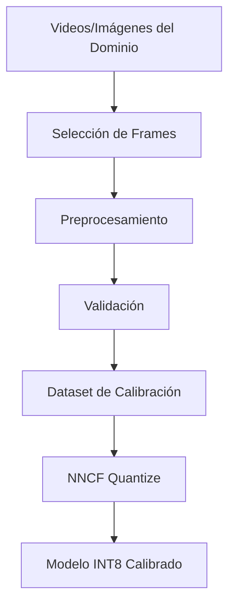

# INT8 Calibration Specification

## Objetivo

Definir el proceso de calibración INT8 con NNCF para obtener modelos cuantizados con accuracy comparable al modelo FP16/FP32 original, habilitando aceleración VNNI en CPUs Intel.

---

## 1. Contexto: Por Qué Calibrar

### Cuantización INT8

La cuantización INT8 reduce la precisión de pesos y activaciones de FP32 (32 bits) a INT8 (8 bits):

```
FP32: -3.402823e+38 a 3.402823e+38 (rango continuo)
INT8: -128 a 127 (256 valores discretos)
```

Para mapear valores FP32 a INT8, NNCF necesita conocer el **rango real** de cada tensor:

```
int8_value = round((fp32_value - zero_point) / scale)
```

### El Problema con Datos Sintéticos

| Método | Rangos Calculados | Accuracy |
|--------|-------------------|----------|
| Datos sintéticos (random) | Incorrectos (distribución uniforme) | ~85-95% del original |
| Datos reales del dominio | Correctos (distribución real) | ~97-99% del original |

**Ejemplo:** Si el modelo procesa videos de personas, los datos sintéticos (ruido aleatorio) no representan patrones de piel, ropa, poses, etc. Los rangos de cuantización serán subóptimos.

---

## 2. Requisitos del Dataset de Calibración

### 2.1 Cantidad de Samples

| Modelo | Samples Mínimos | Samples Recomendados | Samples Óptimos |
|--------|-----------------|----------------------|-----------------|
| YOLO11n (pequeño) | 50 | 100-200 | 300 |
| YOLO11s/m (mediano) | 100 | 200-300 | 500 |
| YOLO11l/x (grande) | 200 | 300-500 | 1000 |

**Nota:** Más samples = mejor calibración, pero rendimientos decrecientes después de ~300.

### 2.2 Representatividad

El dataset debe representar el dominio de inferencia:

**Para segmentación de personas:**
- Diferentes poses (de pie, sentado, caminando)
- Diferentes ángulos de cámara
- Diferentes condiciones de iluminación
- Diferentes fondos
- Diferentes tamaños de persona en frame (cerca/lejos)
- Oclusiones parciales

**Para pose estimation:**
- Todas las articulaciones visibles
- Poses parcialmente ocultas
- Múltiples personas
- Diferentes orientaciones corporales

### 2.3 Formato de Entrada

```
calibration_data/
├── preprocessed_320/
│   ├── frame_0000.npy  # Shape: [1, 3, 320, 320], dtype: float32
│   ├── frame_0001.npy
│   ├── ...
│   └── frame_0299.npy
└── preprocessed_640/
    ├── frame_0000.npy  # Shape: [1, 3, 640, 640], dtype: float32
    ├── ...
    └── frame_0299.npy
```

**Especificaciones del tensor:**
- Shape: `[1, 3, H, W]` (batch=1, RGB, altura, ancho)
- Dtype: `float32`
- Rango de valores: `[0.0, 1.0]` (normalizado)
- Preprocesamiento: Letterbox resize (mantener aspect ratio, pad con gris)

### 2.4 Fuentes de Datos Válidas

1. **Videos del dominio de producción** (recomendado)
   - Extraer frames uniformemente distribuidos
   - Evitar frames consecutivos similares

2. **Imágenes del dominio**
   - Datasets públicos (COCO, OpenImages) si son representativos
   - Imágenes propias del caso de uso

3. **Frames de inferencia real**
   - Capturar durante operación normal
   - Mejor representatividad del dominio

---

## 3. Pipeline de Generación del Dataset

### 3.1 Flujo de Trabajo



### 3.2 Script: extract_calibration_frames.py

**Entrada:**
```bash
uv run extract_calibration_frames.py \
    --source videos/production_sample.mp4 \
    --num-frames 200 \
    --resolution 320 \
    --output calibration_data/
```

**Parámetros:**

| Parámetro | Descripción | Default |
|-----------|-------------|---------|
| `--source` | Video o directorio de imágenes | Requerido |
| `--num-frames` | Número de frames a extraer | 200 |
| `--resolution` | Resolución del modelo (320, 640) | 320 |
| `--output` | Directorio de salida | `calibration_data/` |
| `--strategy` | Estrategia de selección: `uniform`, `random`, `keyframe` | `uniform` |
| `--skip-similar` | Umbral de similitud para saltar frames (0-1) | 0.9 |

**Estrategias de selección:**

1. **uniform:** Extrae frames uniformemente distribuidos
   ```python
   indices = np.linspace(0, total_frames-1, num_frames, dtype=int)
   ```

2. **random:** Selección aleatoria
   ```python
   indices = np.random.choice(total_frames, num_frames, replace=False)
   ```

3. **keyframe:** Detecta cambios de escena (más diversidad)
   ```python
   # Usar diferencia de histogramas o detectar I-frames
   ```

### 3.3 Preprocesamiento (Letterbox)

El preprocesamiento debe ser **idéntico** al usado en inferencia:

```python
def letterbox_preprocess(image: np.ndarray, target_size: int) -> np.ndarray:
    """
    Preprocesa imagen para YOLO (letterbox resize).

    Args:
        image: Imagen BGR de OpenCV [H, W, 3]
        target_size: Tamaño objetivo (320 o 640)

    Returns:
        Tensor preprocesado [1, 3, target_size, target_size]
    """
    h, w = image.shape[:2]

    # Calcular escala manteniendo aspect ratio
    scale = min(target_size / h, target_size / w)
    new_h, new_w = int(h * scale), int(w * scale)

    # Resize
    resized = cv2.resize(image, (new_w, new_h), interpolation=cv2.INTER_LINEAR)

    # Crear canvas con padding (gris 114)
    canvas = np.full((target_size, target_size, 3), 114, dtype=np.uint8)

    # Centrar imagen
    top = (target_size - new_h) // 2
    left = (target_size - new_w) // 2
    canvas[top:top+new_h, left:left+new_w] = resized

    # Convertir a tensor normalizado
    tensor = canvas.astype(np.float32) / 255.0  # [0, 1]
    tensor = tensor.transpose(2, 0, 1)  # HWC -> CHW
    tensor = np.expand_dims(tensor, 0)  # Add batch dim

    return tensor  # [1, 3, H, W]
```

### 3.4 Validación del Dataset

Antes de calibrar, validar:

1. **Número de samples:** ≥ 100
2. **Shapes correctos:** Todos `[1, 3, resolution, resolution]`
3. **Rango de valores:** `[0.0, 1.0]`
4. **Diversidad:** Histogramas variados (no todos similares)

```python
def validate_calibration_dataset(dataset_dir: Path, resolution: int) -> bool:
    """Valida dataset de calibración."""
    files = list(dataset_dir.glob("*.npy"))

    if len(files) < 100:
        print(f"⚠️  Pocos samples: {len(files)} (mínimo 100)")
        return False

    # Verificar shapes y valores
    for f in files[:10]:  # Sample check
        arr = np.load(f)
        if arr.shape != (1, 3, resolution, resolution):
            print(f"❌ Shape incorrecto: {arr.shape}")
            return False
        if arr.min() < 0 or arr.max() > 1:
            print(f"❌ Rango incorrecto: [{arr.min()}, {arr.max()}]")
            return False

    print(f"✅ Dataset válido: {len(files)} samples")
    return True
```

---

## 4. Calibración con NNCF

### 4.1 Script: calibrate_int8.py

**Uso:**
```bash
# Calibrar modelo específico
uv run calibrate_int8.py \
    --model yolo11n-seg \
    --resolution 320 \
    --calibration-data calibration_data/

# Calibrar todos los modelos disponibles
uv run calibrate_int8.py --all --resolution 320
```

### 4.2 Configuración NNCF

```python
import nncf

quantized_model = nncf.quantize(
    model,
    calibration_dataset,
    preset=nncf.QuantizationPreset.MIXED,  # Balance accuracy/speed
    subset_size=300,  # Samples a usar
    fast_bias_correction=True,  # Corrección de bias rápida
    model_type=nncf.ModelType.TRANSFORMER,  # Para YOLO (attention-based)
)
```

**Presets disponibles:**

| Preset | Descripción | Uso |
|--------|-------------|-----|
| `PERFORMANCE` | Máxima velocidad, más agresivo | Edge devices, latencia crítica |
| `MIXED` | Balance accuracy/velocidad | Producción general |
| `ACCURACY` | Preserva accuracy, menos agresivo | Tareas críticas |

### 4.3 Salida

```
exports/int8_calibrated/
├── segmentation/
│   └── yolo11n-seg/
│       └── yolo11n-seg_320_int8_calibrated/
│           ├── yolo11n-seg_320_int8_calibrated.xml
│           └── yolo11n-seg_320_int8_calibrated.bin
└── pose/
    └── yolo11n-pose/
        └── yolo11n-pose_320_int8_calibrated/
            ├── yolo11n-pose_320_int8_calibrated.xml
            └── yolo11n-pose_320_int8_calibrated.bin
```

---

## 5. Validación Post-Calibración

### 5.1 Comparación de Accuracy

```bash
# Comparar FP16 vs INT8 calibrado
uv run validate_int8_accuracy.py \
    --fp16-model exports/fp16/yolo11n-seg.xml \
    --int8-model exports/int8_calibrated/yolo11n-seg_int8.xml \
    --validation-data validation_images/
```

**Métricas a comparar:**
- mAP (mean Average Precision)
- Precision / Recall
- IoU de segmentación
- PCK (Percentage of Correct Keypoints) para pose

### 5.2 Criterios de Aceptación

| Métrica | Pérdida Aceptable | Acción si Falla |
|---------|-------------------|-----------------|
| mAP | < 2% | Aumentar samples, usar MIXED preset |
| Precision | < 3% | Revisar diversidad del dataset |
| IoU | < 2% | Agregar más casos de borde |
| FPS | > 1.5x vs FP32 | Verificar VNNI habilitado |

---

## 6. Flujo de Trabajo Completo

```bash
# 1. Extraer frames de calibración
uv run extract_calibration_frames.py \
    --source videos/production_sample.mp4 \
    --num-frames 300 \
    --resolution 320

# 2. Validar dataset
uv run validate_calibration_dataset.py \
    --dataset calibration_data/preprocessed_320/

# 3. Calibrar modelos
uv run calibrate_int8.py \
    --model yolo11n-seg \
    --resolution 320

uv run calibrate_int8.py \
    --model yolo11n-pose \
    --resolution 320

# 4. Verificar cuantización
uv run scripts/int8_vnni/verify_int8_execution.py \
    --device CPU \
    --model yolo11n-seg

# 5. Validar accuracy (opcional)
uv run validate_int8_accuracy.py \
    --fp16-model exports/fp16/yolo11n-seg.xml \
    --int8-model exports/int8_calibrated/yolo11n-seg_int8.xml

# 6. Ejecutar pipeline híbrido
uv run run_luna.py \
    --video videos/test.mp4 \
    --seg-model exports/int8_calibrated/yolo11n-seg_int8.xml \
    --seg-device CPU \
    --pose-model exports/fp16/yolo11n-pose.xml \
    --pose-device GPU
```

---

## 7. Scripts a Implementar

| Script | Estado | Descripción |
|--------|--------|-------------|
| `extract_calibration_frames.py` | 🔴 Pendiente | Extrae frames de video/imágenes |
| `validate_calibration_dataset.py` | 🔴 Pendiente | Valida formato y diversidad |
| `calibrate_int8.py` | 🟡 Existe (necesita actualizar) | Calibra con NNCF |
| `validate_int8_accuracy.py` | 🔴 Pendiente | Compara accuracy FP16 vs INT8 |

---

## 8. Consideraciones

### 8.1 Tiempo de Calibración

| Modelo | 100 samples | 300 samples | 500 samples |
|--------|-------------|-------------|-------------|
| YOLO11n | ~30s | ~60s | ~90s |
| YOLO11s | ~45s | ~90s | ~150s |
| YOLO11m | ~90s | ~180s | ~300s |

### 8.2 Memoria

La calibración requiere ~2-4GB de RAM adicional para modelos grandes.

### 8.3 Reproducibilidad

Para resultados reproducibles:
```python
import numpy as np
np.random.seed(42)
nncf.set_seed(42)
```

---

## Referencias

- [NNCF Post-Training Quantization](https://docs.openvino.ai/latest/ptq_introduction.html)
- [OpenVINO INT8 Optimization](https://docs.openvino.ai/latest/openvino_docs_optimization_guide_dldt_optimization_guide.html)
- [YOLO Quantization Best Practices](https://docs.ultralytics.com/integrations/openvino/)

---

*Última actualización: 2025-02-10 | Bakery Luna INT8 Calibration Spec v1.0*
