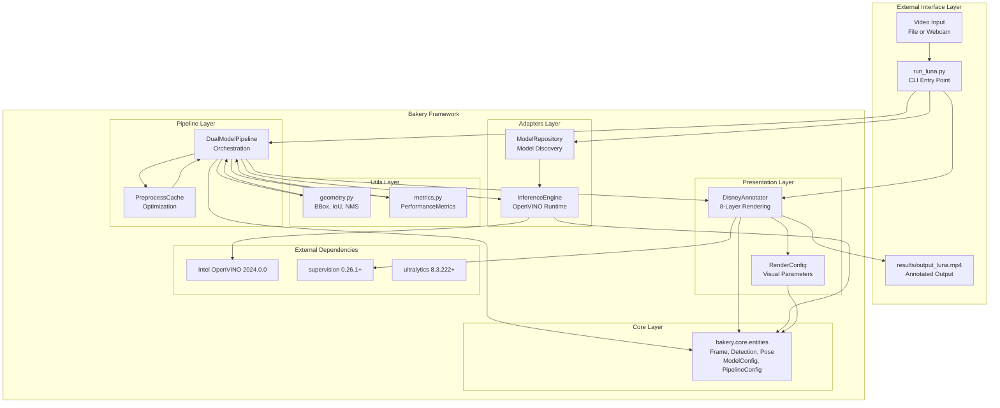
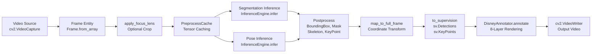
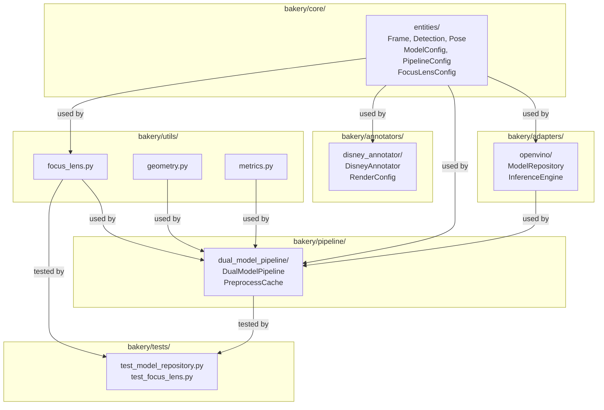

# Overview

Relevant source files

- [.gitignore](https://github.com/e7canasta/bakery-luna/blob/8081344f/.gitignore)
- [bakery/core/entities/__init__.py](https://github.com/e7canasta/bakery-luna/blob/8081344f/bakery/core/entities/__init__.py)
- [pyproject.toml](https://github.com/e7canasta/bakery-luna/blob/8081344f/pyproject.toml)
- [run_luna.py](https://github.com/e7canasta/bakery-luna/blob/8081344f/run_luna.py)

This document provides a high-level introduction to the **bakery-luna** repository, a computer vision system for dual-model inference combining instance segmentation and pose estimation with Disney/Roger Rabbit aesthetic rendering. It covers the system's purpose, architectural organization, key components, and development model. For detailed installation and usage instructions, see [Getting Started](https://deepwiki.com/e7canasta/bakery-luna/2-getting-started). For in-depth technical documentation of specific subsystems, refer to the respective sections in the table of contents.

---

## System Purpose

**bakery-luna** is a demonstration application showcasing a modular computer vision framework called **Bakery**. The system performs real-time dual-model inference on video streams, combining:

|Task|Model Type|Purpose|
|---|---|---|
|Instance Segmentation|YOLO Segmentation|Detect and segment objects with bounding boxes and masks|
|Pose Estimation|YOLO Pose|Detect human skeletons with 17 keypoints (COCO format)|

The system outputs annotated video with a distinctive Disney/Roger Rabbit aesthetic where:

- Detected objects and pose skeletons are rendered in full color
- Background is darkened to black-and-white (60% darkness)
- Optional focus lens creates a bright spotlight region
- 8-layer rendering pipeline creates depth and visual separation

The primary entry point is [`run_luna.py`](https://github.com/e7canasta/bakery-luna/blob/8081344f/%60run_luna.py%60)(), a command-line application that orchestrates model discovery, inference, and rendering.

**Sources:** [run_luna.py1-19](https://github.com/e7canasta/bakery-luna/blob/8081344f/run_luna.py#L1-L19) [pyproject.toml1-21](https://github.com/e7canasta/bakery-luna/blob/8081344f/pyproject.toml#L1-L21)

---

## High-Level Architecture

The Bakery framework follows a **layered architecture** with clear separation of concerns:




**Architecture Diagram: Bakery Framework Layers and Dependencies**

**Sources:** [run_luna.py30-37](https://github.com/e7canasta/bakery-luna/blob/8081344f/run_luna.py#L30-L37) [bakery/core/entities/__init__.py1-31](https://github.com/e7canasta/bakery-luna/blob/8081344f/bakery/core/entities/__init__.py#L1-L31) [pyproject.toml7-14](https://github.com/e7canasta/bakery-luna/blob/8081344f/pyproject.toml#L7-L14)

---

## Core Components

### Core Layer

The **Core Layer** defines domain entities (data structures) used throughout the system. All components depend on these abstractions rather than concrete implementations.

|Entity|Purpose|Module|
|---|---|---|
|`Frame`|Represents a video frame with metadata|`bakery.core.entities.frame`|
|`CropInfo`|Stores focus lens crop parameters|`bakery.core.entities.frame`|
|`BoundingBox`|Object detection bounding box|`bakery.core.entities.detection`|
|`Mask`|Instance segmentation mask|`bakery.core.entities.detection`|
|`Segmentation`|Collection of detections per frame|`bakery.core.entities.detection`|
|`KeyPoint`|Single pose keypoint (x, y, confidence)|`bakery.core.entities.pose`|
|`Skeleton`|Collection of 17 keypoints per person|`bakery.core.entities.pose`|
|`PoseEstimation`|Collection of skeletons per frame|`bakery.core.entities.pose`|
|`ModelConfig`|Model metadata and parameters|`bakery.core.entities.model_config`|
|`PipelineConfig`|Pipeline orchestration settings|`bakery.core.entities.model_config`|
|`FocusLensConfig`|Focus lens crop configuration|`bakery.core.entities.focus_lens_config`|

**Sources:** [bakery/core/entities/__init__.py1-31](https://github.com/e7canasta/bakery-luna/blob/8081344f/bakery/core/entities/__init__.py#L1-L31)

### Adapters Layer

The **Adapters Layer** provides hardware-specific implementations, following the **Adapter Pattern** to isolate OpenVINO dependencies:

- **`ModelRepository`**: Discovers `.xml` model files, validates YOLO format, extracts metadata (input shapes, precision, output layers)
- **`InferenceEngine`**: Wraps OpenVINO runtime, compiles models, executes inference, manages device selection (CPU/GPU/VPU)

**Sources:** [run_luna.py32-33](https://github.com/e7canasta/bakery-luna/blob/8081344f/run_luna.py#L32-L33)

### Pipeline Layer

The **Pipeline Layer** orchestrates complex multi-model workflows:

- **`DualModelPipeline`**: Core orchestrator that:
    - Runs segmentation every N frames (`seg_interval` parameter)
    - Runs pose estimation every frame
    - Manages preprocessing cache when models share resolution
    - Applies focus lens cropping if configured
    - Tracks performance metrics (segmentation runs, pose runs, total frames)

**Sources:** [run_luna.py34](https://github.com/e7canasta/bakery-luna/blob/8081344f/run_luna.py#L34-L34) [run_luna.py82-141](https://github.com/e7canasta/bakery-luna/blob/8081344f/run_luna.py#L82-L141)

### Presentation Layer

The **Presentation Layer** handles visualization:

- **`DisneyAnnotator`**: 8-layer rendering system that creates the Disney/Roger Rabbit aesthetic
    - Layer 1: Darkened B&W background (60% darkness)
    - Layer 2-8: Full-color segmentations, masks, bounding boxes, pose skeletons, focus lens spotlight
- **`RenderConfig`**: Controls visual parameters (`bw_darkness`, `lens_brightness`, `spotlight_brightness`)

**Sources:** [run_luna.py35](https://github.com/e7canasta/bakery-luna/blob/8081344f/run_luna.py#L35-L35) [run_luna.py144-161](https://github.com/e7canasta/bakery-luna/blob/8081344f/run_luna.py#L144-L161)

### Utils Layer

Cross-cutting utilities:

- **`focus_lens.py`**: Crop-based inference optimization (crop, zoom, pad strategies, coordinate mapping)
- **`geometry.py`**: Bounding box operations (`xywh2xyxy`, `bbox_iou`, NMS)
- **`metrics.py`**: Performance tracking (`PerformanceMetrics`, `FPSCounter`)

**Sources:** [run_luna.py37](https://github.com/e7canasta/bakery-luna/blob/8081344f/run_luna.py#L37-L37)

---

## Data Flow

The following diagram traces how data flows from video input through inference to annotated output:



**Data Flow Diagram: Frame Processing Pipeline**

### Key Processing Steps

1. **Frame Capture**: [`cv2.VideoCapture`](https://github.com/e7canasta/bakery-luna/blob/8081344f/%60cv2.VideoCapture%60)() reads frames from file or webcam
2. **Frame Wrapping**: [`Frame.from_array()`](https://github.com/e7canasta/bakery-luna/blob/8081344f/%60Frame.from_array\(\)%60)() wraps raw image data with metadata
3. **Focus Lens (Optional)**: Crop/zoom/pad operations to optimize inference on region of interest
4. **Preprocessing Cache**: Reuses preprocessed tensors when segmentation and pose models share resolution
5. **Segmentation Inference**: Runs every N frames based on `seg_interval` parameter
6. **Pose Inference**: Runs every frame to capture rapid pose changes
7. **Postprocessing**: Convert raw model outputs to domain entities (`BoundingBox`, `Skeleton`, etc.)
8. **Coordinate Mapping**: Transform cropped coordinates back to full frame if focus lens was applied
9. **Supervision Conversion**: Convert to `supervision` library format for rendering
10. **Annotation**: 8-layer Disney rendering pipeline
11. **Output**: Write to video file using [`cv2.VideoWriter`](https://github.com/e7canasta/bakery-luna/blob/8081344f/%60cv2.VideoWriter%60)()

**Sources:** [run_luna.py233-305](https://github.com/e7canasta/bakery-luna/blob/8081344f/run_luna.py#L233-L305)

---

## Module Organization



**Module Dependency Diagram: Bakery Framework Structure**

The Bakery framework follows the **Dependency Inversion Principle**: high-level modules (pipeline, annotators) depend on abstractions (core entities) rather than concrete implementations. This enables:

- **Testability**: Core logic can be tested without hardware dependencies
- **Extensibility**: New adapters can be added (e.g., TensorRT, ONNX Runtime) without changing core code
- **Maintainability**: Clear boundaries between layers prevent tight coupling

**Sources:** [bakery/core/entities/__init__.py1-31](https://github.com/e7canasta/bakery-luna/blob/8081344f/bakery/core/entities/__init__.py#L1-L31)

---

## Development Model

The repository follows a **source-only version control** pattern where only source code is tracked in Git, while all generated artifacts are excluded:

### Version Controlled (Tracked in Git)

- Source code: `bakery/`, `run_luna.py`
- Project configuration: `pyproject.toml`
- Test suite: `bakery/tests/`
- Documentation: `README.md`

### Local Artifacts (Excluded via .gitignore)

|Artifact Type|Directory Pattern|Purpose|
|---|---|---|
|OpenVINO Models|`models/`, `.models/`|Trained `.xml` model files (large binary)|
|Video Data|`data/`, `.data/`|Input video files for inference|
|Results|`results/`, `.results/`|Output videos (e.g., `output_luna.mp4`)|
|Run Logs|`runs/`, `.runs/`|Experiment tracking|
|Configuration|`config/`|Local settings, API keys|
|Virtual Environment|`.venv/`|Python dependencies|
|Test Cache|`.pytest_cache/`|Pytest artifacts|
|Personal Docs|`.obsidian/`, `.agents.md`, `.claude.md`|Developer notes, AI assistant context|

This separation prevents **repository bloat** from large binary files and protects sensitive configuration. Models are expected to be:

1. Trained externally (possibly using `ultralytics` YOLO training)
2. Exported to OpenVINO format (`.xml` + `.bin` files)
3. Stored locally or in cloud storage (S3, GCS, Azure Blob)
4. Discovered dynamically by `ModelRepository` at runtime

**Sources:** [.gitignore1-44](https://github.com/e7canasta/bakery-luna/blob/8081344f/.gitignore#L1-L44)

---

## Technology Stack

The system is built on these core dependencies:

|Dependency|Version|Purpose|
|---|---|---|
|**Python**|3.11.14|Runtime environment|
|**OpenVINO**|2024.0.0|Intel's inference toolkit for optimized model execution|
|**OpenVINO Dev**|2024.0.0|Model conversion and optimization tools|
|**Supervision**|0.26.1+|Computer vision utilities (annotation, tracking)|
|**Ultralytics**|8.3.222+|YOLO model training and export|
|**OpenCV (cv2)**|-|Video I/O and image processing|
|**NNCF**|2.12.x|Neural Network Compression Framework|

### Development Dependencies

- **pytest** 9.0.2+: Unit testing framework
- **pytest-asyncio** 1.3.0+: Async test support

**Sources:** [pyproject.toml6-20](https://github.com/e7canasta/bakery-luna/blob/8081344f/pyproject.toml#L6-L20)

---

## Quick Start Example

The primary usage pattern is through the [`run_luna.py`](https://github.com/e7canasta/bakery-luna/blob/8081344f/%60run_luna.py%60)() CLI:

```
# Basic usage with video file
uv run run_luna.py \
  --video data/videos/sample.mp4 \
  --models-dir models/fp16/

# Webcam with live preview
uv run run_luna.py \
  --video 0 \
  --models-dir models/fp16/ \
  --show

# With focus lens optimization (640x640 crop)
uv run run_luna.py \
  --video data/videos/sample.mp4 \
  --models-dir models/fp16/ \
  --focus-size 640

# Advanced configuration
uv run run_luna.py \
  --video data/videos/sample.mp4 \
  --models-dir models/fp16/ \
  --seg-interval 3 \
  --confidence 0.5 \
  --classes 0 \
  --output results/my_video.mp4
```

For complete CLI reference, see [Command-Line Reference](https://deepwiki.com/e7canasta/bakery-luna/5.1-command-line-reference). For installation instructions, see [Installation and Dependencies](https://deepwiki.com/e7canasta/bakery-luna/2.1-installation-and-dependencies).

**Sources:** [run_luna.py331-440](https://github.com/e7canasta/bakery-luna/blob/8081344f/run_luna.py#L331-L440)

---

## Key Optimizations

The system implements several performance optimizations:

|Optimization|Implementation|Impact|
|---|---|---|
|**Smart Segmentation Scheduling**|Run segmentation every N frames via `--seg-interval`|Reduces segmentation inference by N× (objects move slowly)|
|**Preprocessing Cache**|Reuse preprocessed tensors when models share resolution|Eliminates redundant preprocessing overhead|
|**Focus Lens Cropping**|Process only region of interest via `--focus-size`|Reduces effective resolution, speeds up inference|
|**OpenVINO Optimization**|Use Intel-optimized inference runtime|Hardware-accelerated execution on CPU/GPU/VPU|

The [`PerformanceMetrics`](https://github.com/e7canasta/bakery-luna/blob/8081344f/%60PerformanceMetrics%60)() class tracks:

- Total frames processed
- Segmentation runs (should be `total_frames / seg_interval`)
- Pose runs (should equal `total_frames`)
- Average FPS
- Efficiency ratios

For detailed performance optimization strategies, see [Performance Optimization](https://deepwiki.com/e7canasta/bakery-luna/7.4-performance-optimization).

**Sources:** [run_luna.py307-329](https://github.com/e7canasta/bakery-luna/blob/8081344f/run_luna.py#L307-L329) [run_luna.py133-140](https://github.com/e7canasta/bakery-luna/blob/8081344f/run_luna.py#L133-L140)

---

## Next Steps

- **[Getting Started](https://deepwiki.com/e7canasta/bakery-luna/2-getting-started)**: Install dependencies and run your first pipeline
- **[Core Architecture](https://deepwiki.com/e7canasta/bakery-luna/3-core-architecture)**: Deep dive into the Bakery framework's layered design
- **[Focus Lens System](https://deepwiki.com/e7canasta/bakery-luna/4-focus-lens-system)**: Learn about crop-based inference optimization
- **[Luna Demo Application](https://deepwiki.com/e7canasta/bakery-luna/5-luna-demo-application)**: Complete reference for `run_luna.py`
- **[Model Management](https://deepwiki.com/e7canasta/bakery-luna/6-model-management)**: How to work with OpenVINO models
- **[Development Guide](https://deepwiki.com/e7canasta/bakery-luna/7-development-guide)**: Contributing, testing, and best practices

### On this page

- [Overview](https://deepwiki.com/e7canasta/bakery-luna#overview)
- [System Purpose](https://deepwiki.com/e7canasta/bakery-luna#system-purpose)
- [High-Level Architecture](https://deepwiki.com/e7canasta/bakery-luna#high-level-architecture)
- [Core Components](https://deepwiki.com/e7canasta/bakery-luna#core-components)
- [Core Layer](https://deepwiki.com/e7canasta/bakery-luna#core-layer)
- [Adapters Layer](https://deepwiki.com/e7canasta/bakery-luna#adapters-layer)
- [Pipeline Layer](https://deepwiki.com/e7canasta/bakery-luna#pipeline-layer)
- [Presentation Layer](https://deepwiki.com/e7canasta/bakery-luna#presentation-layer)
- [Utils Layer](https://deepwiki.com/e7canasta/bakery-luna#utils-layer)
- [Data Flow](https://deepwiki.com/e7canasta/bakery-luna#data-flow)
- [Key Processing Steps](https://deepwiki.com/e7canasta/bakery-luna#key-processing-steps)
- [Module Organization](https://deepwiki.com/e7canasta/bakery-luna#module-organization)
- [Development Model](https://deepwiki.com/e7canasta/bakery-luna#development-model)
- [Version Controlled (Tracked in Git)](https://deepwiki.com/e7canasta/bakery-luna#version-controlled-tracked-in-git)
- [Local Artifacts (Excluded via .gitignore)](https://deepwiki.com/e7canasta/bakery-luna#local-artifacts-excluded-via-gitignore)
- [Technology Stack](https://deepwiki.com/e7canasta/bakery-luna#technology-stack)
- [Development Dependencies](https://deepwiki.com/e7canasta/bakery-luna#development-dependencies)
- [Quick Start Example](https://deepwiki.com/e7canasta/bakery-luna#quick-start-example)
- [Key Optimizations](https://deepwiki.com/e7canasta/bakery-luna#key-optimizations)
- [Next Steps](https://deepwiki.com/e7canasta/bakery-luna#next-steps)
