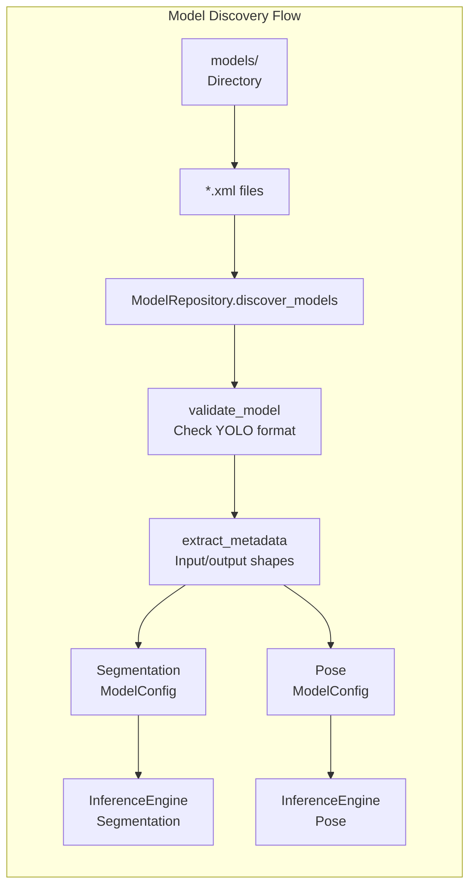
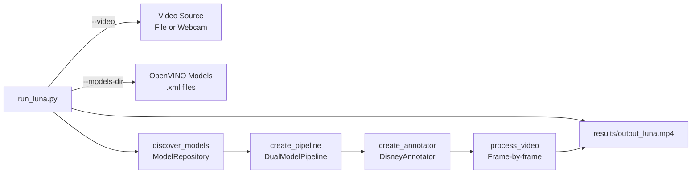
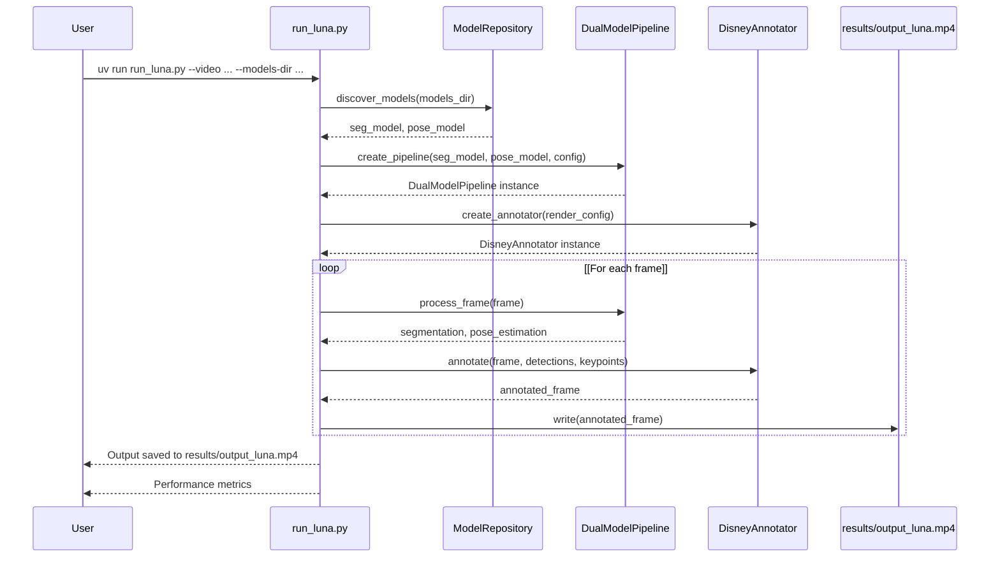

# Getting Started

Relevant source files

- [](https://github.com/e7canasta/bakery-luna/blob/8081344f/.gitignore)
- [](https://github.com/e7canasta/bakery-luna/blob/8081344f/pyproject.toml)
- [](https://github.com/e7canasta/bakery-luna/blob/8081344f/run_luna.py)

This guide walks you through setting up the bakery-luna environment and running your first dual-model inference pipeline. By the end of this page, you will have installed dependencies, configured your local environment, obtained OpenVINO models, and processed your first video with the Luna pipeline.

For detailed information about installation and dependency management, see [Installation and Dependencies](https://deepwiki.com/e7canasta/bakery-luna/2.1-installation-and-dependencies). For a step-by-step tutorial on running the pipeline, see [Running Your First Pipeline](https://deepwiki.com/e7canasta/bakery-luna/2.2-running-your-first-pipeline).

---

## Prerequisites

Before starting, ensure you have:

|Requirement|Version|Purpose|
|---|---|---|
|Python|3.11.14 (< 3.12)|Runtime environment|
|Operating System|Linux, macOS, Windows|OpenVINO compatible OS|
|Hardware|CPU with AVX2|OpenVINO inference (GPU optional)|
|Disk Space|~2-5 GB|Models, videos, and results|

**Sources:** [pyproject.toml6](https://github.com/e7canasta/bakery-luna/blob/8081344f/pyproject.toml#L6-L6)

---

## Installation Overview

The bakery-luna system uses the `uv` package manager for fast, deterministic dependency resolution. The installation process involves:

1. Setting up a Python virtual environment
2. Installing core dependencies via `uv`
3. Creating local directories for models and data
4. Obtaining OpenVINO models

### System Dependencies

The following core dependencies are required:

**Dependency Roles:**

|Package|Version|Purpose|
|---|---|---|
|`openvino`|2024.0.0|Inference runtime for compiled models|
|`openvino-dev`|2024.0.0|Model optimizer and development tools|
|`supervision`|≥0.26.1|Computer vision utilities and annotation helpers|
|`ultralytics`|≥8.3.222|YOLO model training and OpenVINO export|
|`nncf`|≥2.12,<2.13|Neural network compression framework|
|`psutil`|≥7.1.2|System and process monitoring|

**Sources:** [pyproject.toml7-14](https://github.com/e7canasta/bakery-luna/blob/8081344f/pyproject.toml#L7-L14)

---

## Installation Steps

### 1. Install uv Package Manager

```
# Linux/macOS
curl -LsSf https://astral.sh/uv/install.sh | sh

# Windows
powershell -c "irm https://astral.sh/uv/install.ps1 | iex"
```

### 2. Clone Repository

```
git clone https://github.com/e7canasta/bakery-luna
cd bakery-luna
```

### 3. Create Virtual Environment and Install Dependencies

```
# Create virtual environment and install dependencies
uv sync

# Install development dependencies (optional, for testing)
uv sync --group dev
```

This creates a `.venv` directory (excluded from Git) and installs all dependencies specified in `pyproject.toml`.

**Sources:** [pyproject.toml1-21](https://github.com/e7canasta/bakery-luna/blob/8081344f/pyproject.toml#L1-L21) [.gitignore6](https://github.com/e7canasta/bakery-luna/blob/8081344f/.gitignore#L6-L6)

---

## Directory Structure Setup

After installation, you need to create local directories for models, data, and results. These directories are **excluded from Git** to prevent repository bloat:

### Create Required Directories

```
# Create local directories (these are gitignored)
mkdir -p models
mkdir -p data/videos
mkdir -p results
mkdir -p config
```

**Excluded Patterns:**

The following directories and files are excluded from version control:

|Pattern|Purpose|Reason for Exclusion|
|---|---|---|
|`models/`, `.models/`|OpenVINO model files|Large binary files|
|`data/`, `.data/`|Input videos|Large media files|
|`results/`, `.results/`|Output videos|Generated artifacts|
|`config/`|Local configuration|Environment-specific settings|
|`.venv/`|Python virtual environment|Environment-specific binaries|
|`.pytest_cache/`|Test artifacts|Temporary test data|
|`.runs/`, `runs/`|Experiment logs|Ephemeral run data|

**Sources:** [.gitignore1-43](https://github.com/e7canasta/bakery-luna/blob/8081344f/.gitignore#L1-L43)

---

## Obtaining OpenVINO Models

The bakery-luna system requires **two OpenVINO models** in `.xml` format:

1. **Segmentation Model** (YOLO segmentation format)
2. **Pose Estimation Model** (YOLO pose format)

### Model Requirements



### Expected Model Characteristics

|Attribute|Segmentation Model|Pose Model|
|---|---|---|
|Format|OpenVINO IR (.xml + .bin)|OpenVINO IR (.xml + .bin)|
|Input Shape|[1, 3, H, W]|[1, 3, H, W]|
|Output Format|YOLO segmentation outputs|YOLO pose outputs|
|Precision|FP16 or FP32|FP16 or FP32|
|Resolution|Typically 640x640|Typically 640x640|

### Obtaining Models

You have three options:

**Option 1: Export from Ultralytics YOLO**

```
# Install ultralytics (already in dependencies)
# Export segmentation model
yolo export model=yolov8n-seg.pt format=openvino imgsz=640

# Export pose model
yolo export model=yolov8n-pose.pt format=openvino imgsz=640

# Move exported models to models/ directory
mv yolov8n-seg_openvino_model/*.xml models/
mv yolov8n-seg_openvino_model/*.bin models/
mv yolov8n-pose_openvino_model/*.xml models/
mv yolov8n-pose_openvino_model/*.bin models/
```

**Option 2: Download Pre-exported Models**

Download OpenVINO models from a model repository or cloud storage and place them in the `models/` directory.

**Option 3: Use Existing Models**

If you have existing OpenVINO YOLO models, ensure they match the expected format (see [Model Format Requirements](https://deepwiki.com/e7canasta/bakery-luna/6.2-model-format-requirements)).

**Sources:** [run_luna.py40-79](https://github.com/e7canasta/bakery-luna/blob/8081344f/run_luna.py#L40-L79)

---

## Verifying Installation

Test that the installation is complete and models are discoverable:

```
# Test model discovery (should exit with error if no models found)
uv run run_luna.py --video 0 --models-dir models/
```

Expected output:

```
🔍 Discovering models in: models
✅ Found 2 model(s)
   📦 Segmentation: yolov8n-seg.xml (640px)
   🦴 Pose: yolov8n-pose.xml (640px)
```

If you see errors, verify:

- Models exist in `models/` directory
- Models are in OpenVINO format (`.xml` + `.bin`)
- Models follow YOLO format (see [Model Repository](https://deepwiki.com/e7canasta/bakery-luna/6.1-model-repository))

**Sources:** [run_luna.py40-79](https://github.com/e7canasta/bakery-luna/blob/8081344f/run_luna.py#L40-L79)

---

## Running Your First Pipeline

### Basic Command Structure

The `run_luna.py` script is the CLI interface to the Luna pipeline:



### Minimal Example

```
# Process a video file
uv run run_luna.py \
    --video data/videos/sample.mp4 \
    --models-dir models/
```

This will:

1. Discover models in `models/`
2. Open `data/videos/sample.mp4`
3. Process each frame with dual-model inference
4. Save output to `results/output_luna.mp4`

**Sources:** [run_luna.py331-497](https://github.com/e7canasta/bakery-luna/blob/8081344f/run_luna.py#L331-L497)

### Common Use Cases

|Use Case|Command|
|---|---|
|**Webcam Input**|`uv run run_luna.py --video 0 --models-dir models/ --show`|
|**Custom Output Path**|`uv run run_luna.py --video data/videos/test.mp4 --models-dir models/ --output results/my_output.mp4`|
|**High Confidence Filter**|`uv run run_luna.py --video data/videos/test.mp4 --models-dir models/ --confidence 0.5`|
|**Detect Only Persons**|`uv run run_luna.py --video data/videos/test.mp4 --models-dir models/ --classes 0`|
|**Reduce Segmentation Frequency**|`uv run run_luna.py --video data/videos/test.mp4 --models-dir models/ --seg-interval 10`|

**Sources:** [run_luna.py333-358](https://github.com/e7canasta/bakery-luna/blob/8081344f/run_luna.py#L333-L358)

---

## Understanding the Output

### Pipeline Execution Flow



### Console Output

During processing, you'll see:

```
============================================================
          🌙 Bakery Vision Pipeline - Luna
      Dual-Model Inference with Disney Aesthetic
============================================================

🔍 Discovering models in: models
✅ Found 2 model(s)
   📦 Segmentation: yolov8n-seg.xml (640px)
   🦴 Pose: yolov8n-pose.xml (640px)

🔧 Creating inference pipeline...
   Compiling segmentation model...
   ✅ Segmentation engine ready on CPU
   Compiling pose model...
   ✅ Pose engine ready on CPU
   ✅ Pipeline configured (seg_interval=5)
   ⚡ Preprocessing cache optimization enabled (both models use 640px)
   ✅ DisneyAnnotator ready (8-layer rendering)

📹 Video opened: sample.mp4
   Resolution: 1920x1080
   FPS: 30
   Total frames: 900

💾 Output: results/output_luna.mp4

🎬 Processing video...
============================================================
Processing: 100%|██████████| 900/900 [00:45<00:00, 19.8frames/s]
✅ Processed 900 frames

📊 Performance Metrics
============================================================
Total frames:         900
Segmentation runs:    180
Pose runs:            900
Processing time:      45.45s
Average FPS:          19.8

Seg efficiency:       5.0x (ran every 5.0 frames)
Pose efficiency:      1.0x (ran every frame)
============================================================

✨ Done! Output saved to: results/output_luna.mp4
```

**Sources:** [run_luna.py233-329](https://github.com/e7canasta/bakery-luna/blob/8081344f/run_luna.py#L233-L329)

### Output Video Characteristics

The output video (`results/output_luna.mp4`) features the **Disney/Roger Rabbit aesthetic**:

|Layer|Description|
|---|---|
|**Base Layer**|Darkened grayscale background (60% brightness)|
|**Focus Lens**|Brightened circular region if focus lens enabled|
|**Segmentation Masks**|Colorized object masks|
|**Bounding Boxes**|Object detection boxes|
|**Pose Skeletons**|Keypoint connections|
|**Keypoint Markers**|Individual keypoint circles|
|**Confidence Labels**|Detection confidence scores|
|**Focus Region Border**|Red border indicating inference region|

For details on rendering configuration, see [Understanding Output](https://deepwiki.com/e7canasta/bakery-luna/5.3-understanding-output) and [Disney Annotator](https://deepwiki.com/e7canasta/bakery-luna/3-core-architecture).

**Sources:** [run_luna.py143-161](https://github.com/e7canasta/bakery-luna/blob/8081344f/run_luna.py#L143-L161)

---

## Performance Optimization Options

### Segmentation Interval

Control how frequently segmentation runs:

```
# Run segmentation every 10 frames (instead of default 5)
uv run run_luna.py --video data/videos/test.mp4 --models-dir models/ --seg-interval 10
```

**Trade-off:** Higher intervals improve FPS but reduce detection accuracy for fast-moving objects.

### Focus Lens (Crop-Based Inference)

Process only a region of interest for faster inference:

```
# Process centered 640x640 region
uv run run_luna.py --video data/videos/test.mp4 --models-dir models/ --focus-size 640

# Process specific region
uv run run_luna.py --video data/videos/test.mp4 --models-dir models/ --focus-size 480 --focus-x 200 --focus-y 100
```

For comprehensive focus lens documentation, see [Focus Lens System](https://deepwiki.com/e7canasta/bakery-luna/4-focus-lens-system).

**Sources:** [run_luna.py410-438](https://github.com/e7canasta/bakery-luna/blob/8081344f/run_luna.py#L410-L438)

---

## Troubleshooting

### Common Issues

|Issue|Solution|
|---|---|
|**No models found**|Ensure `.xml` and `.bin` files exist in `models/` directory|
|**Invalid model format**|Verify models are YOLO format exported via ultralytics|
|**Video not found**|Check video path exists in `data/videos/`|
|**Slow inference**|Try increasing `--seg-interval` or enabling focus lens|
|**Import errors**|Run `uv sync` to reinstall dependencies|
|**OpenVINO compilation fails**|Check CPU supports AVX2 instructions|

### Validation Commands

```
# Test Python environment
uv run python -c "import openvino; print(openvino.__version__)"

# List discovered models
uv run python -c "from bakery.adapters.openvino.model_repository import ModelRepository; \
    repo = ModelRepository('models/'); \
    print([m.model_path.name for m in repo.discover_models()])"

# Check video properties
ffprobe -i data/videos/sample.mp4
```

---

## Next Steps

Now that you have a working installation:

1. **Explore Pipeline Configuration** - See [Dual Model Pipeline](https://deepwiki.com/e7canasta/bakery-luna/3.3-dual-model-pipeline) for advanced configuration options
2. **Customize Rendering** - See [Disney Annotator](https://deepwiki.com/e7canasta/bakery-luna/3-core-architecture) for aesthetic customization
3. **Optimize Performance** - See [Performance Optimization](https://deepwiki.com/e7canasta/bakery-luna/7.4-performance-optimization) for detailed optimization strategies
4. **Add Custom Models** - See [Model Management](https://deepwiki.com/e7canasta/bakery-luna/6-model-management) for using your own trained models
5. **Run Tests** - See [Testing](https://deepwiki.com/e7canasta/bakery-luna/7.3-testing) to validate your setup

**Sources:** [run_luna.py1-497](https://github.com/e7canasta/bakery-luna/blob/8081344f/run_luna.py#L1-L497) [pyproject.toml1-21](https://github.com/e7canasta/bakery-luna/blob/8081344f/pyproject.toml#L1-L21) [.gitignore1-43](https://github.com/e7canasta/bakery-luna/blob/8081344f/.gitignore#L1-L43)


### On this page

- [Getting Started](https://deepwiki.com/e7canasta/bakery-luna/2-getting-started#getting-started)
- [Prerequisites](https://deepwiki.com/e7canasta/bakery-luna/2-getting-started#prerequisites)
- [Installation Overview](https://deepwiki.com/e7canasta/bakery-luna/2-getting-started#installation-overview)
- [System Dependencies](https://deepwiki.com/e7canasta/bakery-luna/2-getting-started#system-dependencies)
- [Installation Steps](https://deepwiki.com/e7canasta/bakery-luna/2-getting-started#installation-steps)
- [1. Install uv Package Manager](https://deepwiki.com/e7canasta/bakery-luna/2-getting-started#1-install-uv-package-manager)
- [2. Clone Repository](https://deepwiki.com/e7canasta/bakery-luna/2-getting-started#2-clone-repository)
- [3. Create Virtual Environment and Install Dependencies](https://deepwiki.com/e7canasta/bakery-luna/2-getting-started#3-create-virtual-environment-and-install-dependencies)
- [Directory Structure Setup](https://deepwiki.com/e7canasta/bakery-luna/2-getting-started#directory-structure-setup)
- [Create Required Directories](https://deepwiki.com/e7canasta/bakery-luna/2-getting-started#create-required-directories)
- [Obtaining OpenVINO Models](https://deepwiki.com/e7canasta/bakery-luna/2-getting-started#obtaining-openvino-models)
- [Model Requirements](https://deepwiki.com/e7canasta/bakery-luna/2-getting-started#model-requirements)
- [Expected Model Characteristics](https://deepwiki.com/e7canasta/bakery-luna/2-getting-started#expected-model-characteristics)
- [Obtaining Models](https://deepwiki.com/e7canasta/bakery-luna/2-getting-started#obtaining-models)
- [Verifying Installation](https://deepwiki.com/e7canasta/bakery-luna/2-getting-started#verifying-installation)
- [Running Your First Pipeline](https://deepwiki.com/e7canasta/bakery-luna/2-getting-started#running-your-first-pipeline)
- [Basic Command Structure](https://deepwiki.com/e7canasta/bakery-luna/2-getting-started#basic-command-structure)
- [Minimal Example](https://deepwiki.com/e7canasta/bakery-luna/2-getting-started#minimal-example)
- [Common Use Cases](https://deepwiki.com/e7canasta/bakery-luna/2-getting-started#common-use-cases)
- [Understanding the Output](https://deepwiki.com/e7canasta/bakery-luna/2-getting-started#understanding-the-output)
- [Pipeline Execution Flow](https://deepwiki.com/e7canasta/bakery-luna/2-getting-started#pipeline-execution-flow)
- [Console Output](https://deepwiki.com/e7canasta/bakery-luna/2-getting-started#console-output)
- [Output Video Characteristics](https://deepwiki.com/e7canasta/bakery-luna/2-getting-started#output-video-characteristics)
- [Performance Optimization Options](https://deepwiki.com/e7canasta/bakery-luna/2-getting-started#performance-optimization-options)
- [Segmentation Interval](https://deepwiki.com/e7canasta/bakery-luna/2-getting-started#segmentation-interval)
- [Focus Lens (Crop-Based Inference)](https://deepwiki.com/e7canasta/bakery-luna/2-getting-started#focus-lens-crop-based-inference)
- [Troubleshooting](https://deepwiki.com/e7canasta/bakery-luna/2-getting-started#troubleshooting)
- [Common Issues](https://deepwiki.com/e7canasta/bakery-luna/2-getting-started#common-issues)
- [Validation Commands](https://deepwiki.com/e7canasta/bakery-luna/2-getting-started#validation-commands)
- [Next Steps](https://deepwiki.com/e7canasta/bakery-luna/2-getting-started#next-steps)
