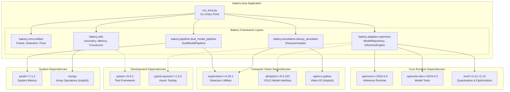

# Installation and Dependencies

Relevant source files

- [](https://github.com/e7canasta/bakery-luna/blob/8081344f/.gitignore)
- [](https://github.com/e7canasta/bakery-luna/blob/8081344f/pyproject.toml)
- [](https://github.com/e7canasta/bakery-luna/blob/8081344f/run_luna.py)

## Purpose and Scope

This page documents the Python dependencies, package management, and installation process for the bakery-luna system. It covers the core runtime dependencies (OpenVINO, supervision, ultralytics), development tools (pytest), Python version constraints, and virtual environment setup using the `uv` package manager.

For information about running your first pipeline after installation, see [Running Your First Pipeline](https://deepwiki.com/e7canasta/bakery-luna/2.2-running-your-first-pipeline). For detailed development environment configuration including local paths and `.gitignore` patterns, see [Development Environment](https://deepwiki.com/e7canasta/bakery-luna/7.2-development-environment).

**Sources:** [pyproject.toml1-21](https://github.com/e7canasta/bakery-luna/blob/8081344f/pyproject.toml#L1-L21) [run_luna.py1-38](https://github.com/e7canasta/bakery-luna/blob/8081344f/run_luna.py#L1-L38)

---

## Python Version Requirements

The bakery-luna system requires Python **3.11.14** or higher, but **below version 3.12**. This constraint is strictly enforced due to compatibility requirements with the OpenVINO 2024.0.0 release.

```
requires-python = ">=3.11.14,<3.12"
```

This version constraint ensures compatibility with:

- OpenVINO inference runtime APIs
- NNCF (Neural Network Compression Framework) optimization tools
- Supervision library's detection utilities

**Sources:** [pyproject.toml6](https://github.com/e7canasta/bakery-luna/blob/8081344f/pyproject.toml#L6-L6)

---

## Dependency Architecture

The following diagram illustrates the dependency relationships between bakery-luna and its external packages, showing how each layer of the system relies on specific libraries.



**Sources:** [pyproject.toml7-20](https://github.com/e7canasta/bakery-luna/blob/8081344f/pyproject.toml#L7-L20) [run_luna.py26-37](https://github.com/e7canasta/bakery-luna/blob/8081344f/run_luna.py#L26-L37)

---

## Core Runtime Dependencies

The following table lists all required runtime dependencies with their version constraints and purposes:

|Package|Version|Purpose|Used By|
|---|---|---|---|
|`openvino`|`==2024.0.0`|OpenVINO inference runtime for model execution|`InferenceEngine`, `ModelRepository`|
|`openvino-dev`|`==2024.0.0`|Model optimization and conversion tools|Model validation, metadata extraction|
|`nncf`|`>=2.12,<2.13`|Neural Network Compression Framework for quantization|Model optimization (FP16, INT8)|
|`supervision`|`>=0.26.1`|Computer vision utilities for detection handling|`DisneyAnnotator`, supervision format conversion|
|`ultralytics`|`>=8.3.222`|YOLO model interface and utilities|Model format compatibility, external training|
|`psutil`|`>=7.1.2`|System resource monitoring|Performance metrics tracking|

**Sources:** [pyproject.toml7-14](https://github.com/e7canasta/bakery-luna/blob/8081344f/pyproject.toml#L7-L14)

### OpenVINO Dependencies

The system uses **OpenVINO 2024.0.0** as the core inference engine. This version is pinned exactly (`==2024.0.0`) to ensure API stability. OpenVINO provides:

- **Inference Runtime**: Executes `.xml` model files on CPU/GPU/VPU devices
- **Model Validation**: Reads model structure and metadata
- **Device Detection**: Auto-detects available hardware accelerators

The `openvino-dev` package includes additional tools for model conversion and optimization, though the primary model training occurs externally using `ultralytics` (see [ML Workflow and Experiment Tracking](https://deepwiki.com/e7canasta/bakery-luna/8-ml-workflow-and-experiment-tracking)).

**Sources:** [pyproject.toml9-10](https://github.com/e7canasta/bakery-luna/blob/8081344f/pyproject.toml#L9-L10) [run_luna.py33-34](https://github.com/e7canasta/bakery-luna/blob/8081344f/run_luna.py#L33-L34)

### Computer Vision Dependencies

The `supervision` library (version 0.26.1+) provides standardized data structures for detection results:

- `sv.Detections`: Bounding box representation
- `sv.KeyPoints`: Pose keypoint representation
- Annotation utilities: Used by `DisneyAnnotator` for 8-layer rendering

The `ultralytics` package (version 8.3.222+) ensures compatibility with YOLO model formats, particularly for understanding model output structures during postprocessing.

**Sources:** [pyproject.toml12-13](https://github.com/e7canasta/bakery-luna/blob/8081344f/pyproject.toml#L12-L13) [run_luna.py35](https://github.com/e7canasta/bakery-luna/blob/8081344f/run_luna.py#L35-L35)

---

## Development Dependencies

Development dependencies are specified in the `[dependency-groups]` section and are only installed when working on the codebase itself:

|Package|Version|Purpose|
|---|---|---|
|`pytest`|`>=9.0.2`|Test framework for unit and integration tests|
|`pytest-asyncio`|`>=1.3.0`|Async test support (future-proofing)|

These dependencies are used by the test suite in `bakery/tests/`, which validates:

- Model discovery and validation (`test_model_repository.py`)
- Focus lens coordinate transformations (`test_focus_lens.py`)
- Geometry utilities (`test_geometry.py`)

**Sources:** [pyproject.toml16-20](https://github.com/e7canasta/bakery-luna/blob/8081344f/pyproject.toml#L16-L20)

---

## Package Manager: uv

The bakery-luna project uses **`uv`** as its package manager. The `uv` tool provides:

- **Fast dependency resolution**: Significantly faster than pip
- **Lockfile management**: `uv.lock` ensures reproducible builds
- **Virtual environment integration**: Automatic venv creation
- **Script execution**: `uv run` command for direct script execution

### Why uv is Used

The `.gitignore` explicitly excludes `uv.lock` from version control, indicating that lock files are environment-specific. This design choice allows:

1. **Cross-platform compatibility**: Different platforms may require different package versions
2. **Flexible upgrades**: Developers can update dependencies within version constraints
3. **Clean repository**: No binary or generated files in Git

**Sources:** [.gitignore20](https://github.com/e7canasta/bakery-luna/blob/8081344f/.gitignore#L20-L20) [run_luna.py13-14](https://github.com/e7canasta/bakery-luna/blob/8081344f/run_luna.py#L13-L14)

---

## Virtual Environment Setup

The project follows standard Python virtual environment practices with `.venv/` as the virtual environment directory.

The `.gitignore` file explicitly excludes `.venv/**` to prevent committing environment-specific files to version control. Each developer maintains their own virtual environment locally.

**Sources:** [.gitignore6](https://github.com/e7canasta/bakery-luna/blob/8081344f/.gitignore#L6-L6)

---

## Installation Process

The following diagram illustrates the complete installation workflow from repository clone to ready-to-run environment:

**Sources:** [pyproject.toml1-21](https://github.com/e7canasta/bakery-luna/blob/8081344f/pyproject.toml#L1-L21) [run_luna.py12-14](https://github.com/e7canasta/bakery-luna/blob/8081344f/run_luna.py#L12-L14)

### Step-by-Step Installation

1. **Clone the repository**:
    
    ```
    git clone https://github.com/e7canasta/bakery-luna.git
    cd bakery-luna
    ```
    
2. **Verify Python version**:
    
    ```
    python --version  # Should be 3.11.14 or higher (< 3.12)
    ```
    
3. **Install uv package manager** (if not already installed):
    
    ```
    pip install uv
    ```
    
4. **Install runtime dependencies**:
    
    ```
    uv sync
    ```
    
    This command:
    
    - Creates `.venv/` virtual environment
    - Installs all packages from `pyproject.toml` dependencies
    - Generates `uv.lock` lockfile (not committed to Git)
5. **Install development dependencies** (optional, for contributors):
    
    ```
    uv sync --dev
    ```
    
    This additionally installs `pytest` and `pytest-asyncio`.
    
6. **Verify installation**:
    
    ```
    uv run python -c "import openvino; import supervision; print('✓ Installation successful')"
    ```
    

**Sources:** [pyproject.toml1-21](https://github.com/e7canasta/bakery-luna/blob/8081344f/pyproject.toml#L1-L21) [run_luna.py13-14](https://github.com/e7canasta/bakery-luna/blob/8081344f/run_luna.py#L13-L14)

---

## Dependencies Not Tracked in Git

The `.gitignore` file ensures that several dependency-related artifacts are never committed to version control:

|Path|Purpose|Why Excluded|
|---|---|---|
|`.venv/`|Virtual environment directory|Platform-specific binaries|
|`uv.lock`|Package lockfile|Environment-specific resolution|
|`.pytest_cache/`|Pytest cache directory|Test run metadata|

This separation ensures the Git repository contains only source code, while all generated artifacts remain local to each developer's machine.

**Sources:** [.gitignore6-38](https://github.com/e7canasta/bakery-luna/blob/8081344f/.gitignore#L6-L38)

---

## Implicit Dependencies

Several dependencies are pulled in transitively but are critical to the system's operation:

- **`numpy`**: Required by OpenVINO, supervision, and ultralytics for array operations
- **`opencv-python`** (cv2): Required by supervision and used directly in [run_luna.py26](https://github.com/e7canasta/bakery-luna/blob/8081344f/run_luna.py#L26-L26)
- **`tqdm`**: Used for progress bars in [run_luna.py28](https://github.com/e7canasta/bakery-luna/blob/8081344f/run_luna.py#L28-L28)

These packages do not need to be explicitly listed in `pyproject.toml` because they are guaranteed to be installed by the primary dependencies.

**Sources:** [run_luna.py26-28](https://github.com/e7canasta/bakery-luna/blob/8081344f/run_luna.py#L26-L28)

---

## Dependency Version Rationale

### Pinned Versions (==)

- **OpenVINO 2024.0.0**: Exact version pinning ensures API stability. OpenVINO frequently introduces breaking changes between major versions.
- **NNCF compatibility**: The `2024.0.0` version of OpenVINO requires NNCF `>=2.12,<2.13`.

### Minimum Versions (>=)

- **supervision 0.26.1**: This version introduced key API improvements for keypoint handling.
- **ultralytics 8.3.222**: Ensures compatibility with latest YOLO model export formats.
- **psutil 7.1.2**: Latest version with improved cross-platform support.

**Sources:** [pyproject.toml7-14](https://github.com/e7canasta/bakery-luna/blob/8081344f/pyproject.toml#L7-L14)

---

## Verification Commands

After installation, verify that all critical components are accessible:

```
# Verify OpenVINO
uv run python -c "from openvino.runtime import Core; print(f'OpenVINO devices: {Core().available_devices}')"

# Verify supervision
uv run python -c "import supervision as sv; print(f'Supervision version: {sv.__version__}')"

# Run test suite (if dev dependencies installed)
uv run pytest bakery/tests/ -v
```

**Sources:** [run_luna.py33-35](https://github.com/e7canasta/bakery-luna/blob/8081344f/run_luna.py#L33-L35) [pyproject.toml17-20](https://github.com/e7canasta/bakery-luna/blob/8081344f/pyproject.toml#L17-L20)

---

## Next Steps

After successfully installing dependencies:

1. **Obtain OpenVINO models**: See [Model Management](https://deepwiki.com/e7canasta/bakery-luna/6-model-management) for model format requirements
2. **Run your first pipeline**: See [Running Your First Pipeline](https://deepwiki.com/e7canasta/bakery-luna/2.2-running-your-first-pipeline) for a step-by-step tutorial
3. **Configure development environment**: See [Development Environment](https://deepwiki.com/e7canasta/bakery-luna/7.2-development-environment) for local configuration

**Sources:** [pyproject.toml1-21](https://github.com/e7canasta/bakery-luna/blob/8081344f/pyproject.toml#L1-L21) [run_luna.py1-19](https://github.com/e7canasta/bakery-luna/blob/8081344f/run_luna.py#L1-L19)


### On this page

- [Installation and Dependencies](https://deepwiki.com/e7canasta/bakery-luna/2.1-installation-and-dependencies#installation-and-dependencies)
- [Purpose and Scope](https://deepwiki.com/e7canasta/bakery-luna/2.1-installation-and-dependencies#purpose-and-scope)
- [Python Version Requirements](https://deepwiki.com/e7canasta/bakery-luna/2.1-installation-and-dependencies#python-version-requirements)
- [Dependency Architecture](https://deepwiki.com/e7canasta/bakery-luna/2.1-installation-and-dependencies#dependency-architecture)
- [Core Runtime Dependencies](https://deepwiki.com/e7canasta/bakery-luna/2.1-installation-and-dependencies#core-runtime-dependencies)
- [OpenVINO Dependencies](https://deepwiki.com/e7canasta/bakery-luna/2.1-installation-and-dependencies#openvino-dependencies)
- [Computer Vision Dependencies](https://deepwiki.com/e7canasta/bakery-luna/2.1-installation-and-dependencies#computer-vision-dependencies)
- [Development Dependencies](https://deepwiki.com/e7canasta/bakery-luna/2.1-installation-and-dependencies#development-dependencies)
- [Package Manager: uv](https://deepwiki.com/e7canasta/bakery-luna/2.1-installation-and-dependencies#package-manager-uv)
- [Why uv is Used](https://deepwiki.com/e7canasta/bakery-luna/2.1-installation-and-dependencies#why-uv-is-used)
- [Virtual Environment Setup](https://deepwiki.com/e7canasta/bakery-luna/2.1-installation-and-dependencies#virtual-environment-setup)
- [Installation Process](https://deepwiki.com/e7canasta/bakery-luna/2.1-installation-and-dependencies#installation-process)
- [Step-by-Step Installation](https://deepwiki.com/e7canasta/bakery-luna/2.1-installation-and-dependencies#step-by-step-installation)
- [Dependencies Not Tracked in Git](https://deepwiki.com/e7canasta/bakery-luna/2.1-installation-and-dependencies#dependencies-not-tracked-in-git)
- [Implicit Dependencies](https://deepwiki.com/e7canasta/bakery-luna/2.1-installation-and-dependencies#implicit-dependencies)
- [Dependency Version Rationale](https://deepwiki.com/e7canasta/bakery-luna/2.1-installation-and-dependencies#dependency-version-rationale)
- [Pinned Versions (==)](https://deepwiki.com/e7canasta/bakery-luna/2.1-installation-and-dependencies#pinned-versions-)
- [Minimum Versions (>=)](https://deepwiki.com/e7canasta/bakery-luna/2.1-installation-and-dependencies#minimum-versions-)
- [Verification Commands](https://deepwiki.com/e7canasta/bakery-luna/2.1-installation-and-dependencies#verification-commands)
- [Next Steps](https://deepwiki.com/e7canasta/bakery-luna/2.1-installation-and-dependencies#next-steps)
