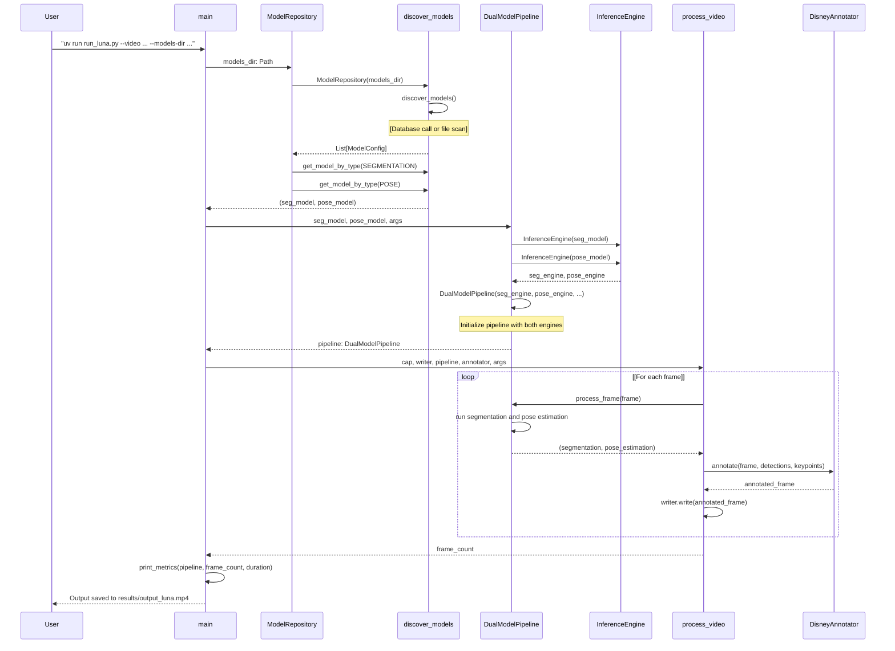
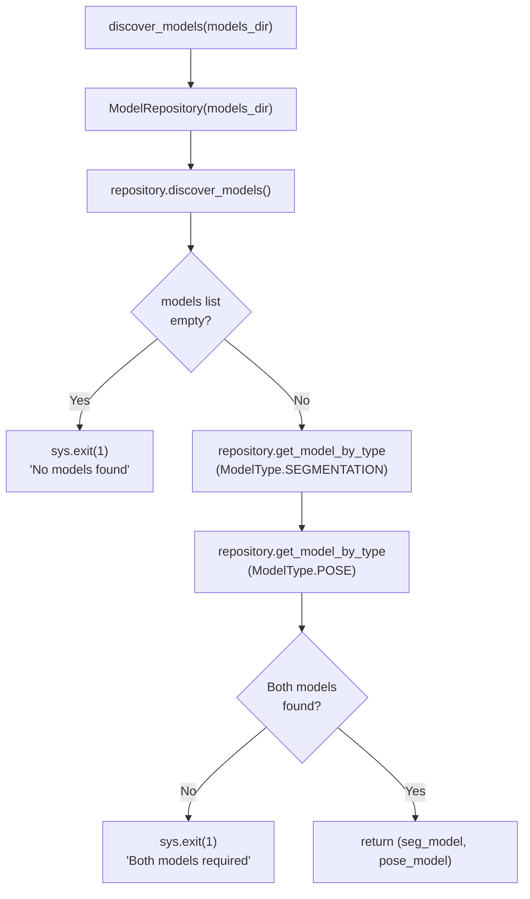
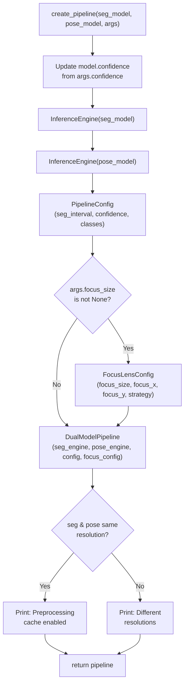
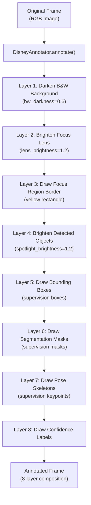

# Running Your First Pipeline

Relevant source files

- [](https://github.com/e7canasta/bakery-luna/blob/8081344f/pyproject.toml)
- [](https://github.com/e7canasta/bakery-luna/blob/8081344f/results/output_luna.mp4)
- [](https://github.com/e7canasta/bakery-luna/blob/8081344f/run_luna.py)

## Purpose and Scope

This guide provides a step-by-step tutorial for running your first Luna pipeline using the `run_luna.py` script. It covers the basic command-line workflow, from model discovery to video output generation. For installation and dependency setup, see [Installation and Dependencies](https://deepwiki.com/e7canasta/bakery-luna/2.1-installation-and-dependencies). For comprehensive CLI reference, see [Command-Line Reference](https://deepwiki.com/e7canasta/bakery-luna/5.1-command-line-reference). For detailed model management topics, see [Model Management](https://deepwiki.com/e7canasta/bakery-luna/6-model-management).

---

## Prerequisites

Before running your first pipeline, ensure you have the following:

|Requirement|Description|Validation|
|---|---|---|
|**Python Environment**|Python 3.11.14 with dependencies installed|Run `python --version`|
|**OpenVINO Models**|`.xml` model files in a directory|Typically in `exports/fp16/` or similar|
|**Video Source**|Video file (`.mp4`) or webcam access|File must exist or camera index must be valid|
|**Output Directory**|Writable location for results|Defaults to `results/`|

The system requires **two models**: a segmentation model (`yolo11*-seg`) and a pose estimation model (`yolo11*-pose`). The `ModelRepository` class automatically discovers these by scanning for `.xml` files and validating their format.

**Sources:** [run_luna.py1-19](https://github.com/e7canasta/bakery-luna/blob/8081344f/run_luna.py#L1-L19) [pyproject.toml1-21](https://github.com/e7canasta/bakery-luna/blob/8081344f/pyproject.toml#L1-L21)

---

## Quick Start Command

The simplest command to run the Luna pipeline is:

```
uv run run_luna.py --video data/videos/sample.mp4 --models-dir exports/fp16/
```

This command:

1. Discovers models in `exports/fp16/`
2. Processes `data/videos/sample.mp4`
3. Outputs results to `results/output_luna.mp4` (default)

**Command Structure:**

```
uv run run_luna.py \
    --video <video_path_or_camera_index> \
    --models-dir <path_to_models>
```

**Sources:** [run_luna.py12-14](https://github.com/e7canasta/bakery-luna/blob/8081344f/run_luna.py#L12-L14) [run_luna.py361-380](https://github.com/e7canasta/bakery-luna/blob/8081344f/run_luna.py#L361-L380)

---

## Execution Flow

When you run the Luna pipeline, the system executes a multi-stage workflow orchestrated by the `main()` function in `run_luna.py`.

### High-Level Execution Sequence




**Sources:** [run_luna.py331-497](https://github.com/e7canasta/bakery-luna/blob/8081344f/run_luna.py#L331-L497) [run_luna.py233-305](https://github.com/e7canasta/bakery-luna/blob/8081344f/run_luna.py#L233-L305)

---

### Stage 1: Model Discovery

The `discover_models()` function uses the `ModelRepository` class to scan the specified directory.



**Console Output Example:**

```
🔍 Discovering models in: exports/fp16
✅ Found 2 model(s)
   📦 Segmentation: yolo11n-seg_openvino_model/yolo11n-seg.xml (640px)
   🦴 Pose: yolo11n-pose_openvino_model/yolo11n-pose.xml (640px)
```

**Sources:** [run_luna.py40-79](https://github.com/e7canasta/bakery-luna/blob/8081344f/run_luna.py#L40-L79)

---

### Stage 2: Pipeline Creation

The `create_pipeline()` function instantiates the `DualModelPipeline` with configured inference engines.



**Console Output Example:**

```
🔧 Creating inference pipeline...
   Compiling segmentation model...
   ✅ Segmentation engine ready on CPU
   Compiling pose model...
   ✅ Pose engine ready on CPU
   ✅ Pipeline configured (seg_interval=5)
   ⚡ Preprocessing cache optimization enabled (both models use 640px)
```

**Sources:** [run_luna.py82-141](https://github.com/e7canasta/bakery-luna/blob/8081344f/run_luna.py#L82-L141)

---

### Stage 3: Video Processing Loop

The `process_video()` function iterates through frames, applying the pipeline and annotator.

**Key Code Entities in Processing Loop:**

|Function/Method|Purpose|Location|
|---|---|---|
|`Frame.from_array()`|Wraps numpy array in Frame entity|[run_luna.py264](https://github.com/e7canasta/bakery-luna/blob/8081344f/run_luna.py#L264-L264)|
|`pipeline.process_frame()`|Runs dual-model inference|[run_luna.py267](https://github.com/e7canasta/bakery-luna/blob/8081344f/run_luna.py#L267-L267)|
|`segmentation.to_supervision()`|Converts to `sv.Detections` format|[run_luna.py270](https://github.com/e7canasta/bakery-luna/blob/8081344f/run_luna.py#L270-L270)|
|`pose_estimation.to_supervision()`|Converts to `sv.KeyPoints` format|[run_luna.py271](https://github.com/e7canasta/bakery-luna/blob/8081344f/run_luna.py#L271-L271)|
|`annotator.annotate()`|Applies Disney-style rendering|[run_luna.py278-283](https://github.com/e7canasta/bakery-luna/blob/8081344f/run_luna.py#L278-L283)|
|`writer.write()`|Writes frame to output video|[run_luna.py286](https://github.com/e7canasta/bakery-luna/blob/8081344f/run_luna.py#L286-L286)|

**Console Output Example:**

```
🎬 Processing video...
============================================================
Processing: 100%|██████████| 300/300 [00:15<00:00, 19.23frames/s]
✅ Processed 300 frames
```

**Sources:** [run_luna.py233-305](https://github.com/e7canasta/bakery-luna/blob/8081344f/run_luna.py#L233-L305)

---

## Understanding the Output

### Terminal Metrics

After processing completes, the `print_metrics()` function displays performance statistics:

```
📊 Performance Metrics
============================================================
Total frames:         300
Segmentation runs:    60
Pose runs:            300
Processing time:      15.60s
Average FPS:          19.23

Seg efficiency:       5.0x (ran every 5.0 frames)
Pose efficiency:      1.0x (ran every frame)
============================================================

✨ Done! Output saved to: results/output_luna.mp4
```

**Metrics Explained:**

|Metric|Description|Interpretation|
|---|---|---|
|**Total frames**|Frames processed|Should match video frame count|
|**Segmentation runs**|Times segmentation model executed|`total_frames / seg_interval`|
|**Pose runs**|Times pose model executed|Usually equals `total_frames`|
|**Seg efficiency**|Frames per segmentation run|Higher = more efficient (caching working)|
|**Average FPS**|Processing throughput|Higher = faster processing|

**Sources:** [run_luna.py307-329](https://github.com/e7canasta/bakery-luna/blob/8081344f/run_luna.py#L307-L329)

---

### Output Video Structure

The output video (`results/output_luna.mp4`) contains the **Disney/Roger Rabbit aesthetic** applied by `DisneyAnnotator`:



**Sources:** [run_luna.py144-160](https://github.com/e7canasta/bakery-luna/blob/8081344f/run_luna.py#L144-L160) [run_luna.py278-283](https://github.com/e7canasta/bakery-luna/blob/8081344f/run_luna.py#L278-L283)

---

## Common Command Variations

### Basic Variations

**Use Webcam Instead of Video File:**

```
uv run run_luna.py --video 0 --models-dir exports/fp16/
```

The `open_video_source()` function attempts to parse `--video` as an integer camera index first, falling back to file path if parsing fails.

**Custom Output Path:**

```
uv run run_luna.py \
    --video data/videos/sample.mp4 \
    --models-dir exports/fp16/ \
    --output my_results/custom_name.mp4
```

**Show Live Preview:**

```
uv run run_luna.py \
    --video data/videos/sample.mp4 \
    --models-dir exports/fp16/ \
    --show
```

Enables `cv2.imshow()` display window during processing. Press `q` to stop early.

**Sources:** [run_luna.py163-203](https://github.com/e7canasta/bakery-luna/blob/8081344f/run_luna.py#L163-L203) [run_luna.py404-408](https://github.com/e7canasta/bakery-luna/blob/8081344f/run_luna.py#L404-L408) [run_luna.py375-380](https://github.com/e7canasta/bakery-luna/blob/8081344f/run_luna.py#L375-L380)

---

### Optimization Parameters

**Adjust Segmentation Interval:**

```
uv run run_luna.py \
    --video data/videos/sample.mp4 \
    --models-dir exports/fp16/ \
    --seg-interval 10
```

Runs segmentation every 10 frames instead of default 5. Higher values improve performance but reduce segmentation update rate.

**Filter Specific Classes:**

```
uv run run_luna.py \
    --video data/videos/sample.mp4 \
    --models-dir exports/fp16/ \
    --classes 0
```

Only detects class 0 (person). Use space-separated list for multiple classes: `--classes 0 2 5`.

**Adjust Confidence Threshold:**

```
uv run run_luna.py \
    --video data/videos/sample.mp4 \
    --models-dir exports/fp16/ \
    --confidence 0.5
```

Higher confidence = fewer but more reliable detections. Applied to both segmentation and pose models.

**Sources:** [run_luna.py382-402](https://github.com/e7canasta/bakery-luna/blob/8081344f/run_luna.py#L382-L402) [run_luna.py96-98](https://github.com/e7canasta/bakery-luna/blob/8081344f/run_luna.py#L96-L98) [run_luna.py110-116](https://github.com/e7canasta/bakery-luna/blob/8081344f/run_luna.py#L110-L116)

---

### Focus Lens Options

**Enable Focus Lens (Centered):**

```
uv run run_luna.py \
    --video data/videos/sample.mp4 \
    --models-dir exports/fp16/ \
    --focus-size 640
```

Crops a 640x640 region from the center of the frame for inference, then maps results back to full frame.

**Focus Lens at Specific Position:**

```
uv run run_luna.py \
    --video data/videos/sample.mp4 \
    --models-dir exports/fp16/ \
    --focus-size 480 \
    --focus-x 100 \
    --focus-y 100
```

Crops a 480x480 region starting at pixel coordinates (100, 100).

**Focus Lens with Pad Strategy:**

```
uv run run_luna.py \
    --video data/videos/sample.mp4 \
    --models-dir exports/fp16/ \
    --focus-size 640 \
    --focus-strategy pad
```

If frame is smaller than `focus_size`, adds black borders instead of upscaling. See [Focus Lens System](https://deepwiki.com/e7canasta/bakery-luna/4-focus-lens-system) for details.

**Sources:** [run_luna.py410-438](https://github.com/e7canasta/bakery-luna/blob/8081344f/run_luna.py#L410-L438) [run_luna.py118-129](https://github.com/e7canasta/bakery-luna/blob/8081344f/run_luna.py#L118-L129)

---

## Troubleshooting Common Issues

### No Models Found

```
❌ No models found in exports/fp16
```

**Causes:**

- Directory doesn't exist
- No `.xml` files in directory
- Incorrect path

**Solutions:**

1. Verify directory exists: `ls -la exports/fp16/`
2. Check for `.xml` files: `find exports/fp16/ -name "*.xml"`
3. Ensure models are in OpenVINO format (see [Model Management](https://deepwiki.com/e7canasta/bakery-luna/6-model-management))

**Sources:** [run_luna.py55-57](https://github.com/e7canasta/bakery-luna/blob/8081344f/run_luna.py#L55-L57)

---

### Missing Model Type

```
⚠️  No segmentation model found
⚠️  No pose model found
❌ Both segmentation and pose models are required
```

**Causes:**

- Only one model type present in directory
- Model filenames don't match YOLO naming conventions
- Invalid model format

**Solutions:**

1. Ensure both segmentation (`*-seg*.xml`) and pose (`*-pose*.xml`) models exist
2. Use `ModelRepository.discover_models()` to validate (see [Model Repository](https://deepwiki.com/e7canasta/bakery-luna/6.1-model-repository))
3. Export models from YOLO format if needed

**Sources:** [run_luna.py65-77](https://github.com/e7canasta/bakery-luna/blob/8081344f/run_luna.py#L65-L77)

---

### Video Not Found

```
❌ Video file not found: data/videos/sample.mp4
```

**Causes:**

- File path is incorrect
- File doesn't exist
- Insufficient permissions

**Solutions:**

1. Verify file exists: `ls -la data/videos/sample.mp4`
2. Use absolute path if relative path fails
3. Try webcam instead: `--video 0`

**Sources:** [run_luna.py184-186](https://github.com/e7canasta/bakery-luna/blob/8081344f/run_luna.py#L184-L186)

---

### Failed to Open Video

```
❌ Failed to open video: data/videos/sample.mp4
```

**Causes:**

- Corrupted video file
- Unsupported codec
- OpenCV not properly installed

**Solutions:**

1. Test video with: `ffplay data/videos/sample.mp4` or `vlc data/videos/sample.mp4`
2. Convert to standard format: `ffmpeg -i input.avi -c:v libx264 output.mp4`
3. Reinstall OpenCV: `uv sync --reinstall`

**Sources:** [run_luna.py188-191](https://github.com/e7canasta/bakery-luna/blob/8081344f/run_luna.py#L188-L191)

---

### Output Directory Not Writable

```
❌ Failed to create video writer: results/output_luna.mp4
```

**Causes:**

- Insufficient write permissions
- Disk full
- Parent directory doesn't exist

**Solutions:**

1. Verify write permissions: `ls -ld results/`
2. Create directory manually: `mkdir -p results/`
3. Specify alternative output: `--output /tmp/output.mp4`

**Sources:** [run_luna.py224-226](https://github.com/e7canasta/bakery-luna/blob/8081344f/run_luna.py#L224-L226)

---

## Next Steps

After successfully running your first pipeline, explore:

- **[Dual Model Pipeline](https://deepwiki.com/e7canasta/bakery-luna/3.3-dual-model-pipeline)** - Understanding preprocessing cache and smart scheduling
- **[Focus Lens System](https://deepwiki.com/e7canasta/bakery-luna/4-focus-lens-system)** - Optimizing inference with crop-based processing
- **[Command-Line Reference](https://deepwiki.com/e7canasta/bakery-luna/5.1-command-line-reference)** - Complete CLI documentation
- **[Understanding Output](https://deepwiki.com/e7canasta/bakery-luna/5.3-understanding-output)** - Deep dive into Disney aesthetic rendering
- **[Model Management](https://deepwiki.com/e7canasta/bakery-luna/6-model-management)** - Working with OpenVINO models
- **[Performance Optimization](https://deepwiki.com/e7canasta/bakery-luna/7.4-performance-optimization)** - Tuning for speed and accuracy

**Sources:** [run_luna.py1-497](https://github.com/e7canasta/bakery-luna/blob/8081344f/run_luna.py#L1-L497)


### On this page

- [Running Your First Pipeline](https://deepwiki.com/e7canasta/bakery-luna/2.2-running-your-first-pipeline#running-your-first-pipeline)
- [Purpose and Scope](https://deepwiki.com/e7canasta/bakery-luna/2.2-running-your-first-pipeline#purpose-and-scope)
- [Prerequisites](https://deepwiki.com/e7canasta/bakery-luna/2.2-running-your-first-pipeline#prerequisites)
- [Quick Start Command](https://deepwiki.com/e7canasta/bakery-luna/2.2-running-your-first-pipeline#quick-start-command)
- [Execution Flow](https://deepwiki.com/e7canasta/bakery-luna/2.2-running-your-first-pipeline#execution-flow)
- [High-Level Execution Sequence](https://deepwiki.com/e7canasta/bakery-luna/2.2-running-your-first-pipeline#high-level-execution-sequence)
- [Stage 1: Model Discovery](https://deepwiki.com/e7canasta/bakery-luna/2.2-running-your-first-pipeline#stage-1-model-discovery)
- [Stage 2: Pipeline Creation](https://deepwiki.com/e7canasta/bakery-luna/2.2-running-your-first-pipeline#stage-2-pipeline-creation)
- [Stage 3: Video Processing Loop](https://deepwiki.com/e7canasta/bakery-luna/2.2-running-your-first-pipeline#stage-3-video-processing-loop)
- [Understanding the Output](https://deepwiki.com/e7canasta/bakery-luna/2.2-running-your-first-pipeline#understanding-the-output)
- [Terminal Metrics](https://deepwiki.com/e7canasta/bakery-luna/2.2-running-your-first-pipeline#terminal-metrics)
- [Output Video Structure](https://deepwiki.com/e7canasta/bakery-luna/2.2-running-your-first-pipeline#output-video-structure)
- [Common Command Variations](https://deepwiki.com/e7canasta/bakery-luna/2.2-running-your-first-pipeline#common-command-variations)
- [Basic Variations](https://deepwiki.com/e7canasta/bakery-luna/2.2-running-your-first-pipeline#basic-variations)
- [Optimization Parameters](https://deepwiki.com/e7canasta/bakery-luna/2.2-running-your-first-pipeline#optimization-parameters)
- [Focus Lens Options](https://deepwiki.com/e7canasta/bakery-luna/2.2-running-your-first-pipeline#focus-lens-options)
- [Troubleshooting Common Issues](https://deepwiki.com/e7canasta/bakery-luna/2.2-running-your-first-pipeline#troubleshooting-common-issues)
- [No Models Found](https://deepwiki.com/e7canasta/bakery-luna/2.2-running-your-first-pipeline#no-models-found)
- [Missing Model Type](https://deepwiki.com/e7canasta/bakery-luna/2.2-running-your-first-pipeline#missing-model-type)
- [Video Not Found](https://deepwiki.com/e7canasta/bakery-luna/2.2-running-your-first-pipeline#video-not-found)
- [Failed to Open Video](https://deepwiki.com/e7canasta/bakery-luna/2.2-running-your-first-pipeline#failed-to-open-video)
- [Output Directory Not Writable](https://deepwiki.com/e7canasta/bakery-luna/2.2-running-your-first-pipeline#output-directory-not-writable)
- [Next Steps](https://deepwiki.com/e7canasta/bakery-luna/2.2-running-your-first-pipeline#next-steps)

