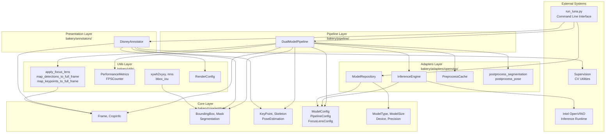
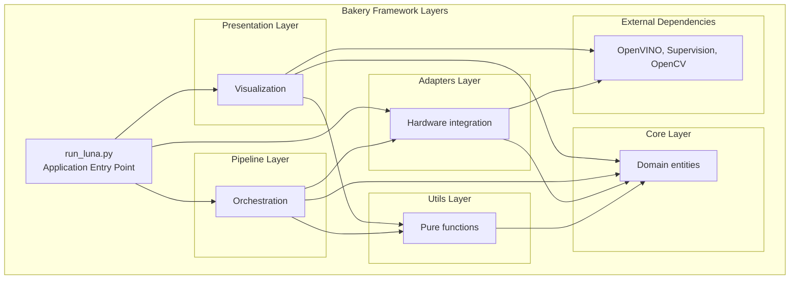
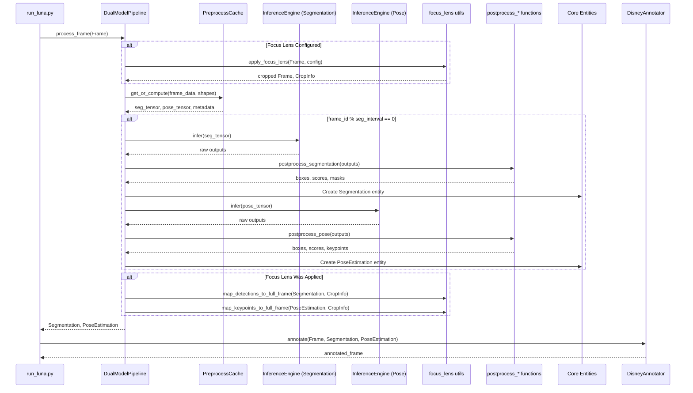

# Core Architecture

Relevant source files

- [](https://github.com/e7canasta/bakery-luna/blob/8081344f/bakery/core/entities/__init__.py)
- [](https://github.com/e7canasta/bakery-luna/blob/8081344f/bakery/pipeline/dual_model_pipeline.py)
- [](https://github.com/e7canasta/bakery-luna/blob/8081344f/bakery/utils/__init__.py)

## Purpose and Scope

This document describes the modular architecture of the Bakery framework, which organizes the bakery-luna system into five distinct layers: Core, Adapters, Pipeline, Presentation, and Utils. This architecture enables clean separation of concerns, testability, and extensibility.

For details on specific components within each layer, see:

- Core entities and data structures: [Core Entities](https://deepwiki.com/e7canasta/bakery-luna/3.1-core-entities)
- Configuration objects: [Configuration System](https://deepwiki.com/e7canasta/bakery-luna/3.2-configuration-system)
- Pipeline orchestration: [Dual Model Pipeline](https://deepwiki.com/e7canasta/bakery-luna/3.3-dual-model-pipeline)
- Hardware integration: [Adapters Layer](https://deepwiki.com/e7canasta/bakery-luna/3.4-adapters-layer)
- Helper functions: [Utilities](https://deepwiki.com/e7canasta/bakery-luna/3.5-utilities)

For information about the Disney aesthetic rendering system, see [Luna Demo Application](https://deepwiki.com/e7canasta/bakery-luna/5-luna-demo-application).

---

## Architectural Overview

The Bakery framework implements a layered architecture where each layer has a specific responsibility and clear dependency boundaries. The layers are organized from foundational (Core) to specialized (Pipeline, Presentation), with cross-cutting concerns handled by the Utils layer.



**Sources:** [bakery/core/entities/__init__.py1-31](https://github.com/e7canasta/bakery-luna/blob/8081344f/bakery/core/entities/__init__.py#L1-L31) [bakery/pipeline/dual_model_pipeline.py1-42](https://github.com/e7canasta/bakery-luna/blob/8081344f/bakery/pipeline/dual_model_pipeline.py#L1-L42) [bakery/utils/__init__.py1-25](https://github.com/e7canasta/bakery-luna/blob/8081344f/bakery/utils/__init__.py#L1-L25)

---

## Five-Layer Design

The Bakery framework organizes code into five distinct layers, each with specific responsibilities:

|Layer|Location|Responsibility|Key Exports|
|---|---|---|---|
|**Core**|`bakery/core/entities/`|Domain entities and value objects|`Frame`, `BoundingBox`, `Segmentation`, `PoseEstimation`, `ModelConfig`|
|**Adapters**|`bakery/adapters/openvino/`|Hardware-specific implementations|`InferenceEngine`, `ModelRepository`, `PreprocessCache`|
|**Pipeline**|`bakery/pipeline/`|Workflow orchestration|`DualModelPipeline`|
|**Presentation**|`bakery/annotators/`|Visualization and rendering|`DisneyAnnotator`, `RenderConfig`|
|**Utils**|`bakery/utils/`|Cross-cutting utilities|`xywh2xyxy`, `nms`, `PerformanceMetrics`, `apply_focus_lens`|

**Sources:** [bakery/core/entities/__init__.py1-31](https://github.com/e7canasta/bakery-luna/blob/8081344f/bakery/core/entities/__init__.py#L1-L31) [bakery/utils/__init__.py1-25](https://github.com/e7canasta/bakery-luna/blob/8081344f/bakery/utils/__init__.py#L1-L25)

---

## Core Layer: Domain Entities

The Core layer defines all data structures used throughout the system. These are immutable value objects and aggregates that represent domain concepts.

```mermaid
graph TD
    subgraph "CoreModule" ["bakery/core/entities/__init__.py"]
        FrameModule[frame.py]
        DetectionModule[detection.py]
        PoseModule[pose.py]
        ModelConfigModule[model_config.py]
        FocusLensConfigModule[focus_lens_config.py]
    end

    subgraph "Entities"
        Frame[Frame]
        CropInfo[CropInfo]
        BoundingBox[BoundingBox]
        Mask[Mask]
        Segmentation[Segmentation]
        KeyPoint[KeyPoint]
        Skeleton[Skeleton]
        PoseEstimation[PoseEstimation]
        COCO[COCO_KEYPOINT_NAMES]
        ModelConfig[ModelConfig]
        PipelineConfig[PipelineConfig]
        ModelType["ModelType enum"]
        ModelSize["ModelSize enum"]
        Device["Device enum"]
        Precision["Precision enum"]
        FocusLensConfig[FocusLensConfig]
    end

    %% Connections from modules to entities
    FrameModule --> Frame
    FrameModule --> CropInfo
    DetectionModule --> BoundingBox
    DetectionModule --> Mask
    DetectionModule --> Segmentation
    PoseModule --> KeyPoint
    PoseModule --> Skeleton
    PoseModule --> PoseEstimation
    PoseModule --> COCO
    ModelConfigModule --> ModelConfig
    ModelConfigModule --> PipelineConfig
    ModelConfigModule --> ModelType
    ModelConfigModule --> ModelSize
    ModelConfigModule --> Device
    ModelConfigModule --> Precision
    FocusLensConfigModule --> FocusLensConfig
```




### Entity Categories

The Core layer exports entities in four categories as shown in [bakery/core/entities/__init__.py9-30](https://github.com/e7canasta/bakery-luna/blob/8081344f/bakery/core/entities/__init__.py#L9-L30):

1. **Frame Entities** (`Frame`, `CropInfo`): Represent video frames and crop regions
2. **Detection Entities** (`BoundingBox`, `Mask`, `Segmentation`): Represent object detection results
3. **Pose Entities** (`KeyPoint`, `Skeleton`, `PoseEstimation`): Represent pose estimation results
4. **Configuration Entities** (`ModelConfig`, `PipelineConfig`, `FocusLensConfig`): Parameterize system behavior

**Sources:** [bakery/core/entities/__init__.py1-31](https://github.com/e7canasta/bakery-luna/blob/8081344f/bakery/core/entities/__init__.py#L1-L31)

---

## Adapters Layer: Hardware Integration

The Adapters layer provides hardware-specific implementations while maintaining a clean interface. This follows the Adapter pattern, allowing the system to be hardware-agnostic at higher layers.

### OpenVINO Adapter Components

The OpenVINO adapter consists of four main components:

|Component|Responsibility|Used By|
|---|---|---|
|`ModelRepository`|Discovers and validates `.xml` models|CLI initialization|
|`InferenceEngine`|Executes inference on OpenVINO runtime|`DualModelPipeline`|
|`PreprocessCache`|Caches preprocessed tensors for reuse|`DualModelPipeline`|
|`postprocess_*` functions|Converts raw model outputs to entities|`DualModelPipeline`|

The `DualModelPipeline` depends on these adapter components as shown in [bakery/pipeline/dual_model_pipeline.py17-28](https://github.com/e7canasta/bakery-luna/blob/8081344f/bakery/pipeline/dual_model_pipeline.py#L17-L28):

```
from bakery.adapters.openvino.inference_engine import InferenceEngine
from bakery.adapters.openvino.preprocessing import PreprocessCache
from bakery.adapters.openvino.postprocessing import (
    postprocess_segmentation,
    postprocess_pose
)
```

**Sources:** [bakery/pipeline/dual_model_pipeline.py17-28](https://github.com/e7canasta/bakery-luna/blob/8081344f/bakery/pipeline/dual_model_pipeline.py#L17-L28)

---

## Pipeline Layer: Orchestration

The Pipeline layer coordinates complex workflows, orchestrating inference engines and managing state. The primary component is `DualModelPipeline`.

### DualModelPipeline Architecture

```mermaid
graph TD
    subgraph "DualModelPipeline Class"
        Init[/"init<br/>Initialize engines and config"/]
        ProcessFrame[/process_frame<br/>Main processing method/]
        CreateSeg[/_create_segmentation<br/>Convert outputs to entity/]
        CreatePose[/_create_pose_estimation<br/>Convert outputs to entity/]
        MapSeg[/_map_segmentation_to_full_frame<br/>Focus lens mapping/]
        MapPose[/_map_pose_to_full_frame<br/>Focus lens mapping/]
        GetMetrics[/"get_metrics<br/>Return PerformanceMetrics"/]
        GetCropInfo[/"get_crop_info<br/>Return CropInfo"/]
    end

    subgraph "Internal State"
        SegEngine[/"seg_engine: InferenceEngine"/]
        PoseEngine[/"pose_engine: InferenceEngine"/]
        PreprocessCache[/"preprocess_cache: PreprocessCache"/]
        Metrics[/"metrics: PerformanceMetrics"/]
        CachedSeg[/"_cached_segmentation: Segmentation"/]
        CurrentCrop[/"_current_crop_info: CropInfo"/]
    end

    %% Initialization connections
    Init --> SegEngine
    Init --> PoseEngine
    Init --> PreprocessCache
    Init --> Metrics

    %% ProcessFrame connections
    ProcessFrame --> PreprocessCache
    ProcessFrame --> SegEngine
    ProcessFrame --> PoseEngine
    ProcessFrame --> CreateSeg
    ProcessFrame --> CreatePose
    ProcessFrame --> MapSeg
    ProcessFrame --> MapPose
    ProcessFrame --> CachedSeg
    ProcessFrame --> CurrentCrop

    %% Other method connections
    GetMetrics --> Metrics
    GetCropInfo --> CurrentCrop
```



The `DualModelPipeline` class is initialized with two inference engines and configuration as shown in [bakery/pipeline/dual_model_pipeline.py43-77](https://github.com/e7canasta/bakery-luna/blob/8081344f/bakery/pipeline/dual_model_pipeline.py#L43-L77):

- `seg_engine`: InferenceEngine for segmentation model
- `pose_engine`: InferenceEngine for pose estimation model
- `config`: PipelineConfig with confidence thresholds and scheduling
- `focus_lens_config`: Optional FocusLensConfig for crop-based inference

**Sources:** [bakery/pipeline/dual_model_pipeline.py31-77](https://github.com/e7canasta/bakery-luna/blob/8081344f/bakery/pipeline/dual_model_pipeline.py#L31-L77)

---

## Presentation Layer: Visualization

The Presentation layer handles rendering and visualization. The primary component is `DisneyAnnotator`, which implements an 8-layer rendering system inspired by Disney animation techniques.

The annotator consumes Core entities (`Frame`, `Segmentation`, `PoseEstimation`) and produces annotated frames for output. It is kept separate from the Pipeline layer to maintain separation between inference logic and visualization logic.

**Sources:** Referenced from high-level diagram analysis

---

## Utils Layer: Cross-Cutting Concerns

The Utils layer provides shared functionality used across multiple layers. It is organized into three categories as shown in [bakery/utils/__init__.py3-24](https://github.com/e7canasta/bakery-luna/blob/8081344f/bakery/utils/__init__.py#L3-L24):

### Geometry Utilities

Functions for bounding box manipulation:

- `xywh2xyxy`: Convert box format from center-width-height to corner coordinates
- `nms`: Non-maximum suppression for duplicate detection removal
- `bbox_iou`: Calculate Intersection over Union for box overlap

### Metrics Utilities

Performance tracking classes:

- `PerformanceMetrics`: Tracks frame counts, inference runs, and efficiency ratios
- `FPSCounter`: Calculates frames per second for real-time monitoring

### Focus Lens Utilities

Crop-based inference optimization functions:

- `apply_focus_lens`: Crops or zooms frame based on `FocusLensConfig`
- `map_detections_to_full_frame`: Transforms detection coordinates back to original frame
- `map_keypoints_to_full_frame`: Transforms keypoint coordinates back to original frame
- `crop_info_to_tuple`: Utility for converting `CropInfo` to tuple format

**Sources:** [bakery/utils/__init__.py1-25](https://github.com/e7canasta/bakery-luna/blob/8081344f/bakery/utils/__init__.py#L1-L25)

---

## Dependency Flow and Isolation

The architecture enforces strict dependency rules to maintain modularity:




### Dependency Principles

1. **Core Independence**: The Core layer has no dependencies on other framework layers. It defines pure data structures.
    
2. **Downward Dependencies**: Higher layers depend on lower layers. The Pipeline depends on Core and Adapters, but Adapters never depend on Pipeline.
    
3. **Adapter Isolation**: Adapters depend only on Core entities and external libraries. This allows swapping implementations (e.g., replacing OpenVINO with TensorRT) without changing Core or Pipeline.
    
4. **Utils as Cross-Cutting**: The Utils layer can be used by any other layer. It depends only on Core entities and standard libraries.
    
5. **Presentation Separation**: The Presentation layer is independent of Pipeline logic, consuming only Core entities. This allows rendering to be changed or disabled without affecting inference.
    

**Sources:** [bakery/pipeline/dual_model_pipeline.py12-28](https://github.com/e7canasta/bakery-luna/blob/8081344f/bakery/pipeline/dual_model_pipeline.py#L12-L28) [bakery/utils/__init__.py3-10](https://github.com/e7canasta/bakery-luna/blob/8081344f/bakery/utils/__init__.py#L3-L10)

---

## Module Organization

The physical file structure mirrors the logical layer organization:

```
bakery/
├── core/
│   └── entities/
│       ├── __init__.py           # Exports: Frame, Detection, Pose, Config entities
│       ├── frame.py
│       ├── detection.py
│       ├── pose.py
│       ├── model_config.py
│       └── focus_lens_config.py
├── adapters/
│   └── openvino/
│       ├── __init__.py
│       ├── model_repository.py
│       ├── inference_engine.py
│       ├── preprocessing.py
│       └── postprocessing.py
├── pipeline/
│   ├── __init__.py
│   └── dual_model_pipeline.py    # Exports: DualModelPipeline
├── annotators/
│   └── disney_annotator/
│       ├── __init__.py
│       ├── annotator.py
│       └── render_config.py
└── utils/
    ├── __init__.py               # Exports: geometry, metrics, focus_lens functions
    ├── geometry.py
    ├── metrics.py
    └── focus_lens.py
```

Each `__init__.py` file explicitly declares the public API using `__all__` lists, as seen in [bakery/core/entities/__init__.py9-31](https://github.com/e7canasta/bakery-luna/blob/8081344f/bakery/core/entities/__init__.py#L9-L31) and [bakery/utils/__init__.py12-25](https://github.com/e7canasta/bakery-luna/blob/8081344f/bakery/utils/__init__.py#L12-L25) This enforces encapsulation and makes the layer boundaries explicit.

**Sources:** [bakery/core/entities/__init__.py1-31](https://github.com/e7canasta/bakery-luna/blob/8081344f/bakery/core/entities/__init__.py#L1-L31) [bakery/utils/__init__.py1-25](https://github.com/e7canasta/bakery-luna/blob/8081344f/bakery/utils/__init__.py#L1-L25)

---

## Data Flow Through Layers

The typical data flow for processing a single frame proceeds through the layers in sequence:


### Key Flow Characteristics

1. **Frame Wrapping**: Raw video frames are immediately wrapped in `Frame` entities [bakery/pipeline/dual_model_pipeline.py85-101](https://github.com/e7canasta/bakery-luna/blob/8081344f/bakery/pipeline/dual_model_pipeline.py#L85-L101)
    
2. **Optional Focus Lens**: If configured, the frame is cropped before inference [bakery/pipeline/dual_model_pipeline.py108-111](https://github.com/e7canasta/bakery-luna/blob/8081344f/bakery/pipeline/dual_model_pipeline.py#L108-L111)
    
3. **Preprocessing Cache**: Tensors are cached to avoid redundant preprocessing when models share resolution [bakery/pipeline/dual_model_pipeline.py118-122](https://github.com/e7canasta/bakery-luna/blob/8081344f/bakery/pipeline/dual_model_pipeline.py#L118-L122)
    
4. **Smart Scheduling**: Segmentation runs only every N frames, while pose estimation runs every frame [bakery/pipeline/dual_model_pipeline.py125-146](https://github.com/e7canasta/bakery-luna/blob/8081344f/bakery/pipeline/dual_model_pipeline.py#L125-L146)
    
5. **Entity Creation**: Raw inference outputs are converted to Core entities with coordinate transformations [bakery/pipeline/dual_model_pipeline.py183-277](https://github.com/e7canasta/bakery-luna/blob/8081344f/bakery/pipeline/dual_model_pipeline.py#L183-L277)
    
6. **Coordinate Mapping**: If Focus Lens was applied, results are mapped back to full frame coordinates [bakery/pipeline/dual_model_pipeline.py173-179](https://github.com/e7canasta/bakery-luna/blob/8081344f/bakery/pipeline/dual_model_pipeline.py#L173-L179)
    

**Sources:** [bakery/pipeline/dual_model_pipeline.py85-181](https://github.com/e7canasta/bakery-luna/blob/8081344f/bakery/pipeline/dual_model_pipeline.py#L85-L181)

---

## Design Patterns

The architecture employs several design patterns to achieve modularity and testability:

### Dependency Inversion

High-level modules (Pipeline, Presentation) depend on abstractions (Core entities) rather than concrete implementations. The `DualModelPipeline` operates on `Frame`, `Segmentation`, and `PoseEstimation` entities without knowing about specific rendering or I/O implementations.

### Adapter Pattern

The `InferenceEngine` and `ModelRepository` classes adapt the OpenVINO API to the framework's interface. This allows the Core and Pipeline layers to be hardware-agnostic.

### Value Objects

Core entities are immutable value objects. For example, `BoundingBox`, `KeyPoint`, and `Mask` cannot be modified after creation. This prevents unintended state mutations and makes the data flow easier to reason about.

### Factory Methods

Entity classes provide factory methods for construction. For instance, `Segmentation.empty(frame_id)` creates an empty result, and `Skeleton.from_array(keypoints, bbox)` constructs from numpy arrays.

**Sources:** [bakery/pipeline/dual_model_pipeline.py1-42](https://github.com/e7canasta/bakery-luna/blob/8081344f/bakery/pipeline/dual_model_pipeline.py#L1-L42) [bakery/core/entities/__init__.py1-31](https://github.com/e7canasta/bakery-luna/blob/8081344f/bakery/core/entities/__init__.py#L1-L31)

---

## Summary

The Bakery framework's five-layer architecture provides:

1. **Modularity**: Each layer has a single responsibility and clear boundaries
2. **Testability**: Layers can be tested independently with mock implementations
3. **Extensibility**: New adapters, pipelines, or annotators can be added without modifying Core
4. **Hardware Independence**: The Adapter pattern isolates hardware-specific code
5. **Type Safety**: Enumerations constrain valid values for configurations

The architecture follows established software engineering principles (SOLID, DDD) while remaining pragmatic for a computer vision application. The separation of concerns enables the system to evolve independently in different dimensions: inference optimization (Pipeline), model support (Adapters), and visualization quality (Presentation).

**Sources:** [bakery/core/entities/__init__.py1-31](https://github.com/e7canasta/bakery-luna/blob/8081344f/bakery/core/entities/__init__.py#L1-L31) [bakery/pipeline/dual_model_pipeline.py1-77](https://github.com/e7canasta/bakery-luna/blob/8081344f/bakery/pipeline/dual_model_pipeline.py#L1-L77) [bakery/utils/__init__.py1-25](https://github.com/e7canasta/bakery-luna/blob/8081344f/bakery/utils/__init__.py#L1-L25)

### On this page

- [Core Architecture](https://deepwiki.com/e7canasta/bakery-luna/3-core-architecture#core-architecture)
- [Purpose and Scope](https://deepwiki.com/e7canasta/bakery-luna/3-core-architecture#purpose-and-scope)
- [Architectural Overview](https://deepwiki.com/e7canasta/bakery-luna/3-core-architecture#architectural-overview)
- [Five-Layer Design](https://deepwiki.com/e7canasta/bakery-luna/3-core-architecture#five-layer-design)
- [Core Layer: Domain Entities](https://deepwiki.com/e7canasta/bakery-luna/3-core-architecture#core-layer-domain-entities)
- [Entity Categories](https://deepwiki.com/e7canasta/bakery-luna/3-core-architecture#entity-categories)
- [Adapters Layer: Hardware Integration](https://deepwiki.com/e7canasta/bakery-luna/3-core-architecture#adapters-layer-hardware-integration)
- [OpenVINO Adapter Components](https://deepwiki.com/e7canasta/bakery-luna/3-core-architecture#openvino-adapter-components)
- [Pipeline Layer: Orchestration](https://deepwiki.com/e7canasta/bakery-luna/3-core-architecture#pipeline-layer-orchestration)
- [DualModelPipeline Architecture](https://deepwiki.com/e7canasta/bakery-luna/3-core-architecture#dualmodelpipeline-architecture)
- [Presentation Layer: Visualization](https://deepwiki.com/e7canasta/bakery-luna/3-core-architecture#presentation-layer-visualization)
- [Utils Layer: Cross-Cutting Concerns](https://deepwiki.com/e7canasta/bakery-luna/3-core-architecture#utils-layer-cross-cutting-concerns)
- [Geometry Utilities](https://deepwiki.com/e7canasta/bakery-luna/3-core-architecture#geometry-utilities)
- [Metrics Utilities](https://deepwiki.com/e7canasta/bakery-luna/3-core-architecture#metrics-utilities)
- [Focus Lens Utilities](https://deepwiki.com/e7canasta/bakery-luna/3-core-architecture#focus-lens-utilities)
- [Dependency Flow and Isolation](https://deepwiki.com/e7canasta/bakery-luna/3-core-architecture#dependency-flow-and-isolation)
- [Dependency Principles](https://deepwiki.com/e7canasta/bakery-luna/3-core-architecture#dependency-principles)
- [Module Organization](https://deepwiki.com/e7canasta/bakery-luna/3-core-architecture#module-organization)
- [Data Flow Through Layers](https://deepwiki.com/e7canasta/bakery-luna/3-core-architecture#data-flow-through-layers)
- [Key Flow Characteristics](https://deepwiki.com/e7canasta/bakery-luna/3-core-architecture#key-flow-characteristics)
- [Design Patterns](https://deepwiki.com/e7canasta/bakery-luna/3-core-architecture#design-patterns)
- [Dependency Inversion](https://deepwiki.com/e7canasta/bakery-luna/3-core-architecture#dependency-inversion)
- [Adapter Pattern](https://deepwiki.com/e7canasta/bakery-luna/3-core-architecture#adapter-pattern)
- [Value Objects](https://deepwiki.com/e7canasta/bakery-luna/3-core-architecture#value-objects)
- [Factory Methods](https://deepwiki.com/e7canasta/bakery-luna/3-core-architecture#factory-methods)
- [Summary](https://deepwiki.com/e7canasta/bakery-luna/3-core-architecture#summary)
