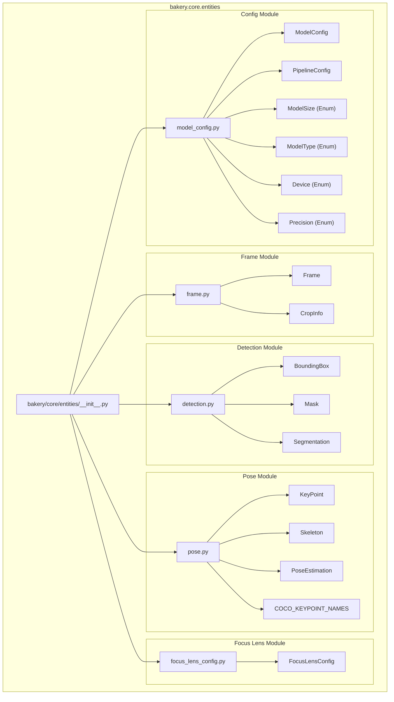
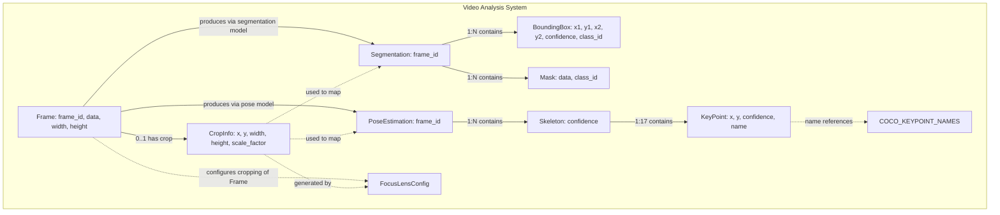

# Core Entities

Relevant source files

- [](https://github.com/e7canasta/bakery-luna/blob/8081344f/bakery/core/entities/__init__.py)

## Purpose and Scope

This document provides a comprehensive reference for all core data structures defined in `bakery/core/entities/`. These entities represent the foundational domain model of the bakery-luna system, serving as immutable value objects and aggregates that flow through the inference pipeline.

Core entities are organized into four categories:

- **Frame entities**: `Frame` and `CropInfo` represent input image data
- **Detection entities**: `BoundingBox`, `Mask`, and `Segmentation` represent object detection results
- **Pose entities**: `KeyPoint`, `Skeleton`, and `PoseEstimation` represent human pose estimation results
- **Configuration entities**: `ModelConfig`, `PipelineConfig`, `FocusLensConfig` parameterize the system (see [Configuration System](https://deepwiki.com/e7canasta/bakery-luna/3.2-configuration-system) for detailed documentation)

These entities are designed following Domain-Driven Design principles, with clear aggregate boundaries and immutability to prevent unintended state mutations. All other layers (Adapters, Pipeline, Annotators, Utils) depend on these core abstractions.

**Sources:** [bakery/core/entities/__init__.py1-32](https://github.com/e7canasta/bakery-luna/blob/8081344f/bakery/core/entities/__init__.py#L1-L32)

---

## Entity Module Organization

The `bakery.core.entities` package exports all core data structures through its public API. The module is organized into five files, each containing related entity definitions.

|Module File|Exported Entities|Purpose|
|---|---|---|
|`frame.py`|`Frame`, `CropInfo`|Input image representation and crop metadata|
|`detection.py`|`BoundingBox`, `Mask`, `Segmentation`|Object detection results|
|`pose.py`|`KeyPoint`, `Skeleton`, `PoseEstimation`, `COCO_KEYPOINT_NAMES`|Human pose estimation results|
|`model_config.py`|`ModelConfig`, `PipelineConfig`, `ModelSize`, `ModelType`, `Device`, `Precision`|Model and pipeline configuration|
|`focus_lens_config.py`|`FocusLensConfig`|Focus lens cropping configuration|

All entities are exported through `__init__.py` to provide a clean import interface: `from bakery.core.entities import Frame, BoundingBox, KeyPoint`.

**Sources:** [bakery/core/entities/__init__.py1-32](https://github.com/e7canasta/bakery-luna/blob/8081344f/bakery/core/entities/__init__.py#L1-L32)

---

## Entity Type Hierarchy

The following diagram shows the complete entity hierarchy and how entities are categorized within the core module.



**Diagram: Core Entity Type Hierarchy**

**Sources:** [bakery/core/entities/__init__.py1-32](https://github.com/e7canasta/bakery-luna/blob/8081344f/bakery/core/entities/__init__.py#L1-L32)

---

## Frame Entities

Frame entities represent the input image data and associated metadata as it flows through the pipeline.

### Frame

The `Frame` class encapsulates a single video frame with its identifying metadata.

**Key Attributes:**

- `data: np.ndarray` - The raw image data in NumPy array format (typically HWC format)
- `frame_id: int` - Sequential frame identifier for tracking
- `width: int` - Frame width in pixels
- `height: int` - Frame height in pixels

**Factory Method:**

- `Frame.from_array(data: np.ndarray, frame_id: int) -> Frame` - Creates a Frame instance from a NumPy array, automatically extracting width and height

The `Frame` entity serves as the primary input to the dual-model pipeline and is the aggregate root for all inference results.

### CropInfo

The `CropInfo` class stores metadata about focus lens cropping operations applied to a frame.

**Key Attributes:**

- `x: int` - X-coordinate of crop origin in the original frame
- `y: int` - Y-coordinate of crop origin in the original frame
- `width: int` - Width of the cropped region
- `height: int` - Height of the cropped region
- `scale_factor: float` - Scaling factor applied during crop (relevant for zoom strategy)

`CropInfo` enables coordinate transformation from cropped inference space back to full-frame coordinates. It is produced by the focus lens system (see [Focus Lens Operations](https://deepwiki.com/e7canasta/bakery-luna/4.2-focus-lens-operations)) and consumed during result mapping.

**Sources:** [bakery/core/entities/__init__.py3](https://github.com/e7canasta/bakery-luna/blob/8081344f/bakery/core/entities/__init__.py#L3-L3)

---

## Detection Entities

Detection entities represent the output of object detection and instance segmentation models.

### BoundingBox

The `BoundingBox` class represents a single detected object with bounding box coordinates.

**Key Attributes:**

- `x1: float` - Left edge of bounding box (xyxy format)
- `y1: float` - Top edge of bounding box
- `x2: float` - Right edge of bounding box
- `y2: float` - Bottom edge of bounding box
- `confidence: float` - Detection confidence score (0.0 to 1.0)
- `class_id: int` - Object class identifier

Bounding boxes use the **xyxy** coordinate format (absolute pixel coordinates). For conversion utilities, see [Utilities](https://deepwiki.com/e7canasta/bakery-luna/3.5-utilities).

### Mask

The `Mask` class represents a segmentation mask for a detected instance.

**Key Attributes:**

- `data: np.ndarray` - Binary or probabilistic mask array
- `class_id: int` - Object class identifier corresponding to the mask

Masks are typically the same resolution as the detection region and are used by the annotator to create precise instance visualizations.

### Segmentation

The `Segmentation` class is an aggregate containing all detection results for a single frame.

**Key Attributes:**

- `boxes: List[BoundingBox]` - All detected bounding boxes in the frame
- `masks: List[Mask]` - All segmentation masks in the frame
- `frame_id: int` - Frame identifier linking results to input

`Segmentation` serves as the complete detection output from the segmentation model. The pipeline may cache this aggregate when using smart segmentation scheduling (see [Dual Model Pipeline](https://deepwiki.com/e7canasta/bakery-luna/3.3-dual-model-pipeline)).

**Sources:** [bakery/core/entities/__init__.py4](https://github.com/e7canasta/bakery-luna/blob/8081344f/bakery/core/entities/__init__.py#L4-L4)

---

## Pose Entities

Pose entities represent human pose estimation results, including keypoint locations and skeletal structures.

### KeyPoint

The `KeyPoint` class represents a single anatomical keypoint (e.g., nose, left elbow).

**Key Attributes:**

- `x: float` - X-coordinate in pixel space
- `y: float` - Y-coordinate in pixel space
- `confidence: float` - Keypoint visibility/confidence score (0.0 to 1.0)
- `name: str` - Semantic name (e.g., "nose", "left_shoulder")

Keypoints use absolute pixel coordinates in the frame's coordinate system. Low confidence values indicate occluded or uncertain keypoints.

### Skeleton

The `Skeleton` class represents a complete pose for a single detected person.

**Key Attributes:**

- `keypoints: List[KeyPoint]` - Ordered list of anatomical keypoints
- `confidence: float` - Overall skeleton detection confidence

The keypoint order follows the COCO keypoint format (17 keypoints). The `COCO_KEYPOINT_NAMES` constant provides the canonical ordering.

### PoseEstimation

The `PoseEstimation` class is an aggregate containing all pose results for a single frame.

**Key Attributes:**

- `skeletons: List[Skeleton]` - All detected person poses in the frame
- `frame_id: int` - Frame identifier linking results to input

`PoseEstimation` represents the complete output from the pose estimation model. Unlike segmentation, pose estimation typically runs on every frame due to rapid pose changes.

### COCO_KEYPOINT_NAMES

A constant tuple defining the 17 COCO keypoint names in canonical order:

```
("nose", "left_eye", "right_eye", "left_ear", "right_ear",
 "left_shoulder", "right_shoulder", "left_elbow", "right_elbow",
 "left_wrist", "right_wrist", "left_hip", "right_hip",
 "left_knee", "right_knee", "left_ankle", "right_ankle")
```

This constant is used for semantic keypoint access and validation.

**Sources:** [bakery/core/entities/__init__.py5](https://github.com/e7canasta/bakery-luna/blob/8081344f/bakery/core/entities/__init__.py#L5-L5)

---

## Entity Relationship Model

The following diagram illustrates the relationships between core entities and their cardinalities.

**Diagram: Core Entity Relationships and Data Flow**





**Sources:** [bakery/core/entities/__init__.py1-32](https://github.com/e7canasta/bakery-luna/blob/8081344f/bakery/core/entities/__init__.py#L1-L32)

---

## Entity Lifecycle and Creation Patterns

Entities are created and transformed at specific points in the pipeline. The following table describes the typical creation pattern for each entity type.

|Entity|Created By|Created When|Consumed By|
|---|---|---|---|
|`Frame`|`run_luna.py`|On each video frame read via `cv2.VideoCapture`|Pipeline preprocessing, focus lens|
|`CropInfo`|`apply_focus_lens`|When focus lens is configured and applied|Result mapping functions|
|`Segmentation`|Segmentation postprocessing|After segmentation model inference (every N frames)|Annotator, result mapping|
|`BoundingBox`|Segmentation postprocessing|Parsed from model output tensor|NMS operations, visualization|
|`Mask`|Segmentation postprocessing|Parsed from model output tensor|Visualization|
|`PoseEstimation`|Pose postprocessing|After pose model inference (every frame)|Annotator, result mapping|
|`Skeleton`|Pose postprocessing|Parsed from model output tensor|Keypoint extraction|
|`KeyPoint`|Pose postprocessing|Parsed from skeleton output|Visualization, coordinate mapping|

**Sources:** [bakery/core/entities/__init__.py1-32](https://github.com/e7canasta/bakery-luna/blob/8081344f/bakery/core/entities/__init__.py#L1-L32)

---

## Configuration Entities Overview

Configuration entities parameterize the system's behavior. These are documented in detail in [Configuration System](https://deepwiki.com/e7canasta/bakery-luna/3.2-configuration-system), but are listed here for completeness:

|Entity|Purpose|Key Attributes|
|---|---|---|
|`ModelConfig`|Model-specific configuration|`model_path`, `resolution`, `confidence`, `type`, `precision`|
|`PipelineConfig`|Pipeline-wide configuration|`segmentation`, `pose`, `seg_interval`, `confidence_threshold`, `class_filter`|
|`FocusLensConfig`|Focus lens cropping configuration|`focus_size`, `focus_x`, `focus_y`, `strategy`, `is_centered`|
|`ModelSize`|Enum for model size variants|`NANO`, `SMALL`, `MEDIUM`, `LARGE`, `XLARGE`|
|`ModelType`|Enum for model categories|`SEGMENTATION`, `POSE`|
|`Device`|Enum for inference devices|`CPU`, `GPU`, `VPU`|
|`Precision`|Enum for model precision|`FP16`, `FP32`|

**Sources:** [bakery/core/entities/__init__.py6-7](https://github.com/e7canasta/bakery-luna/blob/8081344f/bakery/core/entities/__init__.py#L6-L7)

---

## Design Principles

The core entities follow several key design principles:

### Immutability

All entities are designed as immutable value objects. Once created, their state cannot be modified. This prevents unintended side effects and makes the data flow easier to reason about.

### Aggregate Boundaries

- `Frame` is an aggregate root that produces `Segmentation` and `PoseEstimation` aggregates
- `Segmentation` aggregates multiple `BoundingBox` and `Mask` entities
- `PoseEstimation` aggregates multiple `Skeleton` entities
- `Skeleton` aggregates multiple `KeyPoint` entities

These boundaries ensure that related entities are always consistent and complete.

### Type Safety

Entities use type hints throughout, and enumerations (`ModelType`, `Device`, `Precision`) provide compile-time validation of valid values.

### Semantic Clarity

Entity names directly reflect their domain purpose (e.g., `PoseEstimation` rather than `InferenceResult`). This makes the codebase self-documenting and reduces cognitive load.

### Separation of Concerns

Configuration entities (`ModelConfig`, `PipelineConfig`, `FocusLensConfig`) are separated from data entities (`Frame`, `Segmentation`, `PoseEstimation`), allowing parameterization without coupling to specific implementations.

**Sources:** [bakery/core/entities/__init__.py1-32](https://github.com/e7canasta/bakery-luna/blob/8081344f/bakery/core/entities/__init__.py#L1-L32)

---

## Integration with Other Layers

Core entities serve as the contract between all system layers:

- **Adapters Layer** ([Adapters Layer](https://deepwiki.com/e7canasta/bakery-luna/3.4-adapters-layer)): `InferenceEngine` consumes `Frame` entities and produces raw tensors that are converted to `Segmentation` and `PoseEstimation` entities
- **Pipeline Layer** ([Dual Model Pipeline](https://deepwiki.com/e7canasta/bakery-luna/3.3-dual-model-pipeline)): `DualModelPipeline` orchestrates the creation and caching of detection and pose entities
- **Utils Layer** ([Utilities](https://deepwiki.com/e7canasta/bakery-luna/3.5-utilities)): Geometry functions operate on `BoundingBox` coordinates; mapping functions transform entities using `CropInfo`
- **Annotators**: The Disney annotator consumes `Segmentation` and `PoseEstimation` entities to render the final visualization

This dependency structure follows the Dependency Inversion Principle: high-level modules depend on the core abstractions rather than concrete implementations.

**Sources:** [bakery/core/entities/__init__.py1-32](https://github.com/e7canasta/bakery-luna/blob/8081344f/bakery/core/entities/__init__.py#L1-L32)
