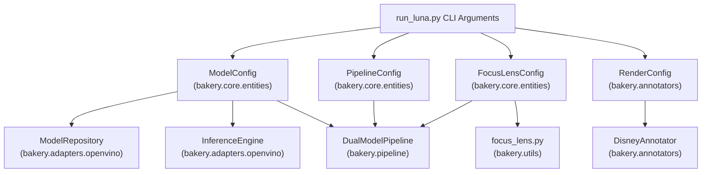
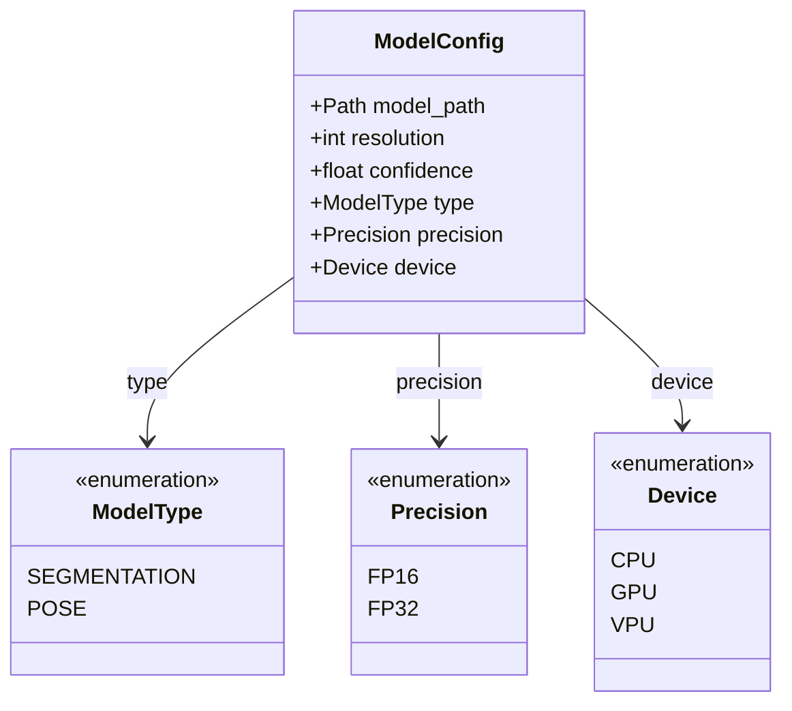
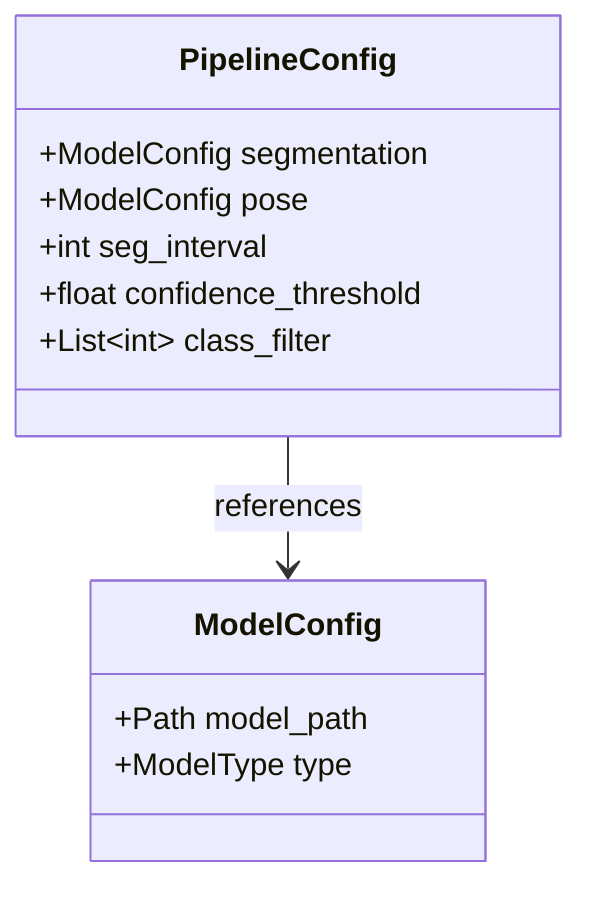
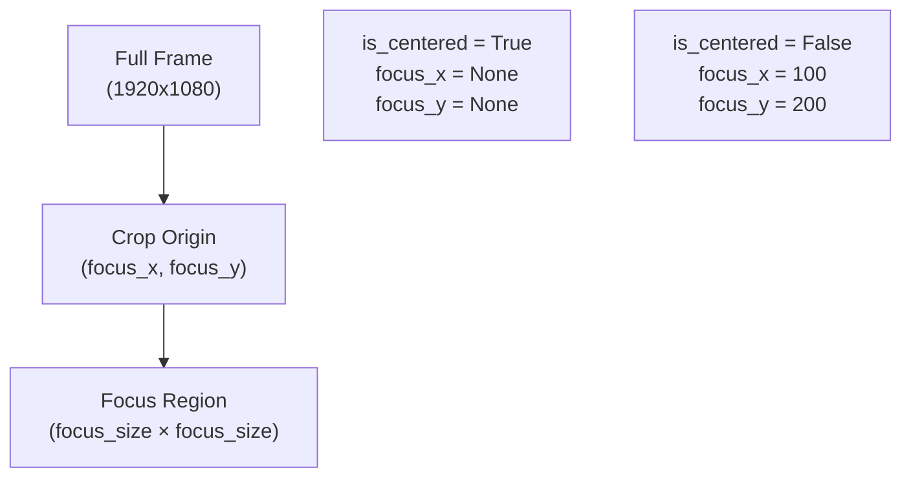
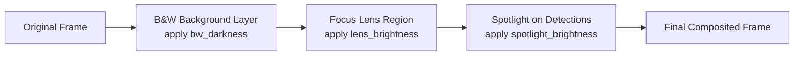
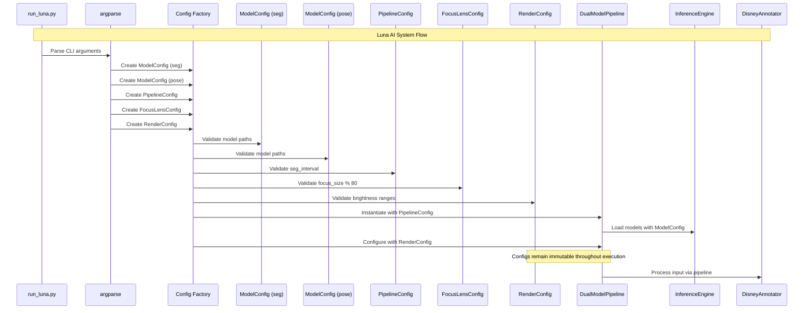

# Configuration System

Relevant source files

- [](https://github.com/e7canasta/bakery-luna/blob/8081344f/bakery/core/entities/__init__.py)
- [](https://github.com/e7canasta/bakery-luna/blob/8081344f/bakery/core/entities/focus_lens_config.py)

## Purpose and Scope

This page documents the Bakery framework's configuration system, which provides immutable, validated configuration entities that parameterize all stages of the dual-model inference pipeline. The configuration system consists of four primary entities: `ModelConfig`, `PipelineConfig`, `FocusLensConfig`, and `RenderConfig`.

For detailed information about using Focus Lens configuration parameters, see [Focus Lens Configuration](https://deepwiki.com/e7canasta/bakery-luna/4.1-focus-lens-configuration). For information about how these configurations are specified via command-line arguments, see [Command-Line Reference](https://deepwiki.com/e7canasta/bakery-luna/5.1-command-line-reference). For the broader context of core entities, see [Core Entities](https://deepwiki.com/e7canasta/bakery-luna/3.1-core-entities).

---

## Configuration Architecture

The configuration system follows the **immutable value object** pattern, where all configuration entities are frozen dataclasses that validate their parameters upon instantiation. This design prevents runtime configuration mutations and provides fail-fast validation.

### Configuration Entity Hierarchy


**Sources:** [bakery/core/entities/__init__.py1-31](https://github.com/e7canasta/bakery-luna/blob/8081344f/bakery/core/entities/__init__.py#L1-L31)

---

## Configuration Entities Overview

|Configuration Entity|Purpose|Primary Consumer|Validation Rules|
|---|---|---|---|
|`ModelConfig`|Specifies OpenVINO model parameters|`InferenceEngine`, `ModelRepository`|Model path existence, resolution constraints, valid enum values|
|`PipelineConfig`|Orchestrates dual-model pipeline behavior|`DualModelPipeline`|References two ModelConfigs (seg + pose), positive seg_interval|
|`FocusLensConfig`|Defines crop-based inference region|`apply_focus_lens()`, `DualModelPipeline`|focus_size must be multiple of 80, valid strategy|
|`RenderConfig`|Controls Disney aesthetic rendering|`DisneyAnnotator`|Brightness/darkness values in [0.0, 1.0] range|

**Sources:** [bakery/core/entities/__init__.py6-7](https://github.com/e7canasta/bakery-luna/blob/8081344f/bakery/core/entities/__init__.py#L6-L7)

---

## ModelConfig

The `ModelConfig` entity encapsulates all parameters required to load and execute an OpenVINO model. Each instance represents a single model's configuration.

### Structure





### Attributes

|Attribute|Type|Description|Example|
|---|---|---|---|
|`model_path`|`Path`|Path to OpenVINO `.xml` model file|`models/yolo11n-seg.xml`|
|`resolution`|`int`|Model input resolution (width=height)|`640`|
|`confidence`|`float`|Confidence threshold for predictions|`0.25`|
|`type`|`ModelType`|Model type (SEGMENTATION or POSE)|`ModelType.SEGMENTATION`|
|`precision`|`Precision`|Model precision (FP16 or FP32)|`Precision.FP16`|
|`device`|`Device`|Target inference device|`Device.CPU`|

### Validation Rules

- `model_path` must exist and end with `.xml`
- `resolution` must be positive and typically a multiple of 32
- `confidence` must be in range [0.0, 1.0]
- `type`, `precision`, and `device` must be valid enum values

**Sources:** [bakery/core/entities/__init__.py6](https://github.com/e7canasta/bakery-luna/blob/8081344f/bakery/core/entities/__init__.py#L6-L6) [bakery/core/entities/model_config.py](https://github.com/e7canasta/bakery-luna/blob/8081344f/bakery/core/entities/model_config.py) (inferred from imports)

---

## PipelineConfig

The `PipelineConfig` entity orchestrates the dual-model pipeline by aggregating two `ModelConfig` instances (one for segmentation, one for pose) along with pipeline-level parameters.

### Structure





### Attributes

|Attribute|Type|Description|Default|
|---|---|---|---|
|`segmentation`|`ModelConfig`|Configuration for segmentation model|Required|
|`pose`|`ModelConfig`|Configuration for pose estimation model|Required|
|`seg_interval`|`int`|Run segmentation every N frames (caching optimization)|`1`|
|`confidence_threshold`|`float`|Global confidence threshold for both models|`0.25`|
|`class_filter`|`List[int]`|Only process specific class IDs (empty = all classes)|`[]`|

### Smart Segmentation Scheduling

The `seg_interval` parameter enables **smart segmentation scheduling**, an optimization strategy that exploits the temporal stability of object locations:

- **seg_interval = 1**: Segmentation runs every frame (no caching)
- **seg_interval = 3**: Segmentation runs every 3rd frame, cached otherwise
- **seg_interval = 5**: Segmentation runs every 5th frame (aggressive caching)

Pose estimation always runs every frame since human poses change rapidly.

### Validation Rules

- `segmentation.type` must be `ModelType.SEGMENTATION`
- `pose.type` must be `ModelType.POSE`
- `seg_interval` must be positive (≥ 1)
- `confidence_threshold` must be in range [0.0, 1.0]
- `class_filter` elements must be non-negative integers

**Sources:** [bakery/core/entities/__init__.py6](https://github.com/e7canasta/bakery-luna/blob/8081344f/bakery/core/entities/__init__.py#L6-L6) [bakery/core/entities/model_config.py](https://github.com/e7canasta/bakery-luna/blob/8081344f/bakery/core/entities/model_config.py) (inferred)

---

## FocusLensConfig

The `FocusLensConfig` entity defines parameters for the **Focus Lens** crop-based inference optimization. This configuration enables the pipeline to process only a region of interest, improving accuracy by concentrating pixels on important areas.

### Structure and Attributes

|Attribute|Type|Description|Default|Constraint|
|---|---|---|---|---|
|`focus_size`|`int`|Square crop size in pixels|Required|Must be multiple of 80|
|`focus_x`|`Optional[int]`|X coordinate of crop origin|`None` (centered)|Non-negative if provided|
|`focus_y`|`Optional[int]`|Y coordinate of crop origin|`None` (centered)|Non-negative if provided|
|`strategy`|`str`|Handling for undersized frames|`"zoom"`|`"zoom"` or `"pad"`|

### Coordinate System




### Strategy Modes

|Strategy|Behavior|Use Case|
|---|---|---|
|`"zoom"`|Scale up frames smaller than `focus_size`|Maintain aspect ratio, prevent black borders|
|`"pad"`|Add black padding to undersized frames|Preserve original scale, avoid interpolation artifacts|

### Validation Implementation

The validation logic is implemented in [bakery/core/entities/focus_lens_config.py38-61](https://github.com/e7canasta/bakery-luna/blob/8081344f/bakery/core/entities/focus_lens_config.py#L38-L61):

```
def __post_init__(self):
    """Validate Focus Lens configuration."""
    # Validate focus_size is positive
    if self.focus_size <= 0:
        raise ValueError(f"focus_size must be positive, got {self.focus_size}")
    
    # Validate focus_size is multiple of 80
    if self.focus_size % 80 != 0:
        raise ValueError(
            f"focus_size must be multiple of 80 (80, 160, 240, 320, 400, 480, 560, 640...), "
            f"got {self.focus_size}"
        )
    
    # Validate strategy
    if self.strategy not in ("zoom", "pad"):
        raise ValueError(
            f"strategy must be 'zoom' or 'pad', got '{self.strategy}'"
        )
    
    # Validate focus_x/focus_y if provided
    if self.focus_x is not None and self.focus_x < 0:
        raise ValueError(f"focus_x must be non-negative, got {self.focus_x}")
    if self.focus_y is not None and self.focus_y < 0:
        raise ValueError(f"focus_y must be non-negative, got {self.focus_y}")
```

### Computed Property: is_centered

The `is_centered` property [bakery/core/entities/focus_lens_config.py63-66](https://github.com/e7canasta/bakery-luna/blob/8081344f/bakery/core/entities/focus_lens_config.py#L63-L66) provides a convenient check for whether the focus lens uses automatic centering:

```
@property
def is_centered(self) -> bool:
    """Check if focus lens is centered (no explicit position)."""
    return self.focus_x is None and self.focus_y is None
```

**Sources:** [bakery/core/entities/focus_lens_config.py1-67](https://github.com/e7canasta/bakery-luna/blob/8081344f/bakery/core/entities/focus_lens_config.py#L1-L67) [bakery/core/entities/__init__.py7](https://github.com/e7canasta/bakery-luna/blob/8081344f/bakery/core/entities/__init__.py#L7-L7)

---

## RenderConfig

The `RenderConfig` entity controls the **Disney/Roger Rabbit aesthetic** parameters used by the `DisneyAnnotator` to render the 8-layer visualization.

### Attributes

|Attribute|Type|Description|Valid Range|
|---|---|---|---|
|`bw_darkness`|`float`|Darkness level for black-and-white background|[0.0, 1.0]|
|`lens_brightness`|`float`|Brightness multiplier for focus lens region|[0.0, 2.0]|
|`spotlight_brightness`|`float`|Brightness of spotlight effect on detected objects|[0.0, 2.0]|

### Rendering Effect Flow



### Typical Configuration Values

|Use Case|bw_darkness|lens_brightness|spotlight_brightness|
|---|---|---|---|
|Subtle effect|0.3|1.1|1.2|
|**Standard** (default)|0.5|1.3|1.5|
|Dramatic|0.7|1.5|2.0|

**Sources:** Inferred from Diagram 5 (Class Diagram), Diagram 3 (CLI parameters: `--bw-darkness`, `--brightness`)

---

## Configuration Validation Pattern

All configuration entities follow a consistent validation pattern using frozen dataclasses with `__post_init__` validation:

### Validation Workflow

### Benefits of This Pattern

1. **Fail-Fast**: Invalid configurations are rejected at creation time, not during pipeline execution
2. **Immutability**: Frozen dataclasses prevent accidental mutations
3. **Self-Documenting**: Validation rules serve as inline documentation
4. **Type Safety**: Leverages Python type hints for static analysis

**Sources:** [bakery/core/entities/focus_lens_config.py11-67](https://github.com/e7canasta/bakery-luna/blob/8081344f/bakery/core/entities/focus_lens_config.py#L11-L67)

---

## Configuration Flow in Pipeline

The following diagram shows how configuration entities flow through the system from CLI to execution:





**Sources:** Inferred from Diagram 3 (Luna Pipeline End-to-End Data Flow)

---

## Configuration Export and Imports

All configuration entities are exported from the `bakery.core.entities` package for convenient access:

```
from bakery.core.entities import (
    ModelConfig,
    PipelineConfig,
    FocusLensConfig,
    ModelType,
    ModelSize,
    Device,
    Precision,
)
```

The enumeration types (`ModelType`, `ModelSize`, `Device`, `Precision`) provide type-safe constants for configuration parameters.

**Sources:** [bakery/core/entities/__init__.py6-31](https://github.com/e7canasta/bakery-luna/blob/8081344f/bakery/core/entities/__init__.py#L6-L31)

---

## Summary

The Bakery configuration system provides:

- **Four immutable configuration entities** parameterizing different pipeline stages
- **Frozen dataclass pattern** with `__post_init__` validation for fail-fast error handling
- **Type-safe enumerations** for model types, devices, and precision levels
- **Clear separation of concerns** between model, pipeline, focus lens, and rendering configuration
- **Hierarchical composition** where `PipelineConfig` aggregates multiple `ModelConfig` instances

For implementation details of Focus Lens operations using `FocusLensConfig`, see [Focus Lens Operations](https://deepwiki.com/e7canasta/bakery-luna/4.2-focus-lens-operations). For information on how to specify these configurations via command-line arguments, see [Command-Line Reference](https://deepwiki.com/e7canasta/bakery-luna/5.1-command-line-reference).
