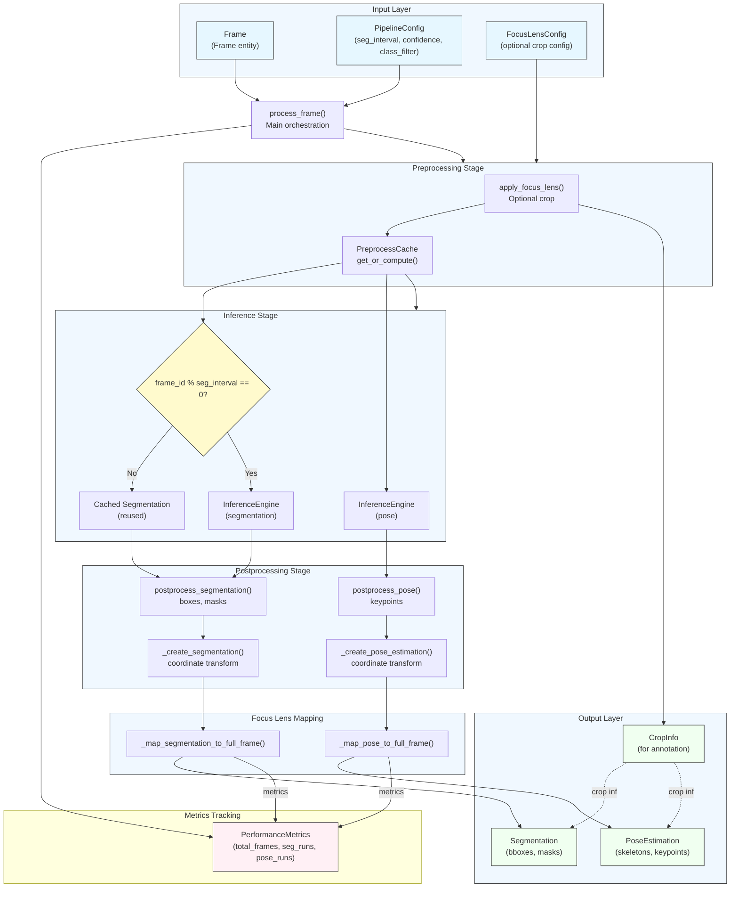
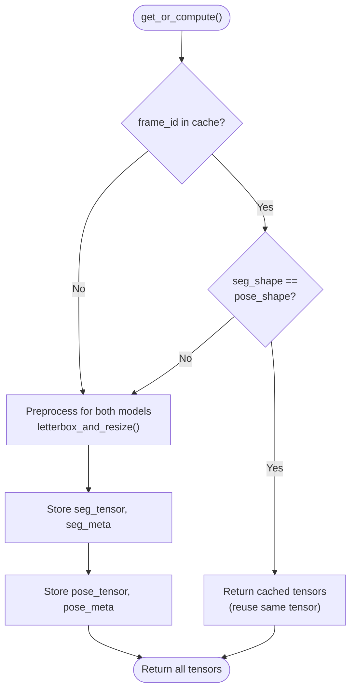
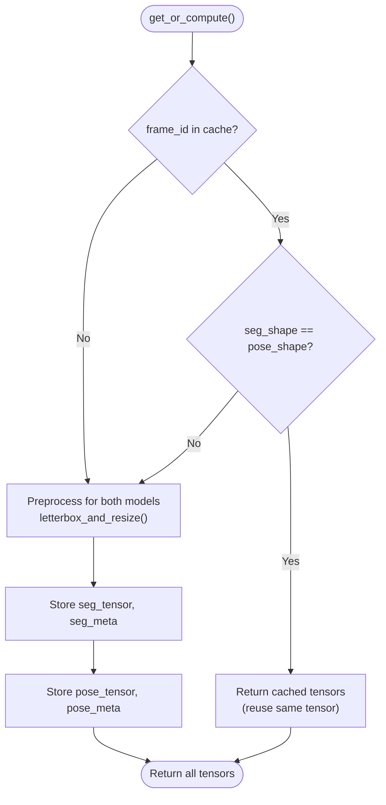
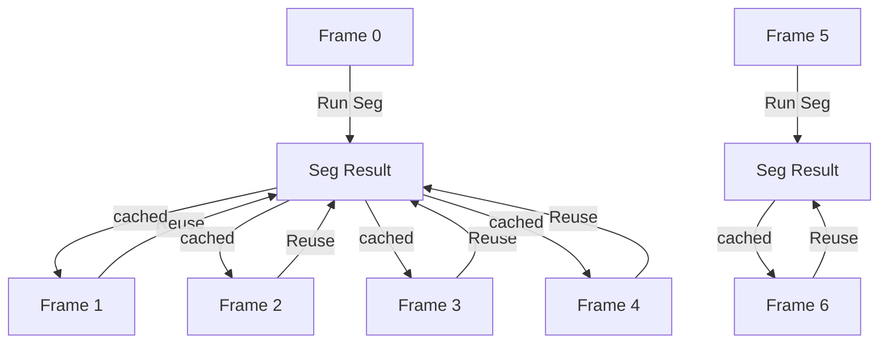
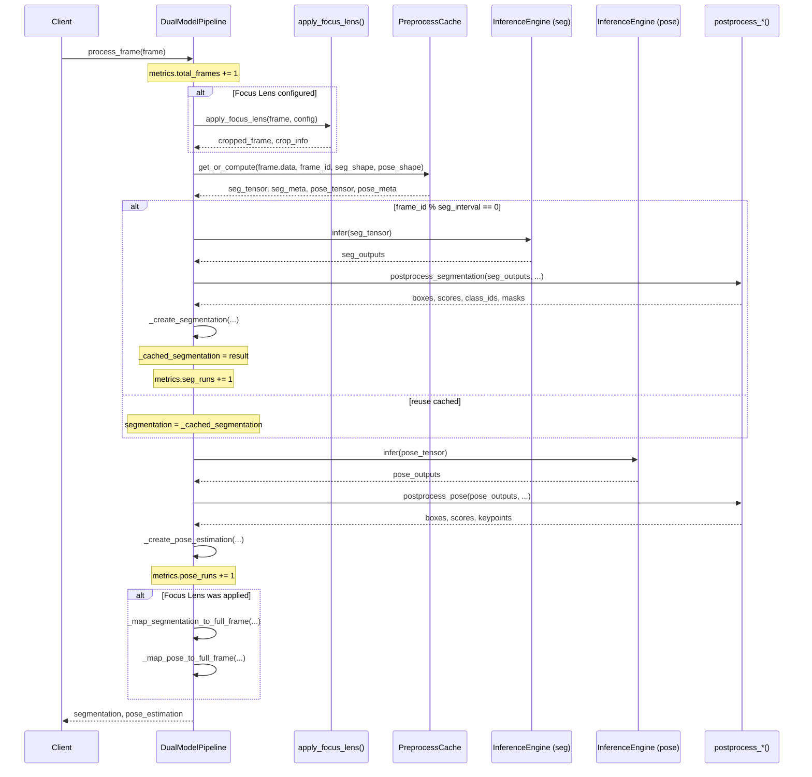
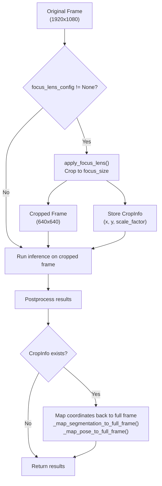
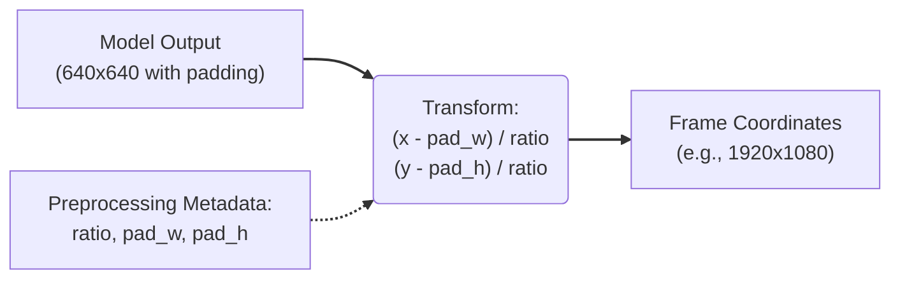
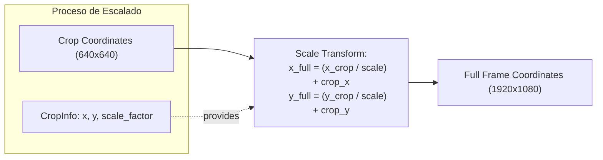
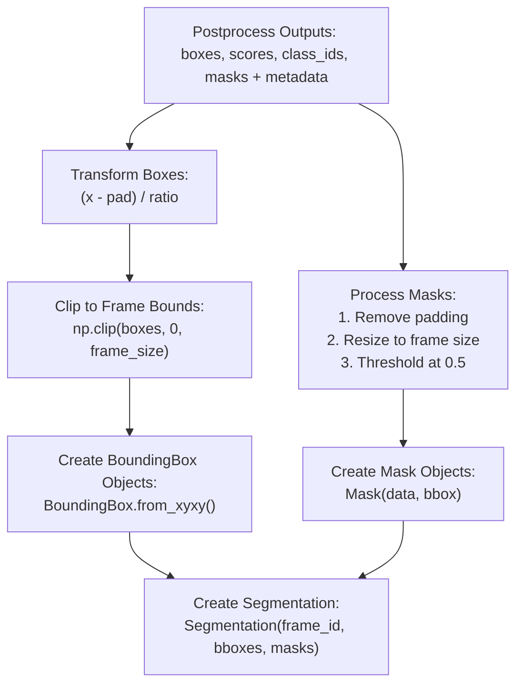
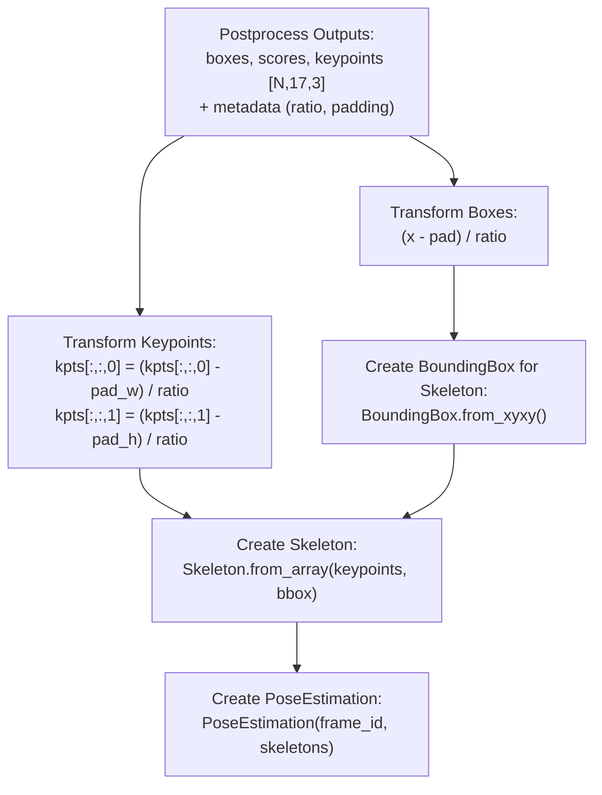

# Dual Model Pipeline

Relevant source files

- [](https://github.com/e7canasta/bakery-luna/blob/8081344f/bakery/pipeline/dual_model_pipeline.py)
- [](https://github.com/e7canasta/bakery-luna/blob/8081344f/pyproject.toml)
- [](https://github.com/e7canasta/bakery-luna/blob/8081344f/run_luna.py)

## Purpose and Scope

The Dual Model Pipeline is the central orchestration layer of the Bakery framework, coordinating inference across two specialized computer vision models: segmentation and pose estimation. This document explains the architecture, optimization strategies, and implementation details of the `DualModelPipeline` class.

For information about the underlying inference adapters, see [Adapters Layer](https://deepwiki.com/e7canasta/bakery-luna/3.4-adapters-layer). For configuration details, see [Configuration System](https://deepwiki.com/e7canasta/bakery-luna/3.2-configuration-system). For the end-to-end execution flow including video I/O and rendering, see [Pipeline Execution Flow](https://deepwiki.com/e7canasta/bakery-luna/5.2-pipeline-execution-flow).

**Sources:** [bakery/pipeline/dual_model_pipeline.py1-503](https://github.com/e7canasta/bakery-luna/blob/8081344f/bakery/pipeline/dual_model_pipeline.py#L1-L503)

---

## Overview

The `DualModelPipeline` class implements a dual-inference architecture where segmentation (object detection with masks) and pose estimation (human keypoint detection) run in coordination. The pipeline employs three key optimizations:

1. **Preprocessing Cache**: Reuses preprocessed tensors when both models share the same input resolution
2. **Smart Segmentation Scheduling**: Runs segmentation every N frames (configurable via `seg_interval`)
3. **Focus Lens Integration**: Supports crop-based inference for computational efficiency

The pipeline produces structured outputs (`Segmentation` and `PoseEstimation` entities) with proper coordinate transformations applied.

**Sources:** [bakery/pipeline/dual_model_pipeline.py31-41](https://github.com/e7canasta/bakery-luna/blob/8081344f/bakery/pipeline/dual_model_pipeline.py#L31-L41)

---

## Architecture

### Pipeline Component Diagram



**Description:** This diagram shows the complete internal architecture of `DualModelPipeline.process_frame()`. The pipeline processes each frame through four major stages: preprocessing (with optional Focus Lens cropping), inference (with smart scheduling), postprocessing (coordinate transformations), and optional mapping back to full frame coordinates. The `PreprocessCache` sits between preprocessing and inference, while `PerformanceMetrics` tracks execution statistics.

**Sources:** [bakery/pipeline/dual_model_pipeline.py43-181](https://github.com/e7canasta/bakery-luna/blob/8081344f/bakery/pipeline/dual_model_pipeline.py#L43-L181) [bakery/pipeline/dual_model_pipeline.py334-372](https://github.com/e7canasta/bakery-luna/blob/8081344f/bakery/pipeline/dual_model_pipeline.py#L334-L372)

---

## Key Components

### DualModelPipeline Class

The `DualModelPipeline` class serves as the main orchestrator. Its constructor and key properties are:

|Component|Type|Purpose|
|---|---|---|
|`seg_engine`|`InferenceEngine`|Executes segmentation model inference|
|`pose_engine`|`InferenceEngine`|Executes pose estimation model inference|
|`config`|`PipelineConfig`|Pipeline parameters (seg_interval, confidence, etc.)|
|`focus_lens_config`|`Optional[FocusLensConfig]`|Crop-based inference configuration|
|`preprocess_cache`|`PreprocessCache`|Caches preprocessed tensors for optimization|
|`metrics`|`PerformanceMetrics`|Tracks frames processed, inference runs|
|`_cached_segmentation`|`Optional[Segmentation]`|Stores last segmentation result for reuse|
|`_current_crop_info`|`Optional[CropInfo]`|Stores crop metadata for annotation|

**Sources:** [bakery/pipeline/dual_model_pipeline.py43-84](https://github.com/e7canasta/bakery-luna/blob/8081344f/bakery/pipeline/dual_model_pipeline.py#L43-L84)

---

### Preprocessing Cache

The `PreprocessCache` optimizes performance when both models use the same input resolution. It stores preprocessed tensors (with letterboxing metadata) and reuses them across models.

**Cache Logic:**






**Description:** The preprocessing cache checks if tensors for the current frame already exist. If both models share the same input shape, the same preprocessed tensor is reused. Otherwise, separate preprocessing occurs for each model. Metadata (ratio, padding) is stored for coordinate transformations during postprocessing.

**Sources:** [bakery/pipeline/dual_model_pipeline.py73-122](https://github.com/e7canasta/bakery-luna/blob/8081344f/bakery/pipeline/dual_model_pipeline.py#L73-L122) [bakery/adapters/openvino/preprocessing.py](https://github.com/e7canasta/bakery-luna/blob/8081344f/bakery/adapters/openvino/preprocessing.py)

---

### Smart Segmentation Scheduling

Segmentation inference is computationally expensive and object positions change slowly across frames. The pipeline implements frame-skipping via `seg_interval`:





**Description:** With `seg_interval=5`, segmentation runs only on frames 0, 5, 10, etc. Intermediate frames reuse the cached result. Pose estimation always runs every frame since human poses change rapidly.

**Implementation:**

```
# Smart scheduling logic
if frame.frame_id % self.config.seg_interval == 0:
    seg_outputs = self.seg_engine.infer(seg_tensor)
    # ... postprocess and cache result
    self.metrics.seg_runs += 1
else:
    # Reuse cached segmentation
    segmentation = self._cached_segmentation
```

**Sources:** [bakery/pipeline/dual_model_pipeline.py124-149](https://github.com/e7canasta/bakery-luna/blob/8081344f/bakery/pipeline/dual_model_pipeline.py#L124-L149)

---

### Performance Metrics

The `PerformanceMetrics` class tracks pipeline efficiency:

|Metric|Type|Description|
|---|---|---|
|`total_frames`|`int`|Total frames processed|
|`seg_runs`|`int`|Number of segmentation inferences executed|
|`pose_runs`|`int`|Number of pose inferences executed|
|`seg_efficiency`|`float` (computed)|`total_frames / seg_runs` (ideal: equals `seg_interval`)|
|`pose_efficiency`|`float` (computed)|`total_frames / pose_runs` (always 1.0)|

Methods:

- `pipeline.get_metrics()` - Returns current metrics
- `pipeline.reset_metrics()` - Resets counters

**Sources:** [bakery/pipeline/dual_model_pipeline.py76-77](https://github.com/e7canasta/bakery-luna/blob/8081344f/bakery/pipeline/dual_model_pipeline.py#L76-L77) [bakery/pipeline/dual_model_pipeline.py334-356](https://github.com/e7canasta/bakery-luna/blob/8081344f/bakery/pipeline/dual_model_pipeline.py#L334-L356) [bakery/utils/metrics.py](https://github.com/e7canasta/bakery-luna/blob/8081344f/bakery/utils/metrics.py)

---

## Processing Flow

### Main `process_frame()` Method

The `process_frame()` method is the primary entry point. It coordinates all pipeline stages:





**Description:** This sequence diagram shows the complete execution flow of `process_frame()`. The method proceeds through Focus Lens application (optional), preprocessing with cache, smart segmentation scheduling, always-on pose estimation, and coordinate mapping back to full frame space if Focus Lens was used.

**Sources:** [bakery/pipeline/dual_model_pipeline.py85-181](https://github.com/e7canasta/bakery-luna/blob/8081344f/bakery/pipeline/dual_model_pipeline.py#L85-L181)

---

## Focus Lens Integration

The pipeline integrates with the Focus Lens system to enable crop-based inference. This reduces computational load by processing only a region of interest.

### Focus Lens Flow





**Description:** When `FocusLensConfig` is provided, the pipeline crops the frame before inference, processes the smaller region, then maps results back to full frame coordinates. The `CropInfo` object stores the transformation metadata required for accurate mapping.

**Key Methods:**

|Method|Purpose|Returns|
|---|---|---|
|`apply_focus_lens()`|Crops frame to focus region|`(Frame, CropInfo)`|
|`_map_segmentation_to_full_frame()`|Maps bboxes/masks back to full frame|`Segmentation`|
|`_map_pose_to_full_frame()`|Maps keypoints back to full frame|`PoseEstimation`|
|`get_crop_info()`|Exposes current crop info to external callers|`Optional[CropInfo]`|

**Sources:** [bakery/pipeline/dual_model_pipeline.py108-112](https://github.com/e7canasta/bakery-luna/blob/8081344f/bakery/pipeline/dual_model_pipeline.py#L108-L112) [bakery/pipeline/dual_model_pipeline.py173-180](https://github.com/e7canasta/bakery-luna/blob/8081344f/bakery/pipeline/dual_model_pipeline.py#L173-L180) [bakery/pipeline/dual_model_pipeline.py358-371](https://github.com/e7canasta/bakery-luna/blob/8081344f/bakery/pipeline/dual_model_pipeline.py#L358-L371) [bakery/pipeline/dual_model_pipeline.py373-502](https://github.com/e7canasta/bakery-luna/blob/8081344f/bakery/pipeline/dual_model_pipeline.py#L373-L502)

---

## Coordinate Transformations

The pipeline performs two levels of coordinate transformation:

### 1. Model Space → Frame Space

Postprocessing converts model output coordinates (with letterbox padding) to frame coordinates:



**Implementation:** [bakery/pipeline/dual_model_pipeline.py209-224](https://github.com/e7canasta/bakery-luna/blob/8081344f/bakery/pipeline/dual_model_pipeline.py#L209-L224) [bakery/pipeline/dual_model_pipeline.py303-316](https://github.com/e7canasta/bakery-luna/blob/8081344f/bakery/pipeline/dual_model_pipeline.py#L303-L316)

### 2. Cropped Frame → Full Frame (Focus Lens)

When Focus Lens is active, an additional transformation maps from cropped to full coordinates:



**Implementation:** [bakery/pipeline/dual_model_pipeline.py373-433](https://github.com/e7canasta/bakery-luna/blob/8081344f/bakery/pipeline/dual_model_pipeline.py#L373-L433) [bakery/pipeline/dual_model_pipeline.py434-502](https://github.com/e7canasta/bakery-luna/blob/8081344f/bakery/pipeline/dual_model_pipeline.py#L434-L502)

**Sources:** [bakery/utils/focus_lens.py](https://github.com/e7canasta/bakery-luna/blob/8081344f/bakery/utils/focus_lens.py)

---

## Segmentation Entity Creation

The `_create_segmentation()` method converts raw postprocessing outputs to the `Segmentation` entity:



**Description:** The method applies coordinate transformations to boxes, clips them to frame boundaries, processes masks (removing padding and resizing), then constructs `BoundingBox` and `Mask` objects wrapped in a `Segmentation` entity.

**Sources:** [bakery/pipeline/dual_model_pipeline.py183-277](https://github.com/e7canasta/bakery-luna/blob/8081344f/bakery/pipeline/dual_model_pipeline.py#L183-L277)

---

## Pose Estimation Entity Creation

The `_create_pose_estimation()` method converts pose outputs to the `PoseEstimation` entity:



**Description:** Both bounding boxes and keypoints undergo coordinate transformation. Each detection becomes a `Skeleton` object (containing 17 keypoints), and all skeletons are wrapped in a `PoseEstimation` entity.

**Sources:** [bakery/pipeline/dual_model_pipeline.py279-332](https://github.com/e7canasta/bakery-luna/blob/8081344f/bakery/pipeline/dual_model_pipeline.py#L279-L332)

---

## Usage Patterns

### Basic Usage

```
from bakery.adapters.openvino.inference_engine import InferenceEngine
from bakery.pipeline.dual_model_pipeline import DualModelPipeline
from bakery.core.entities import PipelineConfig, Frame

# Create inference engines
seg_engine = InferenceEngine(seg_model_config)
pose_engine = InferenceEngine(pose_model_config)

# Create pipeline configuration
pipeline_config = PipelineConfig(
    segmentation=seg_model_config,
    pose=pose_model_config,
    seg_interval=5,  # Run seg every 5 frames
    confidence_threshold=0.25,
    class_filter=None  # All classes
)

# Initialize pipeline
pipeline = DualModelPipeline(seg_engine, pose_engine, pipeline_config)

# Process frame
frame = Frame.from_array(image, frame_id=0)
segmentation, pose_estimation = pipeline.process_frame(frame)

# Access results
print(f"Detected {len(segmentation)} objects")
print(f"Detected {len(pose_estimation)} poses")

# Get metrics
metrics = pipeline.get_metrics()
print(f"Seg efficiency: {metrics.total_frames / metrics.seg_runs}x")
```

**Sources:** [run_luna.py82-141](https://github.com/e7canasta/bakery-luna/blob/8081344f/run_luna.py#L82-L141)

---

### With Focus Lens

```
from bakery.core.entities import FocusLensConfig

# Create focus lens config
focus_lens_config = FocusLensConfig(
    focus_size=640,     # Square crop size
    focus_x=None,       # None = centered
    focus_y=None,
    strategy="zoom"     # or "pad"
)

# Initialize pipeline with focus lens
pipeline = DualModelPipeline(
    seg_engine, 
    pose_engine, 
    pipeline_config,
    focus_lens_config=focus_lens_config
)

# Process frame - inference runs on cropped region
segmentation, pose_estimation = pipeline.process_frame(frame)

# Results are automatically mapped back to full frame coordinates
# Get crop info for visualization
crop_info = pipeline.get_crop_info()
if crop_info:
    print(f"Focus region: ({crop_info.x}, {crop_info.y}) "
          f"{crop_info.width}x{crop_info.height}")
```

**Sources:** [run_luna.py119-131](https://github.com/e7canasta/bakery-luna/blob/8081344f/run_luna.py#L119-L131) [bakery/core/entities/focus_lens_config.py](https://github.com/e7canasta/bakery-luna/blob/8081344f/bakery/core/entities/focus_lens_config.py)

---

### Metrics Tracking

```
# Process multiple frames
for frame_id, image in enumerate(video_frames):
    frame = Frame.from_array(image, frame_id=frame_id)
    segmentation, pose_estimation = pipeline.process_frame(frame)

# Get final metrics
metrics = pipeline.get_metrics()

print(f"Total frames processed: {metrics.total_frames}")
print(f"Segmentation runs: {metrics.seg_runs}")
print(f"Pose runs: {metrics.pose_runs}")
print(f"Seg efficiency: {metrics.total_frames / metrics.seg_runs:.1f}x")

# Reset for new video
pipeline.reset_metrics()
```

**Sources:** [run_luna.py307-329](https://github.com/e7canasta/bakery-luna/blob/8081344f/run_luna.py#L307-L329) [bakery/pipeline/dual_model_pipeline.py334-356](https://github.com/e7canasta/bakery-luna/blob/8081344f/bakery/pipeline/dual_model_pipeline.py#L334-L356)

---

## Method Reference

### Public Methods

|Method|Parameters|Returns|Description|
|---|---|---|---|
|`__init__()`|`seg_engine`, `pose_engine`, `config`, `focus_lens_config`|-|Initializes pipeline with engines and configuration|
|`process_frame()`|`frame: Frame`|`(Segmentation, PoseEstimation)`|Main processing method|
|`get_metrics()`|-|`PerformanceMetrics`|Returns current performance metrics|
|`reset_metrics()`|-|-|Resets all metrics and cached state|
|`get_crop_info()`|-|`Optional[CropInfo]`|Returns crop info from last processed frame|

### Private Methods

|Method|Purpose|
|---|---|
|`_create_segmentation()`|Converts postprocessing outputs to `Segmentation` entity|
|`_create_pose_estimation()`|Converts postprocessing outputs to `PoseEstimation` entity|
|`_map_segmentation_to_full_frame()`|Maps segmentation from crop to full frame|
|`_map_pose_to_full_frame()`|Maps pose estimation from crop to full frame|

**Sources:** [bakery/pipeline/dual_model_pipeline.py31-503](https://github.com/e7canasta/bakery-luna/blob/8081344f/bakery/pipeline/dual_model_pipeline.py#L31-L503)

---

## Implementation Notes

### Resolution Matching Optimization

When both models use the same input resolution (e.g., both 640x640), the `PreprocessCache` reuses the same preprocessed tensor for both inferences:

```
# In run_luna.py output:
# ⚡ Preprocessing cache optimization enabled (both models use 640px)
```

This eliminates redundant letterbox operations and reduces memory allocation overhead.

**Sources:** [run_luna.py136-139](https://github.com/e7canasta/bakery-luna/blob/8081344f/run_luna.py#L136-L139)

---

### Empty Result Handling

Both `Segmentation` and `PoseEstimation` entities support empty results when no detections occur:

```
if len(boxes) == 0:
    return Segmentation.empty(frame_id)

if len(boxes) == 0:
    return PoseEstimation.empty(frame_id)
```

Empty results propagate correctly through the pipeline without causing errors.

**Sources:** [bakery/pipeline/dual_model_pipeline.py206-207](https://github.com/e7canasta/bakery-luna/blob/8081344f/bakery/pipeline/dual_model_pipeline.py#L206-L207) [bakery/pipeline/dual_model_pipeline.py300-301](https://github.com/e7canasta/bakery-luna/blob/8081344f/bakery/pipeline/dual_model_pipeline.py#L300-L301)

---

### Mask Processing Details

Mask processing follows this precise sequence:

1. Extract mask from model output (float values [0, 1] after sigmoid)
2. Remove letterbox padding
3. Resize to original frame dimensions using bilinear interpolation
4. Threshold at 0.5 to create binary mask

This matches the original YOLO postprocessing logic for consistent mask quality.

**Sources:** [bakery/pipeline/dual_model_pipeline.py234-269](https://github.com/e7canasta/bakery-luna/blob/8081344f/bakery/pipeline/dual_model_pipeline.py#L234-L269)

