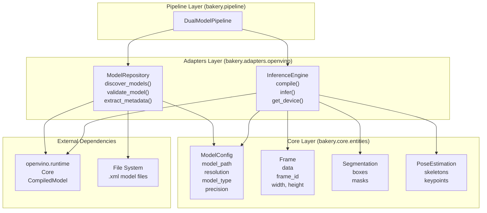
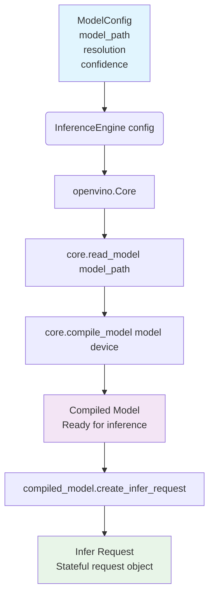
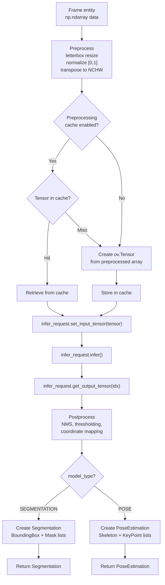
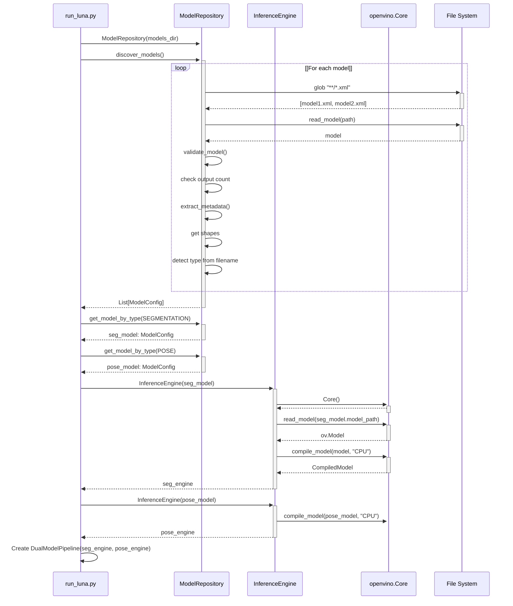
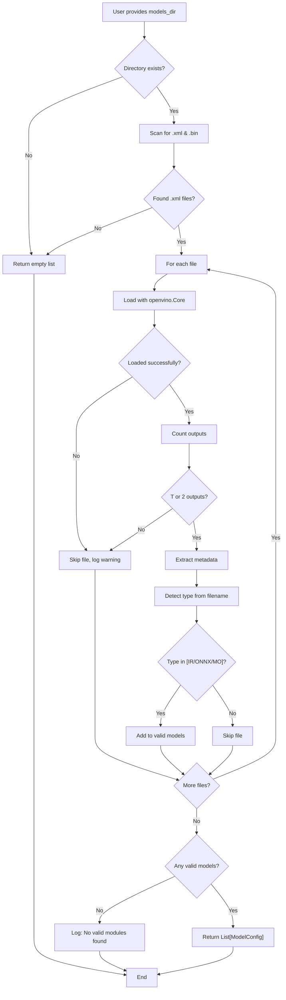

# Adapters Layer

Relevant source files

- [](https://github.com/e7canasta/bakery-luna/blob/8081344f/bakery/tests/test_model_repository.py)
- [](https://github.com/e7canasta/bakery-luna/blob/8081344f/pyproject.toml)
- [](https://github.com/e7canasta/bakery-luna/blob/8081344f/run_luna.py)

## Purpose and Scope

The Adapters Layer provides hardware-specific implementations that integrate external inference runtimes with the Bakery framework's core abstractions. This layer implements the Adapter pattern to isolate hardware dependencies (specifically Intel OpenVINO) from the core business logic, enabling the system to remain portable and testable.

This document covers the `bakery.adapters.openvino` module, which includes `ModelRepository` for model discovery and validation, and `InferenceEngine` for runtime execution. For configuration of discovered models, see [Configuration System](https://deepwiki.com/e7canasta/bakery-luna/3.2-configuration-system). For the orchestration of inference engines, see [Dual Model Pipeline](https://deepwiki.com/e7canasta/bakery-luna/3.3-dual-model-pipeline).

**Sources:** [run_luna.py1-38](https://github.com/e7canasta/bakery-luna/blob/8081344f/run_luna.py#L1-L38) High-Level System Architecture Diagram 1

---

## Adapter Pattern Architecture

The Adapters Layer sits between the core domain entities and external hardware dependencies. It translates between the framework's model-agnostic interfaces and OpenVINO's specific API requirements.



**Key Responsibilities:**

|Component|Responsibility|Inputs|Outputs|
|---|---|---|---|
|`ModelRepository`|Model lifecycle management|Directory path|`List[ModelConfig]`|
|`InferenceEngine`|Runtime execution|`Frame`, `ModelConfig`|Raw inference tensors|

The adapter pattern ensures that changes to OpenVINO versions or switching to alternative runtimes (e.g., ONNX Runtime, TensorRT) only require modifications within the adapters layer, without affecting core entities or pipeline logic.

**Sources:** [run_luna.py32-33](https://github.com/e7canasta/bakery-luna/blob/8081344f/run_luna.py#L32-L33) [run_luna.py52-79](https://github.com/e7canasta/bakery-luna/blob/8081344f/run_luna.py#L52-L79) High-Level System Architecture Diagram 2

---

## ModelRepository

The `ModelRepository` class handles discovery, validation, and metadata extraction for OpenVINO models stored on disk. It scans a directory tree for `.xml` model files and produces validated `ModelConfig` objects.

### Model Discovery Workflow

**Sources:** [run_luna.py40-79](https://github.com/e7canasta/bakery-luna/blob/8081344f/run_luna.py#L40-L79) [bakery/tests/test_model_repository.py24-124](https://github.com/e7canasta/bakery-luna/blob/8081344f/bakery/tests/test_model_repository.py#L24-L124)

---

### Core Methods

#### `discover_models() -> List[ModelConfig]`

Scans the repository directory recursively and returns all valid models as `ModelConfig` objects.

**Algorithm:**

1. Find all `.xml` files using recursive glob
2. For each file, call `validate_model()`
3. If valid, call `extract_metadata()` to get shapes
4. Infer `model_type` from filename patterns (`seg`, `pose`)
5. Infer `precision` from path/filename (`fp16`, `fp32`)
6. Create `ModelConfig` with extracted metadata
7. Return list of valid configs

**Usage in Luna:**

```
repository = ModelRepository(models_dir)
models = repository.discover_models()
# Returns: [ModelConfig(seg), ModelConfig(pose)]
```

**Sources:** [run_luna.py52-59](https://github.com/e7canasta/bakery-luna/blob/8081344f/run_luna.py#L52-L59) [bakery/tests/test_model_repository.py30-53](https://github.com/e7canasta/bakery-luna/blob/8081344f/bakery/tests/test_model_repository.py#L30-L53)

---

#### `validate_model(model_path: Path) -> bool`

Validates that a model file conforms to YOLO format expectations.

**Validation Rules:**

|Check|Segmentation|Pose|Reason|
|---|---|---|---|
|File extension|`.xml`|`.xml`|OpenVINO format|
|Number of outputs|`2`|`1`|YOLO arch structure|
|Output 0 (boxes)|`[1, 84, N]`|`[1, 56, N]`|Box + class format|
|Output 1 (masks)|`[1, 32, H, W]`|N/A|Mask prototypes|

**Implementation approach:**

1. Load model using `openvino.Core.read_model()`
2. Count outputs
3. Return `True` if output count is 1 or 2, `False` otherwise

**Sources:** [bakery/tests/test_model_repository.py126-208](https://github.com/e7canasta/bakery-luna/blob/8081344f/bakery/tests/test_model_repository.py#L126-L208)

---

#### `extract_metadata(model_path: Path) -> Dict`

Extracts structural metadata from the OpenVINO model without compiling it.

**Extracted Fields:**

```
{
    "input_shape": tuple,      # e.g., (1, 3, 640, 640)
    "num_outputs": int,        # 1 for pose, 2 for segmentation
    "output_shapes": List[tuple],  # Shapes of all outputs
    "resolution": int          # Height/width (assumes square input)
}
```

**Resolution Calculation:**

- Extract from `input_shape[2]` (height dimension)
- Assumes square inputs (640x640, 480x480, etc.)
- Used by `ModelConfig.resolution` property

**Sources:** [bakery/tests/test_model_repository.py210-277](https://github.com/e7canasta/bakery-luna/blob/8081344f/bakery/tests/test_model_repository.py#L210-L277)

---

#### `get_model_by_type(model_type: ModelType) -> Optional[ModelConfig]`

Finds the first model matching the specified type from discovered models.

**Usage Pattern:**

```
repository = ModelRepository(models_dir)
repository.discover_models()  # Must be called first

seg_model = repository.get_model_by_type(ModelType.SEGMENTATION)
pose_model = repository.get_model_by_type(ModelType.POSE)

if not seg_model or not pose_model:
    sys.exit(1)  # Both required for dual pipeline
```

Returns `None` if no model of the requested type is found.

**Sources:** [run_luna.py62-77](https://github.com/e7canasta/bakery-luna/blob/8081344f/run_luna.py#L62-L77) [bakery/tests/test_model_repository.py279-324](https://github.com/e7canasta/bakery-luna/blob/8081344f/bakery/tests/test_model_repository.py#L279-L324)

---

## InferenceEngine

The `InferenceEngine` class wraps OpenVINO's `CompiledModel` and handles the complete inference lifecycle: model compilation, preprocessing, execution, and postprocessing.

### Engine Initialization and Compilation



**Device Selection:** The engine compiles models for CPU by default. The target device is determined at construction time and cannot be changed without recompiling the model.

**Sources:** [run_luna.py100-107](https://github.com/e7canasta/bakery-luna/blob/8081344f/run_luna.py#L100-L107)

---

### Inference Execution Flow



**Key Optimization: Preprocessing Cache**

When multiple models share the same input resolution, the `DualModelPipeline` enables preprocessing caching. The first model preprocesses the frame, and the resulting `ov.Tensor` is reused for the second model, eliminating redundant letterbox resizing and normalization.

**Sources:** [run_luna.py131-141](https://github.com/e7canasta/bakery-luna/blob/8081344f/run_luna.py#L131-L141)

---

### Inference Engine Methods

#### `infer(frame: Frame) -> np.ndarray`

Executes inference on a single frame and returns raw output tensors.

**Steps:**

1. Preprocess frame: letterbox resize to model resolution
2. Convert to `openvino.Tensor` (NCHW format, FP32)
3. Set input tensor on `infer_request`
4. Call `infer_request.infer()` (synchronous)
5. Extract output tensors using `get_output_tensor()`
6. Return as numpy arrays

**Tensor Format:**

- Input: `[1, 3, H, W]` (batch=1, RGB channels, height, width)
- Segmentation output 0: `[1, 84, N]` (boxes + classes)
- Segmentation output 1: `[1, 32, H/4, W/4]` (mask prototypes)
- Pose output: `[1, 56, N]` (boxes + keypoints)

**Sources:** [run_luna.py100-107](https://github.com/e7canasta/bakery-luna/blob/8081344f/run_luna.py#L100-L107)

---

#### `get_device() -> str`

Returns the device the model is compiled for (e.g., `"CPU"`, `"GPU"`).

**Usage:**

```
seg_engine = InferenceEngine(seg_model)
print(f"✅ Segmentation engine ready on {seg_engine.get_device()}")
# Output: ✅ Segmentation engine ready on CPU
```

**Sources:** [run_luna.py103](https://github.com/e7canasta/bakery-luna/blob/8081344f/run_luna.py#L103-L103) [run_luna.py107](https://github.com/e7canasta/bakery-luna/blob/8081344f/run_luna.py#L107-L107)

---

## Integration Example: Model Discovery in Luna

The following sequence shows how `run_luna.py` uses the adapters layer to discover and initialize models:



**Sources:** [run_luna.py40-141](https://github.com/e7canasta/bakery-luna/blob/8081344f/run_luna.py#L40-L141)

---

## Model Type Detection Logic

The `ModelRepository` infers model types from filename patterns. This convention-based approach eliminates the need for explicit metadata files.

**Detection Patterns:**

|Model Type|Filename Patterns|Example Filenames|
|---|---|---|
|`SEGMENTATION`|Contains `seg`, `-seg`|`yolo-seg_model.xml`, `seg_fp16.xml`|
|`POSE`|Contains `pose`, `-pose`|`yolo-pose_model.xml`, `pose_fp16.xml`|
|`UNKNOWN`|No pattern match|`custom_model.xml` (skipped)|

**Precision Detection:**

|Precision|Path/Filename Patterns|
|---|---|
|`FP16`|Contains `fp16` anywhere in path|
|`FP32`|Default if no `fp16` pattern|

**Example:**

- Path: `models/fp16/yolo-seg_model.xml`
- Detected: `ModelType.SEGMENTATION`, `Precision.FP16`

**Sources:** [bakery/tests/test_model_repository.py98-124](https://github.com/e7canasta/bakery-luna/blob/8081344f/bakery/tests/test_model_repository.py#L98-L124) [bakery/tests/test_model_repository.py258-277](https://github.com/e7canasta/bakery-luna/blob/8081344f/bakery/tests/test_model_repository.py#L258-L277)

---

## Error Handling and Validation

The adapters layer implements defensive validation at multiple points:

### Validation Checkpoints



**Silent Failures:** The `ModelRepository` does not raise exceptions for invalid models. Instead, it logs warnings and continues processing. This allows partial success when some models are corrupt or incorrectly formatted.

**Sources:** [run_luna.py55-58](https://github.com/e7canasta/bakery-luna/blob/8081344f/run_luna.py#L55-L58) [bakery/tests/test_model_repository.py55-79](https://github.com/e7canasta/bakery-luna/blob/8081344f/bakery/tests/test_model_repository.py#L55-L79)

---

## Testing Strategy

The adapters layer is extensively tested using behavior-driven scenarios. Tests create synthetic OpenVINO models using `openvino.runtime.opset10` to avoid dependency on external model files.

### Test Coverage Matrix

|Feature|Test Class|Scenarios|
|---|---|---|
|Model Discovery|`TestModelDiscoveryBehavior`|All .xml discovered, invalid filtered, empty dir, recursive search|
|Model Validation|`TestModelValidationBehavior`|Segmentation format, pose format, invalid outputs, non-.xml files|
|Metadata Extraction|`TestMetadataExtractionBehavior`|Input shape, output shapes, FP16 detection|
|Type Lookup|`TestGetModelByTypeBehavior`|Find by type, return None when missing|

**Mock Model Creation:**

The test suite includes helper methods that generate valid OpenVINO IR files programmatically:

- `_create_mock_segmentation_model()`: Creates 2-output YOLO seg model
- `_create_mock_pose_model()`: Creates 1-output YOLO pose model
- `_create_mock_invalid_model()`: Creates 3-output invalid model

These synthetic models allow testing without committing large binary files to the repository.

**Sources:** [bakery/tests/test_model_repository.py1-458](https://github.com/e7canasta/bakery-luna/blob/8081344f/bakery/tests/test_model_repository.py#L1-L458)

---

## Performance Considerations

### Compilation Cost

Model compilation is expensive (1-3 seconds per model). The `InferenceEngine` compiles models once at initialization and reuses the `CompiledModel` for all subsequent frames.

**Anti-pattern:**

```
# DON'T: Creates new engine every frame (very slow)
for frame in frames:
    engine = InferenceEngine(model_config)  # Compiles model!
    result = engine.infer(frame)
```

**Correct pattern:**

```
# DO: Compile once, reuse for all frames
engine = InferenceEngine(model_config)
for frame in frames:
    result = engine.infer(frame)
```

**Sources:** [run_luna.py100-107](https://github.com/e7canasta/bakery-luna/blob/8081344f/run_luna.py#L100-L107)

---

### Preprocessing Cache

When segmentation and pose models share the same resolution, the `DualModelPipeline` enables preprocessing cache optimization:

|Scenario|Cache Status|Preprocessing Runs|Performance Gain|
|---|---|---|---|
|Both 640x640|Enabled|1x per frame|~30% faster|
|Seg 640, Pose 480|Disabled|2x per frame|Baseline|

The cache stores `openvino.Tensor` objects keyed by resolution. This eliminates redundant letterbox resizing and normalization operations.

**Sources:** [run_luna.py136-140](https://github.com/e7canasta/bakery-luna/blob/8081344f/run_luna.py#L136-L140)

---

## File Structure

The adapters layer follows this directory organization:

```
bakery/
├── adapters/
│   └── openvino/
│       ├── __init__.py
│       ├── model_repository.py    # ModelRepository class
│       └── inference_engine.py    # InferenceEngine class
└── tests/
    └── test_model_repository.py   # BDD test suite
```

**Key Files:**

- `model_repository.py`: Discovery, validation, metadata extraction
- `inference_engine.py`: Compilation and inference execution
- `test_model_repository.py`: Comprehensive test coverage (442 lines)

**Sources:** [run_luna.py32-33](https://github.com/e7canasta/bakery-luna/blob/8081344f/run_luna.py#L32-L33) [bakery/tests/test_model_repository.py1-12](https://github.com/e7canasta/bakery-luna/blob/8081344f/bakery/tests/test_model_repository.py#L1-L12)

---

## Summary

The Adapters Layer provides a clean abstraction over Intel OpenVINO, enabling the Bakery framework to:

1. **Discover** models dynamically from directory structures
2. **Validate** models against YOLO format expectations
3. **Extract** metadata without compiling models
4. **Execute** inference with device-optimized compilation
5. **Cache** preprocessed tensors for performance

By isolating hardware dependencies, the adapters layer makes the codebase testable, maintainable, and portable to alternative inference runtimes.

**Key Classes:**

- `ModelRepository`: Model lifecycle management
- `InferenceEngine`: Runtime execution wrapper

**Integration Points:**

- Used by [Dual Model Pipeline](https://deepwiki.com/e7canasta/bakery-luna/3.3-dual-model-pipeline) for inference execution
- Produces [ModelConfig](https://deepwiki.com/e7canasta/bakery-luna/3.2-configuration-system) entities from discovered models
- Consumes [Frame](https://deepwiki.com/e7canasta/bakery-luna/3.1-core-entities) entities and produces [Segmentation](https://deepwiki.com/e7canasta/bakery-luna/3.1-core-entities) and [PoseEstimation](https://deepwiki.com/e7canasta/bakery-luna/3.1-core-entities) results

**Sources:** [run_luna.py1-497](https://github.com/e7canasta/bakery-luna/blob/8081344f/run_luna.py#L1-L497) [bakery/tests/test_model_repository.py1-458](https://github.com/e7canasta/bakery-luna/blob/8081344f/bakery/tests/test_model_repository.py#L1-L458) High-Level System Architecture Diagrams 1-2

