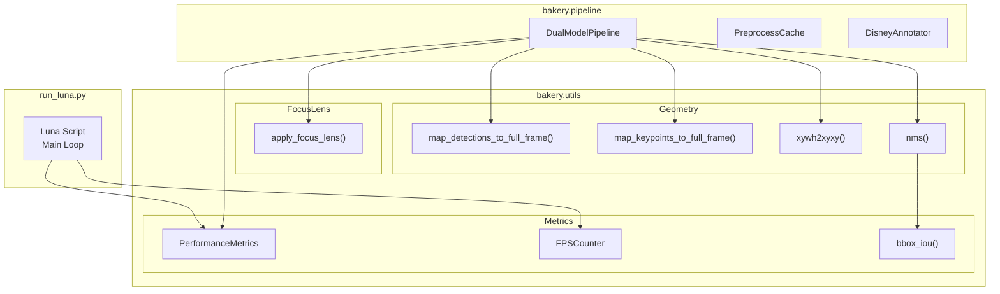
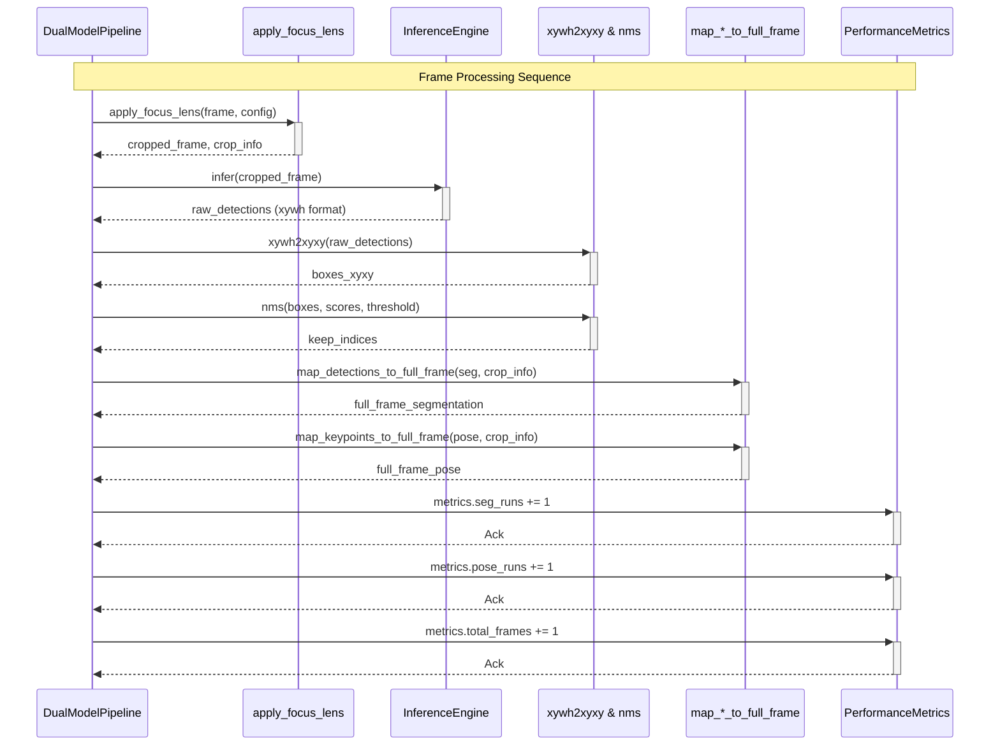

# Utilities

Relevant source files

- [](https://github.com/e7canasta/bakery-luna/blob/8081344f/bakery/utils/__init__.py)

## Purpose and Scope

The **Utilities** layer (`bakery/utils/`) provides cross-cutting helper functions and classes used throughout the Bakery framework. This module contains three primary categories of utilities:

1. **Geometry Operations** - Bounding box transformations, Non-Maximum Suppression (NMS), and Intersection over Union (IoU) calculations
2. **Performance Metrics** - FPS tracking and inference performance measurement
3. **Focus Lens Operations** - Cropping and coordinate transformation utilities for the Focus Lens system

These utilities are foundational components consumed by the Pipeline Layer ([3.3](https://deepwiki.com/e7canasta/bakery-luna/3.3-dual-model-pipeline)), Annotators, and other framework modules. For comprehensive documentation of the Focus Lens feature and its configuration, see [Focus Lens System](https://deepwiki.com/e7canasta/bakery-luna/4-focus-lens-system). For performance optimization strategies that leverage these utilities, see [Performance Optimization](https://deepwiki.com/e7canasta/bakery-luna/7.4-performance-optimization).

**Sources:** [bakery/utils/__init__.py1-26](https://github.com/e7canasta/bakery-luna/blob/8081344f/bakery/utils/__init__.py#L1-L26)

---

## Module Structure

The utilities module exports eleven distinct functions and classes, organized into three functional sub-modules. The following diagram maps the module structure to specific code entities:

**Exported Functions and Classes**

|Category|Symbol|Type|Purpose|
|---|---|---|---|
|Geometry|`xywh2xyxy`|Function|Convert bounding boxes from center format (x, y, w, h) to corner format (x1, y1, x2, y2)|
|Geometry|`bbox_iou`|Function|Calculate Intersection over Union between two bounding boxes|
|Geometry|`nms`|Function|Apply Non-Maximum Suppression to filter overlapping detections|
|Metrics|`PerformanceMetrics`|Class|Track segmentation runs, pose runs, and total frames processed|
|Metrics|`FPSCounter`|Class|Calculate frames per second with configurable smoothing window|
|Focus Lens|`apply_focus_lens`|Function|Apply cropping/zooming to a frame based on FocusLensConfig|
|Focus Lens|`map_detections_to_full_frame`|Function|Transform detection coordinates from cropped to full-frame space|
|Focus Lens|`map_keypoints_to_full_frame`|Function|Transform keypoint coordinates from cropped to full-frame space|
|Focus Lens|`crop_info_to_tuple`|Function|Convert CropInfo entity to (x, y, w, h) tuple|

**Sources:** [bakery/utils/__init__.py1-26](https://github.com/e7canasta/bakery-luna/blob/8081344f/bakery/utils/__init__.py#L1-L26)

---

## Geometry Operations

The geometry sub-module provides functions for bounding box manipulation and overlap analysis. These operations are fundamental to post-processing detection outputs and implementing algorithms like NMS.

### xywh2xyxy

Converts bounding box coordinates from **center-based format** (x_center, y_center, width, height) to **corner-based format** (x1, y1, x2, y2).

**Function Signature:**

```
def xywh2xyxy(boxes: np.ndarray) -> np.ndarray
```

**Parameters:**

- `boxes`: NumPy array of shape `(N, 4+)` where the first 4 columns are [x_center, y_center, width, height]

**Returns:**

- NumPy array of shape `(N, 4+)` where the first 4 columns are [x1, y1, x2, y2]

**Implementation Details:**

- Preserves additional columns beyond the first 4 (e.g., confidence scores, class IDs)
- Transformation formula:
    - `x1 = x_center - width/2`
    - `y1 = y_center - height/2`
    - `x2 = x_center + width/2`
    - `y2 = y_center + height/2`

**Usage Context:** This function is essential for processing YOLO model outputs, which typically return detections in `xywh` format, before converting them to framework entities like `BoundingBox` or supervision library formats.

**Sources:** [bakery/utils/__init__.py3](https://github.com/e7canasta/bakery-luna/blob/8081344f/bakery/utils/__init__.py#L3-L3) [bakery/utils/__init__.py14](https://github.com/e7canasta/bakery-luna/blob/8081344f/bakery/utils/__init__.py#L14-L14)

### bbox_iou

Calculates the **Intersection over Union (IoU)** metric between two bounding boxes. IoU measures the overlap ratio between boxes, with values ranging from 0 (no overlap) to 1 (perfect overlap).

**Function Signature:**

```
def bbox_iou(box1: np.ndarray, box2: np.ndarray) -> float
```

**Parameters:**

- `box1`: NumPy array of shape `(4,)` representing [x1, y1, x2, y2]
- `box2`: NumPy array of shape `(4,)` representing [x1, y1, x2, y2]

**Returns:**

- Float value representing IoU score (0.0 to 1.0)

**Implementation Details:**

- Calculates intersection area: `max(0, min(x2_1, x2_2) - max(x1_1, x1_2)) × max(0, min(y2_1, y2_2) - max(y1_1, y1_2))`
- Calculates union area: `area1 + area2 - intersection_area`
- Returns: `intersection_area / union_area` (or 0.0 if union is zero)

**Usage Context:** Used by the NMS algorithm to determine which detections should be suppressed based on overlap with higher-confidence detections.

**Sources:** [bakery/utils/__init__.py3](https://github.com/e7canasta/bakery-luna/blob/8081344f/bakery/utils/__init__.py#L3-L3) [bakery/utils/__init__.py16](https://github.com/e7canasta/bakery-luna/blob/8081344f/bakery/utils/__init__.py#L16-L16)

### nms

Applies **Non-Maximum Suppression** to filter out redundant overlapping detections, keeping only the highest-confidence detection for each spatial region.

**Function Signature:**

```
def nms(boxes: np.ndarray, scores: np.ndarray, iou_threshold: float = 0.5) -> List[int]
```

**Parameters:**

- `boxes`: NumPy array of shape `(N, 4)` in [x1, y1, x2, y2] format
- `scores`: NumPy array of shape `(N,)` containing confidence scores
- `iou_threshold`: Maximum allowed IoU between kept boxes (default: 0.5)

**Returns:**

- List of integer indices representing the boxes to keep

**Algorithm:**

1. Sort boxes by confidence score (descending)
2. Iteratively select the highest-confidence box not yet processed
3. Suppress all remaining boxes with IoU > `iou_threshold` relative to the selected box
4. Repeat until all boxes are processed

**Usage Context:** Applied during post-processing of segmentation model outputs to eliminate duplicate detections of the same object.

**Sources:** [bakery/utils/__init__.py3](https://github.com/e7canasta/bakery-luna/blob/8081344f/bakery/utils/__init__.py#L3-L3) [bakery/utils/__init__.py15](https://github.com/e7canasta/bakery-luna/blob/8081344f/bakery/utils/__init__.py#L15-L15)

---

## Performance Metrics

The metrics sub-module provides classes for tracking inference performance and calculating frames per second. These metrics are crucial for understanding pipeline efficiency and debugging performance bottlenecks.

### PerformanceMetrics

A data class that tracks cumulative performance statistics across the entire pipeline execution.

**Class Definition:**

```
@dataclass
class PerformanceMetrics:
    seg_runs: int = 0
    pose_runs: int = 0
    total_frames: int = 0
```

**Attributes:**

|Attribute|Type|Description|
|---|---|---|
|`seg_runs`|`int`|Number of times segmentation inference was executed|
|`pose_runs`|`int`|Number of times pose estimation inference was executed|
|`total_frames`|`int`|Total number of video frames processed|

**Methods:**

- Standard dataclass methods: `__init__`, `__repr__`, `__eq__`, etc.

**Usage Pattern:**

```
# Example usage in DualModelPipeline
metrics = PerformanceMetrics()

for frame in video_frames:
    metrics.total_frames += 1
    
    if frame.frame_id % seg_interval == 0:
        segmentation = run_segmentation(frame)
        metrics.seg_runs += 1
    
    pose_estimation = run_pose(frame)
    metrics.pose_runs += 1
```

**Efficiency Calculation:** The ratio `seg_runs / total_frames` reveals the effectiveness of smart segmentation scheduling. Lower ratios indicate more aggressive caching and higher efficiency.

**Sources:** [bakery/utils/__init__.py4](https://github.com/e7canasta/bakery-luna/blob/8081344f/bakery/utils/__init__.py#L4-L4) [bakery/utils/__init__.py18](https://github.com/e7canasta/bakery-luna/blob/8081344f/bakery/utils/__init__.py#L18-L18)

### FPSCounter

A class that calculates real-time frames per second using a configurable smoothing window. This provides stable FPS measurements that aren't overly sensitive to individual frame processing time variations.

**Class Interface:**

```
class FPSCounter:
    def __init__(self, smoothing_window: int = 30):
        """Initialize FPS counter.
        
        Args:
            smoothing_window: Number of recent frames to average over
        """
        
    def tick(self) -> float:
        """Record a frame and return current FPS.
        
        Returns:
            Current FPS averaged over the smoothing window
        """
```

**Implementation Details:**

- Maintains a circular buffer of recent frame timestamps
- Calculates FPS as: `window_size / (current_time - oldest_time_in_window)`
- Provides smoothed FPS by averaging over `smoothing_window` frames
- Default window size of 30 frames provides good balance between responsiveness and stability

**Usage Pattern:**

```
# Example usage in video processing loop
fps_counter = FPSCounter(smoothing_window=30)

for frame in video_frames:
    # Process frame
    annotated_frame = process(frame)
    
    # Update FPS and display
    current_fps = fps_counter.tick()
    print(f"FPS: {current_fps:.1f}")
```

**Sources:** [bakery/utils/__init__.py4](https://github.com/e7canasta/bakery-luna/blob/8081344f/bakery/utils/__init__.py#L4-L4) [bakery/utils/__init__.py19](https://github.com/e7canasta/bakery-luna/blob/8081344f/bakery/utils/__init__.py#L19-L19)

---

## Focus Lens Utilities

The focus lens sub-module implements cropping and coordinate transformation logic that enables the Focus Lens optimization feature. These functions allow the pipeline to perform inference on a cropped region of interest and then map results back to full-frame coordinates.

For comprehensive documentation of Focus Lens concepts, configuration, and strategies, see [Focus Lens System](https://deepwiki.com/e7canasta/bakery-luna/4-focus-lens-system).

### apply_focus_lens

Applies cropping or zooming to a frame based on `FocusLensConfig`, returning a new `Frame` with associated `CropInfo`.

**Function Signature:**

```
def apply_focus_lens(
    frame: Frame,
    config: FocusLensConfig
) -> Tuple[Frame, CropInfo]
```

**Parameters:**

- `frame`: Input `Frame` entity with original video data
- `config`: `FocusLensConfig` specifying focus region and strategy

**Returns:**

- Tuple of:
    - `Frame`: New frame containing the cropped/processed region
    - `CropInfo`: Metadata about the crop operation (x, y, width, height, scale_factor)

**Implementation Strategies:**

The function supports two strategies defined in `FocusLensConfig`:

1. **"zoom" strategy**: Crops to the specified region and resizes to model input resolution
2. **"pad" strategy**: Crops to the specified region and adds padding to match model input resolution

**Coordinate System:** The crop region is defined by `focus_x`, `focus_y` (top-left corner) and `focus_size` (width and height of square region). If `is_centered` is `True`, these coordinates are reinterpreted as the center point.

**Sources:** [bakery/utils/__init__.py5-6](https://github.com/e7canasta/bakery-luna/blob/8081344f/bakery/utils/__init__.py#L5-L6) [bakery/utils/__init__.py21](https://github.com/e7canasta/bakery-luna/blob/8081344f/bakery/utils/__init__.py#L21-L21)

### map_detections_to_full_frame

Transforms detection coordinates (bounding boxes and masks) from cropped frame space back to full-frame coordinate space.

**Function Signature:**

```
def map_detections_to_full_frame(
    segmentation: Segmentation,
    crop_info: CropInfo
) -> Segmentation
```

**Parameters:**

- `segmentation`: `Segmentation` entity with detections in cropped coordinates
- `crop_info`: `CropInfo` metadata from the `apply_focus_lens` operation

**Returns:**

- New `Segmentation` entity with coordinates mapped to full-frame space

**Transformation Logic:** For each bounding box `[x1, y1, x2, y2]` in cropped space:

1. Scale by `crop_info.scale_factor` to account for resize operations
2. Translate by crop offset: `x' = x / scale_factor + crop_info.x`, `y' = y / scale_factor + crop_info.y`
3. For masks, apply the same transformation to pixel coordinates

**Sources:** [bakery/utils/__init__.py7](https://github.com/e7canasta/bakery-luna/blob/8081344f/bakery/utils/__init__.py#L7-L7) [bakery/utils/__init__.py22](https://github.com/e7canasta/bakery-luna/blob/8081344f/bakery/utils/__init__.py#L22-L22)

### map_keypoints_to_full_frame

Transforms pose keypoint coordinates from cropped frame space back to full-frame coordinate space.

**Function Signature:**

```
def map_keypoints_to_full_frame(
    pose_estimation: PoseEstimation,
    crop_info: CropInfo
) -> PoseEstimation
```

**Parameters:**

- `pose_estimation`: `PoseEstimation` entity with keypoints in cropped coordinates
- `crop_info`: `CropInfo` metadata from the `apply_focus_lens` operation

**Returns:**

- New `PoseEstimation` entity with keypoints mapped to full-frame space

**Transformation Logic:** For each keypoint `(x, y)` in cropped space:

1. Scale by `crop_info.scale_factor`
2. Translate by crop offset: `x' = x / scale_factor + crop_info.x`, `y' = y / scale_factor + crop_info.y`

This ensures that pose skeletons rendered on the full frame align correctly with the original video content.

**Sources:** [bakery/utils/__init__.py8](https://github.com/e7canasta/bakery-luna/blob/8081344f/bakery/utils/__init__.py#L8-L8) [bakery/utils/__init__.py23](https://github.com/e7canasta/bakery-luna/blob/8081344f/bakery/utils/__init__.py#L23-L23)

### crop_info_to_tuple

Helper function that converts a `CropInfo` entity to a simple tuple representation.

**Function Signature:**

```
def crop_info_to_tuple(crop_info: CropInfo) -> Tuple[int, int, int, int]
```

**Parameters:**

- `crop_info`: `CropInfo` entity

**Returns:**

- Tuple of `(x, y, width, height)` representing the crop region

**Usage Context:** Useful for interfacing with libraries that expect crop information as tuples (e.g., OpenCV `cv2.getRectSubPix` or numpy array slicing).

**Sources:** [bakery/utils/__init__.py9](https://github.com/e7canasta/bakery-luna/blob/8081344f/bakery/utils/__init__.py#L9-L9) [bakery/utils/__init__.py24](https://github.com/e7canasta/bakery-luna/blob/8081344f/bakery/utils/__init__.py#L24-L24)

---

## Utility Dependencies and Usage Patterns

The following diagram illustrates how different framework components depend on specific utility functions:




**Component Responsibilities:**

|Component|Uses Utilities For|Specific Functions|
|---|---|---|
|`DualModelPipeline`|Bounding box conversion, NMS, focus lens operations, metrics tracking|`xywh2xyxy`, `nms`, `apply_focus_lens`, `map_detections_to_full_frame`, `map_keypoints_to_full_frame`, `PerformanceMetrics`|
|`run_luna.py`|FPS calculation, final metrics reporting|`FPSCounter`, `PerformanceMetrics`|
|`nms()`|IoU calculation for suppression logic|`bbox_iou`|

**Design Principle:** The utilities module follows the **Single Responsibility Principle** by providing focused, stateless functions for common operations. The only stateful components (`PerformanceMetrics`, `FPSCounter`) are simple data containers with minimal behavior, making them easy to test and reason about.

**Sources:** [bakery/utils/__init__.py1-26](https://github.com/e7canasta/bakery-luna/blob/8081344f/bakery/utils/__init__.py#L1-L26)

---

## Integration Example

The following code flow demonstrates how utilities integrate into the typical frame processing pipeline:



**Processing Sequence:**

1. **Focus Lens Application**: If configured, crop the input frame to a region of interest
2. **Inference Execution**: Run models on the cropped frame
3. **Coordinate Conversion**: Transform YOLO's xywh format to xyxy format
4. **Deduplication**: Apply NMS to eliminate redundant detections
5. **Coordinate Mapping**: Transform cropped coordinates back to full-frame space
6. **Metrics Update**: Increment performance counters

This sequence ensures that all geometric transformations are correctly applied, regardless of whether focus lens is active or not.

**Sources:** [bakery/utils/__init__.py1-26](https://github.com/e7canasta/bakery-luna/blob/8081344f/bakery/utils/__init__.py#L1-L26)

---

## Testing

The utilities module is tested through unit tests in `bakery/tests/`. Key test coverage includes:

**Focus Lens Tests** (`test_focus_lens.py`):

- Crop application with different strategies (zoom vs pad)
- Coordinate mapping accuracy for detections and keypoints
- Edge cases: boundary crops, scale factors, centered vs corner coordinates

**Best Practices:**

- Utilities should be pure functions where possible (no side effects)
- Complex transformations (like coordinate mapping) should have comprehensive test coverage
- Performance-critical functions (like NMS) may benefit from profiling and optimization

For more information on running tests, see [Testing](https://deepwiki.com/e7canasta/bakery-luna/7.3-testing).

**Sources:** [bakery/utils/__init__.py1-26](https://github.com/e7canasta/bakery-luna/blob/8081344f/bakery/utils/__init__.py#L1-L26)

Ask Devin about e7canasta/bakery-luna

Fast

Utilities | e7canasta/bakery-luna | DeepWiki

Syntax error in textmermaid version 11.12.2

Add to ContextPress Q