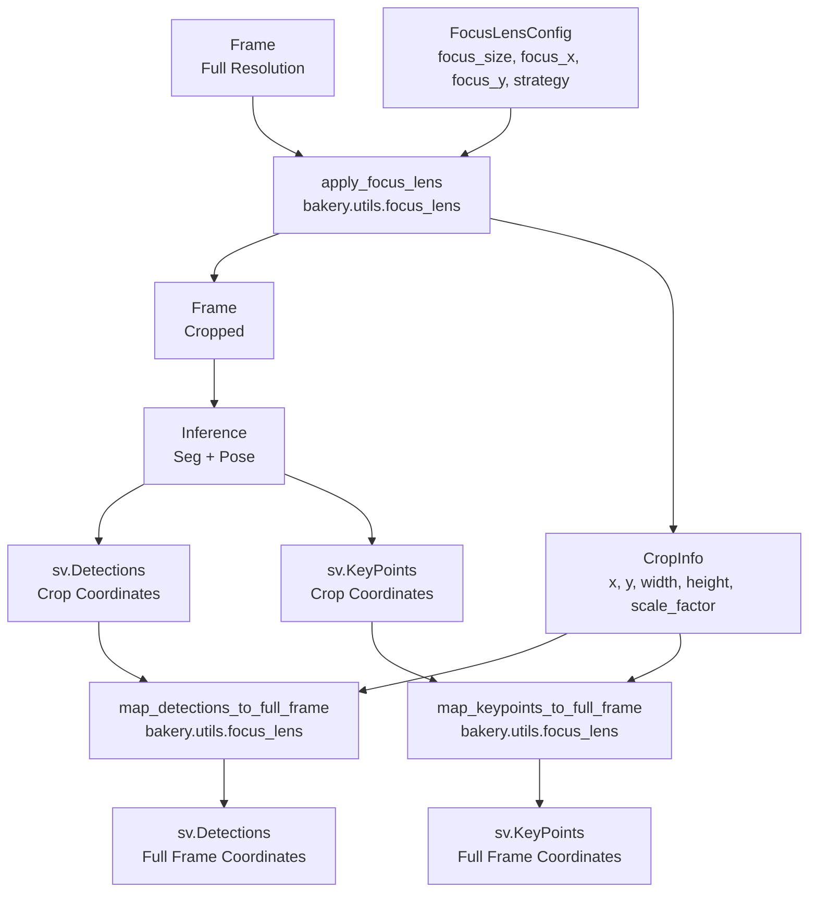
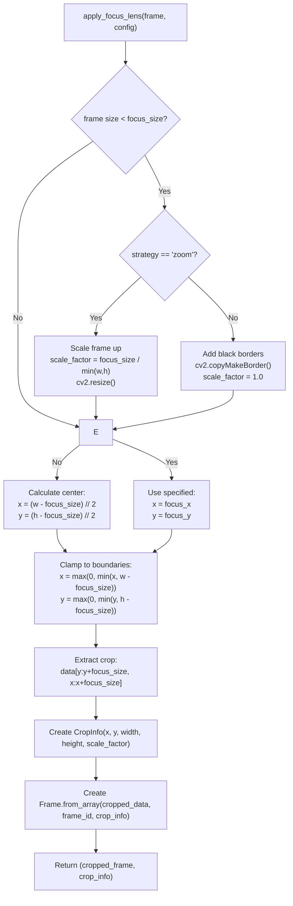
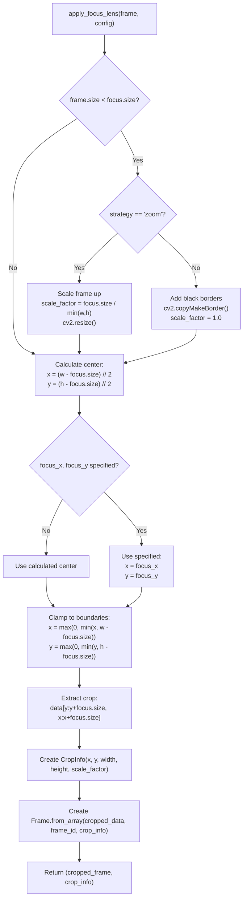
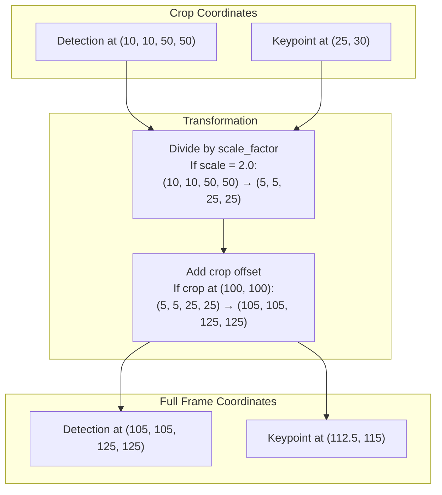
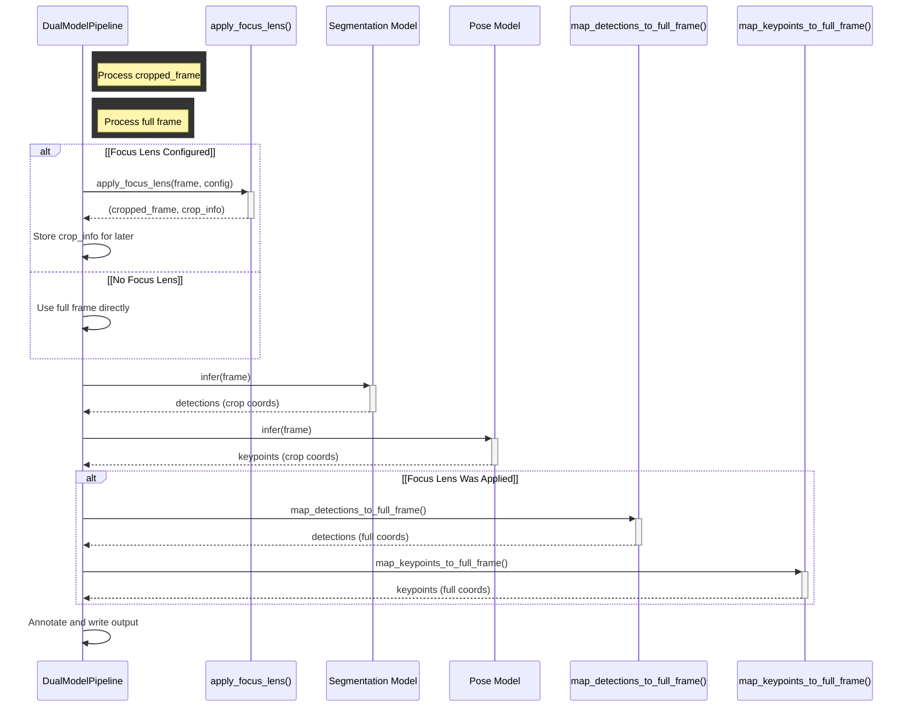

# Focus Lens System

Relevant source files

- [](https://github.com/e7canasta/bakery-luna/blob/8081344f/bakery/core/entities/focus_lens_config.py)
- [](https://github.com/e7canasta/bakery-luna/blob/8081344f/bakery/tests/test_focus_lens.py)
- [](https://github.com/e7canasta/bakery-luna/blob/8081344f/bakery/utils/focus_lens.py)

## Purpose and Scope

This document describes the Focus Lens system, a crop-based inference optimization feature that concentrates pixel density on a region of interest within the frame. The Focus Lens extracts a square crop from the input frame before inference, improving model accuracy by reducing background noise and increasing the effective resolution of the target region.

For information about how Focus Lens integrates into the overall execution flow, see [Luna Pipeline Execution Flow](https://deepwiki.com/e7canasta/bakery-luna/5.2-pipeline-execution-flow). For details on the configuration system, see [Configuration System](https://deepwiki.com/e7canasta/bakery-luna/3.2-configuration-system).

---

## Concept and Motivation

The Focus Lens system addresses a common computer vision challenge: when the subject of interest occupies only a small portion of the frame, much of the model's inference capacity is wasted processing irrelevant background. By cropping to a region of interest before inference, the Focus Lens achieves:

1. **Higher effective resolution** - The cropped pixels are scaled to fill the model's input resolution
2. **Reduced noise** - Background distractions are eliminated from the inference
3. **Computational efficiency** - Smaller crops can enable faster model selection or reduced preprocessing overhead

The system supports two strategies for handling frames smaller than the target crop size:

- **zoom** - Scales the frame up to the required size (default)
- **pad** - Adds black borders to reach the required size without distortion

**Sources:** [bakery/core/entities/focus_lens_config.py1-67](https://github.com/e7canasta/bakery-luna/blob/8081344f/bakery/core/entities/focus_lens_config.py#L1-L67)

---

## Architecture and Data Flow

The Focus Lens system operates as a preprocessing and postprocessing layer around the inference pipeline:



**Sources:** [bakery/utils/focus_lens.py1-276](https://github.com/e7canasta/bakery-luna/blob/8081344f/bakery/utils/focus_lens.py#L1-L276) [bakery/core/entities/focus_lens_config.py11-67](https://github.com/e7canasta/bakery-luna/blob/8081344f/bakery/core/entities/focus_lens_config.py#L11-L67)

---

## Core Entities

The Focus Lens system operates on two primary entities:

### FocusLensConfig

Immutable configuration dataclass that parameterizes the focus lens behavior.

|Attribute|Type|Description|Validation|
|---|---|---|---|
|`focus_size`|`int`|Size of square crop in pixels|Must be positive, multiple of 80|
|`focus_x`|`Optional[int]`|X coordinate of crop origin|Non-negative if provided, `None` = centered|
|`focus_y`|`Optional[int]`|Y coordinate of crop origin|Non-negative if provided, `None` = centered|
|`strategy`|`str`|Handling for small frames|Must be `"zoom"` or `"pad"` (default: `"zoom"`)|

The `focus_size` constraint (multiple of 80) aligns with common YOLO model architectures that require input dimensions divisible by the maximum stride (typically 32-80).

**Sources:** [bakery/core/entities/focus_lens_config.py11-67](https://github.com/e7canasta/bakery-luna/blob/8081344f/bakery/core/entities/focus_lens_config.py#L11-L67)

### CropInfo

Value object that captures the transformation metadata from applying the focus lens.

|Attribute|Type|Description|
|---|---|---|
|`x`|`int`|X coordinate of crop in (possibly scaled) frame|
|`y`|`int`|Y coordinate of crop in (possibly scaled) frame|
|`width`|`int`|Width of crop (equals `focus_size`)|
|`height`|`int`|Height of crop (equals `focus_size`)|
|`scale_factor`|`float`|Scale applied to frame (1.0 = no scaling)|

The `scale_factor` is critical for reverse mapping: when `strategy="zoom"` is used on a small frame, this factor records how much the frame was scaled up.

**Sources:** [bakery/core/entities/frame.py](https://github.com/e7canasta/bakery-luna/blob/8081344f/bakery/core/entities/frame.py) (CropInfo definition), [bakery/utils/focus_lens.py98-104](https://github.com/e7canasta/bakery-luna/blob/8081344f/bakery/utils/focus_lens.py#L98-L104)

---

## Focus Lens Configuration

### Creating a Configuration

```
from bakery.core.entities import FocusLensConfig

# Centered 640x640 crop with default zoom strategy
config = FocusLensConfig(focus_size=640)

# Crop at specific position
config = FocusLensConfig(focus_size=480, focus_x=100, focus_y=200)

# Use pad strategy instead of zoom
config = FocusLensConfig(focus_size=320, strategy="pad")
```

### Validation Rules

The `FocusLensConfig.__post_init__()` method enforces strict validation:

1. **focus_size** must be positive [bakery/core/entities/focus_lens_config.py41-42](https://github.com/e7canasta/bakery-luna/blob/8081344f/bakery/core/entities/focus_lens_config.py#L41-L42)
2. **focus_size** must be multiple of 80 (e.g., 80, 160, 240, 320, 400, 480, 560, 640, 720, 800) [bakery/core/entities/focus_lens_config.py45-49](https://github.com/e7canasta/bakery-luna/blob/8081344f/bakery/core/entities/focus_lens_config.py#L45-L49)
3. **strategy** must be `"zoom"` or `"pad"` [bakery/core/entities/focus_lens_config.py52-55](https://github.com/e7canasta/bakery-luna/blob/8081344f/bakery/core/entities/focus_lens_config.py#L52-L55)
4. **focus_x** and **focus_y** must be non-negative if provided [bakery/core/entities/focus_lens_config.py58-61](https://github.com/e7canasta/bakery-luna/blob/8081344f/bakery/core/entities/focus_lens_config.py#L58-L61)

### Properties

- `is_centered` - Returns `True` when both `focus_x` and `focus_y` are `None` [bakery/core/entities/focus_lens_config.py64-66](https://github.com/e7canasta/bakery-luna/blob/8081344f/bakery/core/entities/focus_lens_config.py#L64-L66)

**Sources:** [bakery/core/entities/focus_lens_config.py38-66](https://github.com/e7canasta/bakery-luna/blob/8081344f/bakery/core/entities/focus_lens_config.py#L38-L66) [bakery/tests/test_focus_lens.py20-137](https://github.com/e7canasta/bakery-luna/blob/8081344f/bakery/tests/test_focus_lens.py#L20-L137)

---

## Applying the Focus Lens

The `apply_focus_lens()` function performs the crop operation:





### Frame Size Handling

When the frame dimensions are smaller than `focus_size`:

**Zoom Strategy** (default):

- Calculates scale factor: `scale = focus_size / min(frame_width, frame_height)` [bakery/utils/focus_lens.py50](https://github.com/e7canasta/bakery-luna/blob/8081344f/bakery/utils/focus_lens.py#L50-L50)
- Resizes frame with `cv2.resize()` using `INTER_LINEAR` interpolation [bakery/utils/focus_lens.py53-55](https://github.com/e7canasta/bakery-luna/blob/8081344f/bakery/utils/focus_lens.py#L53-L55)
- Records `scale_factor` for reverse mapping [bakery/utils/focus_lens.py57](https://github.com/e7canasta/bakery-luna/blob/8081344f/bakery/utils/focus_lens.py#L57-L57)

**Pad Strategy**:

- Calculates padding needed for each edge [bakery/utils/focus_lens.py61-66](https://github.com/e7canasta/bakery-luna/blob/8081344f/bakery/utils/focus_lens.py#L61-L66)
- Adds black borders with `cv2.copyMakeBorder()` [bakery/utils/focus_lens.py68-73](https://github.com/e7canasta/bakery-luna/blob/8081344f/bakery/utils/focus_lens.py#L68-L73)
- Maintains `scale_factor = 1.0` since no scaling occurs [bakery/utils/focus_lens.py44](https://github.com/e7canasta/bakery-luna/blob/8081344f/bakery/utils/focus_lens.py#L44-L44)

### Position Calculation

If `focus_x` or `focus_y` are `None`, the crop is centered [bakery/utils/focus_lens.py77-85](https://github.com/e7canasta/bakery-luna/blob/8081344f/bakery/utils/focus_lens.py#L77-L85):

```
focus_x = max(0, (frame_w - focus_size) // 2)
focus_y = max(0, (frame_h - focus_size) // 2)
```

Positions are clamped to ensure the crop stays within frame boundaries [bakery/utils/focus_lens.py88-89](https://github.com/e7canasta/bakery-luna/blob/8081344f/bakery/utils/focus_lens.py#L88-L89):

```
focus_x = max(0, min(focus_x, frame_w - focus_size))
focus_y = max(0, min(focus_y, frame_h - focus_size))
```

**Sources:** [bakery/utils/focus_lens.py17-113](https://github.com/e7canasta/bakery-luna/blob/8081344f/bakery/utils/focus_lens.py#L17-L113) [bakery/tests/test_focus_lens.py139-248](https://github.com/e7canasta/bakery-luna/blob/8081344f/bakery/tests/test_focus_lens.py#L139-L248)

---

## Coordinate Transformation

After inference on the cropped frame, results must be mapped back to full frame coordinates. This involves two transformations:

1. **Inverse scaling** - If zoom was applied (`scale_factor != 1.0`), divide coordinates by the scale factor
2. **Offset application** - Add the crop position (`x`, `y`) to translate from crop-local to full-frame coordinates



**Sources:** [bakery/utils/focus_lens.py116-261](https://github.com/e7canasta/bakery-luna/blob/8081344f/bakery/utils/focus_lens.py#L116-L261)

---

## Mapping Detections

The `map_detections_to_full_frame()` function transforms `sv.Detections` from crop coordinates to full frame coordinates.

### Bounding Box Transformation

The transformation logic [bakery/utils/focus_lens.py143-152](https://github.com/e7canasta/bakery-luna/blob/8081344f/bakery/utils/focus_lens.py#L143-L152):

```
# Step 1: Apply inverse scale if zoom was used
if scale != 1.0:
    boxes_full = boxes_full / scale

# Step 2: Add offset (adjusted for scale)
boxes_full[:, [0, 2]] += crop_info.x / scale if scale != 1.0 else crop_info.x
boxes_full[:, [1, 3]] += crop_info.y / scale if scale != 1.0 else crop_info.y
```

This ensures coordinates are first descaled, then offset in the correct (unscaled) coordinate space.

### Mask Transformation

Masks require more complex handling because they are 2D arrays, not just coordinates [bakery/utils/focus_lens.py155-197](https://github.com/e7canasta/bakery-luna/blob/8081344f/bakery/utils/focus_lens.py#L155-L197):

1. Create full-size mask initialized to `False` [bakery/utils/focus_lens.py162](https://github.com/e7canasta/bakery-luna/blob/8081344f/bakery/utils/focus_lens.py#L162-L162)
2. If zoom was applied:
    - Calculate original crop dimensions in unscaled space [bakery/utils/focus_lens.py167-170](https://github.com/e7canasta/bakery-luna/blob/8081344f/bakery/utils/focus_lens.py#L167-L170)
    - Resize mask to original crop size with `INTER_NEAREST` [bakery/utils/focus_lens.py173-177](https://github.com/e7canasta/bakery-luna/blob/8081344f/bakery/utils/focus_lens.py#L173-L177)
    - Place resized mask at unscaled crop position [bakery/utils/focus_lens.py180-185](https://github.com/e7canasta/bakery-luna/blob/8081344f/bakery/utils/focus_lens.py#L180-L185)
3. If no zoom:
    - Directly place mask at crop offset [bakery/utils/focus_lens.py187-193](https://github.com/e7canasta/bakery-luna/blob/8081344f/bakery/utils/focus_lens.py#L187-L193)

**Sources:** [bakery/utils/focus_lens.py116-205](https://github.com/e7canasta/bakery-luna/blob/8081344f/bakery/utils/focus_lens.py#L116-L205) [bakery/tests/test_focus_lens.py250-340](https://github.com/e7canasta/bakery-luna/blob/8081344f/bakery/tests/test_focus_lens.py#L250-L340)

---

## Mapping Keypoints

The `map_keypoints_to_full_frame()` function transforms `sv.KeyPoints` from crop coordinates to full frame coordinates, with special handling for invisible keypoints.

### Visible vs Invisible Keypoints

Pose estimation models output keypoints at `(0, 0)` when a keypoint is not visible. These must remain at the origin and not be offset [bakery/utils/focus_lens.py233-234](https://github.com/e7canasta/bakery-luna/blob/8081344f/bakery/utils/focus_lens.py#L233-L234):

```
# Create mask for valid (non-zero) keypoints
valid_mask = ~np.all(np.isclose(xy_full, 0), axis=2)
```

### Transformation Algorithm

The transformation applies only to visible keypoints [bakery/utils/focus_lens.py236-253](https://github.com/e7canasta/bakery-luna/blob/8081344f/bakery/utils/focus_lens.py#L236-L253):

1. If zoom was applied (`scale != 1.0`):
    - Divide visible keypoints by `scale_factor`
    - Calculate offset in unscaled coordinates: `offset_x = crop_info.x / scale`
2. If no zoom:
    - Use offset directly: `offset_x = crop_info.x`
3. Apply offset only where keypoints are visible:
    
    ```
    xy_full[:, :, 0] = np.where(valid_mask, xy_full[:, :, 0] + offset_x, 0)
    xy_full[:, :, 1] = np.where(valid_mask, xy_full[:, :, 1] + offset_y, 0)
    ```
    

This preserves the semantic meaning of `(0, 0)` as "invisible" throughout the pipeline.

**Sources:** [bakery/utils/focus_lens.py208-260](https://github.com/e7canasta/bakery-luna/blob/8081344f/bakery/utils/focus_lens.py#L208-L260) [bakery/tests/test_focus_lens.py342-435](https://github.com/e7canasta/bakery-luna/blob/8081344f/bakery/tests/test_focus_lens.py#L342-L435)

---

## Integration with Dual Model Pipeline

The Focus Lens integrates into the `DualModelPipeline` workflow as follows:



### Usage Pattern in run_luna.py

The Luna demo application uses Focus Lens when CLI arguments are provided [run_luna.py](https://github.com/e7canasta/bakery-luna/blob/8081344f/run_luna.py):

1. Parse `--focus-size`, `--focus-x`, `--focus-y`, `--focus-strategy` arguments
2. Create `FocusLensConfig` if `--focus-size` is specified
3. Pass config to `DualModelPipeline` initialization
4. Pipeline applies focus lens before each inference
5. Pipeline maps results back to full frame coordinates
6. Annotator receives full-frame coordinates and renders

**Sources:** [bakery/utils/focus_lens.py1-276](https://github.com/e7canasta/bakery-luna/blob/8081344f/bakery/utils/focus_lens.py#L1-L276)

---

## Performance Considerations

### Memory Usage

The Focus Lens creates temporary frame copies during transformation:

- **Zoom strategy**: Allocates scaled frame before crop
- **Pad strategy**: Allocates padded frame before crop
- **Mask mapping**: Allocates full-size masks for each detection

For high-resolution video processing, the zoom strategy may consume significant memory when upscaling small frames.

### Computational Overhead

The coordinate transformation operations are vectorized using NumPy:

- Bounding box transformation is O(N) where N = number of detections
- Mask transformation is O(N × H × W) where H, W are frame dimensions
- Keypoint transformation is O(N × K) where K = number of keypoints per skeleton (typically 17)

For most use cases, the mapping overhead is negligible compared to inference time.

### Accuracy Trade-offs

**Benefits:**

- Higher effective resolution on region of interest
- Reduced background interference
- Better detection of small objects within the crop

**Limitations:**

- Objects outside the crop region are not detected
- Crop boundaries may cut through objects, degrading detection quality
- Static crops may miss moving subjects

**Sources:** [bakery/utils/focus_lens.py46-74](https://github.com/e7canasta/bakery-luna/blob/8081344f/bakery/utils/focus_lens.py#L46-L74) (frame handling), [bakery/utils/focus_lens.py155-197](https://github.com/e7canasta/bakery-luna/blob/8081344f/bakery/utils/focus_lens.py#L155-L197) (mask transformation)

---

## Testing and Validation

The Focus Lens system has comprehensive test coverage in [bakery/tests/test_focus_lens.py1-463](https://github.com/e7canasta/bakery-luna/blob/8081344f/bakery/tests/test_focus_lens.py#L1-L463)

### Test Categories

|Test Class|Purpose|Key Scenarios|
|---|---|---|
|`TestFocusLensConfig`|Configuration validation|Valid sizes, invalid sizes, strategy validation, immutability|
|`TestApplyFocusLens`|Crop application|Centered crops, positioned crops, zoom strategy, pad strategy, boundary clamping|
|`TestMapDetectionsToFullFrame`|Detection transformation|Bounding box offset, mask expansion, scale factor handling, empty detections|
|`TestMapKeypointsToFullFrame`|Keypoint transformation|Visible keypoint offset, invisible keypoint preservation, scale factor handling|
|`TestCropInfoToTuple`|Utility function|CropInfo conversion for annotator compatibility|

### Running Tests

```
# Run all Focus Lens tests
pytest bakery/tests/test_focus_lens.py -v

# Run specific test class
pytest bakery/tests/test_focus_lens.py::TestApplyFocusLens -v

# Run with coverage
pytest bakery/tests/test_focus_lens.py --cov=bakery.utils.focus_lens --cov-report=term-missing
```

**Sources:** [bakery/tests/test_focus_lens.py1-463](https://github.com/e7canasta/bakery-luna/blob/8081344f/bakery/tests/test_focus_lens.py#L1-L463)

---

## Common Usage Patterns

### Pattern 1: Centered Crop for Person Tracking

```
# Center a 640x640 crop for close-up person detection
config = FocusLensConfig(focus_size=640)
cropped_frame, crop_info = apply_focus_lens(frame, config)
```

### Pattern 2: Fixed Region Monitoring

```
# Monitor specific region (e.g., doorway at x=500, y=300)
config = FocusLensConfig(focus_size=480, focus_x=500, focus_y=300)
cropped_frame, crop_info = apply_focus_lens(frame, config)
```

### Pattern 3: Small Frame Handling with Padding

```
# Preserve aspect ratio for smaller frames
config = FocusLensConfig(focus_size=640, strategy="pad")
cropped_frame, crop_info = apply_focus_lens(frame, config)
```

### Pattern 4: Complete Inference Pipeline

```
from bakery.core.entities import Frame, FocusLensConfig
from bakery.utils.focus_lens import (
    apply_focus_lens,
    map_detections_to_full_frame,
    map_keypoints_to_full_frame
)

# Configuration
config = FocusLensConfig(focus_size=640)

# Apply focus lens
cropped_frame, crop_info = apply_focus_lens(frame, config)

# Run inference on cropped frame (pseudo-code)
detections_crop = segmentation_model.infer(cropped_frame)
keypoints_crop = pose_model.infer(cropped_frame)

# Map results back to full frame
detections_full = map_detections_to_full_frame(
    detections_crop, crop_info, frame.width, frame.height
)
keypoints_full = map_keypoints_to_full_frame(
    keypoints_crop, crop_info
)

# Continue with full-frame coordinates
```

**Sources:** [bakery/utils/focus_lens.py17-113](https://github.com/e7canasta/bakery-luna/blob/8081344f/bakery/utils/focus_lens.py#L17-L113) [bakery/utils/focus_lens.py116-260](https://github.com/e7canasta/bakery-luna/blob/8081344f/bakery/utils/focus_lens.py#L116-L260)

---

## Related Systems

- For configuration details, see [Focus Lens Configuration](https://deepwiki.com/e7canasta/bakery-luna/4.1-focus-lens-configuration)
- For operational details, see [Focus Lens Operations](https://deepwiki.com/e7canasta/bakery-luna/4.2-focus-lens-operations)
- For pipeline integration, see [Dual Model Pipeline](https://deepwiki.com/e7canasta/bakery-luna/3.3-dual-model-pipeline)
- For command-line usage, see [Command-Line Reference](https://deepwiki.com/e7canasta/bakery-luna/5.1-command-line-reference)
