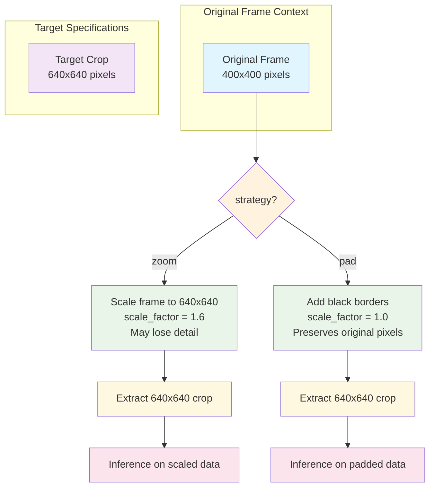
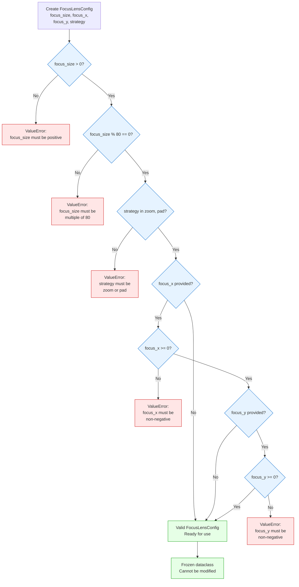
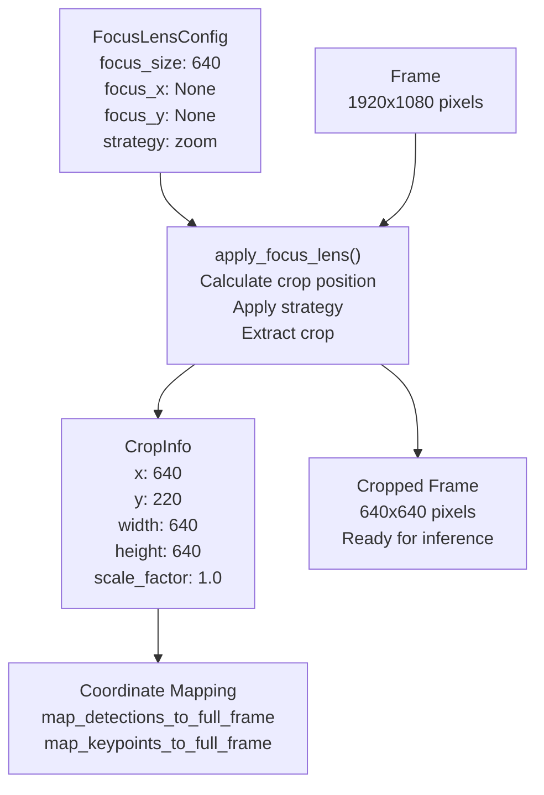

# Focus Lens Configuration

Relevant source files

- [](https://github.com/e7canasta/bakery-luna/blob/8081344f/bakery/core/entities/focus_lens_config.py)
- [](https://github.com/e7canasta/bakery-luna/blob/8081344f/bakery/tests/test_focus_lens.py)

## Purpose and Scope

This document details the `FocusLensConfig` entity, which parameterizes the Focus Lens crop-based inference optimization feature. It covers the configuration parameters, validation rules, and usage patterns for defining how frames should be cropped before inference.

For details on the actual Focus Lens operations (cropping frames, mapping coordinates), see [Focus Lens Operations](https://deepwiki.com/e7canasta/bakery-luna/4.2-focus-lens-operations). For understanding how Focus Lens integrates into the overall pipeline, see [Dual Model Pipeline](https://deepwiki.com/e7canasta/bakery-luna/3.3-dual-model-pipeline).

**Sources:** [bakery/core/entities/focus_lens_config.py1-67](https://github.com/e7canasta/bakery-luna/blob/8081344f/bakery/core/entities/focus_lens_config.py#L1-L67)

---

## FocusLensConfig Entity

The `FocusLensConfig` class is an immutable configuration entity that defines how the Focus Lens feature applies square crops to video frames before inference. By concentrating pixels on a region of interest, Focus Lens improves inference accuracy and can reduce computational overhead.

The entity is implemented as a frozen dataclass at [bakery/core/entities/focus_lens_config.py11-66](https://github.com/e7canasta/bakery-luna/blob/8081344f/bakery/core/entities/focus_lens_config.py#L11-L66) ensuring configuration immutability throughout the pipeline execution.

### Core Characteristics

|Characteristic|Implementation|Purpose|
|---|---|---|
|**Immutability**|`@dataclass(frozen=True)`|Prevents accidental configuration mutation during pipeline execution|
|**Validation**|`__post_init__` method|Ensures all parameters meet system requirements before processing begins|
|**Centered Detection**|`is_centered` property|Simplifies logic when crop position is auto-calculated|

**Sources:** [bakery/core/entities/focus_lens_config.py11-66](https://github.com/e7canasta/bakery-luna/blob/8081344f/bakery/core/entities/focus_lens_config.py#L11-L66)

---

## Configuration Parameters

### Parameter Overview

**Sources:** [bakery/core/entities/focus_lens_config.py19-36](https://github.com/e7canasta/bakery-luna/blob/8081344f/bakery/core/entities/focus_lens_config.py#L19-L36)

---

### focus_size

The `focus_size` parameter defines the dimensions of the square crop region in pixels. This is the most critical parameter as it determines the resolution at which inference will be performed.

**Requirements:**

- Must be a positive integer
- Must be a multiple of 80 (80, 160, 240, 320, 400, 480, 560, 640, 720, 800, ...)

**Rationale:** The multiple-of-80 constraint aligns with YOLO model architecture requirements. YOLO models use progressive downsampling layers, and input dimensions must be divisible by the network's stride to prevent dimension mismatch errors during inference.

**Validation Logic:**

```
# From focus_lens_config.py:41-49
if self.focus_size <= 0:
    raise ValueError(f"focus_size must be positive, got {self.focus_size}")

if self.focus_size % 80 != 0:
    raise ValueError(
        f"focus_size must be multiple of 80 (80, 160, 240, 320, 400, 480, 560, 640...), "
        f"got {self.focus_size}"
    )
```

**Common Values:**

|Value|Use Case|
|---|---|
|320|Low-resolution inference, maximum speed|
|480|Balanced accuracy and speed|
|640|Standard YOLO resolution, good accuracy|
|800+|High-resolution inference, maximum accuracy|

**Sources:** [bakery/core/entities/focus_lens_config.py20-49](https://github.com/e7canasta/bakery-luna/blob/8081344f/bakery/core/entities/focus_lens_config.py#L20-L49) [bakery/tests/test_focus_lens.py125-136](https://github.com/e7canasta/bakery-luna/blob/8081344f/bakery/tests/test_focus_lens.py#L125-L136)

---

### focus_x and focus_y

The `focus_x` and `focus_y` parameters specify the top-left corner coordinates of the crop region in the original frame coordinate space. When both are `None`, the crop is automatically centered.

**Type:** `Optional[int]`  
**Default:** `None` (auto-centered)

**Behavior:**

- **When None:** Crop is centered at `((frame_width - focus_size) // 2, (frame_height - focus_size) // 2)`
- **When specified:** Crop starts at the exact `(focus_x, focus_y)` position
- **Clamping:** If the specified position would place the crop outside frame boundaries, the position is automatically clamped to valid range

**Validation Logic:**

```
# From focus_lens_config.py:58-61
if self.focus_x is not None and self.focus_x < 0:
    raise ValueError(f"focus_x must be non-negative, got {self.focus_x}")
if self.focus_y is not None and self.focus_y < 0:
    raise ValueError(f"focus_y must be non-negative, got {self.focus_y}")
```

**Use Cases:**

- **Centered (None, None):** General-purpose, subject typically centered in frame
- **Fixed Position:** Tracking a specific region (e.g., stage area, doorway)
- **Off-center:** Compensating for camera positioning or known subject location

**Sources:** [bakery/core/entities/focus_lens_config.py21-61](https://github.com/e7canasta/bakery-luna/blob/8081344f/bakery/core/entities/focus_lens_config.py#L21-L61) [bakery/tests/test_focus_lens.py161-195](https://github.com/e7canasta/bakery-luna/blob/8081344f/bakery/tests/test_focus_lens.py#L161-L195)

---

### strategy

The `strategy` parameter determines how to handle frames that are smaller than `focus_size` in either dimension.

**Type:** `str`  
**Valid Values:** `"zoom"`, `"pad"`  
**Default:** `"zoom"`

**Strategy Comparison:**



|Strategy|Behavior|scale_factor|Use Case|
|---|---|---|---|
|**zoom**|Upscale frame to `focus_size`|`> 1.0`|Maximize inference region coverage, acceptable interpolation artifacts|
|**pad**|Add black borders to reach `focus_size`|`1.0`|Preserve original pixel data, avoid interpolation|

**Validation Logic:**

```
# From focus_lens_config.py:52-55
if self.strategy not in ("zoom", "pad"):
    raise ValueError(
        f"strategy must be 'zoom' or 'pad', got '{self.strategy}'"
    )
```

**Sources:** [bakery/core/entities/focus_lens_config.py23-55](https://github.com/e7canasta/bakery-luna/blob/8081344f/bakery/core/entities/focus_lens_config.py#L23-L55) [bakery/tests/test_focus_lens.py196-228](https://github.com/e7canasta/bakery-luna/blob/8081344f/bakery/tests/test_focus_lens.py#L196-L228)

---

## Validation Rules

The `FocusLensConfig` entity enforces validation rules in its `__post_init__` method to ensure configuration correctness before any processing occurs.

### Validation Flow



**Sources:** [bakery/core/entities/focus_lens_config.py38-66](https://github.com/e7canasta/bakery-luna/blob/8081344f/bakery/core/entities/focus_lens_config.py#L38-L66) [bakery/tests/test_focus_lens.py63-123](https://github.com/e7canasta/bakery-luna/blob/8081344f/bakery/tests/test_focus_lens.py#L63-L123)

---

### Validation Error Examples

The test suite at [bakery/tests/test_focus_lens.py63-123](https://github.com/e7canasta/bakery-luna/blob/8081344f/bakery/tests/test_focus_lens.py#L63-L123) demonstrates all validation failure cases:

|Invalid Input|Error Message Pattern|Test Line|
|---|---|---|
|`focus_size=650`|`"multiple of 80"`|[70-71](https://github.com/e7canasta/bakery-luna/blob/8081344f/70-71)|
|`focus_size=0`|`"positive"`|[80-81](https://github.com/e7canasta/bakery-luna/blob/8081344f/80-81)|
|`focus_size=-80`|`"positive"`|[90-91](https://github.com/e7canasta/bakery-luna/blob/8081344f/90-91)|
|`strategy="stretch"`|`"zoom.*pad"`|[100-101](https://github.com/e7canasta/bakery-luna/blob/8081344f/100-101)|
|`focus_x=-10`|`"focus_x"`|[110-111](https://github.com/e7canasta/bakery-luna/blob/8081344f/110-111)|
|`focus_y=-5`|Similar to focus_x|(Not shown but validated)|

**Sources:** [bakery/tests/test_focus_lens.py63-123](https://github.com/e7canasta/bakery-luna/blob/8081344f/bakery/tests/test_focus_lens.py#L63-L123)

---

## Configuration Examples

### Example 1: Centered Crop with Default Strategy

```
# From test_focus_lens.py:30-36
config = FocusLensConfig(focus_size=640)

assert config.focus_size == 640
assert config.focus_x is None
assert config.focus_y is None
assert config.strategy == "zoom"
assert config.is_centered is True
```

**Use Case:** General-purpose inference where subject is typically centered. The crop will be automatically positioned at frame center.

**Sources:** [bakery/tests/test_focus_lens.py23-36](https://github.com/e7canasta/bakery-luna/blob/8081344f/bakery/tests/test_focus_lens.py#L23-L36)

---

### Example 2: Fixed Position Crop

```
# From test_focus_lens.py:45-50
config = FocusLensConfig(focus_size=480, focus_x=100, focus_y=200)

assert config.focus_size == 480
assert config.focus_x == 100
assert config.focus_y == 200
assert config.is_centered is False
```

**Use Case:** Tracking a fixed region of interest, such as a specific area of a stage or a doorway. The crop position remains constant across all frames.

**Sources:** [bakery/tests/test_focus_lens.py38-50](https://github.com/e7canasta/bakery-luna/blob/8081344f/bakery/tests/test_focus_lens.py#L38-L50)

---

### Example 3: Pad Strategy for Small Frames

```
# From test_focus_lens.py:59-61
config = FocusLensConfig(focus_size=320, strategy="pad")

assert config.strategy == "pad"
```

**Use Case:** Processing low-resolution video where preserving original pixel data is critical. Black borders are added rather than upscaling, preventing interpolation artifacts.

**Sources:** [bakery/tests/test_focus_lens.py52-61](https://github.com/e7canasta/bakery-luna/blob/8081344f/bakery/tests/test_focus_lens.py#L52-L61)

---

### Example 4: High-Resolution Tracking

```
# High-resolution crop at specific location
config = FocusLensConfig(
    focus_size=800,
    focus_x=560,
    focus_y=140,
    strategy="zoom"
)
```

**Use Case:** High-accuracy inference on a specific region with upscaling if needed. Suitable for detailed pose estimation or fine-grained segmentation.

**Sources:** [bakery/core/entities/focus_lens_config.py27-30](https://github.com/e7canasta/bakery-luna/blob/8081344f/bakery/core/entities/focus_lens_config.py#L27-L30)

---

## is_centered Property

The `is_centered` property provides a convenient boolean check for whether the crop position is auto-calculated (centered) or explicitly specified.

```
# From focus_lens_config.py:63-66
@property
def is_centered(self) -> bool:
    """Check if focus lens is centered (no explicit position)."""
    return self.focus_x is None and self.focus_y is None
```

**Usage in Pipeline:**

- When `True`: Calculate center position as `((width - focus_size) // 2, (height - focus_size) // 2)`
- When `False`: Use `focus_x` and `focus_y` directly (with clamping)

**Test Examples:**

```
# Centered config
config = FocusLensConfig(focus_size=640)
assert config.is_centered is True  # Line 36

# Positioned config
config = FocusLensConfig(focus_size=480, focus_x=100, focus_y=200)
assert config.is_centered is False  # Line 50
```

**Sources:** [bakery/core/entities/focus_lens_config.py63-66](https://github.com/e7canasta/bakery-luna/blob/8081344f/bakery/core/entities/focus_lens_config.py#L63-L66) [bakery/tests/test_focus_lens.py36-50](https://github.com/e7canasta/bakery-luna/blob/8081344f/bakery/tests/test_focus_lens.py#L36-L50)

---

## Relationship to CropInfo

The `FocusLensConfig` entity defines the desired crop parameters, while the `CropInfo` entity (see [Core Entities](https://deepwiki.com/e7canasta/bakery-luna/3.1-core-entities)) records the actual crop that was applied, including any position clamping and scale factor calculations.

### Configuration to Execution Flow



**Key Distinctions:**

|Aspect|FocusLensConfig|CropInfo|
|---|---|---|
|**Purpose**|Define desired crop parameters|Record actual crop applied|
|**When Created**|Before pipeline execution|During frame processing|
|**Mutability**|Immutable (frozen)|Immutable (frozen)|
|**Contains**|Desired focus_size, position, strategy|Actual x, y, width, height, scale_factor|
|**Usage**|Input to `apply_focus_lens()`|Input to mapping functions|

**Sources:** [bakery/core/entities/focus_lens_config.py11-66](https://github.com/e7canasta/bakery-luna/blob/8081344f/bakery/core/entities/focus_lens_config.py#L11-L66) [bakery/tests/test_focus_lens.py142-248](https://github.com/e7canasta/bakery-luna/blob/8081344f/bakery/tests/test_focus_lens.py#L142-L248)

---

## Configuration in CLI

The `run_luna.py` CLI exposes Focus Lens configuration through command-line arguments:

```
# Centered 640x640 crop
python run_luna.py --video input.mp4 --focus-size 640

# Positioned 480x480 crop
python run_luna.py --video input.mp4 --focus-size 480 --focus-x 100 --focus-y 50

# 320x320 crop with pad strategy
python run_luna.py --video input.mp4 --focus-size 320 --focus-strategy pad
```

For complete CLI reference, see [Command-Line Reference](https://deepwiki.com/e7canasta/bakery-luna/5.1-command-line-reference).

**Sources:** [bakery/core/entities/focus_lens_config.py27-30](https://github.com/e7canasta/bakery-luna/blob/8081344f/bakery/core/entities/focus_lens_config.py#L27-L30)

---

## Summary

The `FocusLensConfig` entity provides a type-safe, validated configuration system for Focus Lens crop-based inference optimization. Key points:

1. **Immutable Design:** Frozen dataclass prevents configuration mutations
2. **Strict Validation:** Multiple-of-80 constraint, non-negative coordinates, valid strategy
3. **Flexible Positioning:** Supports both centered and fixed-position crops
4. **Strategy Control:** Choose between zoom (upscale) and pad (border) for small frames
5. **Clear Semantics:** `is_centered` property simplifies position logic

For details on how this configuration is used to perform actual cropping and coordinate mapping, see [Focus Lens Operations](https://deepwiki.com/e7canasta/bakery-luna/4.2-focus-lens-operations).

**Sources:** [bakery/core/entities/focus_lens_config.py1-67](https://github.com/e7canasta/bakery-luna/blob/8081344f/bakery/core/entities/focus_lens_config.py#L1-L67) [bakery/tests/test_focus_lens.py20-137](https://github.com/e7canasta/bakery-luna/blob/8081344f/bakery/tests/test_focus_lens.py#L20-L137)
