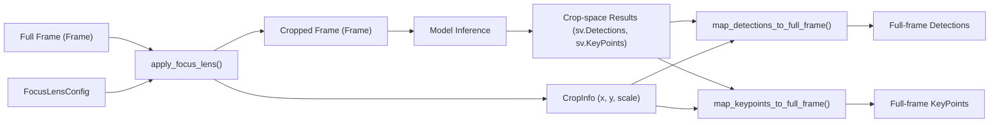
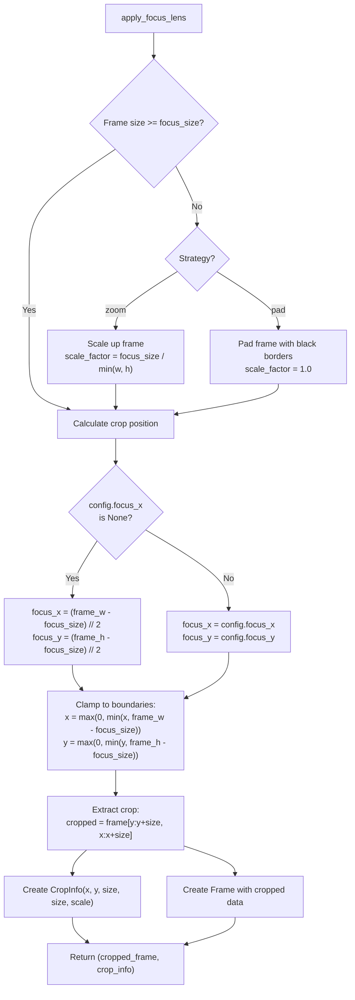
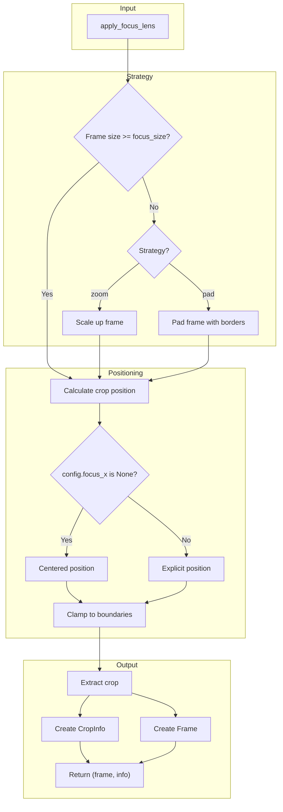
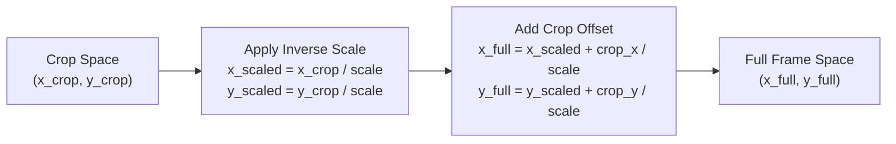
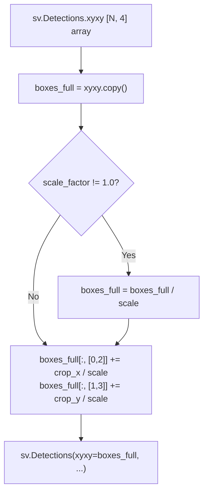
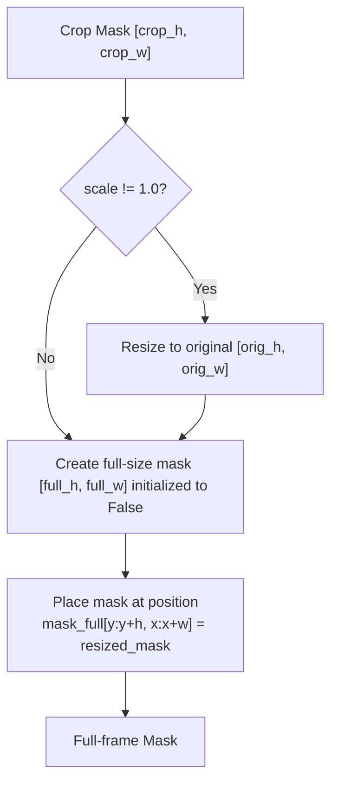
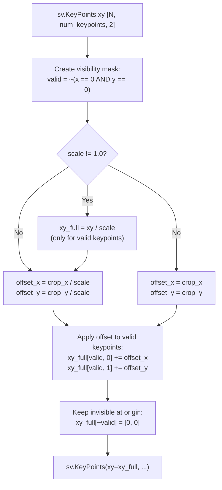
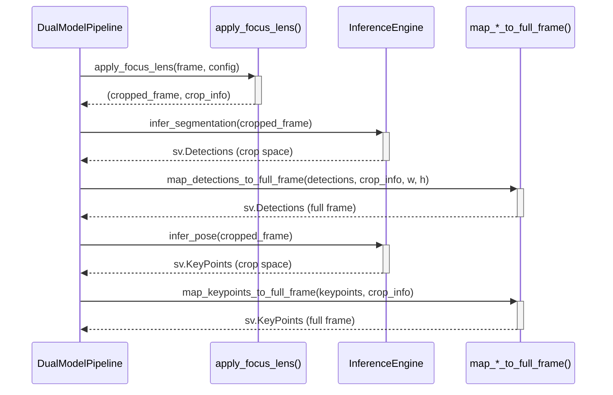

# Focus Lens Operations

Relevant source files

- [](https://github.com/e7canasta/bakery-luna/blob/8081344f/bakery/tests/test_focus_lens.py)
- [](https://github.com/e7canasta/bakery-luna/blob/8081344f/bakery/utils/focus_lens.py)

## Purpose and Scope

This document explains the operational functions that implement the Focus Lens feature: applying crops to frames, and mapping inference results back to full frame coordinates. These operations enable crop-based inference optimization by concentrating computational resources on a region of interest.

For configuration of focus lens parameters, see [Focus Lens Configuration](https://deepwiki.com/e7canasta/bakery-luna/4.1-focus-lens-configuration). For integration of focus lens in the complete pipeline, see [Dual Model Pipeline](https://deepwiki.com/e7canasta/bakery-luna/3.3-dual-model-pipeline).

---

## Overview

The Focus Lens system provides three core operations that work together to enable region-of-interest inference:




**Sources:** [bakery/utils/focus_lens.py1-276](https://github.com/e7canasta/bakery-luna/blob/8081344f/bakery/utils/focus_lens.py#L1-L276)

---

## Function Reference

All focus lens operations are implemented in the `bakery.utils.focus_lens` module:

|Function|Input|Output|Purpose|
|---|---|---|---|
|`apply_focus_lens()`|`Frame`, `FocusLensConfig`|`(Frame, CropInfo)`|Extract cropped region from frame|
|`map_detections_to_full_frame()`|`sv.Detections`, `CropInfo`, dimensions|`sv.Detections`|Transform bounding boxes and masks|
|`map_keypoints_to_full_frame()`|`sv.KeyPoints`, `CropInfo`|`sv.KeyPoints`|Transform pose keypoints|
|`crop_info_to_tuple()`|`Optional[CropInfo]`|`Optional[Tuple]`|Convert to annotator format|

**Sources:** [bakery/utils/focus_lens.py17-276](https://github.com/e7canasta/bakery-luna/blob/8081344f/bakery/utils/focus_lens.py#L17-L276)

---

## Applying Focus Lens

### Function Signature

The `apply_focus_lens()` function extracts a square region from a frame before inference:

```
def apply_focus_lens(
    frame: Frame,
    config: FocusLensConfig
) -> Tuple[Frame, CropInfo]:
```

**Sources:** [bakery/utils/focus_lens.py17-20](https://github.com/e7canasta/bakery-luna/blob/8081344f/bakery/utils/focus_lens.py#L17-L20)

### Crop Position Calculation

The crop position is determined by the configuration:



---



**Sources:** [bakery/utils/focus_lens.py41-113](https://github.com/e7canasta/bakery-luna/blob/8081344f/bakery/utils/focus_lens.py#L41-L113)

### Strategy Behavior

When the frame is smaller than `focus_size`, two strategies are available:

**Zoom Strategy** ([bakery/utils/focus_lens.py48-57](https://github.com/e7canasta/bakery-luna/blob/8081344f/bakery/utils/focus_lens.py#L48-L57)):

- Scales up the frame to at least `focus_size`
- Maintains aspect ratio
- Sets `scale_factor = focus_size / min(frame_w, frame_h)`
- Uses `cv2.INTER_LINEAR` interpolation

**Pad Strategy** ([bakery/utils/focus_lens.py59-74](https://github.com/e7canasta/bakery-luna/blob/8081344f/bakery/utils/focus_lens.py#L59-L74)):

- Adds black borders to reach `focus_size`
- No scaling: `scale_factor = 1.0`
- Centers the original content
- Uses `cv2.BORDER_CONSTANT` with black padding

### Position Clamping

Crop positions are always clamped to valid boundaries to prevent out-of-bounds access:

```
focus_x = max(0, min(focus_x, frame_w - focus_size))
focus_y = max(0, min(focus_y, frame_h - focus_size))
```

This ensures that even if the user specifies an invalid position (e.g., `focus_x=2000` on a 1920px frame), the crop will be adjusted to the maximum valid position.

**Sources:** [bakery/utils/focus_lens.py87-89](https://github.com/e7canasta/bakery-luna/blob/8081344f/bakery/utils/focus_lens.py#L87-L89) [bakery/tests/test_focus_lens.py179-194](https://github.com/e7canasta/bakery-luna/blob/8081344f/bakery/tests/test_focus_lens.py#L179-L194)

### CropInfo Entity

The returned `CropInfo` captures all information needed for reverse mapping:

|Field|Type|Description|
|---|---|---|
|`x`|`int`|Crop X offset in (possibly scaled) frame|
|`y`|`int`|Crop Y offset in (possibly scaled) frame|
|`width`|`int`|Crop width (always equals `focus_size`)|
|`height`|`int`|Crop height (always equals `focus_size`)|
|`scale_factor`|`float`|Zoom scale applied (1.0 = no zoom)|

**Sources:** [bakery/utils/focus_lens.py98-104](https://github.com/e7canasta/bakery-luna/blob/8081344f/bakery/utils/focus_lens.py#L98-L104) [bakery/core/entities/frame.py](https://github.com/e7canasta/bakery-luna/blob/8081344f/bakery/core/entities/frame.py) (assumed)

---

## Coordinate Transformation Mathematics

### Transformation Pipeline

Results from crop-space must be transformed through two steps to reach full-frame coordinates:



### Mathematical Formulation

Given a point `(x_crop, y_crop)` in crop space and `CropInfo(x=crop_x, y=crop_y, scale_factor=scale)`:

**For scaled crops (scale ≠ 1.0):**

```
x_full = (x_crop / scale) + (crop_x / scale)
y_full = (y_crop / scale) + (crop_y / scale)
```

**For unscaled crops (scale = 1.0):**

```
x_full = x_crop + crop_x
y_full = y_crop + crop_y
```

The scale inversion accounts for the zoom applied during `apply_focus_lens()`. If the frame was scaled up by 2.0x before cropping, detected coordinates must be divided by 2.0 to match the original frame dimensions.

**Sources:** [bakery/utils/focus_lens.py142-152](https://github.com/e7canasta/bakery-luna/blob/8081344f/bakery/utils/focus_lens.py#L142-L152) [bakery/utils/focus_lens.py237-253](https://github.com/e7canasta/bakery-luna/blob/8081344f/bakery/utils/focus_lens.py#L237-L253)

---

## Mapping Detections to Full Frame

### Function Signature

```
def map_detections_to_full_frame(
    detections: sv.Detections,
    crop_info: CropInfo,
    full_width: int,
    full_height: int
) -> sv.Detections:
```

**Sources:** [bakery/utils/focus_lens.py116-121](https://github.com/e7canasta/bakery-luna/blob/8081344f/bakery/utils/focus_lens.py#L116-L121)

### Bounding Box Transformation

Bounding boxes are transformed using the coordinate transformation pipeline:



The transformation is applied vectorized to all bounding boxes simultaneously. The `[:, [0, 2]]` slice updates x-coordinates (x1, x2) and `[:, [1, 3]]` updates y-coordinates (y1, y2).

**Sources:** [bakery/utils/focus_lens.py142-152](https://github.com/e7canasta/bakery-luna/blob/8081344f/bakery/utils/focus_lens.py#L142-L152)

### Mask Expansion

Segmentation masks require a two-step process to map from crop space to full frame:

1. **Inverse Scaling** ([bakery/utils/focus_lens.py164-177](https://github.com/e7canasta/bakery-luna/blob/8081344f/bakery/utils/focus_lens.py#L164-L177)):
    
    - If `scale_factor != 1.0`, resize mask to original crop dimensions
    - Uses `cv2.INTER_NEAREST` to preserve binary mask values
    - Calculates original dimensions: `orig_w = crop_width / scale`
2. **Placement** ([bakery/utils/focus_lens.py179-193](https://github.com/e7canasta/bakery-luna/blob/8081344f/bakery/utils/focus_lens.py#L179-L193)):

    - Create zero-initialized full-size mask `[full_height, full_width]`
    - Place resized crop mask at offset position
    - Handle boundary cases where crop extends beyond frame



**Sources:** [bakery/utils/focus_lens.py154-198](https://github.com/e7canasta/bakery-luna/blob/8081344f/bakery/utils/focus_lens.py#L154-L198)

### Empty Detection Handling

The function safely handles empty detections by returning immediately:

```
if len(detections) == 0:
    return detections
```

This preserves the `sv.Detections.empty()` state without attempting transformations.

**Sources:** [bakery/utils/focus_lens.py139-140](https://github.com/e7canasta/bakery-luna/blob/8081344f/bakery/utils/focus_lens.py#L139-L140) [bakery/tests/test_focus_lens.py304-316](https://github.com/e7canasta/bakery-luna/blob/8081344f/bakery/tests/test_focus_lens.py#L304-L316)

---

## Mapping Keypoints to Full Frame

### Function Signature

```
def map_keypoints_to_full_frame(
    keypoints: sv.KeyPoints,
    crop_info: CropInfo
) -> sv.KeyPoints:
```

**Sources:** [bakery/utils/focus_lens.py208-211](https://github.com/e7canasta/bakery-luna/blob/8081344f/bakery/utils/focus_lens.py#L208-L211)

### Invisible Keypoint Handling

A critical aspect of keypoint mapping is preserving invisible keypoints at the origin:



Keypoints at `(0, 0)` are conventionally treated as invisible/not detected. The mapping operation must preserve this semantic meaning by not offsetting these points.

**Sources:** [bakery/utils/focus_lens.py228-260](https://github.com/e7canasta/bakery-luna/blob/8081344f/bakery/utils/focus_lens.py#L228-L260) [bakery/tests/test_focus_lens.py372-396](https://github.com/e7canasta/bakery-luna/blob/8081344f/bakery/tests/test_focus_lens.py#L372-L396)

### Vectorized Transformation

The transformation uses NumPy broadcasting and masking for efficiency:

```
# Create mask for valid keypoints
valid_mask = ~np.all(np.isclose(xy_full, 0), axis=2)  # [N, num_keypoints]

# Apply transformations only to valid keypoints
xy_full[:, :, 0] = np.where(valid_mask, xy_full[:, :, 0] + offset_x, 0)
xy_full[:, :, 1] = np.where(valid_mask, xy_full[:, :, 1] + offset_y, 0)
```

This vectorized approach processes all persons and all keypoints simultaneously.

**Sources:** [bakery/utils/focus_lens.py233-253](https://github.com/e7canasta/bakery-luna/blob/8081344f/bakery/utils/focus_lens.py#L233-L253)

---

## Helper Functions

### crop_info_to_tuple

Converts `CropInfo` to a tuple format for compatibility with the annotator layer:

```
def crop_info_to_tuple(crop_info: Optional[CropInfo]) -> Optional[Tuple[int, int, int, int]]:
    if crop_info is None:
        return None
    return (crop_info.x, crop_info.y, crop_info.width, crop_info.height)
```

The annotator expects crop information as a simple tuple `(x, y, width, height)` rather than the `CropInfo` dataclass. This function provides the conversion.

**Sources:** [bakery/utils/focus_lens.py263-275](https://github.com/e7canasta/bakery-luna/blob/8081344f/bakery/utils/focus_lens.py#L263-L275) [bakery/tests/test_focus_lens.py437-462](https://github.com/e7canasta/bakery-luna/blob/8081344f/bakery/tests/test_focus_lens.py#L437-L462)

---

## Usage Example

The typical usage pattern in the dual model pipeline:



The pipeline applies the crop once, performs inference on the cropped frame, then maps results back to full frame coordinates before annotation.

**Sources:** [bakery/utils/focus_lens.py1-276](https://github.com/e7canasta/bakery-luna/blob/8081344f/bakery/utils/focus_lens.py#L1-L276) [run_luna.py](https://github.com/e7canasta/bakery-luna/blob/8081344f/run_luna.py) (assumed integration point)

---

## Test Coverage

The focus lens operations have comprehensive BDD-style test coverage:

|Test Class|Coverage|
|---|---|
|`TestApplyFocusLens`|Centered crops, positioned crops, boundary clamping, zoom strategy, pad strategy, pixel data validation|
|`TestMapDetectionsToFullFrame`|Bounding box offsets, mask expansion, empty detections, scale factor inversion|
|`TestMapKeypointsToFullFrame`|Visible keypoint offsets, invisible keypoint preservation, empty keypoints, scale factor inversion|
|`TestCropInfoToTuple`|Tuple conversion, None handling|

All tests follow Given-When-Then scenarios with descriptive docstrings.

**Sources:** [bakery/tests/test_focus_lens.py1-463](https://github.com/e7canasta/bakery-luna/blob/8081344f/bakery/tests/test_focus_lens.py#L1-L463)
