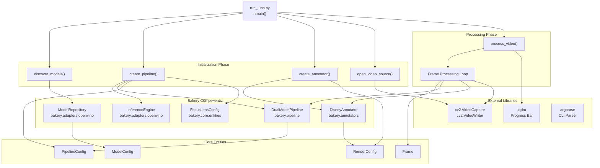
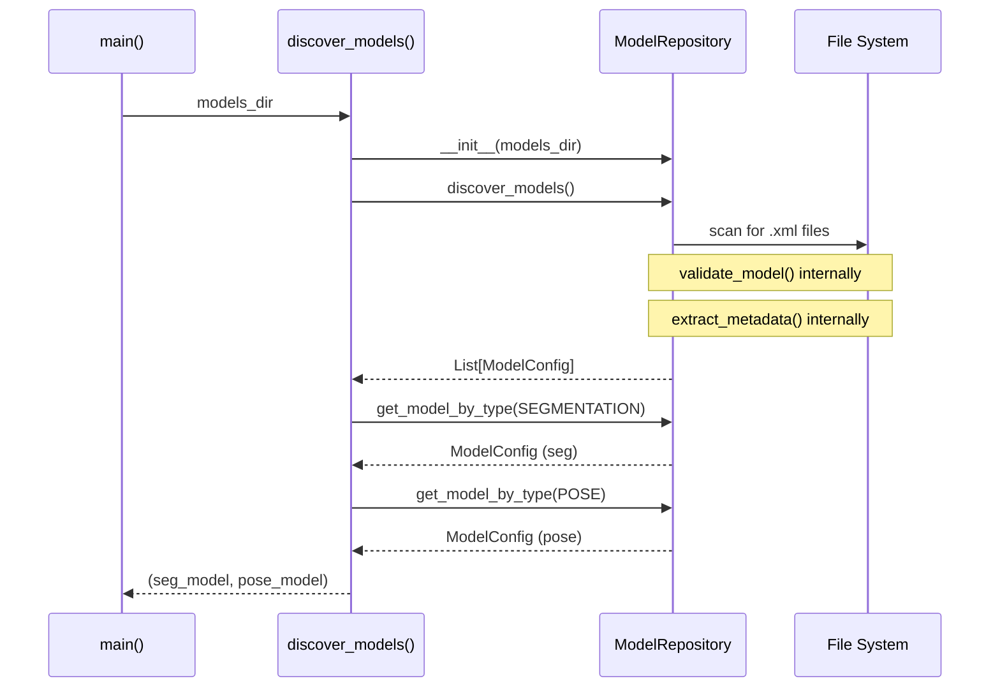
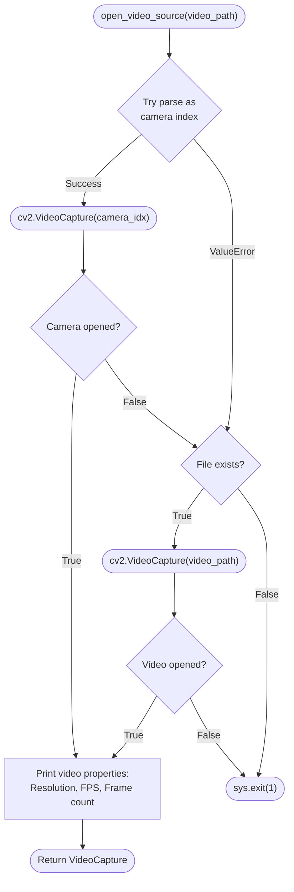
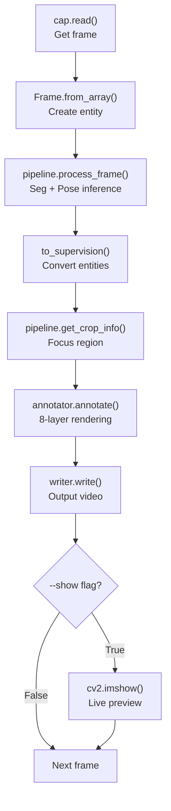
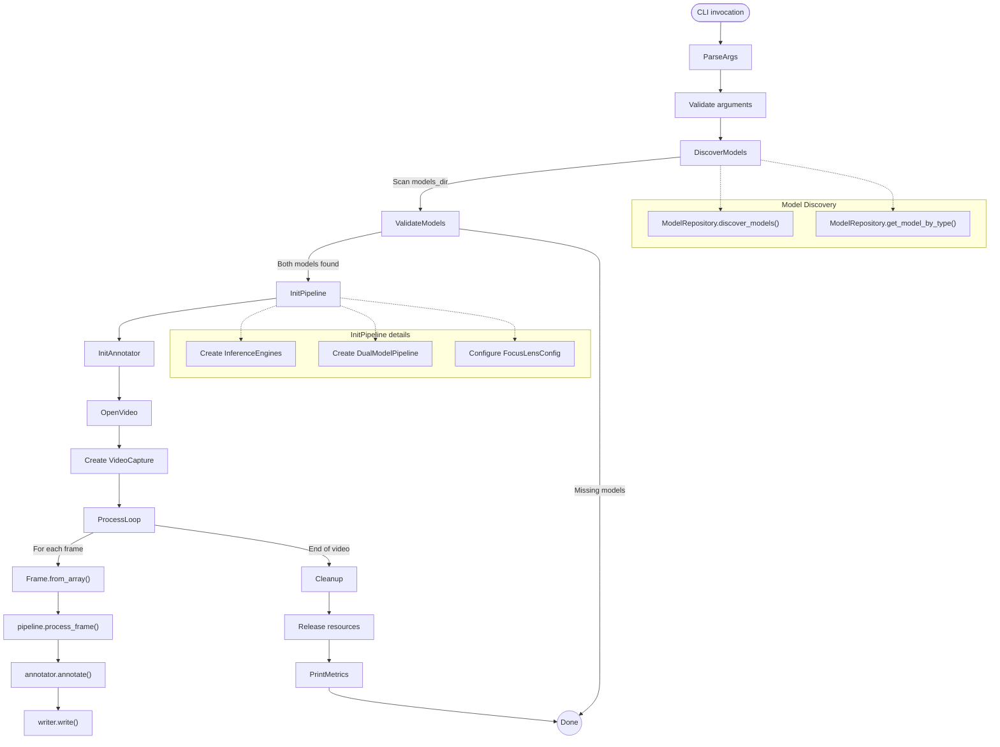

# Luna Demo Application

Relevant source files

- [](https://github.com/e7canasta/bakery-luna/blob/8081344f/pyproject.toml)
- [](https://github.com/e7canasta/bakery-luna/blob/8081344f/results/output_luna.mp4)
- [](https://github.com/e7canasta/bakery-luna/blob/8081344f/run_luna.py)

## Purpose and Scope

This document provides comprehensive documentation for the Luna demo application (`run_luna.py`), which serves as the primary reference implementation and user-facing interface for the Bakery vision framework. The Luna demo orchestrates all framework components to perform dual-model inference (segmentation + pose estimation) on video streams with Disney aesthetic rendering.

For detailed information about specific aspects of the demo:

- Command-line arguments and parameters: see [Command-Line Reference](https://deepwiki.com/e7canasta/bakery-luna/5.1-command-line-reference)
- Step-by-step execution flow and processing logic: see [Pipeline Execution Flow](https://deepwiki.com/e7canasta/bakery-luna/5.2-pipeline-execution-flow)
- Output video format and performance metrics: see [Understanding Output](https://deepwiki.com/e7canasta/bakery-luna/5.3-understanding-output)

For information about the underlying framework components integrated by this demo:

- Core framework architecture: see [Core Architecture](https://deepwiki.com/e7canasta/bakery-luna/3-core-architecture)
- Dual-model pipeline implementation: see [Dual Model Pipeline](https://deepwiki.com/e7canasta/bakery-luna/3.3-dual-model-pipeline)
- Focus Lens optimization: see [Focus Lens System](https://deepwiki.com/e7canasta/bakery-luna/4-focus-lens-system)
- Model discovery and management: see [Model Management](https://deepwiki.com/e7canasta/bakery-luna/6-model-management)

## Overview

The Luna demo application is a command-line tool located at [run_luna.py1-497](https://github.com/e7canasta/bakery-luna/blob/8081344f/run_luna.py#L1-L497) that demonstrates the complete capabilities of the Bakery vision framework. It provides a production-ready example of how to:

1. **Discover and validate OpenVINO models** using `ModelRepository`
2. **Configure and execute dual-model inference** through `DualModelPipeline`
3. **Apply optional Focus Lens optimization** for crop-based inference
4. **Render results with Disney/Roger Rabbit aesthetic** via `DisneyAnnotator`
5. **Track and report performance metrics** including FPS and efficiency statistics

The application processes video files or webcam streams, applies computer vision inference, and generates annotated output videos with a distinctive visual style inspired by the "Who Framed Roger Rabbit" film aesthetic.

**Sources:** [run_luna.py1-19](https://github.com/e7canasta/bakery-luna/blob/8081344f/run_luna.py#L1-L19)

## System Architecture

The Luna demo acts as the orchestration layer that integrates all Bakery framework components. The following diagram illustrates how `run_luna.py` coordinates the framework's modular architecture:



**Key architectural characteristics:**

|Aspect|Implementation|
|---|---|
|**Execution Model**|Sequential initialization followed by frame-by-frame processing loop|
|**Component Coupling**|Loose coupling via configuration entities (`ModelConfig`, `PipelineConfig`, `FocusLensConfig`)|
|**Error Handling**|Fail-fast validation during initialization, graceful degradation during processing|
|**Performance Tracking**|Integrated metrics collection via `PerformanceMetrics` entity|
|**User Interface**|CLI with comprehensive argument parsing and progress visualization|

**Sources:** [run_luna.py1-497](https://github.com/e7canasta/bakery-luna/blob/8081344f/run_luna.py#L1-L497) [run_luna.py331-497](https://github.com/e7canasta/bakery-luna/blob/8081344f/run_luna.py#L331-L497)

## Component Integration

The Luna demo integrates five primary Bakery framework components through a carefully designed initialization and execution sequence:

### Model Discovery and Validation

The `discover_models()` function [run_luna.py40-79](https://github.com/e7canasta/bakery-luna/blob/8081344f/run_luna.py#L40-L79) instantiates `ModelRepository` to scan a directory for OpenVINO models:




The function performs validation to ensure both required model types are present, terminating execution if either is missing [run_luna.py75-77](https://github.com/e7canasta/bakery-luna/blob/8081344f/run_luna.py#L75-L77)

**Sources:** [run_luna.py40-79](https://github.com/e7canasta/bakery-luna/blob/8081344f/run_luna.py#L40-L79)

### Pipeline Configuration and Initialization

The `create_pipeline()` function [run_luna.py82-141](https://github.com/e7canasta/bakery-luna/blob/8081344f/run_luna.py#L82-L141) configures the dual-model inference pipeline:

|Configuration Step|Code Reference|Purpose|
|---|---|---|
|**Update confidence thresholds**|[run_luna.py96-98](https://github.com/e7canasta/bakery-luna/blob/8081344f/run_luna.py#L96-L98)|Apply user-specified confidence to both models|
|**Compile segmentation model**|[run_luna.py101-103](https://github.com/e7canasta/bakery-luna/blob/8081344f/run_luna.py#L101-L103)|Create `InferenceEngine` for segmentation|
|**Compile pose model**|[run_luna.py105-107](https://github.com/e7canasta/bakery-luna/blob/8081344f/run_luna.py#L105-L107)|Create `InferenceEngine` for pose estimation|
|**Create pipeline config**|[run_luna.py109-116](https://github.com/e7canasta/bakery-luna/blob/8081344f/run_luna.py#L109-L116)|Instantiate `PipelineConfig` with interval and filters|
|**Configure Focus Lens**|[run_luna.py118-128](https://github.com/e7canasta/bakery-luna/blob/8081344f/run_luna.py#L118-L128)|Optional crop-based inference optimization|
|**Instantiate pipeline**|[run_luna.py131](https://github.com/e7canasta/bakery-luna/blob/8081344f/run_luna.py#L131-L131)|Create `DualModelPipeline` with all configurations|

The function detects when both models use the same resolution and enables preprocessing cache optimization [run_luna.py136-139](https://github.com/e7canasta/bakery-luna/blob/8081344f/run_luna.py#L136-L139)

**Sources:** [run_luna.py82-141](https://github.com/e7canasta/bakery-luna/blob/8081344f/run_luna.py#L82-L141)

### Annotator Configuration

The `create_annotator()` function [run_luna.py144-160](https://github.com/e7canasta/bakery-luna/blob/8081344f/run_luna.py#L144-L160) configures the Disney-style renderer with specific brightness parameters:

```
# Configuration defined at run_luna.py:154-158
RenderConfig(
    bw_darkness=0.6,          # Background darkened to 60%
    lens_brightness=1.2,       # Focus region brightened by 20%
    spotlight_brightness=1.2   # Detected objects brightened by 20%
)
```

This creates the distinctive "Roger Rabbit" aesthetic where detected objects appear in color against a darkened black-and-white background.

**Sources:** [run_luna.py144-160](https://github.com/e7canasta/bakery-luna/blob/8081344f/run_luna.py#L144-L160)

### Video I/O Management

The demo handles both file-based video and webcam input through `open_video_source()` [run_luna.py163-203](https://github.com/e7canasta/bakery-luna/blob/8081344f/run_luna.py#L163-L203):



The function extracts video metadata including resolution, FPS, and total frame count for pipeline configuration and progress tracking.

**Sources:** [run_luna.py163-203](https://github.com/e7canasta/bakery-luna/blob/8081344f/run_luna.py#L163-L203)

## Processing Workflow

The core processing loop in `process_video()` [run_luna.py233-305](https://github.com/e7canasta/bakery-luna/blob/8081344f/run_luna.py#L233-L305) executes the following operations for each frame:



**Key processing steps:**

1. **Frame Acquisition** [run_luna.py259-261](https://github.com/e7canasta/bakery-luna/blob/8081344f/run_luna.py#L259-L261): Read raw image data from video source
2. **Entity Wrapping** [run_luna.py264](https://github.com/e7canasta/bakery-luna/blob/8081344f/run_luna.py#L264-L264): Convert NumPy array to `Frame` entity with metadata
3. **Dual Inference** [run_luna.py267](https://github.com/e7canasta/bakery-luna/blob/8081344f/run_luna.py#L267-L267): Execute segmentation and pose estimation via `pipeline.process_frame()`
4. **Format Conversion** [run_luna.py270-271](https://github.com/e7canasta/bakery-luna/blob/8081344f/run_luna.py#L270-L271): Convert Bakery entities to Supervision format for rendering
5. **Focus Region Extraction** [run_luna.py274-275](https://github.com/e7canasta/bakery-luna/blob/8081344f/run_luna.py#L274-L275): Get crop information if Focus Lens is active
6. **Rendering** [run_luna.py278-283](https://github.com/e7canasta/bakery-luna/blob/8081344f/run_luna.py#L278-L283): Apply 8-layer Disney aesthetic via `annotator.annotate()`
7. **Output Writing** [run_luna.py286](https://github.com/e7canasta/bakery-luna/blob/8081344f/run_luna.py#L286-L286): Write annotated frame to output video
8. **Optional Preview** [run_luna.py289-293](https://github.com/e7canasta/bakery-luna/blob/8081344f/run_luna.py#L289-L293): Display live preview if `--show` flag is enabled

**Sources:** [run_luna.py233-305](https://github.com/e7canasta/bakery-luna/blob/8081344f/run_luna.py#L233-L305)

## Performance Metrics and Reporting

The demo tracks and reports comprehensive performance metrics via the `print_metrics()` function [run_luna.py307-328](https://github.com/e7canasta/bakery-luna/blob/8081344f/run_luna.py#L307-L328):

|Metric|Description|Calculation|
|---|---|---|
|**Total Frames**|Number of frames processed|`metrics.total_frames`|
|**Segmentation Runs**|Number of times segmentation inference executed|`metrics.seg_runs`|
|**Pose Runs**|Number of times pose inference executed|`metrics.pose_runs`|
|**Processing Time**|Total execution duration in seconds|`end_time - start_time`|
|**Average FPS**|Frames processed per second|`frame_count / duration`|
|**Seg Efficiency**|Segmentation scheduling efficiency|`total_frames / seg_runs`|
|**Pose Efficiency**|Pose inference frequency|`total_frames / pose_runs` (always 1.0)|

The efficiency metrics highlight the optimization strategy: segmentation runs every N frames (configurable via `--seg-interval`), while pose estimation runs on every frame to capture rapid movement [run_luna.py326-327](https://github.com/e7canasta/bakery-luna/blob/8081344f/run_luna.py#L326-L327)

**Sources:** [run_luna.py307-328](https://github.com/e7canasta/bakery-luna/blob/8081344f/run_luna.py#L307-L328)

## Command-Line Interface

The Luna demo provides a comprehensive CLI with the following argument categories:

|Category|Arguments|Description|
|---|---|---|
|**Required**|`--video`, `--models-dir`|Video source and model directory|
|**Output**|`--output`|Output video path (default: `results/output_luna.mp4`)|
|**Inference**|`--seg-interval`, `--confidence`, `--classes`|Control inference behavior|
|**Display**|`--show`|Enable live preview window|
|**Focus Lens**|`--focus-size`, `--focus-x`, `--focus-y`, `--focus-strategy`|Crop-based optimization|

Detailed documentation for all command-line arguments is provided in [Command-Line Reference](https://deepwiki.com/e7canasta/bakery-luna/5.1-command-line-reference).

**Example invocations:**

```
# Basic usage
uv run run_luna.py --video videos/sample.mp4 --models-dir exports/fp16/

# With Focus Lens optimization (centered 640x640 crop)
uv run run_luna.py --video videos/sample.mp4 --models-dir exports/fp16/ --focus-size 640

# High confidence, person detection only, with live preview
uv run run_luna.py --video 0 --models-dir exports/fp16/ --confidence 0.5 --classes 0 --show
```

**Sources:** [run_luna.py331-439](https://github.com/e7canasta/bakery-luna/blob/8081344f/run_luna.py#L331-L439) [run_luna.py336-358](https://github.com/e7canasta/bakery-luna/blob/8081344f/run_luna.py#L336-L358)

## Execution Flow Summary

The complete execution flow follows this sequence:




The execution is divided into three phases:

1. **Initialization Phase** [run_luna.py452-471](https://github.com/e7canasta/bakery-luna/blob/8081344f/run_luna.py#L452-L471): Model discovery, pipeline creation, video I/O setup
2. **Processing Phase** [run_luna.py473-487](https://github.com/e7canasta/bakery-luna/blob/8081344f/run_luna.py#L473-L487): Frame-by-frame inference and rendering loop
3. **Cleanup Phase** [run_luna.py483-492](https://github.com/e7canasta/bakery-luna/blob/8081344f/run_luna.py#L483-L492): Resource release and metrics reporting

**Sources:** [run_luna.py331-497](https://github.com/e7canasta/bakery-luna/blob/8081344f/run_luna.py#L331-L497)

## Integration with Bakery Framework

The Luna demo demonstrates proper integration patterns for the Bakery framework:

|Pattern|Implementation|Benefit|
|---|---|---|
|**Configuration-Driven**|All components configured via entity objects|Type-safe, immutable configuration|
|**Entity-Based Data Flow**|`Frame`, `Segmentation`, `PoseEstimation` entities|Clean separation of concerns|
|**Adapter Pattern**|`InferenceEngine` abstracts OpenVINO|Hardware independence|
|**Pipeline Orchestration**|`DualModelPipeline` coordinates inference|Complex workflow management|
|**Presentation Layer**|`DisneyAnnotator` handles all rendering|Separation of logic and visualization|

This architecture ensures that the demo remains maintainable, testable, and extensible while demonstrating best practices for framework usage.

**Sources:** [run_luna.py1-497](https://github.com/e7canasta/bakery-luna/blob/8081344f/run_luna.py#L1-L497)
