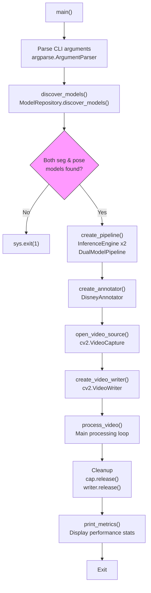
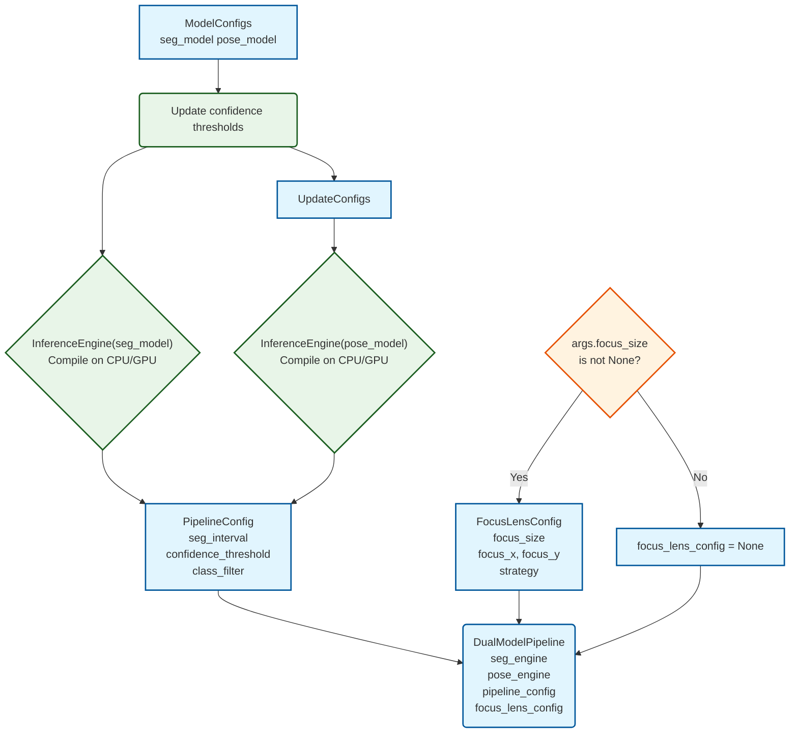
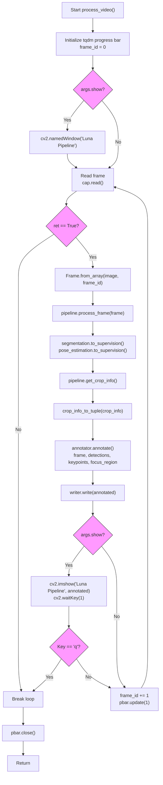
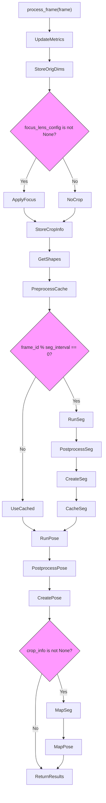
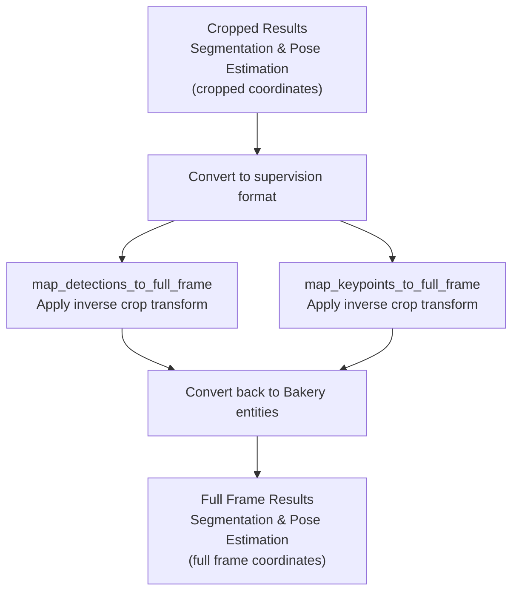

# Pipeline Execution Flow

Relevant source files

- [](https://github.com/e7canasta/bakery-luna/blob/8081344f/bakery/pipeline/dual_model_pipeline.py)
- [](https://github.com/e7canasta/bakery-luna/blob/8081344f/pyproject.toml)
- [](https://github.com/e7canasta/bakery-luna/blob/8081344f/run_luna.py)

## Purpose and Scope

This document traces the complete execution flow of the Luna demo application from command invocation to final output generation. It covers the orchestration logic in `run_luna.py` and the frame-by-frame processing implemented in `DualModelPipeline`.

For command-line arguments and configuration options, see [Command-Line Reference](https://deepwiki.com/e7canasta/bakery-luna/5.1-command-line-reference). For understanding the output format and metrics, see [Understanding Output](https://deepwiki.com/e7canasta/bakery-luna/5.3-understanding-output). For detailed Focus Lens operations, see [Focus Lens System](https://deepwiki.com/e7canasta/bakery-luna/4-focus-lens-system).

---

## High-Level Execution Flow

The Luna pipeline executes in three distinct phases: initialization, processing, and cleanup.



**Sources:** [run_luna.py331-497](https://github.com/e7canasta/bakery-luna/blob/8081344f/run_luna.py#L331-L497)

---

## Initialization Phase

### Model Discovery

The `discover_models()` function locates and validates OpenVINO models in the specified directory.

|Step|Function Call|Output|
|---|---|---|
|1. Scan directory|`ModelRepository(models_dir)`|Repository instance|
|2. Discover models|`repository.discover_models()`|List of `ModelConfig` objects|
|3. Filter by type|`repository.get_model_by_type(ModelType.SEGMENTATION)`|Segmentation model config|
|4. Filter by type|`repository.get_model_by_type(ModelType.POSE)`|Pose model config|
|5. Validate|Check both models exist|Exit if either missing|

**Sources:** [run_luna.py40-79](https://github.com/e7canasta/bakery-luna/blob/8081344f/run_luna.py#L40-L79)

### Pipeline Construction

The `create_pipeline()` function assembles the inference pipeline with configured optimizations.




**Key Configuration Points:**

- **Confidence Threshold:** Applied to both models via `seg_model.confidence = args.confidence` and `pose_model.confidence = args.confidence` [run_luna.py97-98](https://github.com/e7canasta/bakery-luna/blob/8081344f/run_luna.py#L97-L98)
- **Smart Scheduling:** Configured via `seg_interval` in `PipelineConfig` [run_luna.py110-116](https://github.com/e7canasta/bakery-luna/blob/8081344f/run_luna.py#L110-L116)
- **Focus Lens:** Optionally created if `--focus-size` is specified [run_luna.py119-128](https://github.com/e7canasta/bakery-luna/blob/8081344f/run_luna.py#L119-L128)
- **Preprocessing Cache:** Automatically enabled if both models share the same resolution [run_luna.py136-139](https://github.com/e7canasta/bakery-luna/blob/8081344f/run_luna.py#L136-L139)

**Sources:** [run_luna.py82-141](https://github.com/e7canasta/bakery-luna/blob/8081344f/run_luna.py#L82-L141)

### Annotator and I/O Setup

The system creates a `DisneyAnnotator` with fixed rendering parameters and sets up video I/O.

```
# Annotator configuration
render_config = RenderConfig(
    bw_darkness=0.6,           # Darken B&W background to 60%
    lens_brightness=1.2,       # Brighten focus region by 20%
    spotlight_brightness=1.2   # Brighten detected objects by 20%
)
annotator = DisneyAnnotator(render_config, enable_pose=True)
```

**Video I/O Initialization:**

1. **Input:** `open_video_source()` handles both file paths and camera indices [run_luna.py163-203](https://github.com/e7canasta/bakery-luna/blob/8081344f/run_luna.py#L163-L203)
2. **Output:** `create_video_writer()` creates MP4 writer with `'mp4v'` codec [run_luna.py206-230](https://github.com/e7canasta/bakery-luna/blob/8081344f/run_luna.py#L206-L230)

**Sources:** [run_luna.py144-160](https://github.com/e7canasta/bakery-luna/blob/8081344f/run_luna.py#L144-L160) [run_luna.py163-230](https://github.com/e7canasta/bakery-luna/blob/8081344f/run_luna.py#L163-L230)

---

## Processing Phase

The `process_video()` function contains the main processing loop that reads frames, runs inference, annotates, and writes output.

### Main Processing Loop



**Sources:** [run_luna.py233-305](https://github.com/e7canasta/bakery-luna/blob/8081344f/run_luna.py#L233-L305)

### Frame Entity Creation

Each frame is wrapped in a `Frame` entity that carries metadata:

```
frame = Frame.from_array(image, frame_id=frame_id)
# Frame contains:
# - data: np.ndarray (H, W, 3)
# - frame_id: int
# - width: int (from image.shape[1])
# - height: int (from image.shape[0])
```

**Sources:** [run_luna.py264](https://github.com/e7canasta/bakery-luna/blob/8081344f/run_luna.py#L264-L264)

---

## Frame Processing Pipeline

The `DualModelPipeline.process_frame()` method orchestrates the complete inference pipeline for a single frame.

### Processing Flow Diagram



**Sources:** [bakery/pipeline/dual_model_pipeline.py85-181](https://github.com/e7canasta/bakery-luna/blob/8081344f/bakery/pipeline/dual_model_pipeline.py#L85-L181)

### Preprocessing with Cache

The `PreprocessCache` optimizes preprocessing when both models share the same input resolution.

**Cache Logic:**

|Condition|Behavior|
|---|---|
|Same resolution|Compute once, reuse for both models|
|Different resolutions|Compute separately for each model|
|Same frame_id|Return cached tensors without recomputation|

**Preprocessing Steps per Tensor:**

1. Letterbox resize to model input shape
2. Convert BGR to RGB
3. Normalize to [0, 1] range
4. Transpose to (1, 3, H, W) format
5. Store metadata: `ratio`, `pad_w`, `pad_h`, `orig_w`, `orig_h`

**Sources:** [bakery/pipeline/dual_model_pipeline.py118-122](https://github.com/e7canasta/bakery-luna/blob/8081344f/bakery/pipeline/dual_model_pipeline.py#L118-L122)

### Smart Segmentation Scheduling

Segmentation inference runs conditionally based on `seg_interval`, while pose estimation runs on every frame.

```
# Smart scheduling implementation
if frame.frame_id % self.config.seg_interval == 0:
    # Run segmentation inference
    seg_outputs = self.seg_engine.infer(seg_tensor)
    # ... postprocess and cache result
    self._cached_segmentation = segmentation
    self.metrics.seg_runs += 1
else:
    # Reuse cached segmentation
    segmentation = self._cached_segmentation
```

**Efficiency Example:**

- `seg_interval=5`: Segmentation runs every 5 frames (5x efficiency)
- `seg_interval=1`: Segmentation runs every frame (1x efficiency, no optimization)

**Sources:** [bakery/pipeline/dual_model_pipeline.py124-149](https://github.com/e7canasta/bakery-luna/blob/8081344f/bakery/pipeline/dual_model_pipeline.py#L124-L149)

### Postprocessing and Coordinate Transformation

Both segmentation and pose outputs undergo coordinate transformation to map from model space to frame space.

**Transformation Formula:**

```
transformed_x = (model_x - pad_w) / ratio
transformed_y = (model_y - pad_h) / ratio
```

Where:

- `ratio`: Scale factor from letterbox resize
- `pad_w`, `pad_h`: Padding added during letterbox operation

**Segmentation Postprocessing:**

1. Extract boxes and masks from model outputs [bakery/pipeline/dual_model_pipeline.py129-131](https://github.com/e7canasta/bakery-luna/blob/8081344f/bakery/pipeline/dual_model_pipeline.py#L129-L131)
2. Transform box coordinates [bakery/pipeline/dual_model_pipeline.py217-219](https://github.com/e7canasta/bakery-luna/blob/8081344f/bakery/pipeline/dual_model_pipeline.py#L217-L219)
3. Clip boxes to frame boundaries [bakery/pipeline/dual_model_pipeline.py222-223](https://github.com/e7canasta/bakery-luna/blob/8081344f/bakery/pipeline/dual_model_pipeline.py#L222-L223)
4. Resize masks to original frame size [bakery/pipeline/dual_model_pipeline.py236-262](https://github.com/e7canasta/bakery-luna/blob/8081344f/bakery/pipeline/dual_model_pipeline.py#L236-L262)
5. Create `BoundingBox` and `Mask` entities [bakery/pipeline/dual_model_pipeline.py226-271](https://github.com/e7canasta/bakery-luna/blob/8081344f/bakery/pipeline/dual_model_pipeline.py#L226-L271)

**Pose Postprocessing:**

1. Extract boxes and keypoints from model outputs [bakery/pipeline/dual_model_pipeline.py154-156](https://github.com/e7canasta/bakery-luna/blob/8081344f/bakery/pipeline/dual_model_pipeline.py#L154-L156)
2. Transform box coordinates [bakery/pipeline/dual_model_pipeline.py309-311](https://github.com/e7canasta/bakery-luna/blob/8081344f/bakery/pipeline/dual_model_pipeline.py#L309-L311)
3. Transform keypoint coordinates [bakery/pipeline/dual_model_pipeline.py314-316](https://github.com/e7canasta/bakery-luna/blob/8081344f/bakery/pipeline/dual_model_pipeline.py#L314-L316)
4. Create `Skeleton` entities [bakery/pipeline/dual_model_pipeline.py319-327](https://github.com/e7canasta/bakery-luna/blob/8081344f/bakery/pipeline/dual_model_pipeline.py#L319-L327)

**Sources:** [bakery/pipeline/dual_model_pipeline.py183-332](https://github.com/e7canasta/bakery-luna/blob/8081344f/bakery/pipeline/dual_model_pipeline.py#L183-L332)

### Focus Lens Coordinate Mapping

When Focus Lens is active, results are mapped from cropped coordinates back to full frame coordinates.

**Mapping Process:**



**Inverse Transformation:**

```
full_frame_x = (cropped_x / scale_factor) + crop_x
full_frame_y = (cropped_y / scale_factor) + crop_y
```

Where:

- `scale_factor`: Zoom factor applied during crop (e.g., 1.0 for zoom strategy)
- `crop_x`, `crop_y`: Top-left corner of crop region in full frame

**Sources:** [bakery/pipeline/dual_model_pipeline.py173-179](https://github.com/e7canasta/bakery-luna/blob/8081344f/bakery/pipeline/dual_model_pipeline.py#L173-L179) [bakery/pipeline/dual_model_pipeline.py373-502](https://github.com/e7canasta/bakery-luna/blob/8081344f/bakery/pipeline/dual_model_pipeline.py#L373-L502)

---

## Annotation and Output

After inference, the pipeline converts results to supervision format and applies Disney-style rendering.

### Entity to Supervision Conversion

```
# Convert Bakery entities to supervision format
detections = segmentation.to_supervision()  # -> sv.Detections
keypoints = pose_estimation.to_supervision()  # -> sv.KeyPoints

# Get focus region for visualization
crop_info = pipeline.get_crop_info()
focus_region = crop_info_to_tuple(crop_info)  # -> Optional[Tuple[int, int, int, int]]
```

**Sources:** [run_luna.py269-275](https://github.com/e7canasta/bakery-luna/blob/8081344f/run_luna.py#L269-L275)

### Disney Annotator Rendering

The `DisneyAnnotator.annotate()` method applies 8-layer rendering to create the final output frame.

**Rendering Layers:**

1. Darkened B&W background (60% brightness)
2. Brightened focus lens region (120% brightness, if active)
3. Full-color detected object masks (100% brightness)
4. Bounding box outlines
5. Segmentation contours
6. Pose skeletons
7. Pose keypoints
8. Labels and confidence scores

**Sources:** [run_luna.py277-283](https://github.com/e7canasta/bakery-luna/blob/8081344f/run_luna.py#L277-L283)

### Video Writing

The annotated frame is written to the output video file using OpenCV's `VideoWriter`.

```
writer.write(annotated)  # Write frame to output_luna.mp4
```

**Output Format:**

- **Codec:** `'mp4v'` (MPEG-4 Part 2)
- **FPS:** Inherited from input video (or 30 for webcam)
- **Resolution:** Same as input video

**Sources:** [run_luna.py286](https://github.com/e7canasta/bakery-luna/blob/8081344f/run_luna.py#L286-L286)

---

## Cleanup and Metrics

### Resource Cleanup

After processing completes, all resources are released:

```
cap.release()          # Close video capture
writer.release()       # Close video writer
cv2.destroyAllWindows()  # Close display windows (if --show was used)
```

**Sources:** [run_luna.py483-486](https://github.com/e7canasta/bakery-luna/blob/8081344f/run_luna.py#L483-L486)

### Performance Metrics

The `print_metrics()` function displays pipeline performance statistics.

**Metrics Displayed:**

|Metric|Description|Source|
|---|---|---|
|Total frames|Number of frames processed|`metrics.total_frames`|
|Segmentation runs|Number of times segmentation ran|`metrics.seg_runs`|
|Pose runs|Number of times pose ran|`metrics.pose_runs`|
|Processing time|Total elapsed time|`end_time - start_time`|
|Average FPS|Frames per second throughput|`frame_count / duration`|
|Seg efficiency|Frames per segmentation run|`total_frames / seg_runs`|
|Pose efficiency|Always 1x (runs every frame)|`total_frames / pose_runs`|

**Example Output:**

```
📊 Performance Metrics
============================================================
Total frames:         150
Segmentation runs:    30
Pose runs:            150
Processing time:      12.34s
Average FPS:          12.16

Seg efficiency:       5.0x (ran every 5.0 frames)
Pose efficiency:      1.0x (ran every frame)
============================================================
```

**Sources:** [run_luna.py307-328](https://github.com/e7canasta/bakery-luna/blob/8081344f/run_luna.py#L307-L328) [run_luna.py489-490](https://github.com/e7canasta/bakery-luna/blob/8081344f/run_luna.py#L489-L490)

---

## Execution Timeline

The complete execution follows this timeline:

```mermaid
gantt
    title Luna Pipeline Execution Timeline
    dateFormat  HH:mm:ss
    axisFormat  %S

    section Initialization
    Parse CLI args           :a1, 00:00:00, 2s
    Discover models          :a2, after a1, 3s
    Create InferenceEngines  :a3, after a2, 4s
    Create pipeline          :a4, after a3, 3s
    Open video I/O           :a5, after a4, 2s
    Frame loop start         :a6, after a5, 1s

    section Processing
    Process frames           :b1, after a6, 20s
    Frame loop end           :b2, after b1, 1s

    section Cleanup
    Release resources        :c1, after b2, 3s
    Print metrics            :c2, after c1, 2s
```



**Sources:** [run_luna.py331-497](https://github.com/e7canasta/bakery-luna/blob/8081344f/run_luna.py#L331-L497)


### On this page

- [Pipeline Execution Flow](https://deepwiki.com/e7canasta/bakery-luna/5.2-pipeline-execution-flow#pipeline-execution-flow)
- [Purpose and Scope](https://deepwiki.com/e7canasta/bakery-luna/5.2-pipeline-execution-flow#purpose-and-scope)
- [High-Level Execution Flow](https://deepwiki.com/e7canasta/bakery-luna/5.2-pipeline-execution-flow#high-level-execution-flow)
- [Initialization Phase](https://deepwiki.com/e7canasta/bakery-luna/5.2-pipeline-execution-flow#initialization-phase)
- [Model Discovery](https://deepwiki.com/e7canasta/bakery-luna/5.2-pipeline-execution-flow#model-discovery)
- [Pipeline Construction](https://deepwiki.com/e7canasta/bakery-luna/5.2-pipeline-execution-flow#pipeline-construction)
- [Annotator and I/O Setup](https://deepwiki.com/e7canasta/bakery-luna/5.2-pipeline-execution-flow#annotator-and-io-setup)
- [Processing Phase](https://deepwiki.com/e7canasta/bakery-luna/5.2-pipeline-execution-flow#processing-phase)
- [Main Processing Loop](https://deepwiki.com/e7canasta/bakery-luna/5.2-pipeline-execution-flow#main-processing-loop)
- [Frame Entity Creation](https://deepwiki.com/e7canasta/bakery-luna/5.2-pipeline-execution-flow#frame-entity-creation)
- [Frame Processing Pipeline](https://deepwiki.com/e7canasta/bakery-luna/5.2-pipeline-execution-flow#frame-processing-pipeline)
- [Processing Flow Diagram](https://deepwiki.com/e7canasta/bakery-luna/5.2-pipeline-execution-flow#processing-flow-diagram)
- [Preprocessing with Cache](https://deepwiki.com/e7canasta/bakery-luna/5.2-pipeline-execution-flow#preprocessing-with-cache)
- [Smart Segmentation Scheduling](https://deepwiki.com/e7canasta/bakery-luna/5.2-pipeline-execution-flow#smart-segmentation-scheduling)
- [Postprocessing and Coordinate Transformation](https://deepwiki.com/e7canasta/bakery-luna/5.2-pipeline-execution-flow#postprocessing-and-coordinate-transformation)
- [Focus Lens Coordinate Mapping](https://deepwiki.com/e7canasta/bakery-luna/5.2-pipeline-execution-flow#focus-lens-coordinate-mapping)
- [Annotation and Output](https://deepwiki.com/e7canasta/bakery-luna/5.2-pipeline-execution-flow#annotation-and-output)
- [Entity to Supervision Conversion](https://deepwiki.com/e7canasta/bakery-luna/5.2-pipeline-execution-flow#entity-to-supervision-conversion)
- [Disney Annotator Rendering](https://deepwiki.com/e7canasta/bakery-luna/5.2-pipeline-execution-flow#disney-annotator-rendering)
- [Video Writing](https://deepwiki.com/e7canasta/bakery-luna/5.2-pipeline-execution-flow#video-writing)
- [Cleanup and Metrics](https://deepwiki.com/e7canasta/bakery-luna/5.2-pipeline-execution-flow#cleanup-and-metrics)
- [Resource Cleanup](https://deepwiki.com/e7canasta/bakery-luna/5.2-pipeline-execution-flow#resource-cleanup)
- [Performance Metrics](https://deepwiki.com/e7canasta/bakery-luna/5.2-pipeline-execution-flow#performance-metrics)
- [Execution Timeline](https://deepwiki.com/e7canasta/bakery-luna/5.2-pipeline-execution-flow#execution-timeline)
