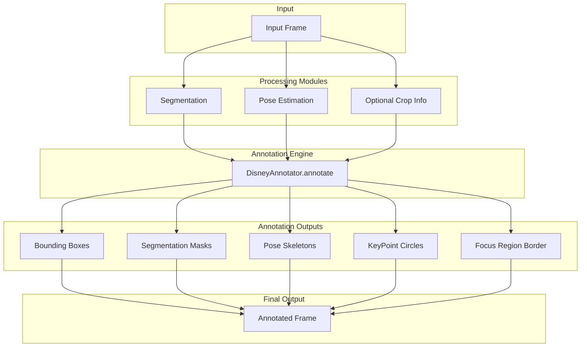
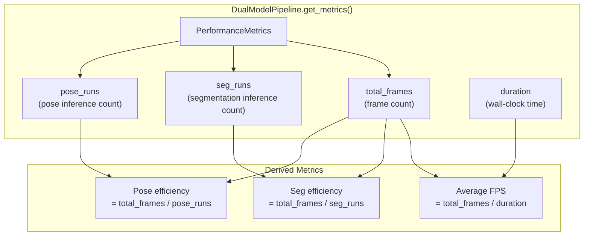
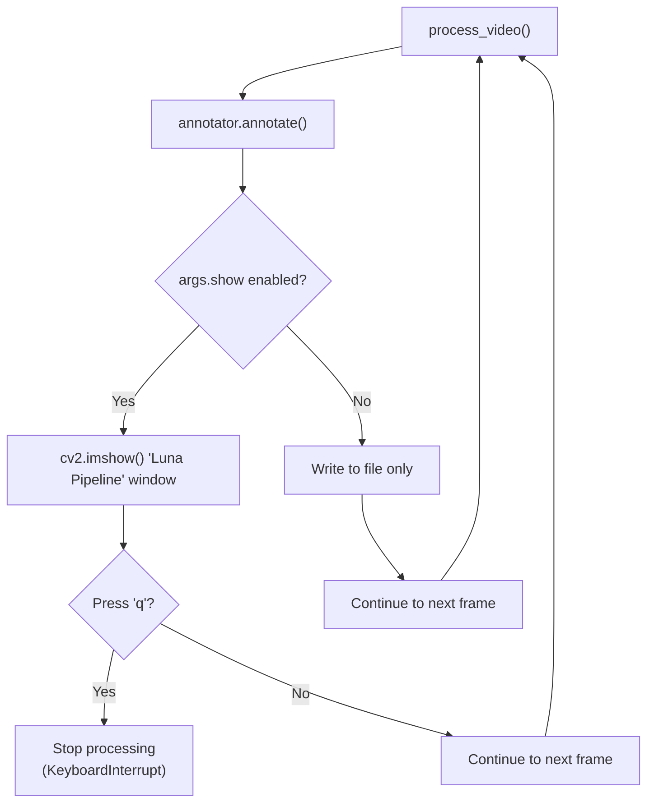
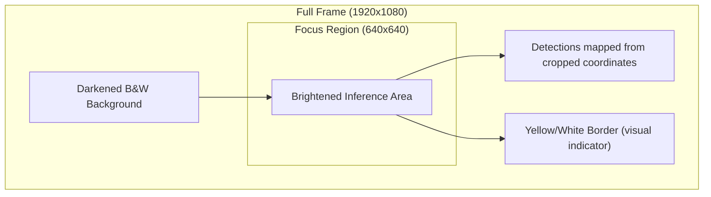

# Understanding Output

Relevant source files

- [](https://github.com/e7canasta/bakery-luna/blob/8081344f/pyproject.toml)
- [](https://github.com/e7canasta/bakery-luna/blob/8081344f/results/output_luna.mp4)
- [](https://github.com/e7canasta/bakery-luna/blob/8081344f/run_luna.py)

## Purpose and Scope

This page explains the output produced by the Luna pipeline, including the video file format, visual rendering characteristics, and performance metrics. It covers how to interpret the annotated video output and understand the efficiency reports printed to console.

For information about configuring the output destination and format settings, see [Command-Line Reference](https://deepwiki.com/e7canasta/bakery-luna/5.1-command-line-reference). For details on the pipeline execution that produces this output, see [Pipeline Execution Flow](https://deepwiki.com/e7canasta/bakery-luna/5.2-pipeline-execution-flow).

---

## Output Artifacts

The Luna pipeline generates two primary outputs:

|Artifact Type|Location|Description|
|---|---|---|
|**Annotated Video**|`results/output_luna.mp4` (default)|MP4 video file with Disney-style rendering applied to each frame|
|**Performance Metrics**|Console (stdout)|Real-time processing statistics and efficiency reports|

The output video path can be customized via the `--output` argument [run_luna.py376-379](https://github.com/e7canasta/bakery-luna/blob/8081344f/run_luna.py#L376-L379) If not specified, the default path is created automatically [run_luna.py443-444](https://github.com/e7canasta/bakery-luna/blob/8081344f/run_luna.py#L443-L444)

**Sources:** [run_luna.py206-230](https://github.com/e7canasta/bakery-luna/blob/8081344f/run_luna.py#L206-L230) [run_luna.py307-328](https://github.com/e7canasta/bakery-luna/blob/8081344f/run_luna.py#L307-L328)

---

## Video Output Format

### Technical Specifications

The output video is written using OpenCV's `VideoWriter` with the following characteristics:

```
fourcc = cv2.VideoWriter_fourcc(*'mp4v')  # MPEG-4 codec
writer = cv2.VideoWriter(output_path, fourcc, fps, (width, height))
```

|Property|Value|Source|
|---|---|---|
|**Codec**|`mp4v` (MPEG-4)|[run_luna.py221](https://github.com/e7canasta/bakery-luna/blob/8081344f/run_luna.py#L221-L221)|
|**Resolution**|Matches input video|[run_luna.py466-467](https://github.com/e7canasta/bakery-luna/blob/8081344f/run_luna.py#L466-L467)|
|**Frame Rate**|Matches input video (or 30 FPS for camera)|[run_luna.py468](https://github.com/e7canasta/bakery-luna/blob/8081344f/run_luna.py#L468-L468)|
|**Color Space**|BGR (OpenCV standard)|Implicit|

The output directory is created automatically if it doesn't exist [run_luna.py219](https://github.com/e7canasta/bakery-luna/blob/8081344f/run_luna.py#L219-L219)

**Sources:** [run_luna.py206-230](https://github.com/e7canasta/bakery-luna/blob/8081344f/run_luna.py#L206-L230) [run_luna.py466-471](https://github.com/e7canasta/bakery-luna/blob/8081344f/run_luna.py#L466-L471)

---

## Disney Aesthetic Rendering

### The Roger Rabbit Effect

The Luna pipeline applies a distinctive **Disney/Roger Rabbit aesthetic** where animated characters (detected objects with poses) appear in color against a darkened, desaturated background. This is implemented by the `DisneyAnnotator` class through an 8-layer rendering system [run_luna.py460](https://github.com/e7canasta/bakery-luna/blob/8081344f/run_luna.py#L460-L460)

```mermaid
flowchart LR
    subgraph "Input"
        InputFrame["Original Frame<br/>(BGR color)"]
    end

    subgraph "DisneyAnnotator"
        RenderConfig["RenderConfig<br/>bw_darkness=0.6<br/>lens_brightness=1.2<br/>spotlight_brightness=1.2"]
        Layer1["Layer 1:<br/>Background Darkening"]
        Layer2["Layer 2:<br/>Focus Lens Brightening"]
        Layer3["Layer 3:<br/>Spotlight on Detections"]
        Layer4["Layer 4:<br/>Bounding Boxes"]
        Layer5["Layer 5:<br/>Segmentation Masks"]
        Layer6["Layer 6:<br/>Pose Skeletons"]
        Layer7["Layer 7:<br/>KeyPoint Circles"]
        Layer8["Layer 8:<br/>Focus Region Border"]
    end

    subgraph "Output"
        OutputFrame["Annotated Frame<br/>(Disney aesthetic)"]
    end

    InputFrame --> DisneyAnnotator
    RenderConfig --> Layer1
    Layer1 --> Layer2
    Layer2 --> Layer3
    Layer3 --> Layer4
    Layer4 --> Layer5
    Layer5 --> Layer6
    Layer6 --> Layer7
    Layer7 --> Layer8
    Layer8 --> OutputFrame
```



**Sources:** [run_luna.py144-161](https://github.com/e7canasta/bakery-luna/blob/8081344f/run_luna.py#L144-L161)

### Render Configuration

The visual appearance is controlled by three key parameters in `RenderConfig`:

|Parameter|Default Value|Effect|
|---|---|---|
|`bw_darkness`|`0.6`|Darkens background to 60% of original brightness|
|`lens_brightness`|`1.2`|Brightens focus lens region by 20%|
|`spotlight_brightness`|`1.2`|Brightens detected objects/poses by 20%|

These values create a **spotlight effect** where:

- The background world is darkened and desaturated (black-and-white)
- The focus lens region (if enabled) is brighter
- Detected objects with poses are rendered in full color with enhanced brightness
- The contrast draws the viewer's attention to animated characters

**Sources:** [run_luna.py154-158](https://github.com/e7canasta/bakery-luna/blob/8081344f/run_luna.py#L154-L158)

### Annotation Layers

The 8-layer rendering pipeline annotates each frame with:



The `annotate()` method receives:

- `frame`: Original full-resolution BGR image
- `detections`: Supervision format detections (bounding boxes + masks)
- `keypoints`: Supervision format keypoints (skeletons)
- `focus_region`: Optional tuple `(x, y, width, height)` for focus lens visualization

**Sources:** [run_luna.py278-283](https://github.com/e7canasta/bakery-luna/blob/8081344f/run_luna.py#L278-L283)

---

## Performance Metrics Output

### Console Report Structure

After processing completes, the pipeline prints a comprehensive performance report to stdout:

```
📊 Performance Metrics
============================================================
Total frames:         150
Segmentation runs:    30
Pose runs:            150
Processing time:      12.45s
Average FPS:          12.05

Seg efficiency:       5.0x (ran every 5.0 frames)
Pose efficiency:      1.0x (ran every frame)
============================================================
```

**Sources:** [run_luna.py307-328](https://github.com/e7canasta/bakery-luna/blob/8081344f/run_luna.py#L307-L328)

### Metrics Breakdown



**Sources:** [run_luna.py307-328](https://github.com/e7canasta/bakery-luna/blob/8081344f/run_luna.py#L307-L328) [run_luna.py489-490](https://github.com/e7canasta/bakery-luna/blob/8081344f/run_luna.py#L489-L490)

### Interpreting Efficiency Metrics

The efficiency metrics reveal the **smart scheduling optimizations** at work:

|Metric|Formula|Interpretation|
|---|---|---|
|**Total frames**|Frame count|Total number of frames processed|
|**Segmentation runs**|Inference count|Number of times segmentation model was executed|
|**Pose runs**|Inference count|Number of times pose model was executed (typically equals total frames)|
|**Seg efficiency**|`total_frames / seg_runs`|Multiplier showing how many frames benefit from each segmentation run|
|**Pose efficiency**|`total_frames / pose_runs`|Typically 1.0x (pose runs every frame)|

**Example Interpretation:**

```
Segmentation runs:    30
Total frames:         150
Seg efficiency:       5.0x (ran every 5.0 frames)
```

This indicates:

- Segmentation ran only 30 times for 150 frames
- Each segmentation result was reused for 5 frames
- The `--seg-interval` was set to 5 [run_luna.py383-387](https://github.com/e7canasta/bakery-luna/blob/8081344f/run_luna.py#L383-L387)
- **5x efficiency gain** from smart scheduling

The segmentation efficiency directly corresponds to the `--seg-interval` argument, which controls how frequently segmentation inference executes while caching results between runs.

**Sources:** [run_luna.py320-327](https://github.com/e7canasta/bakery-luna/blob/8081344f/run_luna.py#L320-L327)

---

## Real-Time Preview

When the `--show` flag is enabled [run_luna.py404-408](https://github.com/e7canasta/bakery-luna/blob/8081344f/run_luna.py#L404-L408) a live preview window displays annotated frames during processing:



|Key Binding|Action|
|---|---|
|`q`|Stop processing immediately [run_luna.py291-293](https://github.com/e7canasta/bakery-luna/blob/8081344f/run_luna.py#L291-L293)|
|Any other key|Continue processing|

The preview window is named `"Luna Pipeline"` and is resizable (`cv2.WINDOW_NORMAL`) [run_luna.py255](https://github.com/e7canasta/bakery-luna/blob/8081344f/run_luna.py#L255-L255)

**Sources:** [run_luna.py253-293](https://github.com/e7canasta/bakery-luna/blob/8081344f/run_luna.py#L253-L293)

---

## Output Quality Factors

### Factors Affecting Visual Output

The quality and characteristics of the output video depend on several configuration parameters:

|Factor|Configuration|Impact on Output|
|---|---|---|
|**Segmentation Interval**|`--seg-interval`|Lower values = more frequent updates, smoother object tracking|
|**Confidence Threshold**|`--confidence`|Higher values = fewer but more confident detections|
|**Class Filter**|`--classes`|Limits visualization to specific object classes|
|**Focus Lens**|`--focus-size`, `--focus-x`, `--focus-y`|Crops inference region, affects detection coverage|
|**Focus Strategy**|`--focus-strategy` (zoom/pad)|Determines how small frames are handled|

**Sources:** [run_luna.py382-438](https://github.com/e7canasta/bakery-luna/blob/8081344f/run_luna.py#L382-L438)

### Focus Lens Visualization

When Focus Lens is active, the output video includes a visual border indicating the inference region:



The focus region visualization helps understand:

- Which part of the frame received inference
- How detections map from cropped to full-frame coordinates
- The scale factor applied (zoom or pad strategy)

**Sources:** [run_luna.py274-275](https://github.com/e7canasta/bakery-luna/blob/8081344f/run_luna.py#L274-L275) [run_luna.py119-128](https://github.com/e7canasta/bakery-luna/blob/8081344f/run_luna.py#L119-L128)

---

## Typical Output Scenarios

### Scenario 1: Standard Full-Frame Processing

**Command:**

```
uv run run_luna.py --video videos/sample.mp4 --models-dir exports/fp16/
```

**Expected Output:**

- Video: `results/output_luna.mp4`
- Full-frame inference on all objects
- Segmentation runs every 5 frames (default `--seg-interval=5`)
- Disney aesthetic with darkened background and colored detections

**Metrics Example:**

```
Total frames:         300
Segmentation runs:    60
Pose runs:            300
Seg efficiency:       5.0x
```

### Scenario 2: Focus Lens with Live Preview

**Command:**

```
uv run run_luna.py --video 0 --models-dir exports/fp16/ --focus-size 640 --show
```

**Expected Output:**

- Webcam feed (device 0)
- Cropped inference on 640x640 region (centered)
- Focus region border visible in output
- Live preview window with 'q' to quit
- Higher FPS due to smaller inference region

**Metrics Example:**

```
Total frames:         450
Segmentation runs:    90
Pose runs:            450
Processing time:      15.2s
Average FPS:          29.6
```

### Scenario 3: High-Confidence Person-Only Detection

**Command:**

```
uv run run_luna.py --video videos/crowd.mp4 --models-dir exports/fp16/ \
    --confidence 0.5 --classes 0 --seg-interval 10
```

**Expected Output:**

- Only person detections (class ID 0)
- High confidence threshold filters weak detections
- Segmentation runs every 10 frames (increased efficiency)
- Cleaner output with fewer false positives

**Metrics Example:**

```
Total frames:         500
Segmentation runs:    50
Pose runs:            500
Seg efficiency:       10.0x (ran every 10.0 frames)
```

**Sources:** [run_luna.py336-358](https://github.com/e7canasta/bakery-luna/blob/8081344f/run_luna.py#L336-L358)

---

## Troubleshooting Output Issues

### Video Writer Fails to Open

**Symptom:** Error message `❌ Failed to create video writer: {output_path}`

**Causes:**

- Output directory doesn't exist (shouldn't happen, created automatically [run_luna.py219](https://github.com/e7canasta/bakery-luna/blob/8081344f/run_luna.py#L219-L219))
- Insufficient disk permissions
- Codec `mp4v` not available on system

**Solution:** Verify write permissions and codec availability.

### Black or Empty Output

**Symptom:** Output video exists but frames are black or show no annotations

**Causes:**

- No detections met confidence threshold
- Class filter excludes all objects
- Focus lens positioned outside frame bounds

**Solution:** Lower `--confidence`, remove `--classes` filter, or adjust focus lens position.

### Low FPS Performance

**Symptom:** Average FPS reported in metrics is significantly lower than expected

**Causes:**

- High-resolution input video
- CPU-only inference without OpenVINO optimizations
- Small `--seg-interval` causing excessive segmentation runs

**Solution:** Increase `--seg-interval`, use GPU device (if available), or enable Focus Lens for cropped inference.

**Sources:** [run_luna.py307-328](https://github.com/e7canasta/bakery-luna/blob/8081344f/run_luna.py#L307-L328)

---

## Summary

The Luna pipeline produces:

1. **Annotated MP4 video** with Disney aesthetic rendering (8 layers)
2. **Performance metrics** showing efficiency gains from smart scheduling
3. **Optional live preview** with keyboard controls

Key output characteristics:

- Background darkened to 60%, detections brightened by 20%
- Segmentation efficiency multiplier reflects `--seg-interval` setting
- Focus lens (when enabled) shows visual border in output
- Metrics provide insights into optimization effectiveness

The output format prioritizes **visual clarity** (Disney aesthetic) and **performance transparency** (detailed metrics), enabling users to understand both the qualitative and quantitative aspects of their pipeline configuration.

**Sources:** [run_luna.py1-497](https://github.com/e7canasta/bakery-luna/blob/8081344f/run_luna.py#L1-L497) [pyproject.toml1-21](https://github.com/e7canasta/bakery-luna/blob/8081344f/pyproject.toml#L1-L21)


### On this page

- [Understanding Output](https://deepwiki.com/e7canasta/bakery-luna/5.3-understanding-output#understanding-output)
- [Purpose and Scope](https://deepwiki.com/e7canasta/bakery-luna/5.3-understanding-output#purpose-and-scope)
- [Output Artifacts](https://deepwiki.com/e7canasta/bakery-luna/5.3-understanding-output#output-artifacts)
- [Video Output Format](https://deepwiki.com/e7canasta/bakery-luna/5.3-understanding-output#video-output-format)
- [Technical Specifications](https://deepwiki.com/e7canasta/bakery-luna/5.3-understanding-output#technical-specifications)
- [Disney Aesthetic Rendering](https://deepwiki.com/e7canasta/bakery-luna/5.3-understanding-output#disney-aesthetic-rendering)
- [The Roger Rabbit Effect](https://deepwiki.com/e7canasta/bakery-luna/5.3-understanding-output#the-roger-rabbit-effect)
- [Render Configuration](https://deepwiki.com/e7canasta/bakery-luna/5.3-understanding-output#render-configuration)
- [Annotation Layers](https://deepwiki.com/e7canasta/bakery-luna/5.3-understanding-output#annotation-layers)
- [Performance Metrics Output](https://deepwiki.com/e7canasta/bakery-luna/5.3-understanding-output#performance-metrics-output)
- [Console Report Structure](https://deepwiki.com/e7canasta/bakery-luna/5.3-understanding-output#console-report-structure)
- [Metrics Breakdown](https://deepwiki.com/e7canasta/bakery-luna/5.3-understanding-output#metrics-breakdown)
- [Interpreting Efficiency Metrics](https://deepwiki.com/e7canasta/bakery-luna/5.3-understanding-output#interpreting-efficiency-metrics)
- [Real-Time Preview](https://deepwiki.com/e7canasta/bakery-luna/5.3-understanding-output#real-time-preview)
- [Output Quality Factors](https://deepwiki.com/e7canasta/bakery-luna/5.3-understanding-output#output-quality-factors)
- [Factors Affecting Visual Output](https://deepwiki.com/e7canasta/bakery-luna/5.3-understanding-output#factors-affecting-visual-output)
- [Focus Lens Visualization](https://deepwiki.com/e7canasta/bakery-luna/5.3-understanding-output#focus-lens-visualization)
- [Typical Output Scenarios](https://deepwiki.com/e7canasta/bakery-luna/5.3-understanding-output#typical-output-scenarios)
- [Scenario 1: Standard Full-Frame Processing](https://deepwiki.com/e7canasta/bakery-luna/5.3-understanding-output#scenario-1-standard-full-frame-processing)
- [Scenario 2: Focus Lens with Live Preview](https://deepwiki.com/e7canasta/bakery-luna/5.3-understanding-output#scenario-2-focus-lens-with-live-preview)
- [Scenario 3: High-Confidence Person-Only Detection](https://deepwiki.com/e7canasta/bakery-luna/5.3-understanding-output#scenario-3-high-confidence-person-only-detection)
- [Troubleshooting Output Issues](https://deepwiki.com/e7canasta/bakery-luna/5.3-understanding-output#troubleshooting-output-issues)
- [Video Writer Fails to Open](https://deepwiki.com/e7canasta/bakery-luna/5.3-understanding-output#video-writer-fails-to-open)
- [Black or Empty Output](https://deepwiki.com/e7canasta/bakery-luna/5.3-understanding-output#black-or-empty-output)
- [Low FPS Performance](https://deepwiki.com/e7canasta/bakery-luna/5.3-understanding-output#low-fps-performance)
- [Summary](https://deepwiki.com/e7canasta/bakery-luna/5.3-understanding-output#summary)
