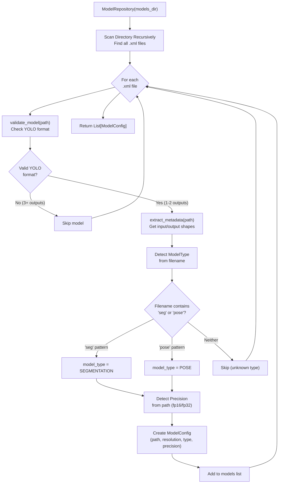
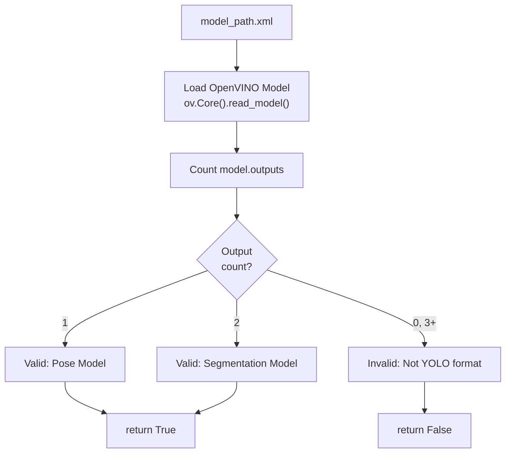
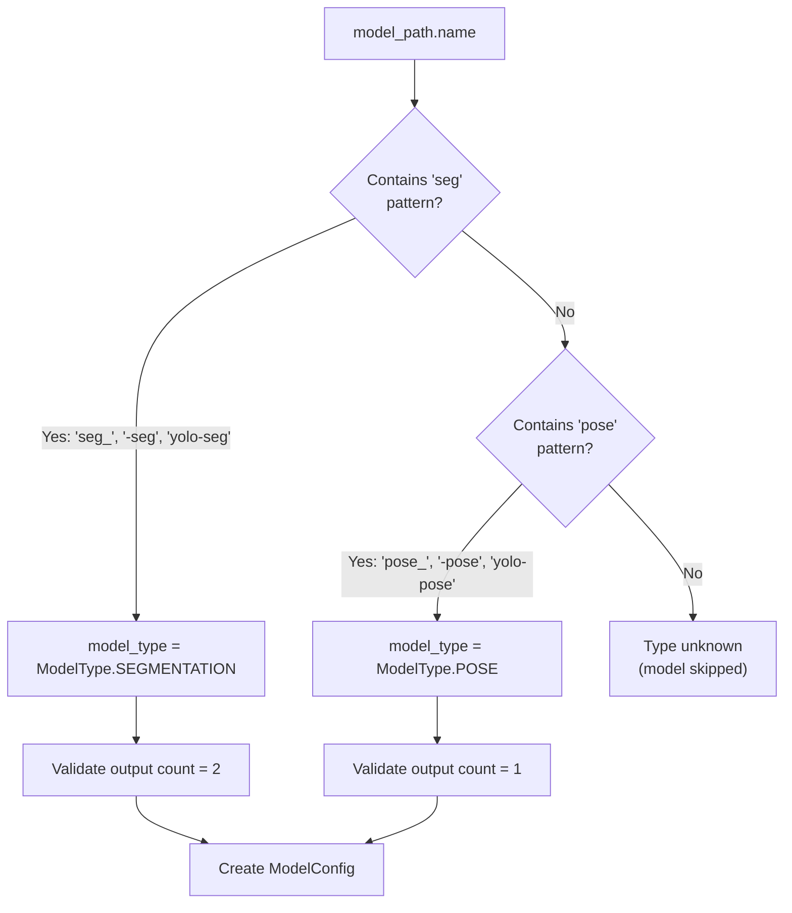
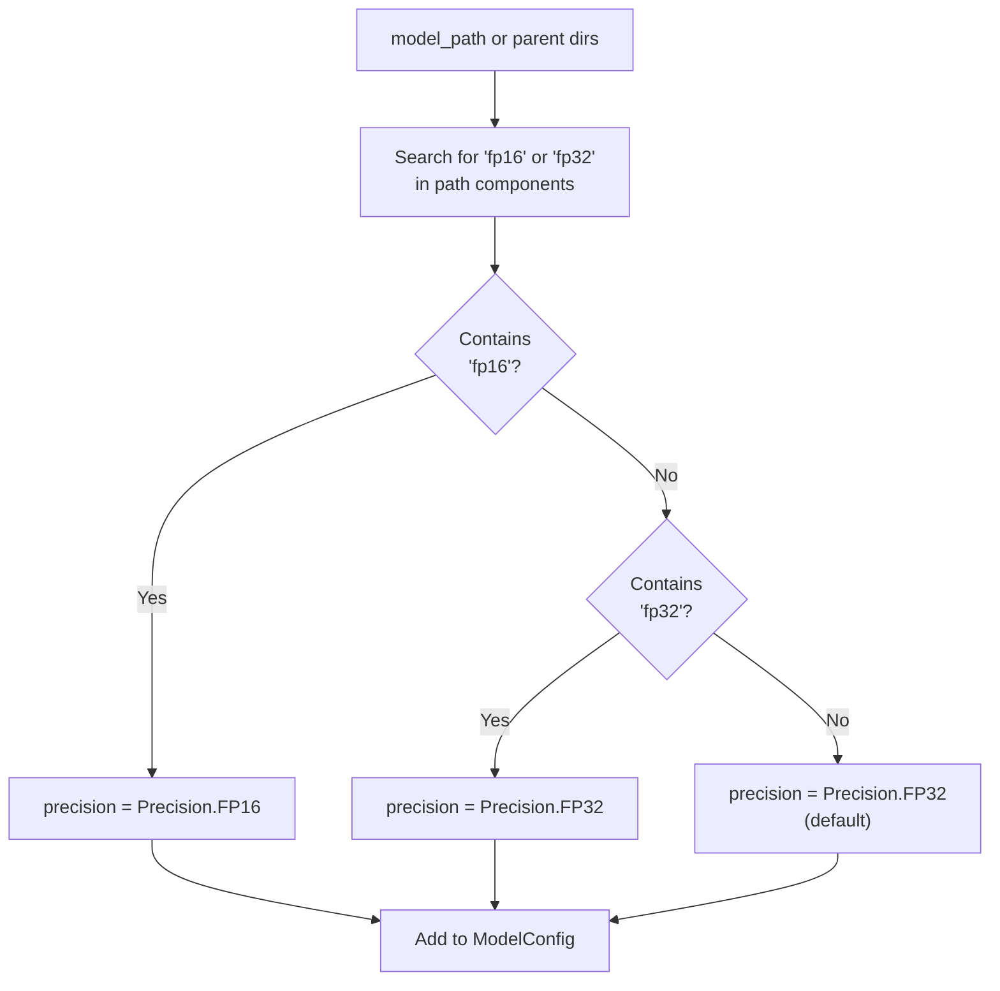
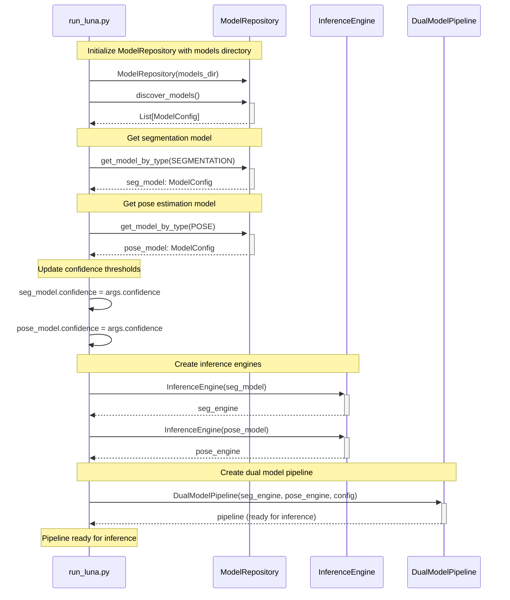
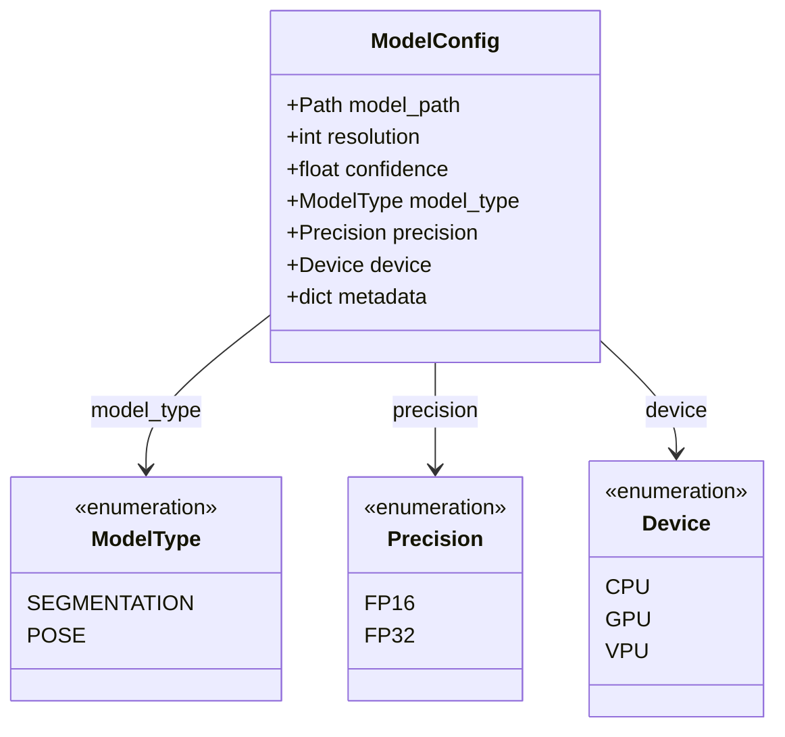

# Model Management

Relevant source files

- [](https://github.com/e7canasta/bakery-luna/blob/8081344f/bakery/tests/test_model_repository.py)
- [](https://github.com/e7canasta/bakery-luna/blob/8081344f/pyproject.toml)
- [](https://github.com/e7canasta/bakery-luna/blob/8081344f/run_luna.py)

## Purpose and Scope

This document describes the model management subsystem responsible for discovering, validating, and configuring OpenVINO models in the bakery-luna framework. The `ModelRepository` class provides automated model discovery from filesystem directories, validates model formats against YOLO specifications, and extracts metadata required for inference configuration.

For information about model execution and inference, see [Adapters Layer](https://deepwiki.com/e7canasta/bakery-luna/3.4-adapters-layer). For details on how models are configured and used in the pipeline, see [Dual Model Pipeline](https://deepwiki.com/e7canasta/bakery-luna/3.3-dual-model-pipeline). For the practical aspects of running models, see [Luna Demo Application](https://deepwiki.com/e7canasta/bakery-luna/5-luna-demo-application).

**Sources:** [run_luna.py1-80](https://github.com/e7canasta/bakery-luna/blob/8081344f/run_luna.py#L1-L80) [bakery/tests/test_model_repository.py1-22](https://github.com/e7canasta/bakery-luna/blob/8081344f/bakery/tests/test_model_repository.py#L1-L22)

---

## Model Repository Overview

The `ModelRepository` class serves as the central model discovery and validation system. It automatically scans directories for OpenVINO `.xml` model files, validates their format, extracts metadata, and categorizes them by type (segmentation or pose).

### Core Responsibilities

|Responsibility|Method|Purpose|
|---|---|---|
|**Model Discovery**|`discover_models()`|Recursively scan directory for `.xml` files and return valid `ModelConfig` objects|
|**Format Validation**|`validate_model(path)`|Verify model conforms to YOLO segmentation/pose output structure|
|**Metadata Extraction**|`extract_metadata(path)`|Extract input shapes, output shapes, and model properties|
|**Type-based Lookup**|`get_model_by_type(type)`|Retrieve first model matching specified `ModelType`|

The repository is initialized with a single directory path and maintains an internal cache of discovered models:

```
repository = ModelRepository(models_dir)
models = repository.discover_models()
seg_model = repository.get_model_by_type(ModelType.SEGMENTATION)
pose_model = repository.get_model_by_type(ModelType.POSE)
```

**Sources:** [run_luna.py40-79](https://github.com/e7canasta/bakery-luna/blob/8081344f/run_luna.py#L40-L79) [bakery/tests/test_model_repository.py24-54](https://github.com/e7canasta/bakery-luna/blob/8081344f/bakery/tests/test_model_repository.py#L24-L54)

---

## Model Discovery Workflow

The following diagram illustrates the complete model discovery process from directory scanning through model configuration:



**Model Discovery Process**

The repository performs recursive directory traversal to locate all `.xml` files. Each candidate file undergoes validation to ensure it conforms to YOLO model output specifications (1 output for pose, 2 outputs for segmentation). Valid models have their metadata extracted and are categorized by analyzing filename patterns.

**Sources:** [run_luna.py40-79](https://github.com/e7canasta/bakery-luna/blob/8081344f/run_luna.py#L40-L79) [bakery/tests/test_model_repository.py30-53](https://github.com/e7canasta/bakery-luna/blob/8081344f/bakery/tests/test_model_repository.py#L30-L53) [bakery/tests/test_model_repository.py98-124](https://github.com/e7canasta/bakery-luna/blob/8081344f/bakery/tests/test_model_repository.py#L98-L124)

---

## Model Validation Rules

The `validate_model()` method enforces strict YOLO format requirements to ensure models are compatible with the inference pipeline.

### YOLO Format Requirements

|Model Type|Output Count|Output Structure|
|---|---|---|
|**Pose**|1 output|Single tensor containing both keypoints and bounding boxes:  <br>`[batch, 56, num_detections]` where 56 = 4 (bbox) + 1 (conf) + 51 (17 keypoints × 3)|
|**Segmentation**|2 outputs|Output 0: Bounding boxes `[batch, 84, num_detections]`  <br>Output 1: Segmentation masks `[batch, 32, mask_h, mask_w]`|

### Validation Logic



**Validation Rejection Cases**

The validation process rejects models in the following scenarios:

- Non-`.xml` file extensions
- Models with 0 outputs (incomplete export)
- Models with 3 or more outputs (not YOLO format)
- Corrupted or unreadable model files

**Sources:** [bakery/tests/test_model_repository.py126-208](https://github.com/e7canasta/bakery-luna/blob/8081344f/bakery/tests/test_model_repository.py#L126-L208)

---

## Metadata Extraction

The `extract_metadata()` method parses OpenVINO model structure to extract configuration parameters required for inference.

### Extracted Metadata Fields

The following table shows the metadata fields extracted from each model:

|Field|Type|Description|Example|
|---|---|---|---|
|`input_shape`|`tuple`|Input tensor shape `(batch, channels, height, width)`|`(1, 3, 640, 640)`|
|`num_outputs`|`int`|Number of output tensors|`2` (segmentation) or `1` (pose)|
|`output_shapes`|`list[tuple]`|Shape of each output tensor|`[(1, 84, 1792), (1, 32, 80, 80)]`|
|`resolution`|`int`|Input image resolution (height/width)|`640`|

### Resolution Calculation

The resolution is extracted from the input shape's spatial dimensions (assuming square input):

```
input_shape = (1, 3, 640, 640)
resolution = input_shape[2]  # height dimension = 640
```

This resolution value is used by the `ModelConfig` to configure preprocessing and is critical for the preprocessing cache optimization when models share the same resolution.

**Sources:** [bakery/tests/test_model_repository.py210-277](https://github.com/e7canasta/bakery-luna/blob/8081344f/bakery/tests/test_model_repository.py#L210-L277)

---

## Model Type Detection

Model type classification uses filename pattern matching to distinguish between segmentation and pose models.



**Pattern Matching Rules**

The filename-based detection looks for the following patterns (case-insensitive):

- **Segmentation**: `seg_`, `-seg`, `_seg`, `seg.`, `yolo-seg`
- **Pose**: `pose_`, `-pose`, `_pose`, `pose.`, `yolo-pose`

Models that do not match either pattern are skipped during discovery, as their type cannot be reliably determined.

**Sources:** [bakery/tests/test_model_repository.py285-324](https://github.com/e7canasta/bakery-luna/blob/8081344f/bakery/tests/test_model_repository.py#L285-L324)

---

## Precision Detection



Model precision (`FP16` or `FP32`) is detected by analyzing the directory path or filename for precision indicators.

### Precision Detection Rules

**Example Path Patterns**

|Path|Detected Precision|
|---|---|
|`exports/fp16/yolo-seg.xml`|`Precision.FP16`|
|`models_fp32/pose_model.xml`|`Precision.FP32`|
|`models/yolo-seg.xml`|`Precision.FP32` (default)|

**Sources:** [bakery/tests/test_model_repository.py258-277](https://github.com/e7canasta/bakery-luna/blob/8081344f/bakery/tests/test_model_repository.py#L258-L277)

---

## Integration with Luna Pipeline

The `ModelRepository` is the first component initialized in the Luna pipeline execution flow, providing model discovery before inference engine creation.

### Luna Pipeline Integration Flow



**Pipeline Initialization Steps**

1. **Discovery Phase** ([run_luna.py40-79](https://github.com/e7canasta/bakery-luna/blob/8081344f/run_luna.py#L40-L79)): The `discover_models()` function creates a `ModelRepository` and scans the specified directory
2. **Type-based Retrieval** ([run_luna.py62-77](https://github.com/e7canasta/bakery-luna/blob/8081344f/run_luna.py#L62-L77)): Both segmentation and pose models are retrieved using `get_model_by_type()`
3. **Configuration Update** ([run_luna.py97-98](https://github.com/e7canasta/bakery-luna/blob/8081344f/run_luna.py#L97-L98)): Confidence thresholds are updated from CLI arguments
4. **Engine Compilation** ([run_luna.py101-107](https://github.com/e7canasta/bakery-luna/blob/8081344f/run_luna.py#L101-L107)): Each `ModelConfig` is passed to `InferenceEngine` for OpenVINO compilation
5. **Pipeline Creation** ([run_luna.py131](https://github.com/e7canasta/bakery-luna/blob/8081344f/run_luna.py#L131-L131)): The compiled engines are used to construct the `DualModelPipeline`

**Sources:** [run_luna.py40-141](https://github.com/e7canasta/bakery-luna/blob/8081344f/run_luna.py#L40-L141)

---

## Model Directory Structure

The `ModelRepository` supports flexible directory structures through recursive scanning. Models can be organized in flat or nested hierarchies.

### Supported Directory Layouts

**Flat Structure:**

```
models/
├── yolo-seg_640.xml
├── yolo-seg_640.bin
├── yolo-pose_640.xml
└── yolo-pose_640.bin
```

**Nested by Precision:**

```
exports/
├── fp16/
│   ├── yolo-seg.xml
│   ├── yolo-seg.bin
│   ├── yolo-pose.xml
│   └── yolo-pose.bin
└── fp32/
    ├── yolo-seg.xml
    └── yolo-pose.xml
```

**Nested by Model Type:**

```
models/
├── segmentation/
│   └── fp16/
│       └── model.xml
└── pose/
    └── fp16/
        └── model.xml
```

All layouts are discovered automatically through recursive directory traversal. The repository finds all `.xml` files regardless of nesting depth.

**Sources:** [bakery/tests/test_model_repository.py98-124](https://github.com/e7canasta/bakery-luna/blob/8081344f/bakery/tests/test_model_repository.py#L98-L124)

---

## Error Handling and Validation Failures

The `ModelRepository` implements graceful error handling to skip invalid models while continuing discovery.

### Common Validation Failures

|Failure Scenario|Detection Method|Behavior|
|---|---|---|
|**Wrong output count**|`validate_model()` checks output count|Model skipped, not added to results|
|**Corrupted `.xml` file**|OpenVINO read failure|Model skipped, error logged|
|**Unknown model type**|Filename pattern matching fails|Model skipped (no seg/pose pattern)|
|**Missing `.bin` file**|OpenVINO model loading|Model skipped (incomplete export)|
|**Non-YOLO architecture**|Output shape inspection|Model skipped (incompatible format)|

### Empty Directory Handling

If no valid models are found, `discover_models()` returns an empty list. The Luna pipeline checks for this condition and exits with an error message:

```
if not models:
    print(f"❌ No models found in {models_dir}")
    sys.exit(1)
```

The pipeline also requires both segmentation and pose models to be present:

```
if not seg_model or not pose_model:
    print("\n❌ Both segmentation and pose models are required")
    sys.exit(1)
```

**Sources:** [run_luna.py55-77](https://github.com/e7canasta/bakery-luna/blob/8081344f/run_luna.py#L55-L77) [bakery/tests/test_model_repository.py55-78](https://github.com/e7canasta/bakery-luna/blob/8081344f/bakery/tests/test_model_repository.py#L55-L78) [bakery/tests/test_model_repository.py80-96](https://github.com/e7canasta/bakery-luna/blob/8081344f/bakery/tests/test_model_repository.py#L80-L96)

---

## ModelConfig Entity

The `ModelConfig` entity is the output of model discovery, encapsulating all information required to configure inference.



### ModelConfig Structure

**ModelConfig Properties**

|Property|Source|Usage|
|---|---|---|
|`model_path`|Discovered `.xml` file path|Passed to OpenVINO `Core.read_model()`|
|`resolution`|Extracted from input shape|Used for preprocessing and focus lens|
|`confidence`|User-specified threshold|Filters low-confidence detections|
|`model_type`|Filename pattern matching|Routes to appropriate postprocessing|
|`precision`|Path-based detection|Informational (affects performance)|
|`metadata`|Extracted from model structure|Contains input/output shapes|

The `resolution` property is particularly important as it determines preprocessing cache behavior in the `DualModelPipeline`. When both models share the same resolution, preprocessing tensors can be reused.

**Sources:** [run_luna.py96-98](https://github.com/e7canasta/bakery-luna/blob/8081344f/run_luna.py#L96-L98) [bakery/tests/test_model_repository.py216-237](https://github.com/e7canasta/bakery-luna/blob/8081344f/bakery/tests/test_model_repository.py#L216-L237)

---

## Testing Model Discovery

The test suite validates all aspects of model discovery, validation, and metadata extraction through BDD-style tests.

### Test Coverage

|Test Feature|Test Class|Key Scenarios|
|---|---|---|
|**Model Discovery**|`TestModelDiscoveryBehavior`|Find all models, filter invalid, handle empty dirs, recursive scanning|
|**Model Validation**|`TestModelValidationBehavior`|Validate segmentation (2 outputs), validate pose (1 output), reject invalid|
|**Metadata Extraction**|`TestMetadataExtractionBehavior`|Extract input shape, output shapes, detect precision|
|**Type-based Lookup**|`TestGetModelByTypeBehavior`|Find by type, return None when missing|

The tests create mock OpenVINO models using `openvino.runtime.opset10` operations to simulate real model structures without requiring actual trained models.

**Sources:** [bakery/tests/test_model_repository.py1-458](https://github.com/e7canasta/bakery-luna/blob/8081344f/bakery/tests/test_model_repository.py#L1-L458)


### On this page

- [Model Management](https://deepwiki.com/e7canasta/bakery-luna/6-model-management#model-management)
- [Purpose and Scope](https://deepwiki.com/e7canasta/bakery-luna/6-model-management#purpose-and-scope)
- [Model Repository Overview](https://deepwiki.com/e7canasta/bakery-luna/6-model-management#model-repository-overview)
- [Core Responsibilities](https://deepwiki.com/e7canasta/bakery-luna/6-model-management#core-responsibilities)
- [Model Discovery Workflow](https://deepwiki.com/e7canasta/bakery-luna/6-model-management#model-discovery-workflow)
- [Model Validation Rules](https://deepwiki.com/e7canasta/bakery-luna/6-model-management#model-validation-rules)
- [YOLO Format Requirements](https://deepwiki.com/e7canasta/bakery-luna/6-model-management#yolo-format-requirements)
- [Validation Logic](https://deepwiki.com/e7canasta/bakery-luna/6-model-management#validation-logic)
- [Metadata Extraction](https://deepwiki.com/e7canasta/bakery-luna/6-model-management#metadata-extraction)
- [Extracted Metadata Fields](https://deepwiki.com/e7canasta/bakery-luna/6-model-management#extracted-metadata-fields)
- [Resolution Calculation](https://deepwiki.com/e7canasta/bakery-luna/6-model-management#resolution-calculation)
- [Model Type Detection](https://deepwiki.com/e7canasta/bakery-luna/6-model-management#model-type-detection)
- [Precision Detection](https://deepwiki.com/e7canasta/bakery-luna/6-model-management#precision-detection)
- [Precision Detection Rules](https://deepwiki.com/e7canasta/bakery-luna/6-model-management#precision-detection-rules)
- [Integration with Luna Pipeline](https://deepwiki.com/e7canasta/bakery-luna/6-model-management#integration-with-luna-pipeline)
- [Luna Pipeline Integration Flow](https://deepwiki.com/e7canasta/bakery-luna/6-model-management#luna-pipeline-integration-flow)
- [Model Directory Structure](https://deepwiki.com/e7canasta/bakery-luna/6-model-management#model-directory-structure)
- [Supported Directory Layouts](https://deepwiki.com/e7canasta/bakery-luna/6-model-management#supported-directory-layouts)
- [Error Handling and Validation Failures](https://deepwiki.com/e7canasta/bakery-luna/6-model-management#error-handling-and-validation-failures)
- [Common Validation Failures](https://deepwiki.com/e7canasta/bakery-luna/6-model-management#common-validation-failures)
- [Empty Directory Handling](https://deepwiki.com/e7canasta/bakery-luna/6-model-management#empty-directory-handling)
- [ModelConfig Entity](https://deepwiki.com/e7canasta/bakery-luna/6-model-management#modelconfig-entity)
- [ModelConfig Structure](https://deepwiki.com/e7canasta/bakery-luna/6-model-management#modelconfig-structure)
- [Testing Model Discovery](https://deepwiki.com/e7canasta/bakery-luna/6-model-management#testing-model-discovery)
- [Test Coverage](https://deepwiki.com/e7canasta/bakery-luna/6-model-management#test-coverage)
