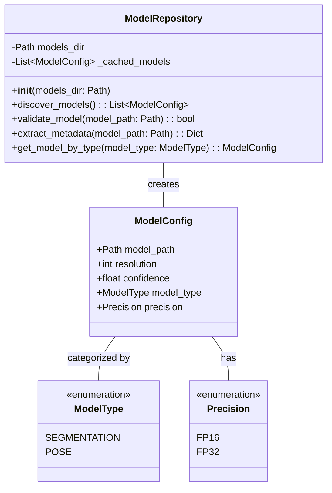
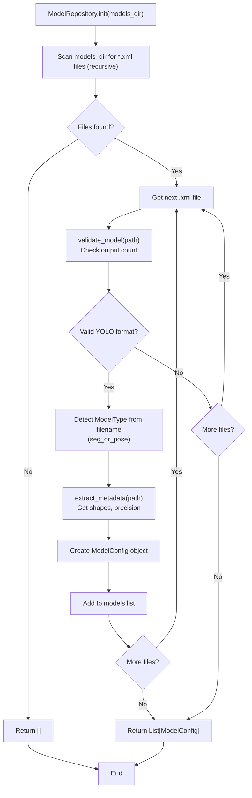
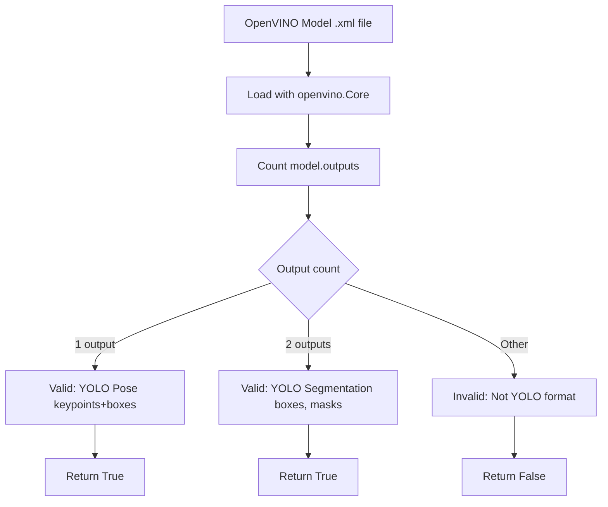
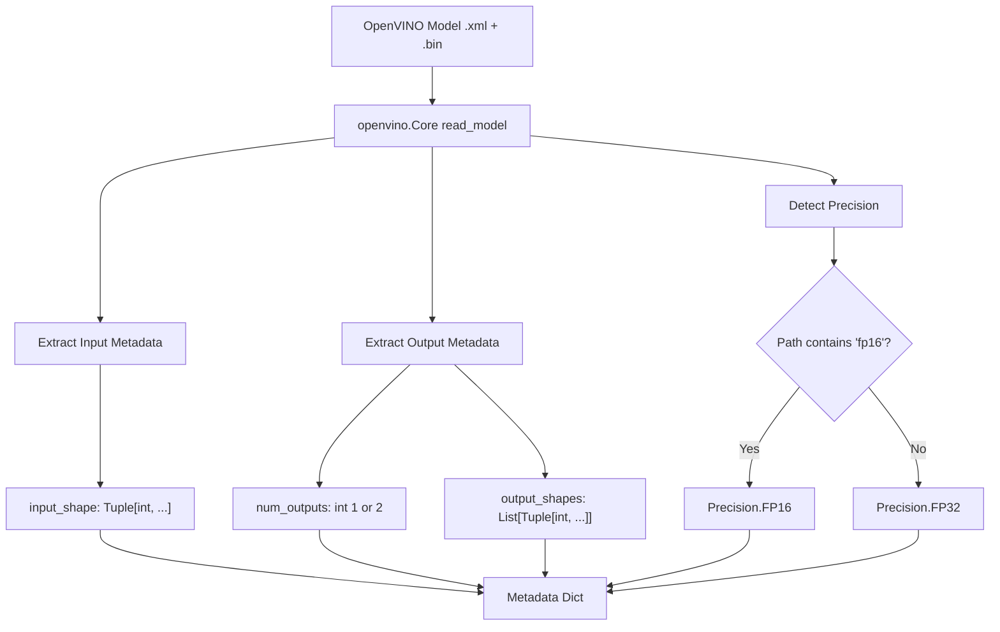
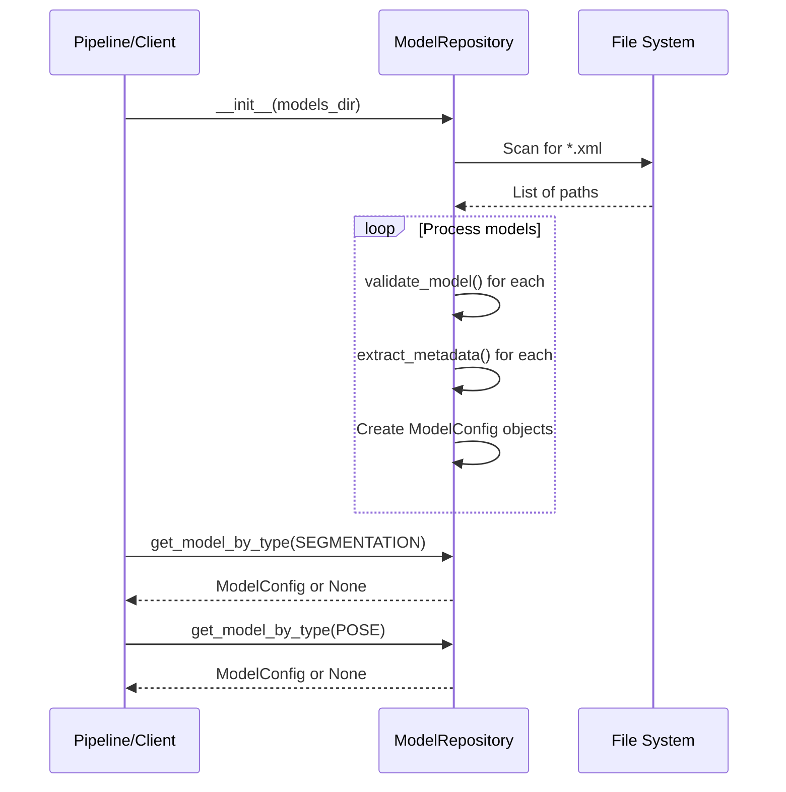
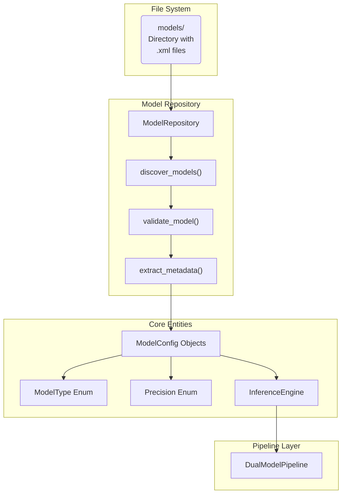

# Model Repository

Relevant source files

- [](https://github.com/e7canasta/bakery-luna/blob/8081344f/bakery/tests/test_model_repository.py)

The Model Repository is the component responsible for discovering, validating, and extracting metadata from OpenVINO model files. It serves as the entry point for model management in the bakery-luna system, scanning directories for `.xml` model files, validating their format against YOLO specifications, and producing `ModelConfig` objects that are consumed by the inference pipeline.

For information about the actual inference execution, see [Adapters Layer](https://deepwiki.com/e7canasta/bakery-luna/3.4-adapters-layer). For details on model format requirements and YOLO specifications, see [Model Format Requirements](https://deepwiki.com/e7canasta/bakery-luna/6.2-model-format-requirements).

## Overview

The `ModelRepository` class provides a clean abstraction over OpenVINO model discovery and validation. It automatically scans a specified directory for model files, validates them against expected YOLO formats (segmentation and pose estimation), extracts metadata such as input/output shapes and precision, and returns configuration objects ready for use by the inference engine.

**Sources:** [bakery/tests/test_model_repository.py1-458](https://github.com/e7canasta/bakery-luna/blob/8081344f/bakery/tests/test_model_repository.py#L1-L458)

### Class Structure



**Diagram: ModelRepository Class Structure and Relationships**

**Sources:** [bakery/tests/test_model_repository.py20-21](https://github.com/e7canasta/bakery-luna/blob/8081344f/bakery/tests/test_model_repository.py#L20-L21) [bakery/tests/test_model_repository.py285-324](https://github.com/e7canasta/bakery-luna/blob/8081344f/bakery/tests/test_model_repository.py#L285-L324)

## Model Discovery Process

The `discover_models()` method performs recursive directory scanning to locate all `.xml` files representing OpenVINO models. The discovery process includes validation and type detection based on filename patterns.

### Discovery Algorithm

|Step|Operation|Implementation Detail|
|---|---|---|
|1. Scan Directory|Recursively find all `.xml` files|Uses `Path.rglob("*.xml")`|
|2. Validate Format|Check YOLO output count|Segmentation: 2 outputs, Pose: 1 output|
|3. Detect Type|Parse filename for model type|Patterns: `seg_`, `-seg`, `pose_`, `-pose`|
|4. Extract Metadata|Read OpenVINO model structure|Input/output shapes, precision|
|5. Create Config|Build `ModelConfig` objects|Returns list of valid models|

**Sources:** [bakery/tests/test_model_repository.py30-54](https://github.com/e7canasta/bakery-luna/blob/8081344f/bakery/tests/test_model_repository.py#L30-L54) [bakery/tests/test_model_repository.py98-124](https://github.com/e7canasta/bakery-luna/blob/8081344f/bakery/tests/test_model_repository.py#L98-L124)

### Discovery Flow Diagram



**Diagram: Model Discovery and Validation Flow**

**Sources:** [bakery/tests/test_model_repository.py30-54](https://github.com/e7canasta/bakery-luna/blob/8081344f/bakery/tests/test_model_repository.py#L30-L54) [bakery/tests/test_model_repository.py55-78](https://github.com/e7canasta/bakery-luna/blob/8081344f/bakery/tests/test_model_repository.py#L55-L78)

### Recursive Discovery

The repository scans subdirectories recursively, allowing models to be organized in hierarchical structures such as by precision level or lens type:

```
models/
├── lens1/
│   └── fp16/
│       └── yolo-seg_model.xml
└── lens2/
    └── fp32/
        └── yolo-pose_model.xml
```

All models are discovered regardless of directory depth.

**Sources:** [bakery/tests/test_model_repository.py98-124](https://github.com/e7canasta/bakery-luna/blob/8081344f/bakery/tests/test_model_repository.py#L98-L124)

## Model Validation

The `validate_model(model_path: Path) -> bool` method ensures that discovered models conform to the expected YOLO format. Validation is critical for preventing runtime errors during inference.

### Validation Rules



**Diagram: Model Validation Decision Tree**

**Sources:** [bakery/tests/test_model_repository.py132-169](https://github.com/e7canasta/bakery-luna/blob/8081344f/bakery/tests/test_model_repository.py#L132-L169)

### Validation Test Cases

|Scenario|Model Structure|Expected Result|
|---|---|---|
|Segmentation Model|2 outputs (boxes, masks)|`True`|
|Pose Model|1 output (keypoints + boxes)|`True`|
|Invalid Model|3+ outputs|`False`|
|Non-XML File|`.txt` or other extension|`False`|

**Sources:** [bakery/tests/test_model_repository.py170-208](https://github.com/e7canasta/bakery-luna/blob/8081344f/bakery/tests/test_model_repository.py#L170-L208)

### YOLO Format Specifications

The validation logic specifically checks for YOLO v8 format models:

- **Segmentation Models**: Must have exactly 2 outputs
    
    - Output 0: Detection boxes with shape `[1, 84, N]` where N depends on input resolution
    - Output 1: Segmentation masks with shape `[1, 32, H, W]`
- **Pose Models**: Must have exactly 1 output
    
    - Output 0: Combined detection boxes and keypoints with shape `[1, 56, N]`

Any model with a different output count is rejected as invalid.

**Sources:** [bakery/tests/test_model_repository.py126-208](https://github.com/e7canasta/bakery-luna/blob/8081344f/bakery/tests/test_model_repository.py#L126-L208)

## Metadata Extraction

The `extract_metadata(model_path: Path) -> Dict` method reads the OpenVINO model structure and extracts critical information needed for inference configuration.

### Extracted Metadata Fields



**Diagram: Metadata Extraction Process**

**Sources:** [bakery/tests/test_model_repository.py216-277](https://github.com/e7canasta/bakery-luna/blob/8081344f/bakery/tests/test_model_repository.py#L216-L277)

### Metadata Dictionary Structure

```
{
    "input_shape": (1, 3, 640, 640),      # NCHW format
    "num_outputs": 2,                      # 1 for pose, 2 for segmentation
    "output_shapes": [
        (1, 84, 1792),                     # boxes
        (1, 32, 80, 80)                    # masks (segmentation only)
    ],
    "precision": Precision.FP16            # Detected from path
}
```

**Sources:** [bakery/tests/test_model_repository.py216-277](https://github.com/e7canasta/bakery-luna/blob/8081344f/bakery/tests/test_model_repository.py#L216-L277)

### Precision Detection

Precision is inferred from the model path rather than read from the model itself:

- Path contains `"fp16"` → `Precision.FP16`
- Otherwise → `Precision.FP32` (default)

This allows for consistent precision labeling based on the directory structure where models are stored.

**Sources:** [bakery/tests/test_model_repository.py258-277](https://github.com/e7canasta/bakery-luna/blob/8081344f/bakery/tests/test_model_repository.py#L258-L277)

## Model Retrieval by Type

The `get_model_by_type(model_type: ModelType) -> Optional[ModelConfig]` method provides convenient access to discovered models by their type.

### Retrieval Behavior

|Input|Models Available|Return Value|
|---|---|---|
|`ModelType.SEGMENTATION`|Segmentation + Pose|First segmentation `ModelConfig`|
|`ModelType.POSE`|Segmentation + Pose|First pose `ModelConfig`|
|`ModelType.SEGMENTATION`|Only Pose|`None`|
|`ModelType.POSE`|Only Segmentation|`None`|

**Sources:** [bakery/tests/test_model_repository.py285-324](https://github.com/e7canasta/bakery-luna/blob/8081344f/bakery/tests/test_model_repository.py#L285-L324)

### Usage Example Flow



**Diagram: Typical ModelRepository Usage Sequence**

**Sources:** [bakery/tests/test_model_repository.py285-324](https://github.com/e7canasta/bakery-luna/blob/8081344f/bakery/tests/test_model_repository.py#L285-L324)

### Return Values

- **Found**: Returns the first `ModelConfig` matching the requested type
- **Not Found**: Returns `None` if no models of that type exist
- **Multiple Matches**: Always returns the first match; does not raise errors

**Sources:** [bakery/tests/test_model_repository.py306-324](https://github.com/e7canasta/bakery-luna/blob/8081344f/bakery/tests/test_model_repository.py#L306-L324)

## Integration with the System

The `ModelRepository` serves as the bridge between the file system and the inference pipeline, converting raw `.xml` files into structured `ModelConfig` objects.



**Diagram: ModelRepository Integration in System Architecture**

**Sources:** [bakery/tests/test_model_repository.py1-458](https://github.com/e7canasta/bakery-luna/blob/8081344f/bakery/tests/test_model_repository.py#L1-L458)

## Error Handling

The `ModelRepository` uses validation to filter invalid models rather than raising exceptions. This design allows the system to continue operating even if some models in the directory are malformed.

### Error Scenarios

|Error Condition|Handling Strategy|Result|
|---|---|---|
|Invalid model format|Skip during discovery|Excluded from results|
|Empty directory|Return empty list|No errors raised|
|Non-XML file|Validation returns `False`|Ignored|
|Model type not found|`get_model_by_type()` returns `None`|Caller handles gracefully|
|Missing .bin file|OpenVINO load fails|Validation returns `False`|

**Sources:** [bakery/tests/test_model_repository.py55-96](https://github.com/e7canasta/bakery-luna/blob/8081344f/bakery/tests/test_model_repository.py#L55-L96) [bakery/tests/test_model_repository.py189-208](https://github.com/e7canasta/bakery-luna/blob/8081344f/bakery/tests/test_model_repository.py#L189-L208)

## Testing

The `ModelRepository` has comprehensive test coverage using BDD-style scenarios organized into feature groups:

### Test Coverage

|Feature|Test Class|Scenarios Covered|
|---|---|---|
|Model Discovery|`TestModelDiscoveryBehavior`|All models found, filtering invalid, empty directory, recursive discovery|
|Model Validation|`TestModelValidationBehavior`|Segmentation validation, pose validation, rejection of invalid models, non-XML rejection|
|Metadata Extraction|`TestMetadataExtractionBehavior`|Input shape extraction, output shapes, FP16 precision detection|
|Get Model by Type|`TestGetModelByTypeBehavior`|Finding by type, returning None when not found|

**Sources:** [bakery/tests/test_model_repository.py24-324](https://github.com/e7canasta/bakery-luna/blob/8081344f/bakery/tests/test_model_repository.py#L24-L324)

### Mock Model Creation

Tests use helper functions to create synthetic OpenVINO models with the expected YOLO format structure:

- `_create_mock_segmentation_model()`: Creates a 2-output model [bakery/tests/test_model_repository.py327-368](https://github.com/e7canasta/bakery-luna/blob/8081344f/bakery/tests/test_model_repository.py#L327-L368)
- `_create_mock_pose_model()`: Creates a 1-output model [bakery/tests/test_model_repository.py370-401](https://github.com/e7canasta/bakery-luna/blob/8081344f/bakery/tests/test_model_repository.py#L370-L401)
- `_create_mock_invalid_model()`: Creates a 3-output model for negative testing [bakery/tests/test_model_repository.py403-443](https://github.com/e7canasta/bakery-luna/blob/8081344f/bakery/tests/test_model_repository.py#L403-L443)

These mocks use OpenVINO's `opset10` operations to construct valid model graphs that can be serialized and loaded.

**Sources:** [bakery/tests/test_model_repository.py326-458](https://github.com/e7canasta/bakery-luna/blob/8081344f/bakery/tests/test_model_repository.py#L326-L458)


### On this page

- [Model Repository](https://deepwiki.com/e7canasta/bakery-luna/6.1-model-repository#model-repository)
- [Overview](https://deepwiki.com/e7canasta/bakery-luna/6.1-model-repository#overview)
- [Class Structure](https://deepwiki.com/e7canasta/bakery-luna/6.1-model-repository#class-structure)
- [Model Discovery Process](https://deepwiki.com/e7canasta/bakery-luna/6.1-model-repository#model-discovery-process)
- [Discovery Algorithm](https://deepwiki.com/e7canasta/bakery-luna/6.1-model-repository#discovery-algorithm)
- [Discovery Flow Diagram](https://deepwiki.com/e7canasta/bakery-luna/6.1-model-repository#discovery-flow-diagram)
- [Recursive Discovery](https://deepwiki.com/e7canasta/bakery-luna/6.1-model-repository#recursive-discovery)
- [Model Validation](https://deepwiki.com/e7canasta/bakery-luna/6.1-model-repository#model-validation)
- [Validation Rules](https://deepwiki.com/e7canasta/bakery-luna/6.1-model-repository#validation-rules)
- [Validation Test Cases](https://deepwiki.com/e7canasta/bakery-luna/6.1-model-repository#validation-test-cases)
- [YOLO Format Specifications](https://deepwiki.com/e7canasta/bakery-luna/6.1-model-repository#yolo-format-specifications)
- [Metadata Extraction](https://deepwiki.com/e7canasta/bakery-luna/6.1-model-repository#metadata-extraction)
- [Extracted Metadata Fields](https://deepwiki.com/e7canasta/bakery-luna/6.1-model-repository#extracted-metadata-fields)
- [Metadata Dictionary Structure](https://deepwiki.com/e7canasta/bakery-luna/6.1-model-repository#metadata-dictionary-structure)
- [Precision Detection](https://deepwiki.com/e7canasta/bakery-luna/6.1-model-repository#precision-detection)
- [Model Retrieval by Type](https://deepwiki.com/e7canasta/bakery-luna/6.1-model-repository#model-retrieval-by-type)
- [Retrieval Behavior](https://deepwiki.com/e7canasta/bakery-luna/6.1-model-repository#retrieval-behavior)
- [Usage Example Flow](https://deepwiki.com/e7canasta/bakery-luna/6.1-model-repository#usage-example-flow)
- [Return Values](https://deepwiki.com/e7canasta/bakery-luna/6.1-model-repository#return-values)
- [Integration with the System](https://deepwiki.com/e7canasta/bakery-luna/6.1-model-repository#integration-with-the-system)
- [Error Handling](https://deepwiki.com/e7canasta/bakery-luna/6.1-model-repository#error-handling)
- [Error Scenarios](https://deepwiki.com/e7canasta/bakery-luna/6.1-model-repository#error-scenarios)
- [Testing](https://deepwiki.com/e7canasta/bakery-luna/6.1-model-repository#testing)
- [Test Coverage](https://deepwiki.com/e7canasta/bakery-luna/6.1-model-repository#test-coverage)
- [Mock Model Creation](https://deepwiki.com/e7canasta/bakery-luna/6.1-model-repository#mock-model-creation)
