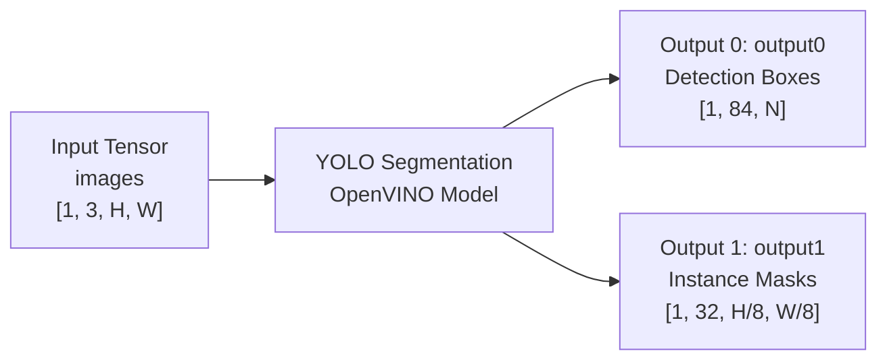
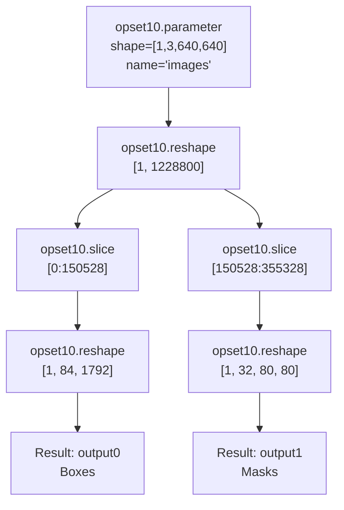
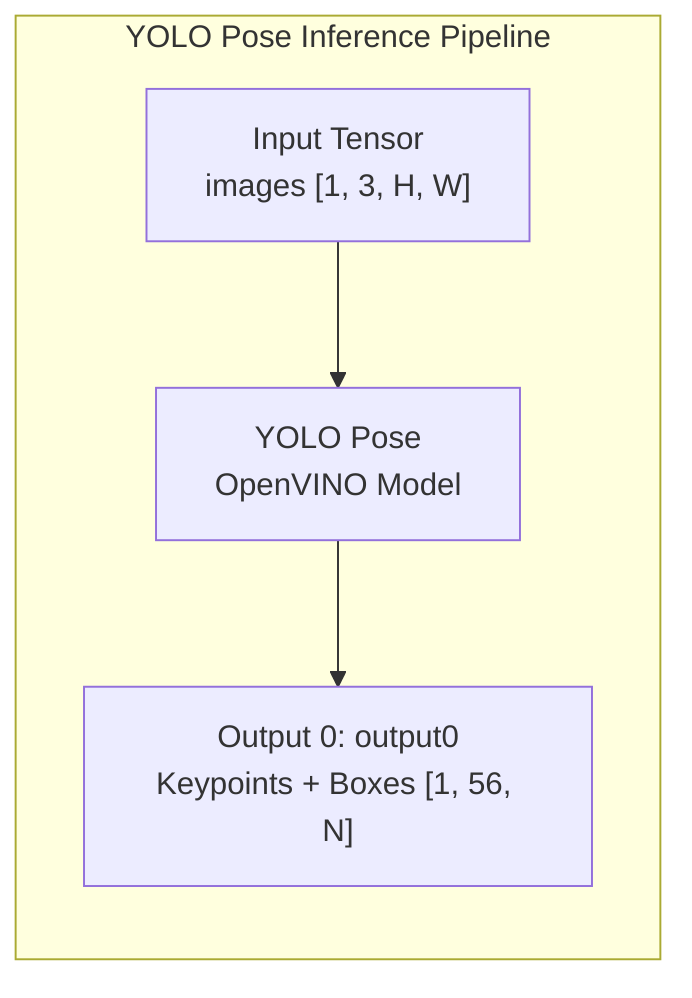
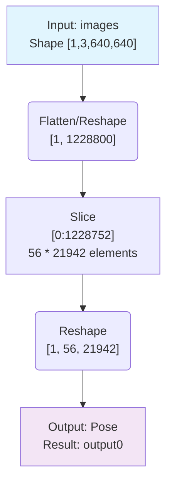
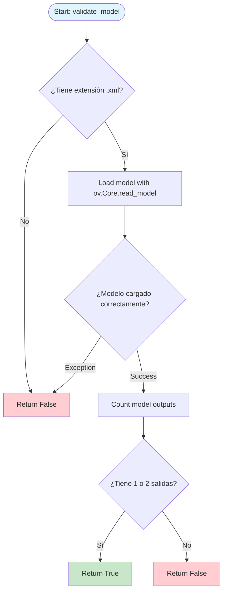
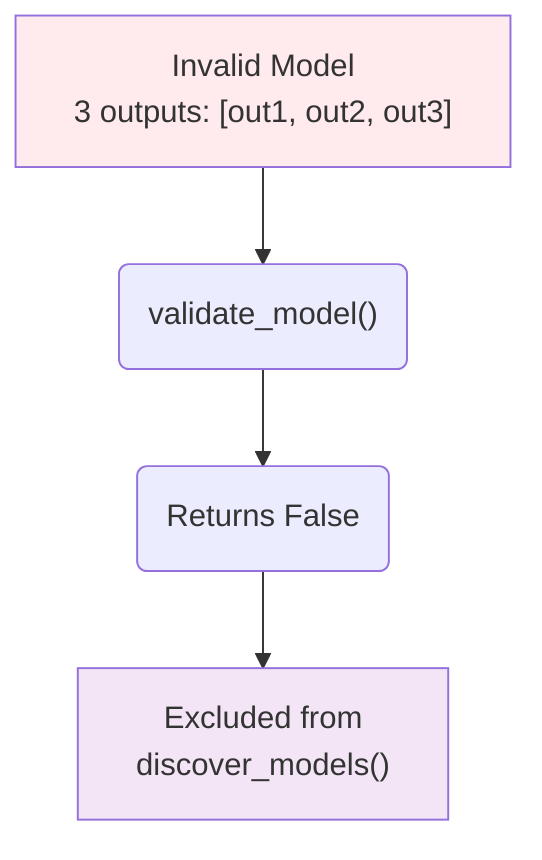
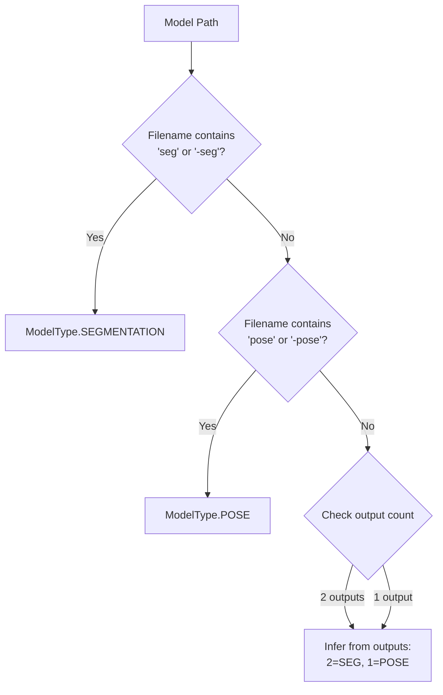
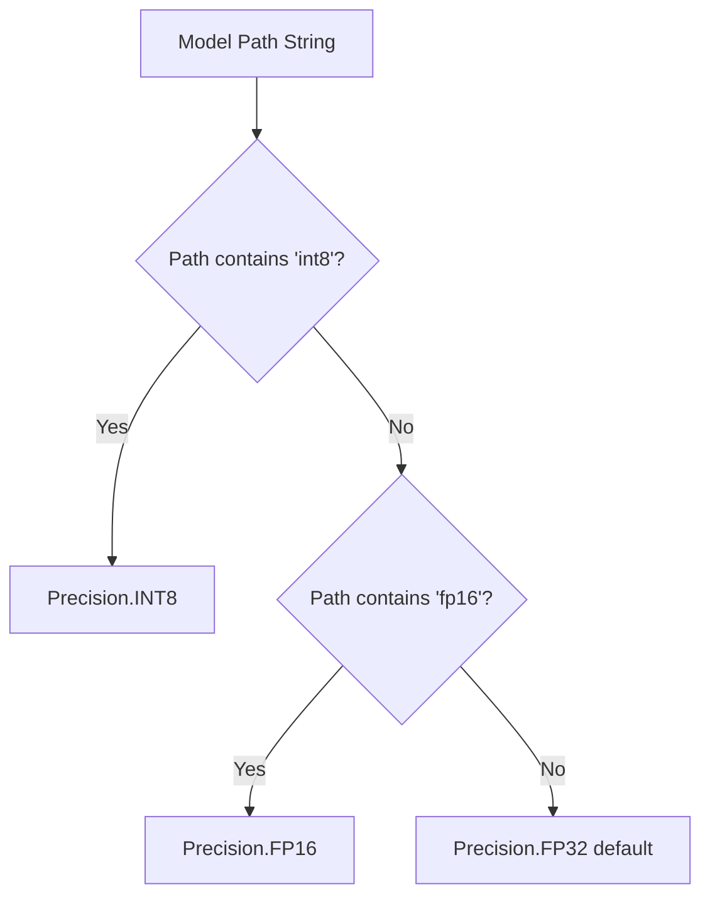
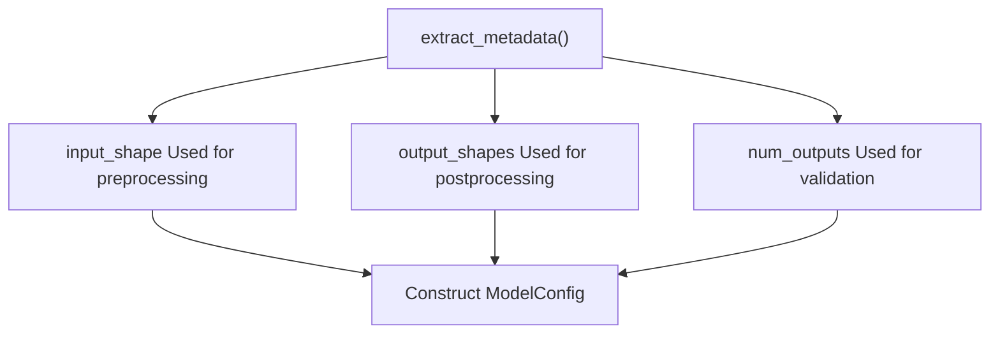

# Model Format Requirements

Relevant source files

- [](https://github.com/e7canasta/bakery-luna/blob/8081344f/bakery/tests/test_model_repository.py)

This document specifies the expected format for OpenVINO models used in the bakery-luna system. It covers YOLO segmentation and pose estimation model structures, validation rules, and metadata extraction requirements. For information about discovering and loading these models, see [Model Repository](https://deepwiki.com/e7canasta/bakery-luna/6.1-model-repository). For details on how models are used during inference, see [Adapters Layer](https://deepwiki.com/e7canasta/bakery-luna/3.4-adapters-layer).

---

## Overview

The bakery-luna system requires models in **OpenVINO Intermediate Representation (IR)** format, consisting of `.xml` and `.bin` file pairs. Models must conform to the **YOLO architecture** with specific output structure constraints:

|Model Type|Expected Outputs|Purpose|
|---|---|---|
|Segmentation|2 outputs|Bounding boxes + instance masks|
|Pose|1 output|Keypoints + bounding boxes (combined)|

Models are validated during discovery by the `ModelRepository` class, which checks output count and extracts metadata. Invalid models (e.g., 3 outputs) are automatically filtered out.

**Sources:** [bakery/tests/test_model_repository.py1-21](https://github.com/e7canasta/bakery-luna/blob/8081344f/bakery/tests/test_model_repository.py#L1-L21)

---

## YOLO Segmentation Model Format

### Output Structure

YOLO segmentation models must produce **exactly 2 outputs**:



**Diagram:** YOLO Segmentation Model Output Topology

### Output Specifications

|Output|Friendly Name|Shape Format|Contents|
|---|---|---|---|
|0|`output0`|`[batch, 84, num_anchors]`|Detection boxes: 4 coords + confidence + 80 class scores|
|1|`output1`|`[batch, 32, mask_h, mask_w]`|Mask prototypes for instance segmentation|

**Typical Shapes:**

- Input: `[1, 3, 640, 640]`
- Output 0: `[1, 84, 1792]` (1792 anchor points for 640×640 input)
- Output 1: `[1, 32, 80, 80]` (mask grid at 1/8 resolution)

### Example Model Creation

The test suite creates mock segmentation models with this structure:



**Diagram:** Mock Segmentation Model Graph Structure (Test Implementation)

**Sources:** [bakery/tests/test_model_repository.py327-367](https://github.com/e7canasta/bakery-luna/blob/8081344f/bakery/tests/test_model_repository.py#L327-L367)

---

## YOLO Pose Model Format

### Output Structure

YOLO pose models must produce **exactly 1 output** containing both keypoints and bounding boxes:





**Diagram:** YOLO Pose Model Output Topology

### Output Specifications

|Output|Friendly Name|Shape Format|Contents|
|---|---|---|---|
|0|`output0`|`[batch, 56, num_anchors]`|Combined: 4 bbox coords + 1 confidence + 51 keypoint values (17 × 3)|

**Shape Breakdown (56 channels):**

- Channels 0-3: Bounding box `[x, y, w, h]`
- Channel 4: Object confidence
- Channels 5-55: 17 keypoints × 3 values `[x, y, visibility]`

**Typical Shapes:**

- Input: `[1, 3, 640, 640]`
- Output: `[1, 56, 21942]` (21942 anchor points for 640×640 input)

### Example Model Creation



**Diagram:** Mock Pose Model Graph Structure (Test Implementation)

**Sources:** [bakery/tests/test_model_repository.py370-400](https://github.com/e7canasta/bakery-luna/blob/8081344f/bakery/tests/test_model_repository.py#L370-L400)

---

## OpenVINO Model File Structure

### Required Files

Each model requires two files in the same directory:

|File Extension|Purpose|Format|
|---|---|---|
|`.xml`|Model topology|XML description of network graph|
|`.bin`|Model weights|Binary blob of trained parameters|

**File Naming:** The `.xml` file is the primary reference. The `.bin` file must have the same base name.

### XML Structure Requirements

The OpenVINO XML must define:

1. **Input Layer:**
    
    - Name: `images` (standard convention)
    - Shape: `[batch, channels, height, width]`
    - Dtype: `float32`
2. **Output Layers:**
    
    - Segmentation: 2 result nodes (`output0`, `output1`)
    - Pose: 1 result node (`output0`)
3. **Friendly Names:**
    
    - Output nodes must have `friendly_name` attributes
    - Used for output tensor identification

### Model Serialization

Models are created using OpenVINO's Python API and serialized:

```
# Segmentation model example
model = ov.Model([output_boxes, output_masks], [input_layer], "segmentation_model")
ov.serialize(model, str(xml_path))
```

The `ov.serialize()` function generates both `.xml` and `.bin` files automatically.

**Sources:** [bakery/tests/test_model_repository.py362-366](https://github.com/e7canasta/bakery-luna/blob/8081344f/bakery/tests/test_model_repository.py#L362-L366)

---

## Model Validation Rules

### Validation Process



**Diagram:** Model Validation Decision Flow

### Validation Criteria

|Criterion|Requirement|Test Case|
|---|---|---|
|File Extension|Must be `.xml`|[bakery/tests/test_model_repository.py189-207](https://github.com/e7canasta/bakery-luna/blob/8081344f/bakery/tests/test_model_repository.py#L189-L207)|
|Load Success|Must load without exceptions|[bakery/tests/test_model_repository.py132-149](https://github.com/e7canasta/bakery-luna/blob/8081344f/bakery/tests/test_model_repository.py#L132-L149)|
|Output Count|Must be 1 or 2|[bakery/tests/test_model_repository.py170-187](https://github.com/e7canasta/bakery-luna/blob/8081344f/bakery/tests/test_model_repository.py#L170-L187)|
|Segmentation|Exactly 2 outputs|[bakery/tests/test_model_repository.py132-149](https://github.com/e7canasta/bakery-luna/blob/8081344f/bakery/tests/test_model_repository.py#L132-L149)|
|Pose|Exactly 1 output|[bakery/tests/test_model_repository.py151-168](https://github.com/e7canasta/bakery-luna/blob/8081344f/bakery/tests/test_model_repository.py#L151-L168)|

**Invalid Models:**

Models with 3 or more outputs are rejected:



**Diagram:** Invalid Model Filtering

**Sources:** [bakery/tests/test_model_repository.py126-187](https://github.com/e7canasta/bakery-luna/blob/8081344f/bakery/tests/test_model_repository.py#L126-L187) [bakery/tests/test_model_repository.py403-442](https://github.com/e7canasta/bakery-luna/blob/8081344f/bakery/tests/test_model_repository.py#L403-L442)

---

## Model Type Detection

### Detection Strategy

Model type is inferred from the filename or path using pattern matching:



**Diagram:** Model Type Detection Logic

### Naming Conventions

|Pattern|Detected Type|Example Filenames|
|---|---|---|
|Contains `seg` or `-seg`|`SEGMENTATION`|`yolo-seg_model.xml`, `model_seg.xml`|
|Contains `pose` or `-pose`|`POSE`|`yolo-pose_model.xml`, `model_pose.xml`|
|Neither|Inferred from outputs|Falls back to output count check|

**Important:** The test suite explicitly requires pattern matching for subdirectory discovery to work correctly:

> "Note: filenames must match detection patterns (seg_ or -seg for segmentation, pose_ or -pose for pose) otherwise the model type detection fails"

**Sources:** [bakery/tests/test_model_repository.py98-124](https://github.com/e7canasta/bakery-luna/blob/8081344f/bakery/tests/test_model_repository.py#L98-L124)

---

## Precision Detection

### Detection Method

Model precision is determined by examining the model path:




**Diagram:** Precision Detection from Path

### Precision Markers

|Path Contains|Detected Precision|Example|
|---|---|---|
|`fp16` or `FP16`|`Precision.FP16`|`models_fp16/model.xml`, `model_fp16.xml`|
|Neither|`Precision.FP32`|`models/model.xml`|

**Typical Directory Structure:**

```
models/
├── lens1/
│   ├── fp16/
│   │   ├── yolo-seg_model.xml
│   │   └── yolo-seg_model.bin
│   └── fp32/
│       ├── yolo-seg_model.xml
│       └── yolo-seg_model.bin
└── lens2/
    └── fp16/
        ├── yolo-pose_model.xml
        └── yolo-pose_model.bin
```

**Sources:** [bakery/tests/test_model_repository.py258-277](https://github.com/e7canasta/bakery-luna/blob/8081344f/bakery/tests/test_model_repository.py#L258-L277)

---

## Metadata Extraction

### Extracted Metadata

The `ModelRepository.extract_metadata()` method extracts the following information:

|Metadata Field|Type|Example Value|Source|
|---|---|---|---|
|`input_shape`|`tuple[int, ...]`|`(1, 3, 640, 640)`|`model.inputs[0].shape`|
|`output_shapes`|`list[tuple[int, ...]]`|`[(1, 84, 1792), (1, 32, 80, 80)]`|`[out.shape for out in model.outputs]`|
|`num_outputs`|`int`|`2`|`len(model.outputs)`|
|`precision`|`Precision`|`Precision.FP16`|From path string|
|`model_type`|`ModelType`|`ModelType.SEGMENTATION`|From outputs or filename|

### Metadata Usage



**Diagram:** Metadata Extraction and Usage

### Example Metadata

For a typical segmentation model:

```
{
    "input_shape": (1, 3, 640, 640),
    "num_outputs": 2,
    "output_shapes": [
        (1, 84, 1792),    # Boxes
        (1, 32, 80, 80)   # Masks
    ]
}
```

**Sources:** [bakery/tests/test_model_repository.py210-277](https://github.com/e7canasta/bakery-luna/blob/8081344f/bakery/tests/test_model_repository.py#L210-L277)

---

## Validation Test Cases

### Test Coverage Matrix

|Feature|Test Scenario|Expected Result|Test Reference|
|---|---|---|---|
|Discovery|All `.xml` models found|Returns all valid models|[bakery/tests/test_model_repository.py30-53](https://github.com/e7canasta/bakery-luna/blob/8081344f/bakery/tests/test_model_repository.py#L30-L53)|
|Discovery|Invalid models excluded|Filters out 3-output models|[bakery/tests/test_model_repository.py55-78](https://github.com/e7canasta/bakery-luna/blob/8081344f/bakery/tests/test_model_repository.py#L55-L78)|
|Discovery|Empty directory|Returns empty list|[bakery/tests/test_model_repository.py80-96](https://github.com/e7canasta/bakery-luna/blob/8081344f/bakery/tests/test_model_repository.py#L80-L96)|
|Discovery|Recursive search|Finds models in subdirectories|[bakery/tests/test_model_repository.py98-124](https://github.com/e7canasta/bakery-luna/blob/8081344f/bakery/tests/test_model_repository.py#L98-L124)|
|Validation|Segmentation (2 outputs)|Returns `True`|[bakery/tests/test_model_repository.py132-149](https://github.com/e7canasta/bakery-luna/blob/8081344f/bakery/tests/test_model_repository.py#L132-L149)|
|Validation|Pose (1 output)|Returns `True`|[bakery/tests/test_model_repository.py151-168](https://github.com/e7canasta/bakery-luna/blob/8081344f/bakery/tests/test_model_repository.py#L151-L168)|
|Validation|Invalid (3 outputs)|Returns `False`|[bakery/tests/test_model_repository.py170-187](https://github.com/e7canasta/bakery-luna/blob/8081344f/bakery/tests/test_model_repository.py#L170-L187)|
|Validation|Non-XML file|Returns `False`|[bakery/tests/test_model_repository.py189-207](https://github.com/e7canasta/bakery-luna/blob/8081344f/bakery/tests/test_model_repository.py#L189-L207)|
|Metadata|Input shape extraction|Correct tuple returned|[bakery/tests/test_model_repository.py216-236](https://github.com/e7canasta/bakery-luna/blob/8081344f/bakery/tests/test_model_repository.py#L216-L236)|
|Metadata|Output shapes extraction|List of tuples returned|[bakery/tests/test_model_repository.py238-257](https://github.com/e7canasta/bakery-luna/blob/8081344f/bakery/tests/test_model_repository.py#L238-L257)|
|Metadata|FP16 detection|`Precision.FP16` set|[bakery/tests/test_model_repository.py258-277](https://github.com/e7canasta/bakery-luna/blob/8081344f/bakery/tests/test_model_repository.py#L258-L277)|

### Mock Model Helpers

The test suite provides helper functions to create OpenVINO models programmatically:

|Helper Function|Purpose|Returns|
|---|---|---|
|`_create_mock_segmentation_model()`|Creates valid 2-output model|`Path` to `.xml`|
|`_create_mock_pose_model()`|Creates valid 1-output model|`Path` to `.xml`|
|`_create_mock_invalid_model()`|Creates invalid 3-output model|`Path` to `.xml`|

These functions use OpenVINO's `opset10` operations to construct model graphs and serialize them to disk for testing.

**Sources:** [bakery/tests/test_model_repository.py326-442](https://github.com/e7canasta/bakery-luna/blob/8081344f/bakery/tests/test_model_repository.py#L326-L442)

---

## Summary

### Key Requirements Checklist

- [ ]  Model files: `.xml` + `.bin` pair with matching base names
- [ ]  Input layer: Named `images`, shape `[1, 3, H, W]`, dtype `float32`
- [ ]  Segmentation models: Exactly 2 outputs (`output0`, `output1`)
- [ ]  Pose models: Exactly 1 output (`output0`)
- [ ]  Output shapes: Must be valid 3D tensors `[batch, channels, spatial]`
- [ ]  Filename convention: Contains `seg`/`-seg` or `pose`/`-pose` for type detection
- [ ]  Precision marker: Include `fp16` in path for FP16 models
- [ ]  YOLO format: Compatible with Ultralytics YOLO export structure

### Common Validation Failures

|Issue|Symptom|Solution|
|---|---|---|
|Wrong output count|Model filtered during discovery|Export with correct YOLO format (1 or 2 outputs)|
|Missing `.bin` file|Load failure|Ensure both `.xml` and `.bin` exist|
|Wrong input name|Inference error|Rename input layer to `images`|
|Type not detected|Wrong `ModelType` assigned|Add `seg` or `pose` to filename|
|Precision not detected|Defaults to FP32|Add `fp16` to directory or filename|

For runtime usage of validated models, see [Model Repository](https://deepwiki.com/e7canasta/bakery-luna/6.1-model-repository) for discovery APIs and [Adapters Layer](https://deepwiki.com/e7canasta/bakery-luna/3.4-adapters-layer) for inference integration.

**Sources:** [bakery/tests/test_model_repository.py1-458](https://github.com/e7canasta/bakery-luna/blob/8081344f/bakery/tests/test_model_repository.py#L1-L458)

Dismiss

Refresh this wiki

This wiki was recently refreshed. Please wait 8 days to refresh again.

### On this page

- [Model Format Requirements](https://deepwiki.com/e7canasta/bakery-luna/6.2-model-format-requirements#model-format-requirements)
- [Overview](https://deepwiki.com/e7canasta/bakery-luna/6.2-model-format-requirements#overview)
- [YOLO Segmentation Model Format](https://deepwiki.com/e7canasta/bakery-luna/6.2-model-format-requirements#yolo-segmentation-model-format)
- [Output Structure](https://deepwiki.com/e7canasta/bakery-luna/6.2-model-format-requirements#output-structure)
- [Output Specifications](https://deepwiki.com/e7canasta/bakery-luna/6.2-model-format-requirements#output-specifications)
- [Example Model Creation](https://deepwiki.com/e7canasta/bakery-luna/6.2-model-format-requirements#example-model-creation)
- [YOLO Pose Model Format](https://deepwiki.com/e7canasta/bakery-luna/6.2-model-format-requirements#yolo-pose-model-format)
- [Output Structure](https://deepwiki.com/e7canasta/bakery-luna/6.2-model-format-requirements#output-structure-1)
- [Output Specifications](https://deepwiki.com/e7canasta/bakery-luna/6.2-model-format-requirements#output-specifications-1)
- [Example Model Creation](https://deepwiki.com/e7canasta/bakery-luna/6.2-model-format-requirements#example-model-creation-1)
- [OpenVINO Model File Structure](https://deepwiki.com/e7canasta/bakery-luna/6.2-model-format-requirements#openvino-model-file-structure)
- [Required Files](https://deepwiki.com/e7canasta/bakery-luna/6.2-model-format-requirements#required-files)
- [XML Structure Requirements](https://deepwiki.com/e7canasta/bakery-luna/6.2-model-format-requirements#xml-structure-requirements)
- [Model Serialization](https://deepwiki.com/e7canasta/bakery-luna/6.2-model-format-requirements#model-serialization)
- [Model Validation Rules](https://deepwiki.com/e7canasta/bakery-luna/6.2-model-format-requirements#model-validation-rules)
- [Validation Process](https://deepwiki.com/e7canasta/bakery-luna/6.2-model-format-requirements#validation-process)
- [Validation Criteria](https://deepwiki.com/e7canasta/bakery-luna/6.2-model-format-requirements#validation-criteria)
- [Model Type Detection](https://deepwiki.com/e7canasta/bakery-luna/6.2-model-format-requirements#model-type-detection)
- [Detection Strategy](https://deepwiki.com/e7canasta/bakery-luna/6.2-model-format-requirements#detection-strategy)
- [Naming Conventions](https://deepwiki.com/e7canasta/bakery-luna/6.2-model-format-requirements#naming-conventions)
- [Precision Detection](https://deepwiki.com/e7canasta/bakery-luna/6.2-model-format-requirements#precision-detection)
- [Detection Method](https://deepwiki.com/e7canasta/bakery-luna/6.2-model-format-requirements#detection-method)
- [Precision Markers](https://deepwiki.com/e7canasta/bakery-luna/6.2-model-format-requirements#precision-markers)
- [Metadata Extraction](https://deepwiki.com/e7canasta/bakery-luna/6.2-model-format-requirements#metadata-extraction)
- [Extracted Metadata](https://deepwiki.com/e7canasta/bakery-luna/6.2-model-format-requirements#extracted-metadata)
- [Metadata Usage](https://deepwiki.com/e7canasta/bakery-luna/6.2-model-format-requirements#metadata-usage)
- [Example Metadata](https://deepwiki.com/e7canasta/bakery-luna/6.2-model-format-requirements#example-metadata)
- [Validation Test Cases](https://deepwiki.com/e7canasta/bakery-luna/6.2-model-format-requirements#validation-test-cases)
- [Test Coverage Matrix](https://deepwiki.com/e7canasta/bakery-luna/6.2-model-format-requirements#test-coverage-matrix)
- [Mock Model Helpers](https://deepwiki.com/e7canasta/bakery-luna/6.2-model-format-requirements#mock-model-helpers)
- [Summary](https://deepwiki.com/e7canasta/bakery-luna/6.2-model-format-requirements#summary)
- [Key Requirements Checklist](https://deepwiki.com/e7canasta/bakery-luna/6.2-model-format-requirements#key-requirements-checklist)
- [Common Validation Failures](https://deepwiki.com/e7canasta/bakery-luna/6.2-model-format-requirements#common-validation-failures)

Ask Devin about e7canasta/bakery-luna

Fast

Model Format Requirements | e7canasta/bakery-luna | DeepWiki

Add to ContextPress Q