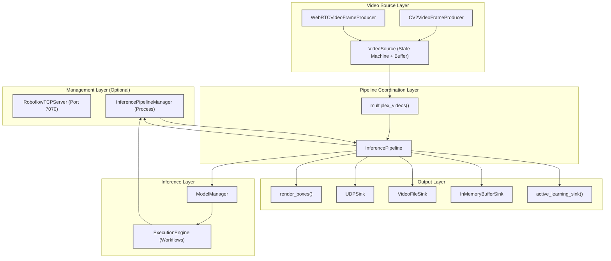
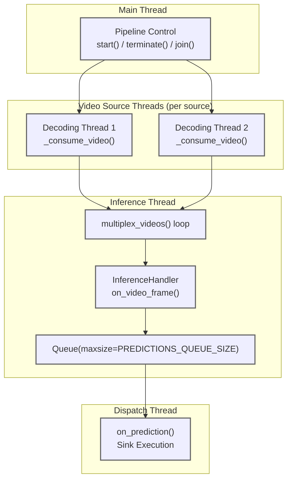
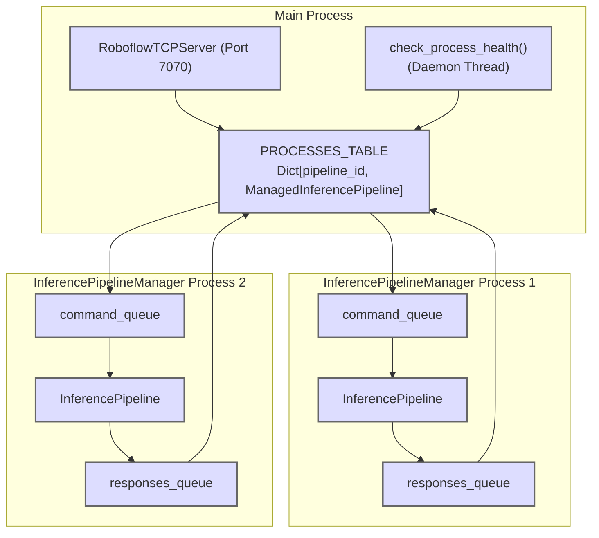
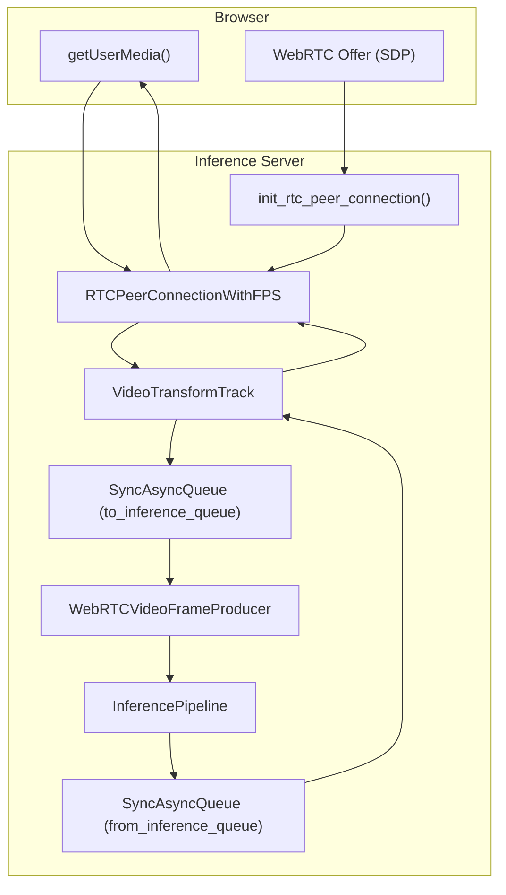

# Stream Processing


## Overview

The Stream Processing system provides real-time video inference capabilities through a pipeline architecture that handles video decoding, model inference, and result dispatching. The system is built around the `InferencePipeline` class and supports diverse video sources including files, RTSP streams, USB cameras, and WebRTC connections.

Key capabilities:

- **Single and Multi-Source Processing**: Process one or multiple video streams simultaneously with frame multiplexing
- **Flexible Buffer Management**: Configurable strategies for frame buffering and consumption optimized for files vs. streams
- **Real-Time and Batch Modes**: Support for low-latency stream processing and complete file processing
- **Modular Output Handling**: Extensible sink system for visualization, storage, network transmission, and Active Learning integration
- **Production Management**: Multi-process Stream Manager for handling multiple concurrent pipelines

This page provides an overview of the Stream Processing architecture. For detailed information on specific components, see:

- [InferencePipeline](https://deepwiki.com/roboflow/inference/4.1-inferencepipeline) - Core pipeline implementation and threading model
- [Video Sources and Buffer Management](https://deepwiki.com/roboflow/inference/4.2-video-sources-and-buffer-management) - VideoSource state machine and buffer strategies
- [Sinks and Output Handlers](https://deepwiki.com/roboflow/inference/4.3-sinks-and-output-handlers) - Result processing and output modes
- [Stream Manager Architecture](https://deepwiki.com/roboflow/inference/4.4-stream-manager-architecture) - Multi-process pipeline management
- [WebRTC Real-Time Processing](https://deepwiki.com/roboflow/inference/4.5-webrtc-real-time-processing) - Browser-based video streaming integration

## System Architecture

The Stream Processing system consists of three primary layers: video acquisition, inference coordination, and result dispatching.

### High-Level Component Diagram



Sources:

- [inference/core/interfaces/camera/video_source.py136-181](https://github.com/roboflow/inference/blob/77b91b3b/inference/core/interfaces/camera/video_source.py#L136-L181)
- [inference/core/interfaces/stream_manager/manager_app/webrtc.py286-330](https://github.com/roboflow/inference/blob/77b91b3b/inference/core/interfaces/stream_manager/manager_app/webrtc.py#L286-L330)
- [inference/core/interfaces/stream/inference_pipeline.py86-310](https://github.com/roboflow/inference/blob/77b91b3b/inference/core/interfaces/stream/inference_pipeline.py#L86-L310)
- [inference/core/interfaces/camera/utils.py239-317](https://github.com/roboflow/inference/blob/77b91b3b/inference/core/interfaces/camera/utils.py#L239-L317)
- [inference/core/interfaces/stream/model_handlers/workflows.py8-59](https://github.com/roboflow/inference/blob/77b91b3b/inference/core/interfaces/stream/model_handlers/workflows.py#L8-L59)
- [inference/core/interfaces/stream_manager/manager_app/app.py85-168](https://github.com/roboflow/inference/blob/77b91b3b/inference/core/interfaces/stream_manager/manager_app/app.py#L85-L168)

### Core Components

The system is organized around these key classes:

|Component|Module|Responsibility|
|---|---|---|
|`VideoSource`|[inference/core/interfaces/camera/video_source.py191-726](https://github.com/roboflow/inference/blob/77b91b3b/inference/core/interfaces/camera/video_source.py#L191-L726)|Video decoding, buffering, state management, reconnection|
|`InferencePipeline`|[inference/core/interfaces/stream/inference_pipeline.py86-794](https://github.com/roboflow/inference/blob/77b91b3b/inference/core/interfaces/stream/inference_pipeline.py#L86-L794)|Coordinates video sources, inference, and output dispatching|
|`multiplex_videos()`|[inference/core/interfaces/camera/utils.py239-317](https://github.com/roboflow/inference/blob/77b91b3b/inference/core/interfaces/camera/utils.py#L239-L317)|Multiplexes frames from multiple video sources|
|`VideoFrameProducer`|[inference/core/interfaces/camera/entities.py84-102](https://github.com/roboflow/inference/blob/77b91b3b/inference/core/interfaces/camera/entities.py#L84-L102)|Protocol for video frame production (CV2, WebRTC)|
|Sinks|[inference/core/interfaces/stream/sinks.py](https://github.com/roboflow/inference/blob/77b91b3b/inference/core/interfaces/stream/sinks.py)|Process and output inference results|
|`InferencePipelineManager`|[inference/core/interfaces/stream_manager/manager_app/inference_pipeline_manager.py71-571](https://github.com/roboflow/inference/blob/77b91b3b/inference/core/interfaces/stream_manager/manager_app/inference_pipeline_manager.py#L71-L571)|Manages pipeline lifecycle in separate process|
|`RoboflowTCPServer`|[inference/core/interfaces/stream_manager/manager_app/app.py85-273](https://github.com/roboflow/inference/blob/77b91b3b/inference/core/interfaces/stream_manager/manager_app/app.py#L85-L273)|TCP interface for multi-pipeline management|

## Threading and Process Model

The Stream Processing system uses multiple threads to separate concerns and maximize throughput.



### InferencePipeline Threading Model

Each `VideoSource` runs its own decoding thread ([inference/core/interfaces/camera/video_source.py667-726](https://github.com/roboflow/inference/blob/77b91b3b/inference/core/interfaces/camera/video_source.py#L667-L726)), the inference loop runs on a dedicated thread ([inference/core/interfaces/stream/inference_pipeline.py815-900](https://github.com/roboflow/inference/blob/77b91b3b/inference/core/interfaces/stream/inference_pipeline.py#L815-L900)), and result dispatching runs on another thread ([inference/core/interfaces/stream/inference_pipeline.py902-947](https://github.com/roboflow/inference/blob/77b91b3b/inference/core/interfaces/stream/inference_pipeline.py#L902-L947)). This separation ensures video decoding never blocks inference and inference never blocks result handling.

Sources:

- [inference/core/interfaces/camera/video_source.py623-624](https://github.com/roboflow/inference/blob/77b91b3b/inference/core/interfaces/camera/video_source.py#L623-L624)
- [inference/core/interfaces/stream/inference_pipeline.py815-947](https://github.com/roboflow/inference/blob/77b91b3b/inference/core/interfaces/stream/inference_pipeline.py#L815-L947)

### Stream Manager Process Model

For production deployments, the Stream Manager spawns separate processes for each pipeline:



The Stream Manager ([inference/core/interfaces/stream_manager/manager_app/app.py85-583](https://github.com/roboflow/inference/blob/77b91b3b/inference/core/interfaces/stream_manager/manager_app/app.py#L85-L583)) provides process isolation, resource monitoring, and automatic cleanup of completed pipelines. See [Stream Manager Architecture](https://deepwiki.com/roboflow/inference/4.4-stream-manager-architecture) for details.

Sources:

- [inference/core/interfaces/stream_manager/manager_app/app.py71-73](https://github.com/roboflow/inference/blob/77b91b3b/inference/core/interfaces/stream_manager/manager_app/app.py#L71-L73)
- [inference/core/interfaces/stream_manager/manager_app/inference_pipeline_manager.py71-132](https://github.com/roboflow/inference/blob/77b91b3b/inference/core/interfaces/stream_manager/manager_app/inference_pipeline_manager.py#L71-L132)
- [inference/core/interfaces/stream_manager/manager_app/app.py334-436](https://github.com/roboflow/inference/blob/77b91b3b/inference/core/interfaces/stream_manager/manager_app/app.py#L334-L436)

## Data Flow Through the Pipeline

Video frames flow through multiple stages from video source to final output.

### Frame Processing Pipeline

```mermaid
graph LR
    %% Capas como subgráficos
    subgraph "Video Decoding"
        A["VideoFrameProducer.grab()"]
        B["VideoFrameProducer.retrieve()"]
        C["Queue(maxsize=buffer_size)"]
    end

    subgraph "Frame Multiplexing"
        D["multiplex_videos()<br/>batch_collection_timeout"]
        E["List[VideoFrame]"]
    end

    subgraph "Inference"
        F["InferenceHandler on_video_frame()"]
        G["Model.infer() or ExecutionEngine.run()"]
        H["Queue(maxsize=PREDICTIONS_QUEUE_SIZE)"]
    end

    subgraph "Output Dispatch"
        I["on_prediction()<br/>(Sink)"]
        J["Visualization / Storage / Network / Active Learning"]
    end

    %% Conexiones
    A --> B
    B --> C
    C --> D
    D --> E
    E --> F
    F --> G
    G --> H
    H --> I
    I --> J

    %% Estilo opcional para resaltar capas
    classDef layer fill:#eef,stroke:#666,stroke-width:2px
    class A,B,C,D,E,F,G,H,I,J layer
```



The key queues that decouple processing stages:

- **Frame Buffer** (`Queue` in `VideoSource`): Size controlled by `buffer_size` (default 64), filling strategy controls overflow behavior
- **Predictions Queue**: Size controlled by `predictions_queue_size` (default from `PREDICTIONS_QUEUE_SIZE` env var), stores inference results awaiting dispatch

Sources:

- [inference/core/interfaces/camera/video_source.py667-726](https://github.com/roboflow/inference/blob/77b91b3b/inference/core/interfaces/camera/video_source.py#L667-L726)
- [inference/core/interfaces/camera/utils.py239-317](https://github.com/roboflow/inference/blob/77b91b3b/inference/core/interfaces/camera/utils.py#L239-L317)
- [inference/core/interfaces/stream/inference_pipeline.py815-900](https://github.com/roboflow/inference/blob/77b91b3b/inference/core/interfaces/stream/inference_pipeline.py#L815-L900)
- [inference/core/interfaces/stream/inference_pipeline.py902-947](https://github.com/roboflow/inference/blob/77b91b3b/inference/core/interfaces/stream/inference_pipeline.py#L902-L947)

### VideoFrame Data Structure

Each frame carries metadata through the pipeline:

```
@dataclass(frozen=True)
class VideoFrame:
    image: np.ndarray              # Frame pixels
    frame_id: int                  # Sequential frame number
    frame_timestamp: datetime      # Decode timestamp
    source_id: Optional[int]       # Source identifier (for multiplexing)
    fps: Optional[float]           # Declared source FPS
    measured_fps: Optional[float]  # Measured FPS for streams
    comes_from_video_file: bool    # File vs stream flag
```

This structure is defined in [inference/core/interfaces/camera/entities.py49-71](https://github.com/roboflow/inference/blob/77b91b3b/inference/core/interfaces/camera/entities.py#L49-L71) and flows through all pipeline stages, enabling latency measurement and source tracking in multi-stream scenarios.

Sources:

- [inference/core/interfaces/camera/entities.py49-71](https://github.com/roboflow/inference/blob/77b91b3b/inference/core/interfaces/camera/entities.py#L49-L71)

## Initialization Patterns

The `InferencePipeline` class provides multiple initialization methods for different use cases. All methods internally route to `init_with_custom_logic()` with appropriate handlers.

### Initialization Methods

|Method|Use Case|Key Parameters|
|---|---|---|
|`init()`|Standard Roboflow models|`model_id`, `video_reference`, `on_prediction`|
|`init_with_yolo_world()`|Zero-shot detection|`classes`, `model_size`, `video_reference`|
|`init_with_workflow()`|Workflow execution|`workflow_specification` or `workspace_name`+`workflow_id`|
|`init_with_custom_logic()`|Custom inference functions|`on_video_frame`, `on_prediction`|

### Standard Model Inference

```
from inference import InferencePipeline
from inference.core.interfaces.stream.sinks import render_boxes

pipeline = InferencePipeline.init(
    model_id="yolov8n-640",
    video_reference="video.mp4",
    on_prediction=render_boxes,
    api_key="YOUR_API_KEY"
)
pipeline.start()
pipeline.join()
```

Internally creates a `default_process_frame()` handler ([inference/core/interfaces/stream/model_handlers/roboflow_models.py9-24](https://github.com/roboflow/inference/blob/77b91b3b/inference/core/interfaces/stream/model_handlers/roboflow_models.py#L9-L24)) that calls `ModelManager.infer()`.

### Workflow-Based Inference

```
pipeline = InferencePipeline.init_with_workflow(
    video_reference=0,  # Webcam
    workspace_name="my-workspace",
    workflow_id="my-workflow",
    on_prediction=my_sink,
    api_key="YOUR_API_KEY"
)
```

Uses `WorkflowRunner.run_workflow()` ([inference/core/interfaces/stream/model_handlers/workflows.py10-58](https://github.com/roboflow/inference/blob/77b91b3b/inference/core/interfaces/stream/model_handlers/workflows.py#L10-L58)) to execute workflow blocks and inject `VideoMetadata` for each frame.

### Custom Inference Logic

```
def custom_inference(video_frames: List[VideoFrame]) -> List[dict]:
    # Custom processing logic
    return [{"custom": "result"}] * len(video_frames)

pipeline = InferencePipeline.init_with_custom_logic(
    video_reference="rtsp://stream",
    on_video_frame=custom_inference,
    on_prediction=my_sink
)
```

Provides full control over the inference handler. The function must accept `List[VideoFrame]` and return `List[dict]` to maintain batch processing compatibility.

Sources:

- [inference/core/interfaces/stream/inference_pipeline.py87-310](https://github.com/roboflow/inference/blob/77b91b3b/inference/core/interfaces/stream/inference_pipeline.py#L87-L310)
- [inference/core/interfaces/stream/inference_pipeline.py311-457](https://github.com/roboflow/inference/blob/77b91b3b/inference/core/interfaces/stream/inference_pipeline.py#L311-L457)
- [inference/core/interfaces/stream/inference_pipeline.py459-690](https://github.com/roboflow/inference/blob/77b91b3b/inference/core/interfaces/stream/inference_pipeline.py#L459-L690)
- [inference/core/interfaces/stream/inference_pipeline.py692-794](https://github.com/roboflow/inference/blob/77b91b3b/inference/core/interfaces/stream/inference_pipeline.py#L692-L794)

## Configuration Parameters

Key parameters that control pipeline behavior:

|Parameter|Type|Default|Description|
|---|---|---|---|
|`max_fps`|`float`|`None`|Limits processing rate per source|
|`buffer_size`|`int`|`DEFAULT_BUFFER_SIZE` (64)|Video source buffer size|
|`predictions_queue_size`|`int`|`PREDICTIONS_QUEUE_SIZE` (512)|Inference results buffer size|
|`batch_collection_timeout`|`float`|`None`|Max wait time for multi-source batch (seconds)|
|`source_buffer_filling_strategy`|`BufferFillingStrategy`|Auto (file=`WAIT`, stream=`DROP_OLDEST`)|How to handle full buffers|
|`source_buffer_consumption_strategy`|`BufferConsumptionStrategy`|Auto (file=`LAZY`, stream=`EAGER`)|How to consume buffered frames|
|`sink_mode`|`SinkMode`|`ADAPTIVE`|How to invoke sinks (`SEQUENTIAL`, `BATCH`, or `ADAPTIVE`)|
|`active_learning_enabled`|`bool`|`ACTIVE_LEARNING_ENABLED` env|Enable Active Learning sampling|

For multi-source processing, setting `batch_collection_timeout` is critical in production to prevent slow sources from blocking the pipeline. See [Video Sources and Buffer Management](https://deepwiki.com/roboflow/inference/4.2-video-sources-and-buffer-management) for buffer strategy details.

Sources:

- [inference/core/interfaces/stream/inference_pipeline.py87-240](https://github.com/roboflow/inference/blob/77b91b3b/inference/core/interfaces/stream/inference_pipeline.py#L87-L240)
- [inference/core/env.py](https://github.com/roboflow/inference/blob/77b91b3b/inference/core/env.py) (environment variable defaults)

## WebRTC Video Streaming

The system supports WebRTC for browser-based real-time video streaming. The WebRTC implementation uses `aiortc` and bridges async/sync execution contexts.

### WebRTC Data Flow



The key challenge is bridging async (WebRTC/aiortc) and sync (InferencePipeline) contexts. This is solved using `SyncAsyncQueue` ([inference/core/utils/async_utils.py27-95](https://github.com/roboflow/inference/blob/77b91b3b/inference/core/utils/async_utils.py#L27-L95)), which provides both sync and async interfaces to the same underlying `asyncio.Queue`.

For real-time processing, `webrtc_realtime_processing=True` enables draining of the `RemoteStreamTrack._queue` ([inference/core/interfaces/stream_manager/manager_app/webrtc.py223-231](https://github.com/roboflow/inference/blob/77b91b3b/inference/core/interfaces/stream_manager/manager_app/webrtc.py#L223-L231)) to prevent buffering. See [WebRTC Real-Time Processing](https://deepwiki.com/roboflow/inference/4.5-webrtc-real-time-processing) for implementation details.

Sources:

- [inference/core/interfaces/stream_manager/manager_app/webrtc.py377-481](https://github.com/roboflow/inference/blob/77b91b3b/inference/core/interfaces/stream_manager/manager_app/webrtc.py#L377-L481)
- [inference/core/interfaces/stream_manager/manager_app/webrtc.py99-283](https://github.com/roboflow/inference/blob/77b91b3b/inference/core/interfaces/stream_manager/manager_app/webrtc.py#L99-L283)
- [inference/core/interfaces/stream_manager/manager_app/webrtc.py286-330](https://github.com/roboflow/inference/blob/77b91b3b/inference/core/interfaces/stream_manager/manager_app/webrtc.py#L286-L330)
- [inference/core/utils/async_utils.py27-95](https://github.com/roboflow/inference/blob/77b91b3b/inference/core/utils/async_utils.py#L27-L95)

## Practical Usage Examples

### Basic Video File Processing

```
from inference import InferencePipeline
from inference.core.interfaces.stream.sinks import render_boxes

# Initialize pipeline with visualization
pipeline = InferencePipeline.init(
    model_id="model-name/1",
    video_reference="video.mp4",
    on_prediction=render_boxes
)

# Run pipeline
pipeline.start()
pipeline.join()
```

### Multi-camera Object Detection

```
from inference import InferencePipeline
from inference.core.interfaces.stream.sinks import UDPSink

# Create UDP sink for sending results over network
udp_sink = UDPSink.init(ip_address="192.168.1.100", port=9090)

# Initialize pipeline with multiple cameras
pipeline = InferencePipeline.init(
    model_id="object-detection-model/2",
    video_reference=[0, 1],  # Camera IDs 0 and 1
    on_prediction=udp_sink.send_predictions,
    batch_collection_timeout=0.1  # Wait max 100ms for frame batch
)

# Run pipeline
pipeline.start()
pipeline.join()
```

### Video Recording with Annotations

```
from inference import InferencePipeline
from inference.core.interfaces.stream.sinks import VideoFileSink

# Create video file sink
video_sink = VideoFileSink.init(
    video_file_name="output.avi",
    output_fps=30,
    video_frame_size=(1920, 1080)
)

# Initialize pipeline with RTSP stream
pipeline = InferencePipeline.init(
    model_id="instance-segmentation-model/1",
    video_reference="rtsp://camera-stream-url",
    on_prediction=video_sink.on_prediction,
    max_fps=30  # Limit processing rate
)

# Run pipeline
pipeline.start()
try:
    # Run for a specific duration or until manual interrupt
    pipeline.join()
finally:
    # Ensure video file is properly closed
    video_sink.release()
```

Sources:

- [inference/core/interfaces/stream/inference_pipeline.py85-456](https://github.com/roboflow/inference/blob/77b91b3b/inference/core/interfaces/stream/inference_pipeline.py#L85-L456)
- [inference/core/interfaces/stream/sinks.py40-115](https://github.com/roboflow/inference/blob/77b91b3b/inference/core/interfaces/stream/sinks.py#L40-L115)
- [inference/core/interfaces/stream/sinks.py228-318](https://github.com/roboflow/inference/blob/77b91b3b/inference/core/interfaces/stream/sinks.py#L228-L318)
- [inference/core/interfaces/stream/sinks.py406-542](https://github.com/roboflow/inference/blob/77b91b3b/inference/core/interfaces/stream/sinks.py#L406-L542)


### On this page

- [Stream Processing](https://deepwiki.com/roboflow/inference/4-stream-processing#stream-processing)
- [Overview](https://deepwiki.com/roboflow/inference/4-stream-processing#overview)
- [System Architecture](https://deepwiki.com/roboflow/inference/4-stream-processing#system-architecture)
- [High-Level Component Diagram](https://deepwiki.com/roboflow/inference/4-stream-processing#high-level-component-diagram)
- [Core Components](https://deepwiki.com/roboflow/inference/4-stream-processing#core-components)
- [Threading and Process Model](https://deepwiki.com/roboflow/inference/4-stream-processing#threading-and-process-model)
- [InferencePipeline Threading Model](https://deepwiki.com/roboflow/inference/4-stream-processing#inferencepipeline-threading-model)
- [Stream Manager Process Model](https://deepwiki.com/roboflow/inference/4-stream-processing#stream-manager-process-model)
- [Data Flow Through the Pipeline](https://deepwiki.com/roboflow/inference/4-stream-processing#data-flow-through-the-pipeline)
- [Frame Processing Pipeline](https://deepwiki.com/roboflow/inference/4-stream-processing#frame-processing-pipeline)
- [VideoFrame Data Structure](https://deepwiki.com/roboflow/inference/4-stream-processing#videoframe-data-structure)
- [Initialization Patterns](https://deepwiki.com/roboflow/inference/4-stream-processing#initialization-patterns)
- [Initialization Methods](https://deepwiki.com/roboflow/inference/4-stream-processing#initialization-methods)
- [Standard Model Inference](https://deepwiki.com/roboflow/inference/4-stream-processing#standard-model-inference)
- [Workflow-Based Inference](https://deepwiki.com/roboflow/inference/4-stream-processing#workflow-based-inference)
- [Custom Inference Logic](https://deepwiki.com/roboflow/inference/4-stream-processing#custom-inference-logic)
- [Configuration Parameters](https://deepwiki.com/roboflow/inference/4-stream-processing#configuration-parameters)
- [WebRTC Video Streaming](https://deepwiki.com/roboflow/inference/4-stream-processing#webrtc-video-streaming)
- [WebRTC Data Flow](https://deepwiki.com/roboflow/inference/4-stream-processing#webrtc-data-flow)
- [Practical Usage Examples](https://deepwiki.com/roboflow/inference/4-stream-processing#practical-usage-examples)
- [Basic Video File Processing](https://deepwiki.com/roboflow/inference/4-stream-processing#basic-video-file-processing)
- [Multi-camera Object Detection](https://deepwiki.com/roboflow/inference/4-stream-processing#multi-camera-object-detection)
- [Video Recording with Annotations](https://deepwiki.com/roboflow/inference/4-stream-processing#video-recording-with-annotations)
