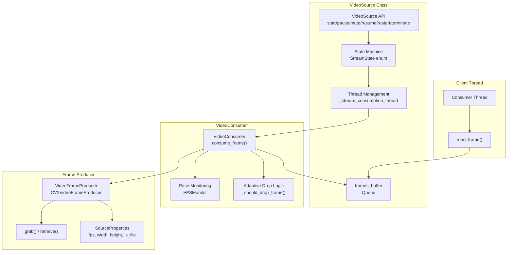
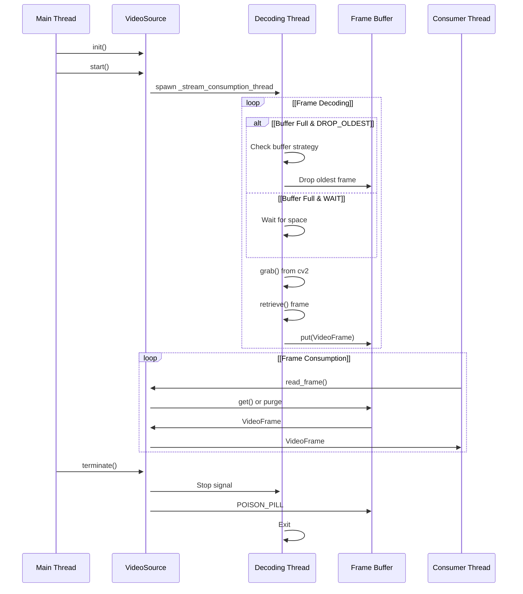
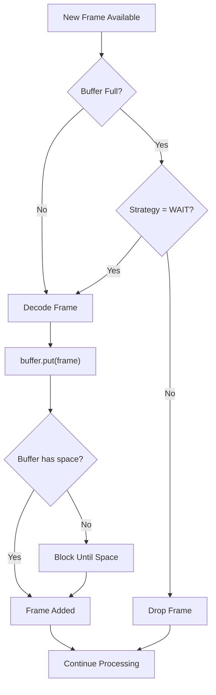
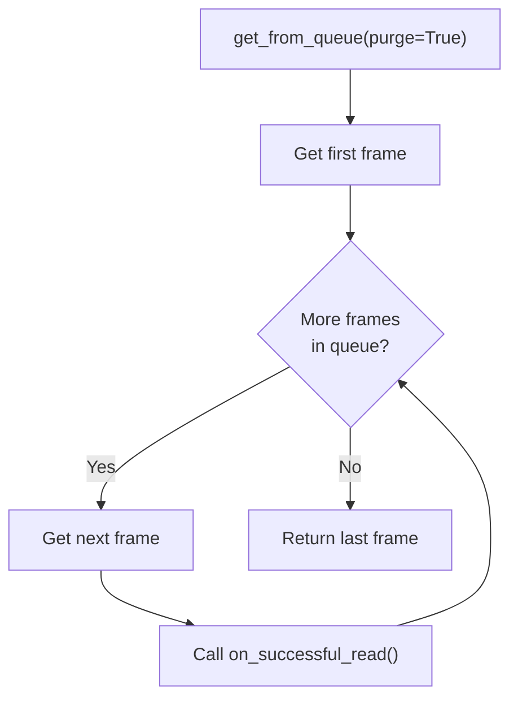
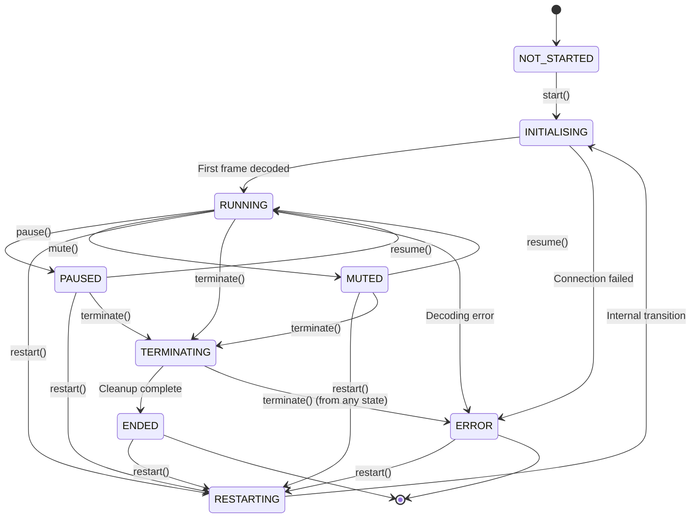
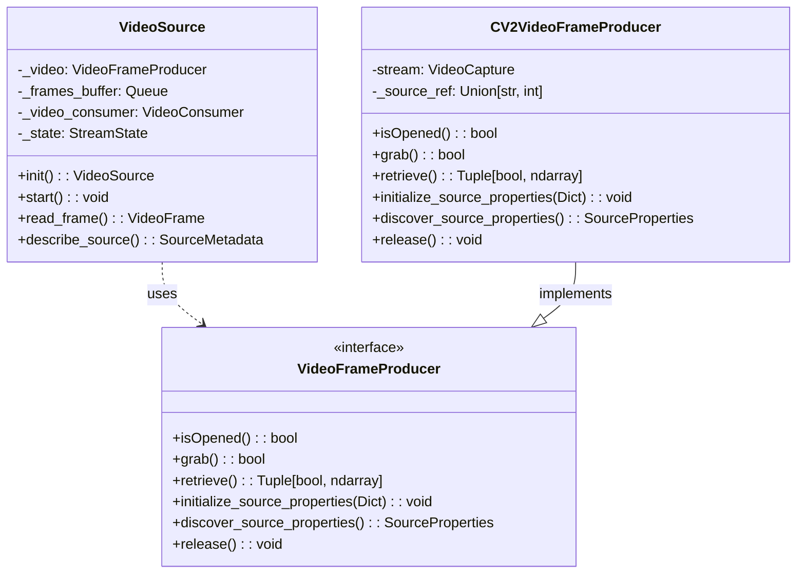
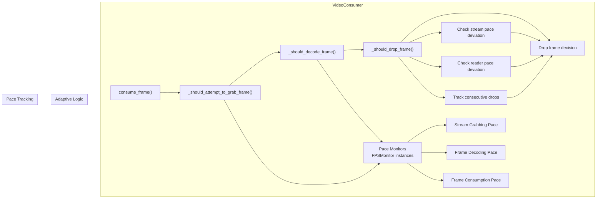
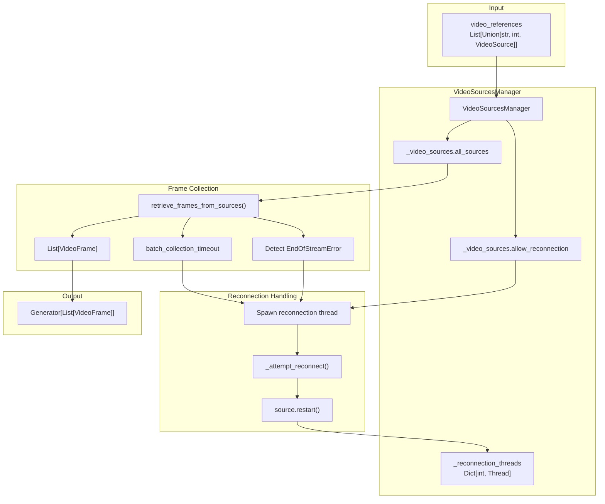
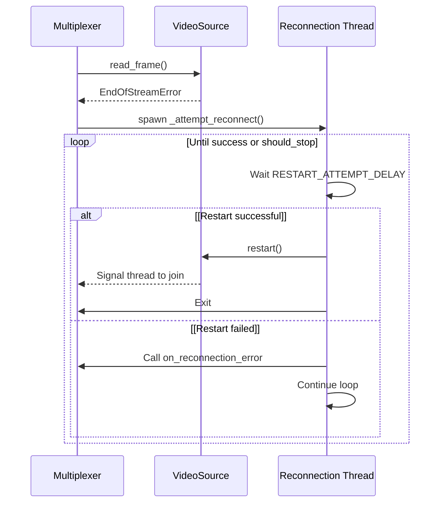

# Video Sources and Buffer Management

## Purpose and Scope

This document describes the video source abstraction layer and buffer management strategies used by the streaming components of Roboflow Inference. The `VideoSource` class provides a unified interface for consuming frames from video files, RTSP streams, HTTP streams, and local cameras, with configurable buffering strategies to handle different performance characteristics and latency requirements.

For information about how video sources integrate into the inference pipeline, see [InferencePipeline](https://deepwiki.com/roboflow/inference/4.1-inferencepipeline). For details on output handling after inference, see [Sinks and Output Handlers](https://deepwiki.com/roboflow/inference/4.3-sinks-and-output-handlers).

## VideoSource Architecture Overview

The `VideoSource` class implements a producer-consumer pattern with buffered frame decoding. It separates video decoding from frame consumption using multiple threads, allowing independent control over how frames are produced and consumed.

### Core Components


**Diagram: VideoSource Component Architecture**

Sources: [inference/core/interfaces/camera/video_source.py191-724](https://github.com/roboflow/inference/blob/77b91b3b/inference/core/interfaces/camera/video_source.py#L191-L724)

### Threading Model

The `VideoSource` operates with two distinct threads:

1. **Decoding Thread** (`_stream_consumption_thread`): Continuously grabs and decodes frames from the video source, placing them in a buffer. This thread runs the `_consume_video()` method.
    
2. **Consumer Thread**: External thread (typically from `InferencePipeline`) that calls `read_frame()` to retrieve decoded frames from the buffer.



**Diagram: Threading Model and Frame Flow**

Sources: [inference/core/interfaces/camera/video_source.py667-721](https://github.com/roboflow/inference/blob/77b91b3b/inference/core/interfaces/camera/video_source.py#L667-L721) [inference/core/interfaces/camera/video_source.py539-574](https://github.com/roboflow/inference/blob/77b91b3b/inference/core/interfaces/camera/video_source.py#L539-L574)

## Buffer Filling Strategies

Buffer filling strategies control how the decoding thread behaves when the frame buffer is full. The strategy is specified via the `BufferFillingStrategy` enum and determines whether frames are dropped and which frames to drop.

### Strategy Types

|Strategy|Behavior|Use Case|
|---|---|---|
|`WAIT`|Blocks until buffer has space|Video files - process every frame|
|`DROP_OLDEST`|Removes oldest frame from buffer|Real-time streams - prioritize recent frames|
|`DROP_LATEST`|Discards newly decoded frame|Stable processing with occasional spikes|
|`ADAPTIVE_DROP_OLDEST`|`DROP_OLDEST` + adaptive frame dropping|Resource-constrained devices (Jetson)|
|`ADAPTIVE_DROP_LATEST`|`DROP_LATEST` + adaptive frame dropping|Resource-constrained with preference for continuity|

Sources: [inference/core/interfaces/camera/video_source.py88-104](https://github.com/roboflow/inference/blob/77b91b3b/inference/core/interfaces/camera/video_source.py#L88-L104)

### WAIT Strategy

The `WAIT` strategy ensures every frame is processed by blocking the decoding thread when the buffer is full. This is the default for video files.
```
GrabFrame > CheckBuffer > BufferFull > WaitForSpace > DecodeFrame > PutInBufer  
```



**Diagram: WAIT Strategy Flow**

Key implementation: When buffer is full, the `put()` operation blocks until space becomes available. This guarantees frame-by-frame processing but can cause decoding to lag behind real-time for streams.

Sources: [inference/core/interfaces/camera/video_source.py659-662](https://github.com/roboflow/inference/blob/77b91b3b/inference/core/interfaces/camera/video_source.py#L659-L662)

### DROP_OLDEST Strategy

The `DROP_OLDEST` strategy prioritizes recent frames by removing the oldest frame from the buffer when full. This is the default for streams.

The dropping is handled by `drop_single_frame_from_buffer()` which:

1. Attempts to get a frame from the buffer without blocking
2. If successful, emits a `FRAME_DROPPED` status update
3. Makes space for the new frame

Sources: [inference/core/interfaces/camera/video_source.py953-979](https://github.com/roboflow/inference/blob/77b91b3b/inference/core/interfaces/camera/video_source.py#L953-L979) [inference/core/interfaces/camera/video_source.py663-665](https://github.com/roboflow/inference/blob/77b91b3b/inference/core/interfaces/camera/video_source.py#L663-L665)

### ADAPTIVE Strategies

Adaptive strategies extend `DROP_OLDEST` or `DROP_LATEST` with preemptive frame dropping based on pace monitoring. They address scenarios where:

- Hardware cannot keep up with both decoding and processing
- Stream grabbing pace must be maintained to avoid decoder failures
- Processing is slower than frame production

The adaptive logic monitors:

- **Stream pace deviation**: Difference between actual frame grabbing rate and declared source FPS
- **Reader pace deviation**: Difference between decoding rate and consumption rate
- **Consecutive drops**: Number of frames dropped in a row

When deviations exceed configured thresholds, frames are preemptively dropped without decoding to maintain system stability.

Sources: [inference/core/interfaces/camera/video_source.py96-99](https://github.com/roboflow/inference/blob/77b91b3b/inference/core/interfaces/camera/video_source.py#L96-L99) [inference/core/interfaces/camera/video_source.py261-276](https://github.com/roboflow/inference/blob/77b91b3b/inference/core/interfaces/camera/video_source.py#L261-L276)

#### Adaptive Mode Parameters

The adaptive behavior is controlled by environment variables:

|Parameter|Environment Variable|Default|Description|
|---|---|---|---|
|Stream pace tolerance|`VIDEO_SOURCE_ADAPTIVE_MODE_STREAM_PACE_TOLERANCE`|0.1|Max deviation from source FPS before dropping|
|Reader pace tolerance|`VIDEO_SOURCE_ADAPTIVE_MODE_READER_PACE_TOLERANCE`|5.0|Max deviation between decode/consume rates|
|Minimum samples|`VIDEO_SOURCE_MINIMUM_ADAPTIVE_MODE_SAMPLES`|10|Frames needed before adaptive mode activates|
|Max consecutive drops|`VIDEO_SOURCE_MAXIMUM_ADAPTIVE_FRAMES_DROPPED_IN_ROW`|16|Max frames dropped in succession|

Sources: [inference/core/interfaces/camera/video_source.py200-204](https://github.com/roboflow/inference/blob/77b91b3b/inference/core/interfaces/camera/video_source.py#L200-L204) [inference/core/env.py](https://github.com/roboflow/inference/blob/77b91b3b/inference/core/env.py)

## Buffer Consumption Strategies

Buffer consumption strategies control how the consumer thread retrieves frames from the buffer. The strategy is specified via the `BufferConsumptionStrategy` enum.

### LAZY Consumption

`LAZY` mode retrieves one frame at a time from the buffer in FIFO order. This is the default for video files and ensures sequential frame processing.

```
# Simplified implementation
frame = buffer.get(timeout=timeout)
```

Sources: [inference/core/interfaces/camera/video_source.py106-109](https://github.com/roboflow/inference/blob/77b91b3b/inference/core/interfaces/camera/video_source.py#L106-L109)

### EAGER Consumption

`EAGER` mode retrieves all available frames from the buffer and returns only the most recent one, discarding intermediate frames. This is the default for streams and minimizes latency.

The `get_from_queue()` helper function implements this by setting `purge=True`:


**Diagram: EAGER Consumption Flow**

Sources: [inference/core/interfaces/camera/video_source.py557](https://github.com/roboflow/inference/blob/77b91b3b/inference/core/interfaces/camera/video_source.py#L557-L557) [inference/core/interfaces/camera/video_source.py903-949](https://github.com/roboflow/inference/blob/77b91b3b/inference/core/interfaces/camera/video_source.py#L903-L949)

## State Machine and Lifecycle

The `VideoSource` maintains a state machine to manage its lifecycle and ensure thread-safe state transitions. All state changes are protected by the `_state_change_lock` via the `@lock_state_transition` decorator.

### State Diagram

The VideoSource state machine is implemented in `inference/core/interfaces/camera/video_source.py` with thread-safe state transitions protected by the `@lock_state_transition` decorator.

## State Definitions

The `StreamState` enum defines all nine states in the lifecycle:

- `NOT_STARTED` - Initial state before `start()` is called
- `INITIALISING` - Connecting to source and decoding first frame
- `RUNNING` - Normal operation, frames being decoded and buffered
- `PAUSED` - Decoding paused, no new frames grabbed
- `MUTED` - Frames grabbed but not decoded, intermediate frames dropped
- `RESTARTING` - Internal state during restart operation
- `TERMINATING` - Cleanup in progress
- `ENDED` - Terminal state, source closed
- `ERROR` - Terminal state, unrecoverable error occurred

## State Transition Logic

State transitions are controlled by eligibility sets that define which states can transition to which operations:

- **Start eligible**: `NOT_STARTED`, `RESTARTING`, `ENDED`
- **Pause eligible**: `RUNNING` only
- **Mute eligible**: `RUNNING` only
- **Resume eligible**: `PAUSED`, `MUTED`
- **Terminate eligible**: `MUTED`, `RUNNING`, `PAUSED`, `RESTARTING`, `ENDED`, `ERROR`
- **Restart eligible**: `MUTED`, `RUNNING`, `PAUSED`, `ENDED`, `ERROR`

## Thread Safety Implementation

All state-changing methods use the `@lock_state_transition` decorator which wraps execution in a lock context:

```
@lock_state_transition  
def start(self) -> None:  
    if self._state not in START_ELIGIBLE_STATES:  
        raise StreamOperationNotAllowedError(...)  
    self._start()
```

The actual state change happens in `_change_state()` which updates the internal state and emits status events.

## Key Methods

Each state transition method checks eligibility before executing:

- `start()` - Initializes video source and starts consumption thread
- `pause()` - Stops frame grabbing by clearing playback event
- `mute()` - Stops buffering while continuing to grab frames
- `resume()` - Restores normal operation from paused/muted states
- `terminate()` - Cleans up resources and ends consumption
- `restart()` - Terminates and reinitializes the source

## Notes

The state machine ensures thread-safe operations and prevents invalid transitions through the eligibility checks and lock mechanism. Invalid transitions raise `StreamOperationNotAllowedError` exceptions, which are tested in the unit tests.



**Diagram: VideoSource State Machine**

Sources: [inference/core/interfaces/camera/video_source.py51-86](https://github.com/roboflow/inference/blob/77b91b3b/inference/core/interfaces/camera/video_source.py#L51-L86)

### State Definitions

|State|Description|
|---|---|
|`NOT_STARTED`|Initial state before `start()` is called|
|`INITIALISING`|Connecting to source and decoding first frame|
|`RUNNING`|Normal operation, frames being decoded and buffered|
|`PAUSED`|Decoding paused, no new frames grabbed (can cause stream issues)|
|`MUTED`|Frames grabbed but not decoded, intermediate frames dropped|
|`RESTARTING`|Internal state during restart operation|
|`TERMINATING`|Cleanup in progress|
|`ENDED`|Terminal state, source closed|
|`ERROR`|Terminal state, unrecoverable error occurred|

Sources: [inference/core/interfaces/camera/video_source.py51-60](https://github.com/roboflow/inference/blob/77b91b3b/inference/core/interfaces/camera/video_source.py#L51-L60)

### State Transition Guards

Each operation checks if the current state permits the transition:

```
START_ELIGIBLE_STATES = {
    StreamState.NOT_STARTED,
    StreamState.RESTARTING,
    StreamState.ENDED,
}
PAUSE_ELIGIBLE_STATES = {StreamState.RUNNING}
MUTE_ELIGIBLE_STATES = {StreamState.RUNNING}
RESUME_ELIGIBLE_STATES = {StreamState.PAUSED, StreamState.MUTED}
TERMINATE_ELIGIBLE_STATES = {
    StreamState.MUTED,
    StreamState.RUNNING,
    StreamState.PAUSED,
    StreamState.RESTARTING,
    StreamState.ENDED,
    StreamState.ERROR,
}
RESTART_ELIGIBLE_STATES = {
    StreamState.MUTED,
    StreamState.RUNNING,
    StreamState.PAUSED,
    StreamState.ENDED,
    StreamState.ERROR,
}
```

If an operation is called from an ineligible state, a `StreamOperationNotAllowedError` is raised.

Sources: [inference/core/interfaces/camera/video_source.py63-86](https://github.com/roboflow/inference/blob/77b91b3b/inference/core/interfaces/camera/video_source.py#L63-L86)

## Video Source Types and Properties

### VideoFrameProducer Protocol

The `VideoFrameProducer` protocol defines the interface for frame providers. The default implementation is `CV2VideoFrameProducer`, which wraps OpenCV's `VideoCapture`.



**Diagram: VideoFrameProducer Class Hierarchy**

Sources: [inference/core/interfaces/camera/entities.py58-69](https://github.com/roboflow/inference/blob/77b91b3b/inference/core/interfaces/camera/entities.py#L58-L69) [inference/core/interfaces/camera/video_source.py136-181](https://github.com/roboflow/inference/blob/77b91b3b/inference/core/interfaces/camera/video_source.py#L136-L181)

### SourceProperties

When a source is initialized, properties are discovered and stored in a `SourceProperties` dataclass:

```
@dataclass(frozen=True)
class SourceProperties:
    width: int
    height: int
    total_frames: int
    is_file: bool
    fps: float
    timestamp_created: Optional[datetime] = None
```

The `is_file` property is crucial as it determines default buffer strategies:

- **Files**: `WAIT` + `LAZY` (process every frame)
- **Streams**: Adaptive `DROP_OLDEST` + `EAGER` (low latency)

Sources: [inference/core/interfaces/camera/entities.py36-44](https://github.com/roboflow/inference/blob/77b91b3b/inference/core/interfaces/camera/entities.py#L36-L44) [inference/core/interfaces/camera/video_source.py158-177](https://github.com/roboflow/inference/blob/77b91b3b/inference/core/interfaces/camera/video_source.py#L158-L177) [inference/core/interfaces/camera/video_source.py618-621](https://github.com/roboflow/inference/blob/77b91b3b/inference/core/interfaces/camera/video_source.py#L618-L621) [inference/core/interfaces/camera/video_source.py663-665](https://github.com/roboflow/inference/blob/77b91b3b/inference/core/interfaces/camera/video_source.py#L663-L665)

### VideoFrame Entity

Each decoded frame is wrapped in a `VideoFrame` dataclass:

```
@dataclass(frozen=True)
class VideoFrame:
    image: np.ndarray
    frame_id: int
    frame_timestamp: datetime
    source_id: Optional[int] = None
    fps: Optional[float] = None
    measured_fps: Optional[float] = None
    comes_from_video_file: Optional[bool] = None
```

This metadata enables:

- Tracking frame order and identifying drops
- Computing latency (`datetime.now() - frame_timestamp`)
- Source identification in multi-stream scenarios
- FPS-aware processing

Sources: [inference/core/interfaces/camera/entities.py46-56](https://github.com/roboflow/inference/blob/77b91b3b/inference/core/interfaces/camera/entities.py#L46-L56)

## VideoConsumer and Adaptive Mode

The `VideoConsumer` class encapsulates frame consumption logic from the `VideoFrameProducer` and implements the adaptive mode algorithms.

### VideoConsumer Responsibilities




**Diagram: VideoConsumer Structure and Adaptive Logic**

Sources: [inference/core/interfaces/camera/video_source.py727-889](https://github.com/roboflow/inference/blob/77b91b3b/inference/core/interfaces/camera/video_source.py#L727-L889)

### Adaptive Mode Decision Logic

The `_should_drop_frame()` method implements the core adaptive logic:

1. **Check if adaptive mode is active**: Buffer strategy must be `ADAPTIVE_DROP_OLDEST` or `ADAPTIVE_DROP_LATEST`
    
2. **Check consecutive drops limit**: If max consecutive drops reached, reset counter and decode frame
    
3. **Evaluate stream pace**:
    
    - Compare actual grabbing pace to declared source FPS
    - If deviation exceeds `adaptive_mode_stream_pace_tolerance`, drop frame
4. **Evaluate reader pace**:
    
    - Compare decoding pace to consumption pace
    - If decoding outpaces consumption by more than `adaptive_mode_reader_pace_tolerance`, drop frame
5. **Return decision**: `True` to drop (grab but not decode), `False` to decode
    

Sources: [inference/core/interfaces/camera/video_source.py863-889](https://github.com/roboflow/inference/blob/77b91b3b/inference/core/interfaces/camera/video_source.py#L863-L889)

### FPS Limiting with Desired FPS

When `desired_fps` is specified during initialization, the `VideoConsumer` enforces a maximum frame rate by skipping frames:

```
def _should_attempt_to_grab_frame(
    self,
    declared_source_fps: Optional[float],
    is_source_video_file: bool,
) -> bool:
    if self._desired_fps is None:
        return True
    # Calculate if enough time has passed since last frame
    # based on desired_fps
```

This is implemented via the `_frame_should_be_grabbed_based_on_fps_limiting()` method which uses random sampling to achieve the target FPS when processing video files.

Sources: [inference/core/interfaces/camera/video_source.py806-824](https://github.com/roboflow/inference/blob/77b91b3b/inference/core/interfaces/camera/video_source.py#L806-L824) [inference/core/interfaces/camera/video_source.py826-861](https://github.com/roboflow/inference/blob/77b91b3b/inference/core/interfaces/camera/video_source.py#L826-L861)

## Multiplexing Multiple Sources

The `multiplex_videos()` function provides a unified interface for consuming frames from multiple video sources simultaneously. This is used by `InferencePipeline` when multiple video references are provided.

### Multiplexer Architecture


**Diagram: Video Multiplexing Architecture**

Sources: [inference/core/interfaces/camera/utils.py239-325](https://github.com/roboflow/inference/blob/77b91b3b/inference/core/interfaces/camera/utils.py#L239-L325)

### Batch Collection with Timeout

The multiplexer collects frames from all sources, but with a timeout to prevent slow sources from blocking the batch:

1. **Initialize timeout**: Calculate `batch_timeout_moment = last_batch_time + batch_collection_timeout`
    
2. **Iterate sources**: For each source:
    
    - Calculate remaining time: `batch_time_left = max(batch_timeout_moment - now, 0.0)`
    - Call `source.read_frame(timeout=batch_time_left)`
    - If frame retrieved, add to batch
    - If timeout or error, skip this source for this batch
3. **Return batch**: Return list of frames (possibly incomplete if sources timed out)
    

This ensures the pipeline continues processing even when individual sources are slow or temporarily unavailable.

Sources: [inference/core/interfaces/camera/utils.py143-175](https://github.com/roboflow/inference/blob/77b91b3b/inference/core/interfaces/camera/utils.py#L143-L175)

### Reconnection Strategy

For streams (not files), the multiplexer automatically spawns reconnection threads when `EndOfStreamError` is detected:


**Diagram: Automatic Reconnection Flow**

The default delay between reconnection attempts is controlled by `INFERENCE_PIPELINE_RESTART_ATTEMPT_DELAY` environment variable (default 5 seconds).

Sources: [inference/core/interfaces/camera/utils.py194-219](https://github.com/roboflow/inference/blob/77b91b3b/inference/core/interfaces/camera/utils.py#L194-L219) [inference/core/interfaces/camera/utils.py432-457](https://github.com/roboflow/inference/blob/77b91b3b/inference/core/interfaces/camera/utils.py#L432-L457)

## Configuration and Environment Variables

### VideoSource Configuration Parameters

|Parameter|Type|Default|Description|
|---|---|---|---|
|`video_reference`|`Union[str, int, Callable]`|Required|File path, stream URL, device ID, or callable returning VideoFrameProducer|
|`buffer_size`|`int`|`DEFAULT_BUFFER_SIZE` (64)|Maximum frames in buffer|
|`buffer_filling_strategy`|`BufferFillingStrategy`|Auto|How to handle full buffer|
|`buffer_consumption_strategy`|`BufferConsumptionStrategy`|Auto|How to read from buffer|
|`video_source_properties`|`Dict[str, float]`|`{}`|cv2.CAP_PROP_* properties|
|`source_id`|`int`|`None`|Identifier for multi-source scenarios|
|`desired_fps`|`Union[float, int]`|`None`|Maximum frame rate|

Sources: [inference/core/interfaces/camera/video_source.py192-318](https://github.com/roboflow/inference/blob/77b91b3b/inference/core/interfaces/camera/video_source.py#L192-L318)

### Environment Variables

|Variable|Default|Description|
|---|---|---|
|`VIDEO_SOURCE_BUFFER_SIZE`|64|Default buffer size|
|`VIDEO_SOURCE_ADAPTIVE_MODE_STREAM_PACE_TOLERANCE`|0.1|Stream pace deviation threshold|
|`VIDEO_SOURCE_ADAPTIVE_MODE_READER_PACE_TOLERANCE`|5.0|Reader pace deviation threshold|
|`VIDEO_SOURCE_MINIMUM_ADAPTIVE_MODE_SAMPLES`|10|Frames before adaptive mode activates|
|`VIDEO_SOURCE_MAXIMUM_ADAPTIVE_FRAMES_DROPPED_IN_ROW`|16|Max consecutive adaptive drops|
|`INFERENCE_PIPELINE_RESTART_ATTEMPT_DELAY`|5|Seconds between reconnection attempts|

Sources: [inference/core/env.py](https://github.com/roboflow/inference/blob/77b91b3b/inference/core/env.py) [inference/core/interfaces/camera/video_source.py286-291](https://github.com/roboflow/inference/blob/77b91b3b/inference/core/interfaces/camera/video_source.py#L286-L291)

### Automatic Strategy Selection

When strategies are not explicitly specified, `VideoSource` selects defaults based on `SourceProperties.is_file`:

```
def _set_file_mode_consumption_strategies(self) -> None:
    if self._buffer_consumption_strategy is None:
        self._buffer_consumption_strategy = BufferConsumptionStrategy.LAZY

def _set_stream_mode_consumption_strategies(self) -> None:
    if self._buffer_consumption_strategy is None:
        self._buffer_consumption_strategy = BufferConsumptionStrategy.EAGER
```

The `VideoConsumer` similarly adapts the filling strategy based on whether the source is a file.

Sources: [inference/core/interfaces/camera/video_source.py659-665](https://github.com/roboflow/inference/blob/77b91b3b/inference/core/interfaces/camera/video_source.py#L659-L665)

## Status Updates and Observability

The `VideoSource` emits `StatusUpdate` events at key points in its lifecycle, which can be intercepted by registering handlers:

```
source = VideoSource.init(
    video_reference="rtsp://example.com/stream",
    status_update_handlers=[my_handler],
)
```

### Event Types

|Event Type|Severity|Emitted When|
|---|---|---|
|`SOURCE_STATE_UPDATE`|INFO|State transitions|
|`SOURCE_ERROR`|ERROR|Errors in decoding thread|
|`FRAME_CAPTURED`|DEBUG|Frame successfully decoded|
|`FRAME_DROPPED`|DEBUG|Frame dropped from buffer|
|`FRAME_CONSUMED`|DEBUG|Frame retrieved by consumer|
|`VIDEO_CONSUMPTION_STARTED`|INFO|Decoding thread starts|
|`VIDEO_CONSUMPTION_FINISHED`|INFO|Decoding thread exits|

All events include context such as `source_id`, `frame_id`, and timestamps for debugging and monitoring.

Sources: [inference/core/interfaces/camera/video_source.py38-46](https://github.com/roboflow/inference/blob/77b91b3b/inference/core/interfaces/camera/video_source.py#L38-L46) [inference/core/interfaces/camera/entities.py13-28](https://github.com/roboflow/inference/blob/77b91b3b/inference/core/interfaces/camera/entities.py#L13-L28)

### On this page

- [Video Sources and Buffer Management](https://deepwiki.com/roboflow/inference/4.2-video-sources-and-buffer-management#video-sources-and-buffer-management)
- [Purpose and Scope](https://deepwiki.com/roboflow/inference/4.2-video-sources-and-buffer-management#purpose-and-scope)
- [VideoSource Architecture Overview](https://deepwiki.com/roboflow/inference/4.2-video-sources-and-buffer-management#videosource-architecture-overview)
- [Core Components](https://deepwiki.com/roboflow/inference/4.2-video-sources-and-buffer-management#core-components)
- [Threading Model](https://deepwiki.com/roboflow/inference/4.2-video-sources-and-buffer-management#threading-model)
- [Buffer Filling Strategies](https://deepwiki.com/roboflow/inference/4.2-video-sources-and-buffer-management#buffer-filling-strategies)
- [Strategy Types](https://deepwiki.com/roboflow/inference/4.2-video-sources-and-buffer-management#strategy-types)
- [WAIT Strategy](https://deepwiki.com/roboflow/inference/4.2-video-sources-and-buffer-management#wait-strategy)
- [DROP_OLDEST Strategy](https://deepwiki.com/roboflow/inference/4.2-video-sources-and-buffer-management#drop_oldest-strategy)
- [ADAPTIVE Strategies](https://deepwiki.com/roboflow/inference/4.2-video-sources-and-buffer-management#adaptive-strategies)
- [Adaptive Mode Parameters](https://deepwiki.com/roboflow/inference/4.2-video-sources-and-buffer-management#adaptive-mode-parameters)
- [Buffer Consumption Strategies](https://deepwiki.com/roboflow/inference/4.2-video-sources-and-buffer-management#buffer-consumption-strategies)
- [LAZY Consumption](https://deepwiki.com/roboflow/inference/4.2-video-sources-and-buffer-management#lazy-consumption)
- [EAGER Consumption](https://deepwiki.com/roboflow/inference/4.2-video-sources-and-buffer-management#eager-consumption)
- [State Machine and Lifecycle](https://deepwiki.com/roboflow/inference/4.2-video-sources-and-buffer-management#state-machine-and-lifecycle)
- [State Diagram](https://deepwiki.com/roboflow/inference/4.2-video-sources-and-buffer-management#state-diagram)
- [State Definitions](https://deepwiki.com/roboflow/inference/4.2-video-sources-and-buffer-management#state-definitions)
- [State Transition Guards](https://deepwiki.com/roboflow/inference/4.2-video-sources-and-buffer-management#state-transition-guards)
- [Video Source Types and Properties](https://deepwiki.com/roboflow/inference/4.2-video-sources-and-buffer-management#video-source-types-and-properties)
- [VideoFrameProducer Protocol](https://deepwiki.com/roboflow/inference/4.2-video-sources-and-buffer-management#videoframeproducer-protocol)
- [SourceProperties](https://deepwiki.com/roboflow/inference/4.2-video-sources-and-buffer-management#sourceproperties)
- [VideoFrame Entity](https://deepwiki.com/roboflow/inference/4.2-video-sources-and-buffer-management#videoframe-entity)
- [VideoConsumer and Adaptive Mode](https://deepwiki.com/roboflow/inference/4.2-video-sources-and-buffer-management#videoconsumer-and-adaptive-mode)
- [VideoConsumer Responsibilities](https://deepwiki.com/roboflow/inference/4.2-video-sources-and-buffer-management#videoconsumer-responsibilities)
- [Adaptive Mode Decision Logic](https://deepwiki.com/roboflow/inference/4.2-video-sources-and-buffer-management#adaptive-mode-decision-logic)
- [FPS Limiting with Desired FPS](https://deepwiki.com/roboflow/inference/4.2-video-sources-and-buffer-management#fps-limiting-with-desired-fps)
- [Multiplexing Multiple Sources](https://deepwiki.com/roboflow/inference/4.2-video-sources-and-buffer-management#multiplexing-multiple-sources)
- [Multiplexer Architecture](https://deepwiki.com/roboflow/inference/4.2-video-sources-and-buffer-management#multiplexer-architecture)
- [Batch Collection with Timeout](https://deepwiki.com/roboflow/inference/4.2-video-sources-and-buffer-management#batch-collection-with-timeout)
- [Reconnection Strategy](https://deepwiki.com/roboflow/inference/4.2-video-sources-and-buffer-management#reconnection-strategy)
- [Configuration and Environment Variables](https://deepwiki.com/roboflow/inference/4.2-video-sources-and-buffer-management#configuration-and-environment-variables)
- [VideoSource Configuration Parameters](https://deepwiki.com/roboflow/inference/4.2-video-sources-and-buffer-management#videosource-configuration-parameters)
- [Environment Variables](https://deepwiki.com/roboflow/inference/4.2-video-sources-and-buffer-management#environment-variables)
- [Automatic Strategy Selection](https://deepwiki.com/roboflow/inference/4.2-video-sources-and-buffer-management#automatic-strategy-selection)
- [Status Updates and Observability](https://deepwiki.com/roboflow/inference/4.2-video-sources-and-buffer-management#status-updates-and-observability)
- [Event Types](https://deepwiki.com/roboflow/inference/4.2-video-sources-and-buffer-management#event-types)
