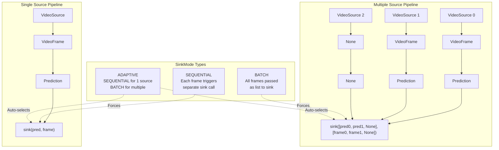
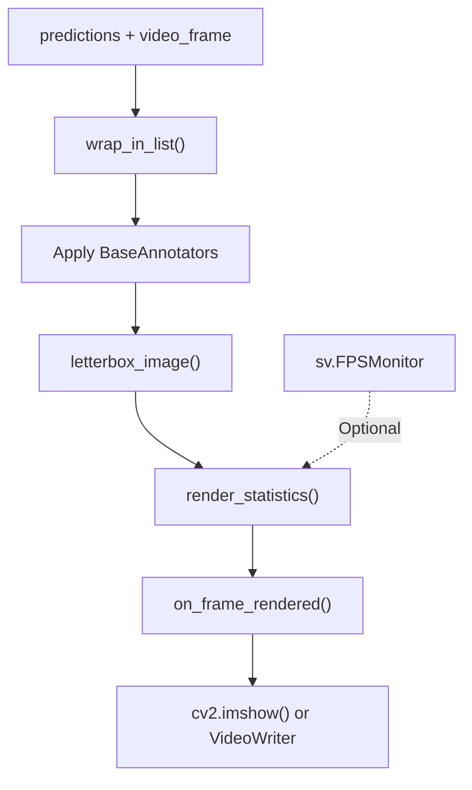
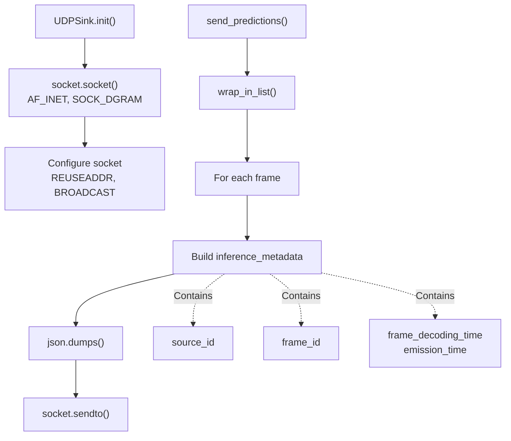
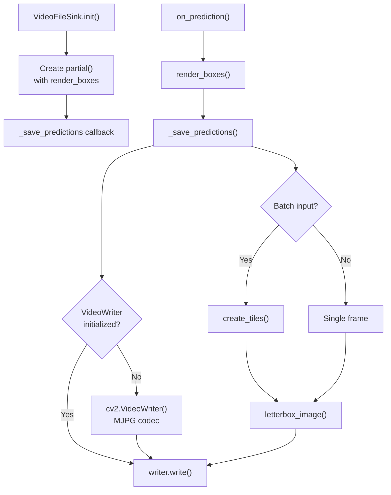
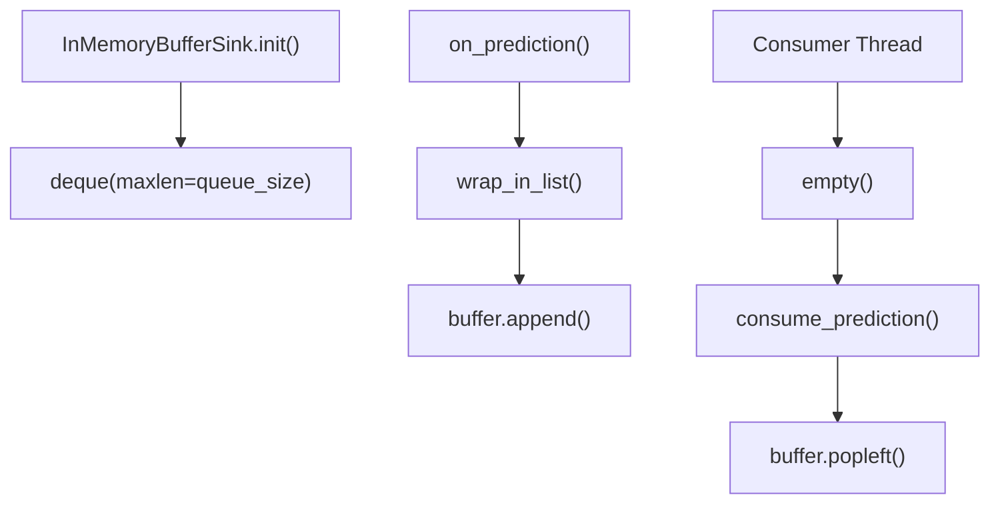
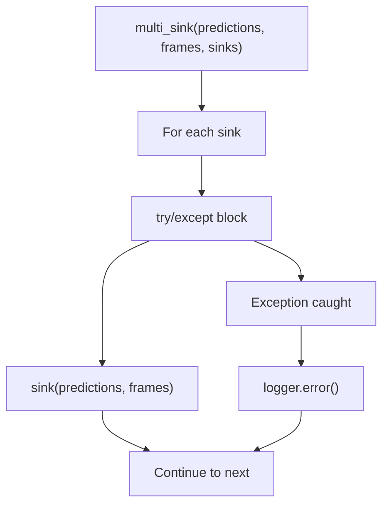
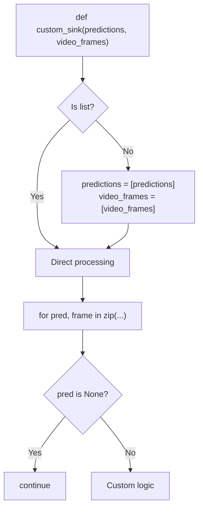
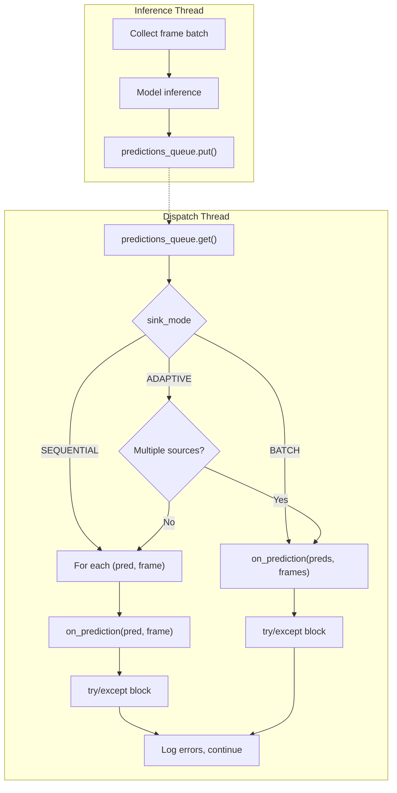

# Sinks and Output Handlers

## Purpose and Scope

This document describes the sink system used by `InferencePipeline` to process predictions after model inference. Sinks are callback functions that receive video frames and their corresponding predictions, enabling operations like visualization, data transmission, storage, and Active Learning data collection.

For information on the overall pipeline architecture, see [InferencePipeline](https://deepwiki.com/roboflow/inference/4.1-inferencepipeline). For video source configuration, see [Video Sources and Buffer Management](https://deepwiki.com/roboflow/inference/4.2-video-sources-and-buffer-management).

---

## Sink Handler Interface

A sink is a callable that consumes predictions and video frames. The `SinkHandler` type definition supports both single-frame (sequential) and batch processing modes.

**Type Definition:**

[inference/core/interfaces/stream/entities.py124-130](https://github.com/roboflow/inference/blob/77b91b3b/inference/core/interfaces/stream/entities.py#L124-L130)

```
SinkHandler = Optional[
    Union[
        Callable[[AnyPrediction, VideoFrame], None],
        Callable[[List[Optional[AnyPrediction]], List[Optional[VideoFrame]]], None],
    ]
]
```

The handler can accept either:

- **Sequential mode**: Single `(prediction, video_frame)` pair
- **Batch mode**: Lists of `(predictions, video_frames)` with `None` values for missing frames

Sources: [inference/core/interfaces/stream/entities.py124-130](https://github.com/roboflow/inference/blob/77b91b3b/inference/core/interfaces/stream/entities.py#L124-L130)

---

## Sink Execution Modes

The `SinkMode` enum controls how predictions and frames are passed to sink handlers when processing multiple video sources.



### Mode Descriptions

|Mode|Behavior|Use Case|
|---|---|---|
|`SEQUENTIAL`|Each frame/prediction triggers separate sink call|Legacy sinks, simple processing|
|`BATCH`|All frames/predictions passed as aligned lists|Efficient batch processing, multi-source visualization|
|`ADAPTIVE`|SEQUENTIAL for 1 source, BATCH for multiple|Default mode, backward compatible|

**Configuration:**

[inference/core/interfaces/stream/inference_pipeline.py112](https://github.com/roboflow/inference/blob/77b91b3b/inference/core/interfaces/stream/inference_pipeline.py#L112-L112)

The `sink_mode` parameter is set during `InferencePipeline` initialization and defaults to `SinkMode.ADAPTIVE`.

Sources: [inference/core/interfaces/stream/inference_pipeline.py80-83](https://github.com/roboflow/inference/blob/77b91b3b/inference/core/interfaces/stream/inference_pipeline.py#L80-L83) [inference/core/interfaces/stream/inference_pipeline.py112](https://github.com/roboflow/inference/blob/77b91b3b/inference/core/interfaces/stream/inference_pipeline.py#L112-L112) [inference/core/interfaces/stream/inference_pipeline.py216-227](https://github.com/roboflow/inference/blob/77b91b3b/inference/core/interfaces/stream/inference_pipeline.py#L216-L227)

---

## Built-in Sinks

### render_boxes

Renders object detection predictions as bounding boxes on video frames. Supports both single and batch input modes.




**Key Parameters:**

[inference/core/interfaces/stream/sinks.py40-49](https://github.com/roboflow/inference/blob/77b91b3b/inference/core/interfaces/stream/sinks.py#L40-L49)

- `annotator`: `BaseAnnotator` or list (default: `BoxAnnotator` + `LabelAnnotator`)
- `display_size`: Tuple for output resolution (default: 1280x720)
- `fps_monitor`: Optional `sv.FPSMonitor` for throughput tracking
- `display_statistics`: Boolean to overlay latency/FPS metrics
- `on_frame_rendered`: Callback receiving `(source_id, np.ndarray)`

**Implementation Details:**

[inference/core/interfaces/stream/sinks.py115-153](https://github.com/roboflow/inference/blob/77b91b3b/inference/core/interfaces/stream/sinks.py#L115-L153)

The function automatically detects input mode (sequential vs batch), applies annotations, resizes frames, and invokes the callback. It handles malformed predictions gracefully by logging warnings and displaying unmodified frames.

Sources: [inference/core/interfaces/stream/sinks.py40-153](https://github.com/roboflow/inference/blob/77b91b3b/inference/core/interfaces/stream/sinks.py#L40-L153)

---

### UDPSink

Transmits predictions and frame metadata over UDP socket as JSON payloads.



**Initialization:**

[inference/core/interfaces/stream/sinks.py229-251](https://github.com/roboflow/inference/blob/77b91b3b/inference/core/interfaces/stream/sinks.py#L229-L251)

Creates UDP socket with broadcast enabled and configurable buffer sizes (SNDBUF: 65536).

**Message Format:**

The JSON payload includes original predictions plus `inference_metadata`:

- `source_id`: Video source identifier
- `frame_id`: Sequential frame number
- `frame_decoding_time`: ISO format timestamp when frame was decoded
- `emission_time`: ISO format timestamp when message was sent

[inference/core/interfaces/stream/sinks.py304-318](https://github.com/roboflow/inference/blob/77b91b3b/inference/core/interfaces/stream/sinks.py#L304-L318)

Sources: [inference/core/interfaces/stream/sinks.py228-319](https://github.com/roboflow/inference/blob/77b91b3b/inference/core/interfaces/stream/sinks.py#L228-L319)

---

### VideoFileSink

Saves annotated frames to video file with configurable encoding parameters.



**Configuration Parameters:**

[inference/core/interfaces/stream/sinks.py408-438](https://github.com/roboflow/inference/blob/77b91b3b/inference/core/interfaces/stream/sinks.py#L408-L438)

|Parameter|Type|Default|Description|
|---|---|---|---|
|`video_file_name`|str|Required|Output file path|
|`annotator`|BaseAnnotator|Box + Label|Visualization annotator|
|`display_size`|Tuple[int, int]|(1280, 720)|Tile size for single source|
|`output_fps`|int|25|Output video FPS|
|`video_frame_size`|Tuple[int, int]|(1280, 720)|Final video dimensions|
|`quiet`|bool|False|Suppress progress logging|

**Lifecycle Management:**

[inference/core/interfaces/stream/sinks.py537-541](https://github.com/roboflow/inference/blob/77b91b3b/inference/core/interfaces/stream/sinks.py#L537-L541)

Implements context manager protocol (`__enter__`, `__exit__`) and `release()` method for proper resource cleanup.

Sources: [inference/core/interfaces/stream/sinks.py406-542](https://github.com/roboflow/inference/blob/77b91b3b/inference/core/interfaces/stream/sinks.py#L406-L542)

---

### InMemoryBufferSink

Accumulates predictions in a fixed-size circular buffer for later retrieval.



**Interface:**

[inference/core/interfaces/stream/sinks.py544-571](https://github.com/roboflow/inference/blob/77b91b3b/inference/core/interfaces/stream/sinks.py#L544-L571)

- `on_prediction()`: Appends `(predictions, video_frames)` tuple to buffer
- `empty()`: Returns boolean indicating buffer state
- `consume_prediction()`: Removes and returns oldest buffered item

**Use Case:**

Designed for WebRTC worker pattern where predictions are buffered temporarily before being consumed by separate processing logic. The circular buffer automatically discards oldest items when full.

Sources: [inference/core/interfaces/stream/sinks.py544-571](https://github.com/roboflow/inference/blob/77b91b3b/inference/core/interfaces/stream/sinks.py#L544-L571)

---


---

### multi_sink

Chains multiple sinks together, executing each sequentially with error isolation.



**Error Handling:**

[inference/core/interfaces/stream/sinks.py360-366](https://github.com/roboflow/inference/blob/77b91b3b/inference/core/interfaces/stream/sinks.py#L360-L366)

Each sink executes within its own try-except block. Errors are logged but do not interrupt execution of subsequent sinks or raise exceptions to the pipeline.

**Example Usage:**

```
from functools import partial
from inference.core.interfaces.stream.sinks import multi_sink, UDPSink, render_boxes

udp_sink = UDPSink.init(ip_address="127.0.0.1", port=9090)
on_prediction = partial(
    multi_sink, 
    sinks=[udp_sink.send_predictions, render_boxes]
)

pipeline = InferencePipeline.init(
    model_id="yolov8n-640",
    video_reference="video.mp4",
    on_prediction=on_prediction,
)
```

Sources: [inference/core/interfaces/stream/sinks.py321-367](https://github.com/roboflow/inference/blob/77b91b3b/inference/core/interfaces/stream/sinks.py#L321-L367)

---

## Custom Sink Implementation

### Signature Requirements

Custom sinks must handle both sequential and batch input modes for compatibility with `SinkMode.ADAPTIVE`.



### Example Implementation

[docs/using_inference/inference_pipeline.md289-308](https://github.com/roboflow/inference/blob/77b91b3b/docs/using_inference/inference_pipeline.md#L289-L308)

```
from typing import Union, List, Optional, Any
from inference.core.interfaces.camera.entities import VideoFrame

def custom_sink(
    predictions: Union[Any, List[Optional[dict]]],
    video_frame: Union[VideoFrame, List[Optional[VideoFrame]]],
) -> None:
    # Ensure list format for unified processing
    if not issubclass(type(predictions), list):
        predictions = [predictions]
        video_frame = [video_frame]
    
    # Process each prediction
    for prediction, frame in zip(predictions, video_frame):
        if prediction is None:
            continue  # Missing frame from batch timeout
        
        # Implement custom logic here
        # - Save to database
        # - Trigger external API
        # - Aggregate statistics
        # etc.
```

### Closure for Additional Parameters

[docs/using_inference/inference_pipeline.md264-283](https://github.com/roboflow/inference/blob/77b91b3b/docs/using_inference/inference_pipeline.md#L264-L283)

Use `functools.partial` to inject additional configuration into sink:

```
from functools import partial

def configurable_sink(
    predictions: dict,
    video_frame: VideoFrame,
    threshold: float,
    output_dir: str,
) -> None:
    # Use threshold and output_dir in logic
    pass

pipeline = InferencePipeline.init(
    model_id="model/1",
    video_reference="video.mp4",
    on_prediction=partial(
        configurable_sink, 
        threshold=0.8, 
        output_dir="/data/outputs"
    ),
)
```

Sources: [docs/using_inference/inference_pipeline.md289-308](https://github.com/roboflow/inference/blob/77b91b3b/docs/using_inference/inference_pipeline.md#L289-L308) [docs/using_inference/inference_pipeline.md264-283](https://github.com/roboflow/inference/blob/77b91b3b/docs/using_inference/inference_pipeline.md#L264-L283)

---

## Sink Execution Flow in InferencePipeline



**Dispatch Logic:**

[inference/core/interfaces/stream/inference_pipeline.py855-906](https://github.com/roboflow/inference/blob/77b91b3b/inference/core/interfaces/stream/inference_pipeline.py#L855-L906)

The dispatch thread retrieves predictions from the queue and invokes the sink according to the configured `sink_mode`. All sink errors are caught and logged via the watchdog without interrupting pipeline execution.

**Threading Model:**

[inference/core/interfaces/stream/inference_pipeline.py796-801](https://github.com/roboflow/inference/blob/77b91b3b/inference/core/interfaces/stream/inference_pipeline.py#L796-L801)

Three separate threads ensure non-blocking operation:

1. **Video decoding thread**: Grabs frames from sources
2. **Inference thread**: Runs model predictions in batches
3. **Dispatch thread**: Executes sink handlers

Sources: [inference/core/interfaces/stream/inference_pipeline.py796-906](https://github.com/roboflow/inference/blob/77b91b3b/inference/core/interfaces/stream/inference_pipeline.py#L796-L906)

---

## Integration Points

### Configuration in InferencePipeline.init()

[inference/core/interfaces/stream/inference_pipeline.py86-242](https://github.com/roboflow/inference/blob/77b91b3b/inference/core/interfaces/stream/inference_pipeline.py#L86-L242)

Sinks are configured via the `on_prediction` parameter:

```
pipeline = InferencePipeline.init(
    model_id="yolov8n-640",
    video_reference="video.mp4",
    on_prediction=my_sink,  # SinkHandler
    sink_mode=SinkMode.ADAPTIVE,
    predictions_queue_size=512,
)
```

### Batch Collection and None Handling

[inference/core/interfaces/camera/utils.py239-349](https://github.com/roboflow/inference/blob/77b91b3b/inference/core/interfaces/camera/utils.py#L239-L349)

When using multiple video sources with `batch_collection_timeout`, frames that couldn't be collected in time result in `None` values at corresponding positions in prediction/frame lists. Sinks must handle these `None` values gracefully:

```
for prediction, frame in zip(predictions, video_frames):
    if prediction is None or frame is None:
        continue  # Skip missing data
    # Process valid data
```

Sources: [inference/core/interfaces/stream/inference_pipeline.py86-242](https://github.com/roboflow/inference/blob/77b91b3b/inference/core/interfaces/stream/inference_pipeline.py#L86-L242) [inference/core/interfaces/camera/utils.py239-349](https://github.com/roboflow/inference/blob/77b91b3b/inference/core/interfaces/camera/utils.py#L239-L349)

---

## Performance Considerations

### Thread Pool for Blocking Operations

For sinks performing I/O-heavy operations (database writes, API calls), consider offloading work to a thread pool to avoid blocking the dispatch thread:

```
from concurrent.futures import ThreadPoolExecutor

executor = ThreadPoolExecutor(max_workers=4)

def async_sink(predictions, video_frame):
    def blocking_operation():
        # Expensive I/O operation
        pass
    
    executor.submit(blocking_operation)
```

### Queue Size Configuration

[inference/core/interfaces/stream/inference_pipeline.py227-228](https://github.com/roboflow/inference/blob/77b91b3b/inference/core/interfaces/stream/inference_pipeline.py#L227-L228)

The `predictions_queue_size` parameter controls backpressure between inference and sink threads. Larger values accommodate slower sinks but increase memory usage:

- **Default**: Determined by `PREDICTIONS_QUEUE_SIZE` environment variable
- **Small queues** (64-128): Fast sinks, low latency priority
- **Large queues** (512-1024): Slower sinks, throughput priority

Sources: [inference/core/interfaces/stream/inference_pipeline.py227-228](https://github.com/roboflow/inference/blob/77b91b3b/inference/core/interfaces/stream/inference_pipeline.py#L227-L228)


### On this page

- [Sinks and Output Handlers](https://deepwiki.com/roboflow/inference/4.3-sinks-and-output-handlers#sinks-and-output-handlers)
- [Purpose and Scope](https://deepwiki.com/roboflow/inference/4.3-sinks-and-output-handlers#purpose-and-scope)
- [Sink Handler Interface](https://deepwiki.com/roboflow/inference/4.3-sinks-and-output-handlers#sink-handler-interface)
- [Sink Execution Modes](https://deepwiki.com/roboflow/inference/4.3-sinks-and-output-handlers#sink-execution-modes)
- [Mode Descriptions](https://deepwiki.com/roboflow/inference/4.3-sinks-and-output-handlers#mode-descriptions)
- [Built-in Sinks](https://deepwiki.com/roboflow/inference/4.3-sinks-and-output-handlers#built-in-sinks)
- [render_boxes](https://deepwiki.com/roboflow/inference/4.3-sinks-and-output-handlers#render_boxes)
- [UDPSink](https://deepwiki.com/roboflow/inference/4.3-sinks-and-output-handlers#udpsink)
- [VideoFileSink](https://deepwiki.com/roboflow/inference/4.3-sinks-and-output-handlers#videofilesink)
- [InMemoryBufferSink](https://deepwiki.com/roboflow/inference/4.3-sinks-and-output-handlers#inmemorybuffersink)
- [active_learning_sink](https://deepwiki.com/roboflow/inference/4.3-sinks-and-output-handlers#active_learning_sink)
- [multi_sink](https://deepwiki.com/roboflow/inference/4.3-sinks-and-output-handlers#multi_sink)
- [Custom Sink Implementation](https://deepwiki.com/roboflow/inference/4.3-sinks-and-output-handlers#custom-sink-implementation)
- [Signature Requirements](https://deepwiki.com/roboflow/inference/4.3-sinks-and-output-handlers#signature-requirements)
- [Example Implementation](https://deepwiki.com/roboflow/inference/4.3-sinks-and-output-handlers#example-implementation)
- [Closure for Additional Parameters](https://deepwiki.com/roboflow/inference/4.3-sinks-and-output-handlers#closure-for-additional-parameters)
- [Sink Execution Flow in InferencePipeline](https://deepwiki.com/roboflow/inference/4.3-sinks-and-output-handlers#sink-execution-flow-in-inferencepipeline)
- [Integration Points](https://deepwiki.com/roboflow/inference/4.3-sinks-and-output-handlers#integration-points)
- [Configuration in InferencePipeline.init()](https://deepwiki.com/roboflow/inference/4.3-sinks-and-output-handlers#configuration-in-inferencepipelineinit)
- [Batch Collection and None Handling](https://deepwiki.com/roboflow/inference/4.3-sinks-and-output-handlers#batch-collection-and-none-handling)
- [Performance Considerations](https://deepwiki.com/roboflow/inference/4.3-sinks-and-output-handlers#performance-considerations)
- [Thread Pool for Blocking Operations](https://deepwiki.com/roboflow/inference/4.3-sinks-and-output-handlers#thread-pool-for-blocking-operations)
- [Queue Size Configuration](https://deepwiki.com/roboflow/inference/4.3-sinks-and-output-handlers#queue-size-configuration)

