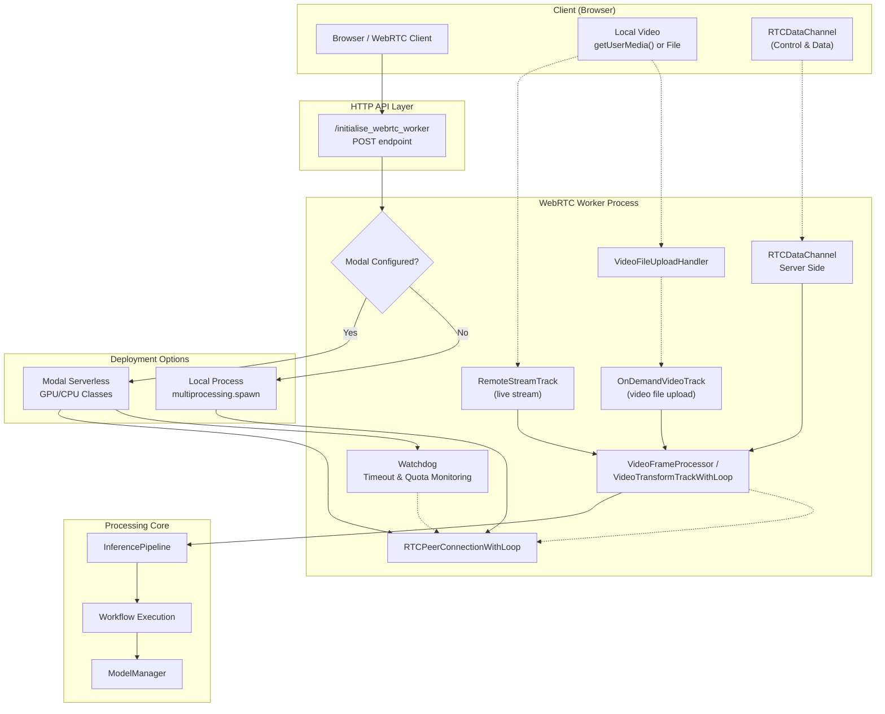
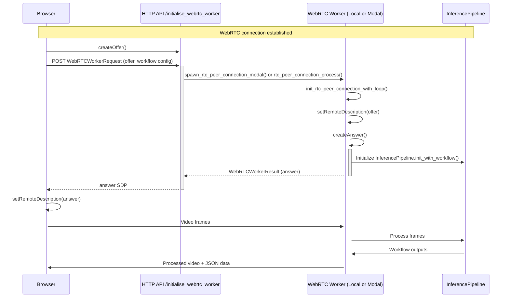
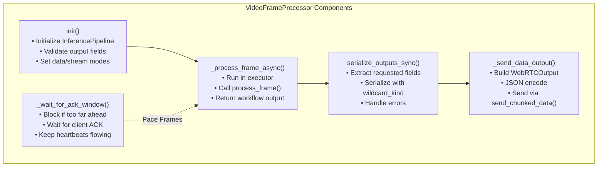
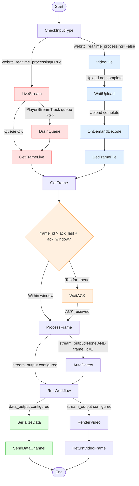
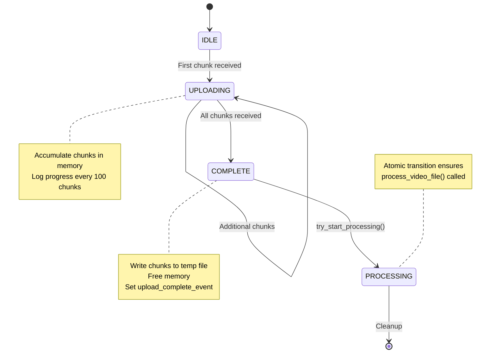
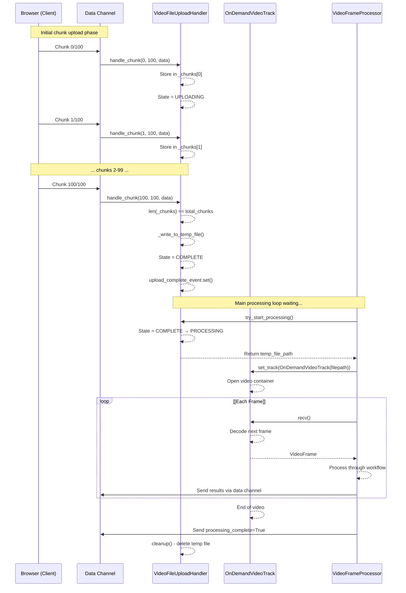

# WebRTC Real-Time Processing


## Purpose and Scope

This document describes the WebRTC real-time video processing system in Roboflow Inference. WebRTC enables bidirectional streaming between browsers and the inference server, allowing users to:

- Stream live webcam video for real-time inference with results returned as video or structured data
- Upload and process video files without pre-buffering entire files into memory
- Control processing parameters dynamically through a data channel
- Deploy processing workloads on serverless infrastructure (Modal)

For general stream processing concepts including `InferencePipeline` architecture, see [InferencePipeline](https://deepwiki.com/roboflow/inference/4.1-inferencepipeline). For deployment of stream processing as a managed service, see [Stream Manager Architecture](https://deepwiki.com/roboflow/inference/4.4-stream-manager-architecture).

**Sources:** [inference/core/interfaces/webrtc_worker/webrtc.py1-68](https://github.com/roboflow/inference/blob/77b91b3b/inference/core/interfaces/webrtc_worker/webrtc.py#L1-L68) [inference/core/interfaces/webrtc_worker/entities.py1-111](https://github.com/roboflow/inference/blob/77b91b3b/inference/core/interfaces/webrtc_worker/entities.py#L1-L111)

---

## System Architecture



**Architecture Components**

|Component|Purpose|Key Classes|
|---|---|---|
|**RTCPeerConnectionWithLoop**|Manages WebRTC connection lifecycle in async event loop|`RTCPeerConnectionWithLoop`|
|**VideoFrameProcessor**|Base class for processing frames through workflow|`VideoFrameProcessor`|
|**VideoTransformTrackWithLoop**|Video track that processes and returns frames|`VideoTransformTrackWithLoop`|
|**OnDemandVideoTrack**|Lazy video decoder for uploaded files (memory efficient)|`OnDemandVideoTrack`|
|**VideoFileUploadHandler**|Handles chunked video file uploads via data channel|`VideoFileUploadHandler`|
|**Watchdog**|Monitors heartbeats and enforces timeouts/quotas|`Watchdog`|

**Sources:** [inference/core/interfaces/webrtc_worker/webrtc.py1-100](https://github.com/roboflow/inference/blob/77b91b3b/inference/core/interfaces/webrtc_worker/webrtc.py#L1-L100) [inference/core/interfaces/webrtc_worker/modal.py1-94](https://github.com/roboflow/inference/blob/77b91b3b/inference/core/interfaces/webrtc_worker/modal.py#L1-L94) [inference/core/interfaces/webrtc_worker/entities.py18-51](https://github.com/roboflow/inference/blob/77b91b3b/inference/core/interfaces/webrtc_worker/entities.py#L18-L51)

---

## WebRTC Connection Setup

### Offer/Answer Exchange

The WebRTC connection follows the standard offer/answer protocol:

1. **Client creates offer**: Browser creates `RTCPeerConnection` and generates SDP offer
2. **Server processes offer**: Server receives offer via HTTP POST to `/initialise_webrtc_worker`
3. **Server creates answer**: Server initializes peer connection, configures tracks/channels, generates SDP answer
4. **Client sets answer**: Browser sets remote description and connection establishes



**Sources:** [inference/core/interfaces/webrtc_worker/webrtc.py832-1000](https://github.com/roboflow/inference/blob/77b91b3b/inference/core/interfaces/webrtc_worker/webrtc.py#L832-L1000) [examples/webrtc/webrtc_worker.py154-227](https://github.com/roboflow/inference/blob/77b91b3b/examples/webrtc/webrtc_worker.py#L154-L227)

### ICE Server Configuration

The system supports STUN/TURN servers for NAT traversal:

```
# From WebRTCWorkerRequest entity
class WebRTCConfig(BaseModel):
    iceServers: List[RTCIceServer]

class RTCIceServer(BaseModel):
    urls: List[str]
    username: Optional[str] = None
    credential: Optional[str] = None
```

Configuration sources:

- **Public STUN servers**: Default for Modal deployments (see `WEBRTC_MODAL_PUBLIC_STUN_SERVERS`)
- **Custom TURN servers**: Passed in `WebRTCWorkerRequest.webrtc_config`
- **Local deployments**: Can use default configuration or custom TURN servers

**Sources:** [inference/core/interfaces/webrtc_worker/entities.py18-26](https://github.com/roboflow/inference/blob/77b91b3b/inference/core/interfaces/webrtc_worker/entities.py#L18-L26) [inference/core/env](https://github.com/roboflow/inference/blob/77b91b3b/inference/core/env#LNaN-LNaN)

### Event Loop Management

WebRTC requires an async event loop. The system uses `RTCPeerConnectionWithLoop` to bind the peer connection to a specific loop:

```
class RTCPeerConnectionWithLoop(RTCPeerConnection):
    def __init__(
        self,
        asyncio_loop: asyncio.AbstractEventLoop,
        *args,
        **kwargs,
    ):
        super().__init__(*args, **kwargs)
        self._loop = asyncio_loop
```

This is critical because:

- **Local deployment**: Creates new event loop in spawned process
- **Modal deployment**: Runs in Modal container's event loop
- **aioice workaround**: Removes cached lock bound to old event loop (see lines 843-850 in webrtc.py)

**Sources:** [inference/core/interfaces/webrtc_worker/webrtc.py269-278](https://github.com/roboflow/inference/blob/77b91b3b/inference/core/interfaces/webrtc_worker/webrtc.py#L269-L278) [inference/core/interfaces/webrtc_worker/webrtc.py832-850](https://github.com/roboflow/inference/blob/77b91b3b/inference/core/interfaces/webrtc_worker/webrtc.py#L832-L850)

---

## Video Frame Processing Pipeline

### VideoFrameProcessor Base Class

`VideoFrameProcessor` is the core processing engine that can operate with or without video output:

**Key Responsibilities:**

1. Initialize `InferencePipeline` with workflow configuration
2. Process frames through workflow
3. Serialize outputs for data channel transmission
4. Manage flow control with ACK-based pacing



**Data Output Modes:**

|Mode|Configuration|Behavior|
|---|---|---|
|`DataOutputMode.NONE`|`data_output=None` or `[]`|Send only metadata (frame_id, timestamp)|
|`DataOutputMode.ALL`|`data_output=["*"]`|Send all workflow outputs except images|
|`DataOutputMode.SPECIFIC`|`data_output=["field1", "field2"]`|Send only listed fields (including images if named)|

**Stream Output Modes:**

|Mode|Configuration|Behavior|
|---|---|---|
|`StreamOutputMode.AUTO_DETECT`|`stream_output=None`|Auto-detect first image output on frame 1|
|`StreamOutputMode.NO_VIDEO`|`stream_output=[]`|No video track (data-only mode)|
|`StreamOutputMode.SPECIFIC_FIELD`|`stream_output=["field"]`|Use specific workflow output field|

**Sources:** [inference/core/interfaces/webrtc_worker/webrtc.py280-698](https://github.com/roboflow/inference/blob/77b91b3b/inference/core/interfaces/webrtc_worker/webrtc.py#L280-L698) [inference/core/interfaces/webrtc_worker/entities.py86-96](https://github.com/roboflow/inference/blob/77b91b3b/inference/core/interfaces/webrtc_worker/entities.py#L86-L96)

### VideoTransformTrackWithLoop

`VideoTransformTrackWithLoop` extends `VideoFrameProcessor` and `VideoStreamTrack` for video output:

```
class VideoTransformTrackWithLoop(VideoStreamTrack, VideoFrameProcessor):
    """Video track that processes frames through workflow and sends video back."""
    
    async def recv(self):
        # 1. Wait for track to be ready (video file upload case)
        # 2. Optional ACK pacing for flow control
        # 3. Drain queue if using PlayerStreamTrack (RTSP)
        # 4. Get frame from track
        # 5. Auto-detect stream_output on first frame if needed
        # 6. Process frame through workflow
        # 7. Send data via data channel
        # 8. Return processed video frame
```

The `recv()` method is called by WebRTC to retrieve each frame. Key features:

- **Frame draining**: Drops old frames from RTSP/video file queues to maintain real-time processing
- **Auto-detection**: Finds first image output if `stream_output=None`
- **Dual output**: Sends processed video frame AND JSON data simultaneously
- **Error overlay**: Overlays error messages on video frames when `include_errors_on_frame=True`

**Sources:** [inference/core/interfaces/webrtc_worker/webrtc.py700-807](https://github.com/roboflow/inference/blob/77b91b3b/inference/core/interfaces/webrtc_worker/webrtc.py#L700-L807)

### OnDemandVideoTrack for Video Files

For video file uploads, `OnDemandVideoTrack` provides memory-efficient processing:

```
class OnDemandVideoTrack(MediaStreamTrack):
    """Lazy video track that decodes frames on-demand without pre-buffering.
    
    Unlike MediaPlayer which spawns a background thread to decode ALL frames
    into an unbounded queue, this class decodes one frame per recv() call.
    This keeps memory usage constant (~50-100MB) regardless of video length.
    """
    
    async def recv(self) -> VideoFrame:
        loop = asyncio.get_running_loop()
        frame = await loop.run_in_executor(None, lambda: next(self._iterator, None))
        if frame is None:
            self.stop()
            raise MediaStreamError("End of video file")
        return frame
```

**Memory Comparison:**

|Approach|Memory Usage|Implementation|
|---|---|---|
|`MediaPlayer` (default aiortc)|O(N) - buffers entire video|Background thread + unbounded queue|
|`OnDemandVideoTrack`|O(1) - constant ~50-100MB|Decode one frame per `recv()` call|

**Sources:** [inference/core/interfaces/webrtc_worker/webrtc.py87-121](https://github.com/roboflow/inference/blob/77b91b3b/inference/core/interfaces/webrtc_worker/webrtc.py#L87-L121)

### Processing Flow for Different Input Types



**Sources:** [inference/core/interfaces/webrtc_worker/webrtc.py758-807](https://github.com/roboflow/inference/blob/77b91b3b/inference/core/interfaces/webrtc_worker/webrtc.py#L758-L807) [inference/core/interfaces/webrtc_worker/webrtc.py557-617](https://github.com/roboflow/inference/blob/77b91b3b/inference/core/interfaces/webrtc_worker/webrtc.py#L557-L617)

---

## Data Channel Communication

### Chunked Binary Protocol

The data channel uses a custom binary protocol to handle large payloads (e.g., base64-encoded images):

**Header Format:**

```
[frame_id: 4 bytes][chunk_index: 4 bytes][total_chunks: 4 bytes][payload: N bytes]
```

All integers are `uint32` little-endian (via `struct.pack("<III", ...)`).

```
CHUNK_SIZE = 48 * 1024  # 48KB - safe for all WebRTC implementations

def create_chunked_binary_message(
    frame_id: int, chunk_index: int, total_chunks: int, payload: bytes
) -> bytes:
    """Create a binary message with standard 12-byte header."""
    header = struct.pack("<III", frame_id, chunk_index, total_chunks)
    return header + payload
```

**Rate Limiting:**

The `send_chunked_data()` function includes backpressure handling:

```
async def send_chunked_data(
    data_channel: RTCDataChannel,
    frame_id: int,
    payload_bytes: bytes,
    chunk_size: int = CHUNK_SIZE,
    heartbeat_callback: Optional[Callable[[], None]] = None,
) -> None:
    # Wait for buffer to drain if above threshold
    while data_channel.bufferedAmount > WEBRTC_DATA_CHANNEL_BUFFER_SIZE_LIMIT:
        sleep_count += 1
        if heartbeat_callback:
            heartbeat_callback()  # Keep watchdog alive
        await asyncio.sleep(WEBRTC_DATA_CHANNEL_BUFFER_DRAINING_DELAY)
```

Configuration via environment variables:

- `WEBRTC_DATA_CHANNEL_BUFFER_SIZE_LIMIT`: Max buffered bytes before waiting (default varies)
- `WEBRTC_DATA_CHANNEL_BUFFER_DRAINING_DELAY`: Sleep duration when waiting (default varies)

**Sources:** [inference/core/interfaces/webrtc_worker/webrtc.py71-267](https://github.com/roboflow/inference/blob/77b91b3b/inference/core/interfaces/webrtc_worker/webrtc.py#L71-L267)

### WebRTC Data Output Structure

The data channel sends JSON-encoded `WebRTCOutput` messages:

```
class WebRTCOutput(BaseModel):
    serialized_output_data: Optional[Dict[str, Any]] = None  # Workflow outputs
    video_metadata: Optional[WebRTCVideoMetadata] = None     # Frame metadata
    errors: List[str] = Field(default_factory=list)          # Processing errors
    processing_complete: bool = False                        # End-of-video signal
```

**Video Metadata:**

```
class WebRTCVideoMetadata(BaseModel):
    frame_id: int                    # Sequential frame counter
    received_at: str                 # ISO timestamp when received
    pts: Optional[int] = None        # Presentation timestamp
    time_base: Optional[float] = None
    declared_fps: Optional[float] = None
    measured_fps: Optional[float] = None
```

**Sources:** [inference/core/interfaces/webrtc_worker/entities.py53-75](https://github.com/roboflow/inference/blob/77b91b3b/inference/core/interfaces/webrtc_worker/entities.py#L53-L75)

### Flow Control with ACK Window

For video file processing (`webrtc_realtime_processing=False`), the system implements receiver-paced flow control:

```
def record_ack(self, ack: int) -> None:
    """Record cumulative ACK from the client.
    
    ACK semantics: client has fully handled all frames <= ack.
    Backwards compatible: pacing is disabled until we receive the first ACK.
    """
    if ack_int > self._ack_last:
        self._ack_last = ack_int
        self._ack_event.set()

async def _wait_for_ack_window(self, next_frame_id: int) -> None:
    """Block frame production when too far ahead of client ACKs.
    
    Allows up to (_ack_window) frames in flight beyond the last ACK.
    Only active for non-realtime processing (video file uploads).
    """
    if self.realtime_processing:
        return
    if self._ack_last == 0:
        return  # Not yet enabled
    
    while next_frame_id > (self._ack_last + self._ack_window):
        self._ack_event.clear()
        await asyncio.wait_for(self._ack_event.wait(), timeout=0.2)
```

**ACK Protocol:**

|Step|Action|Purpose|
|---|---|---|
|1. Client processes frame N|Client finishes rendering/storing result|Ensures client is ready|
|2. Client sends ACK={N}|JSON message via data channel: `{"ack": N}`|Signals completion|
|3. Server updates `_ack_last`|`record_ack(N)` called|Tracks client progress|
|4. Server checks window|If producing frame > (ack + window), wait|Prevents buffer overflow|

Configuration:

- `WEBRTC_DATA_CHANNEL_ACK_WINDOW`: Number of frames allowed in flight (default varies by deployment)

**Sources:** [inference/core/interfaces/webrtc_worker/webrtc.py373-424](https://github.com/roboflow/inference/blob/77b91b3b/inference/core/interfaces/webrtc_worker/webrtc.py#L373-L424) [inference/core/interfaces/stream_manager/manager_app/entities.py126-132](https://github.com/roboflow/inference/blob/77b91b3b/inference/core/interfaces/stream_manager/manager_app/entities.py#L126-L132)

---

## Video File Upload Protocol

### VideoFileUploadHandler

Handles chunked video file uploads via data channel with automatic completion:

```
class VideoFileUploadHandler:
    """Handles video file uploads via data channel.
    
    Protocol: [chunk_index:u32][total_chunks:u32][payload]
    Auto-completes when all chunks received.
    """
    
    def __init__(self):
        self._chunks: Dict[int, bytes] = {}
        self._total_chunks: Optional[int] = None
        self._temp_file_path: Optional[str] = None
        self._state = VideoFileUploadState.IDLE
        self.upload_complete_event = asyncio.Event()
```

**State Machine:**



```
- **`[*]`**: Estado inicial.
- **`IDLE` → `UPLOADING`**: Se activa al recibir el primer chunk.
- **`UPLOADING` → `UPLOADING`**: Recibe más chunks (bucle).
- **`UPLOADING` → `COMPLETE`**: Cuando se reciben todos los chunks.
- **`COMPLETE` → `PROCESSING`**: Llama a `try_start_processing()` — aquí se inicia el procesamiento real del archivo.
- **`PROCESSING` → `[*]`**: Finaliza con limpieza (`Cleanup`).

Las notas explican qué ocurre en cada estado:

- En `UPLOADING`: acumulación en memoria + logging.
- En `COMPLETE`: escritura a disco temporal + liberación de memoria.
- En `PROCESSING`: garantía atómica de que se llama a `process_video_file()`.
```

**Chunk Format:**

The upload protocol differs from the output protocol (no frame_id):

```
[chunk_index: 4 bytes][total_chunks: 4 bytes][payload: N bytes]
```

```
VIDEO_FILE_HEADER_SIZE = 8  # Just chunk_index + total_chunks

def parse_video_file_chunk(message: bytes) -> Tuple[int, int, bytes]:
    """Parse video file chunk message.
    Returns: (chunk_index, total_chunks, payload)
    """
    if len(message) < VIDEO_FILE_HEADER_SIZE:
        raise ValueError(f"Message too short: {len(message)} bytes")
    chunk_index, total_chunks = struct.unpack("<II", message[:8])
    return chunk_index, total_chunks, message[8:]
```

**Sources:** [inference/core/interfaces/webrtc_worker/webrtc.py123-201](https://github.com/roboflow/inference/blob/77b91b3b/inference/core/interfaces/webrtc_worker/webrtc.py#L123-L201) [inference/core/interfaces/webrtc_worker/entities.py98-111](https://github.com/roboflow/inference/blob/77b91b3b/inference/core/interfaces/webrtc_worker/entities.py#L98-L111) [inference/core/interfaces/webrtc_worker/utils.py191-201](https://github.com/roboflow/inference/blob/77b91b3b/inference/core/interfaces/webrtc_worker/utils.py#L191-L201)

### Upload and Processing Flow



**Sources:** [inference/core/interfaces/webrtc_worker/webrtc.py123-201](https://github.com/roboflow/inference/blob/77b91b3b/inference/core/interfaces/webrtc_worker/webrtc.py#L123-L201) [inference/core/interfaces/webrtc_worker/webrtc.py87-121](https://github.com/roboflow/inference/blob/77b91b3b/inference/core/interfaces/webrtc_worker/webrtc.py#L87-L121)

### Data-Only Processing Mode

When `stream_output=[]`, the system runs in data-only mode (no video track):

```
async def process_frames_data_only(self):
    """Process frames for data extraction only, without video track output.
    
    This is used when stream_output=[] and no video track is needed.
    """
    logger.info("Starting data-only frame processing...")
    
    try:
        while not self._stop_processing:
            # ACK-based pacing
            await self._wait_for_ack_window(next_frame_id=self._received_frames + 1)
            
            # Get frame from media track
            if not self.track or self.track.readyState == "ended":
                break
            
            frame = await self.track.recv()
            self._received_frames += 1
            
            # Process without rendering
            workflow_output, _, errors = await self._process_frame_async(
                frame=frame,
                frame_id=self._received_frames,
                render_output=False,
                include_errors_on_frame=False,
            )
            
            # Send data via data channel
            await self._send_data_output(workflow_output, frame_timestamp, frame, errors)
    finally:
        # Send completion signal
        await self._send_processing_complete()
```

This mode is useful for:

- **Data extraction**: Extract predictions/metadata without video rendering
- **Memory efficiency**: No video encoding/transmission overhead
- **Batch processing**: Process entire video files for analytics

**Sources:** [inference/core/interfaces/webrtc_worker/webrtc.py557-617](https://github.com/roboflow/inference/blob/77b91b3b/inference/core/interfaces/webrtc_worker/webrtc.py#L557-L617)

---


### Watchdog and Timeout Management

The `Watchdog` class monitors processing health:

```
class Watchdog:
    def __init__(
        self,
        api_key: str,
        timeout_seconds: int,
        on_timeout: Optional[Callable[[], None]] = None,
    ):
        self.timeout_seconds = timeout_seconds
        self.last_heartbeat = datetime.datetime.now()
        self.on_timeout = on_timeout
        self._thread = threading.Thread(target=self._watchdog_thread)
    
    def heartbeat(self):
        """Called by processing code to signal liveness."""
        self.last_heartbeat = datetime.datetime.now()
        self._heartbeats += 1
    
    def _watchdog_thread(self):
        while not self._stopping:
            if not self.is_alive():
                logger.error("Watchdog timeout reached")
                self.on_timeout(message=f"Timeout reached")
                break
            
            # Optional: Check quota
            if WEBRTC_MODAL_USAGE_QUOTA_ENABLED and is_over_quota(self._api_key):
                logger.error("API key over quota")
                self.on_timeout(message=f"API key over quota")
                break
```

**Integration with Modal:**

```
async def run_rtc_peer_connection_with_watchdog(
    webrtc_request: WebRTCWorkerRequest,
    send_answer: Callable[[WebRTCWorkerResult], None],
    model_manager: ModelManager,
    watchdog: Watchdog,
):
    rtc_peer_connection_task = asyncio.create_task(
        init_rtc_peer_connection_with_loop(
            webrtc_request=webrtc_request,
            heartbeat_callback=watchdog.heartbeat,  # Passed to processor
        )
    )
    
    def on_timeout(message: Optional[str] = ""):
        # Use call_soon_threadsafe since callback from watchdog thread
        loop.call_soon_threadsafe(rtc_peer_connection_task.cancel, message)
    
    watchdog.on_timeout = on_timeout
    watchdog.start()
```

**Heartbeat Sources:**

- **Data channel send**: Called during `send_chunked_data()` buffer waits
- **ACK wait**: Called during `_wait_for_ack_window()` timeout loops
- **Periodic**: Throughout processing to signal liveness

**Sources:** [inference/core/interfaces/webrtc_worker/watchdog.py1-83](https://github.com/roboflow/inference/blob/77b91b3b/inference/core/interfaces/webrtc_worker/watchdog.py#L1-L83) [inference/core/interfaces/webrtc_worker/modal.py210-252](https://github.com/roboflow/inference/blob/77b91b3b/inference/core/interfaces/webrtc_worker/modal.py#L210-L252)

### Usage Tracking

Modal executions track billable usage:

```
# In rtc_peer_connection_modal() method
_exec_session_started = datetime.datetime.now()
webrtc_request.processing_session_started = _exec_session_started

# Subtract container startup time for first invocation (cold start)
if self._function_call_number_on_container == 1 and self._cold_start:
    webrtc_request.processing_session_started -= datetime.timedelta(
        seconds=self._container_startup_time_seconds
    )

# ... processing ...

_exec_session_stopped = datetime.datetime.now()

# Record usage
usage_collector.record_usage(
    source=workflow_id,
    category="modal",
    api_key=webrtc_request.api_key,
    resource_details={
        "plan": webrtc_plan,
        "billable": True,
        "video_source": video_source,
        "is_preview": webrtc_request.is_preview,
    },
    execution_duration=(_exec_session_stopped - _exec_session_started).total_seconds(),
)
```

**Sources:** [inference/core/interfaces/webrtc_worker/modal.py295-435](https://github.com/roboflow/inference/blob/77b91b3b/inference/core/interfaces/webrtc_worker/modal.py#L295-L435)

---

## Integration Points

### InferencePipeline Integration

WebRTC processing initializes `InferencePipeline` with special `VideoFrameProducer`:

```
self._inference_pipeline = InferencePipeline.init_with_workflow(
    video_reference=VideoFrameProducer,  # Placeholder class
    workflow_specification=workflow_configuration.workflow_specification,
    workspace_name=workflow_configuration.workspace_name,
    workflow_id=workflow_configuration.workflow_id,
    api_key=api_key,
    image_input_name=workflow_configuration.image_input_name,
    workflows_parameters=workflow_configuration.workflows_parameters,
    workflows_thread_pool_workers=workflow_configuration.workflows_thread_pool_workers,
    video_metadata_input_name=workflow_configuration.video_metadata_input_name,
    model_manager=model_manager,
)
```

**Key Differences from Normal InferencePipeline:**

|Aspect|Normal InferencePipeline|WebRTC InferencePipeline|
|---|---|---|
|Video Source|Actual video file/stream/webcam|`VideoFrameProducer` placeholder|
|Frame Delivery|VideoSource pulls from source|Manual push via `_on_video_frame()`|
|Threading|Separate decoding/inference threads|Single-threaded in event loop|
|Buffer Management|VideoSource handles buffering|WebRTC track handles buffering|

The pipeline is never started with `start()`. Instead, frames are pushed directly:

```
video_frame = InferenceVideoFrame(
    image=np_image,
    frame_id=frame_id,
    frame_timestamp=datetime.datetime.now(),
    comes_from_video_file=False,
    fps=30,
)
workflow_output = inference_pipeline._on_video_frame([video_frame])[0]
```

**Sources:** [inference/core/interfaces/webrtc_worker/webrtc.py347-360](https://github.com/roboflow/inference/blob/77b91b3b/inference/core/interfaces/webrtc_worker/webrtc.py#L347-L360) [inference/core/interfaces/webrtc_worker/utils.py41-108](https://github.com/roboflow/inference/blob/77b91b3b/inference/core/interfaces/webrtc_worker/utils.py#L41-L108)

### Stream Manager Integration

The Stream Manager provides an alternative WebRTC implementation that integrates with `InferencePipeline` threads:

**Key Components:**

- `SyncAsyncQueue`: Bridges async WebRTC event loop and sync InferencePipeline threads
- `WebRTCVideoFrameProducer`: Implements `VideoFrameProducer` interface, pulls from queue
- `VideoTransformTrack`: Runs reader loop in async, pushes frames to queue
- `webrtc_sink()`: Custom sink that puts processed frames into queue

**Comparison with WebRTC Worker:**

|Aspect|WebRTC Worker|Stream Manager WebRTC|
|---|---|---|
|InferencePipeline|Not started, manual frame push|Started with threads|
|Processing Model|Event loop only|Multi-threaded (VideoSource + Inference threads)|
|Use Case|Modal serverless, simple workflows|Local deployments, complex pipelines|
|Video Sources|WebRTC only|Any source InferencePipeline supports|

**Sources:** [inference/core/interfaces/stream_manager/manager_app/webrtc.py1-482](https://github.com/roboflow/inference/blob/77b91b3b/inference/core/interfaces/stream_manager/manager_app/webrtc.py#L1-L482) [inference/core/interfaces/stream_manager/manager_app/inference_pipeline_manager.py249-478](https://github.com/roboflow/inference/blob/77b91b3b/inference/core/interfaces/stream_manager/manager_app/inference_pipeline_manager.py#L249-L478)

### HTTP API Endpoints

The HTTP API exposes a single endpoint for WebRTC initialization:

```
# POST /initialise_webrtc_worker
async def initialise_webrtc_worker(
    webrtc_request: WebRTCWorkerRequest,
) -> WebRTCWorkerResult:
    """Initialize WebRTC peer connection.
    
    Returns SDP answer for client to setRemoteDescription().
    """
    from inference.core.interfaces.webrtc_worker import start_worker
    
    result = await start_worker(webrtc_request=webrtc_request)
    return result
```

**Request Structure (`WebRTCWorkerRequest`):**

```
class WebRTCWorkerRequest(BaseModel):
    api_key: Optional[str] = None
    workflow_configuration: WorkflowConfiguration
    is_preview: bool = False
    webrtc_offer: WebRTCOffer  # SDP offer from client
    webrtc_config: Optional[WebRTCConfig] = None  # ICE servers
    webrtc_realtime_processing: bool = True
    stream_output: Optional[List[str]] = None
    data_output: Optional[List[str]] = None
    declared_fps: Optional[float] = None
    rtsp_url: Optional[str] = None
    processing_timeout: Optional[int] = None
    requested_plan: Optional[str] = "webrtc-gpu-small"
    requested_region: Optional[str] = None  # Modal region
```

**Response Structure (`WebRTCWorkerResult`):**

```
class WebRTCWorkerResult(BaseModel):
    answer: Optional[WebRTCOffer] = None  # SDP answer for client
    process_id: Optional[Union[int, str]] = None
    exception_type: Optional[str] = None
    error_message: Optional[str] = None
    error_context: Optional[str] = None
    inner_error: Optional[str] = None
```

**Sources:** [inference/core/interfaces/webrtc_worker/__init__.py1-77](https://github.com/roboflow/inference/blob/77b91b3b/inference/core/interfaces/webrtc_worker/__init__.py#L1-L77) [inference/core/interfaces/webrtc_worker/entities.py28-84](https://github.com/roboflow/inference/blob/77b91b3b/inference/core/interfaces/webrtc_worker/entities.py#L28-L84)

---

## Configuration Reference

### Environment Variables

**WebRTC Core:**

- `WEBRTC_REALTIME_PROCESSING`: Default realtime mode (`True`/`False`)
- `WEBRTC_DATA_CHANNEL_BUFFER_SIZE_LIMIT`: Max buffered bytes before backpressure
- `WEBRTC_DATA_CHANNEL_BUFFER_DRAINING_DELAY`: Sleep duration when waiting for buffer drain
- `WEBRTC_DATA_CHANNEL_ACK_WINDOW`: Number of frames allowed in flight for flow control

**Modal Deployment:**

- `WEBRTC_MODAL_TOKEN_ID`: Modal authentication token ID
- `WEBRTC_MODAL_TOKEN_SECRET`: Modal authentication token secret
- `WEBRTC_MODAL_APP_NAME`: Modal app name (default: varies)
- `WEBRTC_MODAL_IMAGE_NAME`: Docker image for Modal containers
- `WEBRTC_MODAL_IMAGE_TAG`: Docker image tag (defaults to inference version)
- `WEBRTC_MODAL_GCP_SECRET_NAME`: GCP secret for private registry
- `WEBRTC_MODAL_FUNCTION_GPU`: GPU type (T4, A10G, etc.)
- `WEBRTC_MODAL_FUNCTION_TIME_LIMIT`: Max execution time (seconds)
- `WEBRTC_MODAL_FUNCTION_MAX_TIME_LIMIT`: Absolute max time limit
- `WEBRTC_MODAL_FUNCTION_MIN_CONTAINERS`: Minimum warm containers
- `WEBRTC_MODAL_FUNCTION_BUFFER_CONTAINERS`: Buffer for scaling
- `WEBRTC_MODAL_FUNCTION_SCALEDOWN_WINDOW`: Scale-down delay
- `WEBRTC_MODAL_FUNCTION_ENABLE_MEMORY_SNAPSHOT`: Enable GPU snapshots
- `WEBRTC_MODAL_FUNCTION_MAX_INPUTS`: Max concurrent inputs per container
- `WEBRTC_MODAL_MIN_CPU_CORES`: Minimum CPU cores
- `WEBRTC_MODAL_MIN_RAM_MB`: Minimum RAM (MB)
- `WEBRTC_MODAL_PRELOAD_MODELS`: Comma-separated model IDs to preload
- `WEBRTC_MODAL_PRELOAD_HF_IDS`: Comma-separated HuggingFace IDs to preload
- `WEBRTC_MODAL_MODELS_PRELOAD_API_KEY`: API key for model preloading
- `WEBRTC_MODAL_SHUTDOWN_RESERVE`: Reserve time before timeout (seconds)
- `WEBRTC_MODAL_WATCHDOG_TIMEMOUT`: Watchdog timeout (seconds)
- `WEBRTC_MODAL_RESPONSE_TIMEOUT`: Timeout for receiving answer (seconds)
- `WEBRTC_MODAL_USAGE_QUOTA_ENABLED`: Enable quota checking
- `WEBRTC_MODAL_PUBLIC_STUN_SERVERS`: Default public STUN servers
- `WEBRTC_MODAL_RTSP_PLACEHOLDER`: Placeholder for RTSP URLs
- `WEBRTC_MODAL_RTSP_PLACEHOLDER_URL`: Actual RTSP URL to use
- `WEBRTC_MODAL_ROBOFLOW_INTERNAL_SERVICE_NAME`: Internal service name

**Debugging:**

- `DEBUG_WEBRTC_PROCESSING_LATENCY`: Log processing latency
- `DEBUG_AIORTC_QUEUES`: Log aiortc queue sizes

**Sources:** [inference/core/env](https://github.com/roboflow/inference/blob/77b91b3b/inference/core/env#LNaN-LNaN) [inference/core/interfaces/webrtc_worker/modal.py1-53](https://github.com/roboflow/inference/blob/77b91b3b/inference/core/interfaces/webrtc_worker/modal.py#L1-L53)


### On this page

- [WebRTC Real-Time Processing](https://deepwiki.com/roboflow/inference/4.5-webrtc-real-time-processing#webrtc-real-time-processing)
- [Purpose and Scope](https://deepwiki.com/roboflow/inference/4.5-webrtc-real-time-processing#purpose-and-scope)
- [System Architecture](https://deepwiki.com/roboflow/inference/4.5-webrtc-real-time-processing#system-architecture)
- [WebRTC Connection Setup](https://deepwiki.com/roboflow/inference/4.5-webrtc-real-time-processing#webrtc-connection-setup)
- [Offer/Answer Exchange](https://deepwiki.com/roboflow/inference/4.5-webrtc-real-time-processing#offeranswer-exchange)
- [ICE Server Configuration](https://deepwiki.com/roboflow/inference/4.5-webrtc-real-time-processing#ice-server-configuration)
- [Event Loop Management](https://deepwiki.com/roboflow/inference/4.5-webrtc-real-time-processing#event-loop-management)
- [Video Frame Processing Pipeline](https://deepwiki.com/roboflow/inference/4.5-webrtc-real-time-processing#video-frame-processing-pipeline)
- [VideoFrameProcessor Base Class](https://deepwiki.com/roboflow/inference/4.5-webrtc-real-time-processing#videoframeprocessor-base-class)
- [VideoTransformTrackWithLoop](https://deepwiki.com/roboflow/inference/4.5-webrtc-real-time-processing#videotransformtrackwithloop)
- [OnDemandVideoTrack for Video Files](https://deepwiki.com/roboflow/inference/4.5-webrtc-real-time-processing#ondemandvideotrack-for-video-files)
- [Processing Flow for Different Input Types](https://deepwiki.com/roboflow/inference/4.5-webrtc-real-time-processing#processing-flow-for-different-input-types)
- [Data Channel Communication](https://deepwiki.com/roboflow/inference/4.5-webrtc-real-time-processing#data-channel-communication)
- [Chunked Binary Protocol](https://deepwiki.com/roboflow/inference/4.5-webrtc-real-time-processing#chunked-binary-protocol)
- [WebRTC Data Output Structure](https://deepwiki.com/roboflow/inference/4.5-webrtc-real-time-processing#webrtc-data-output-structure)
- [Flow Control with ACK Window](https://deepwiki.com/roboflow/inference/4.5-webrtc-real-time-processing#flow-control-with-ack-window)
- [Video File Upload Protocol](https://deepwiki.com/roboflow/inference/4.5-webrtc-real-time-processing#video-file-upload-protocol)
- [VideoFileUploadHandler](https://deepwiki.com/roboflow/inference/4.5-webrtc-real-time-processing#videofileuploadhandler)
- [Upload and Processing Flow](https://deepwiki.com/roboflow/inference/4.5-webrtc-real-time-processing#upload-and-processing-flow)
- [Data-Only Processing Mode](https://deepwiki.com/roboflow/inference/4.5-webrtc-real-time-processing#data-only-processing-mode)
- [Modal Deployment](https://deepwiki.com/roboflow/inference/4.5-webrtc-real-time-processing#modal-deployment)
- [Serverless Execution Architecture](https://deepwiki.com/roboflow/inference/4.5-webrtc-real-time-processing#serverless-execution-architecture)
- [GPU/CPU Class Selection](https://deepwiki.com/roboflow/inference/4.5-webrtc-real-time-processing#gpucpu-class-selection)
- [Model Preloading Strategy](https://deepwiki.com/roboflow/inference/4.5-webrtc-real-time-processing#model-preloading-strategy)
- [Watchdog and Timeout Management](https://deepwiki.com/roboflow/inference/4.5-webrtc-real-time-processing#watchdog-and-timeout-management)
- [Usage Tracking](https://deepwiki.com/roboflow/inference/4.5-webrtc-real-time-processing#usage-tracking)
- [Integration Points](https://deepwiki.com/roboflow/inference/4.5-webrtc-real-time-processing#integration-points)
- [InferencePipeline Integration](https://deepwiki.com/roboflow/inference/4.5-webrtc-real-time-processing#inferencepipeline-integration)
- [Stream Manager Integration](https://deepwiki.com/roboflow/inference/4.5-webrtc-real-time-processing#stream-manager-integration)
- [HTTP API Endpoints](https://deepwiki.com/roboflow/inference/4.5-webrtc-real-time-processing#http-api-endpoints)
- [Configuration Reference](https://deepwiki.com/roboflow/inference/4.5-webrtc-real-time-processing#configuration-reference)
- [Environment Variables](https://deepwiki.com/roboflow/inference/4.5-webrtc-real-time-processing#environment-variables)

