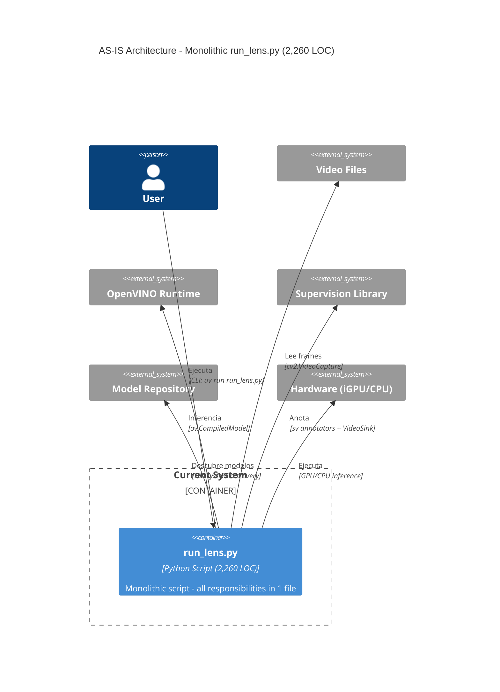
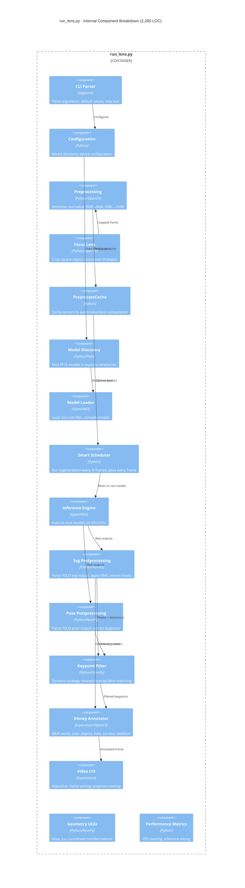
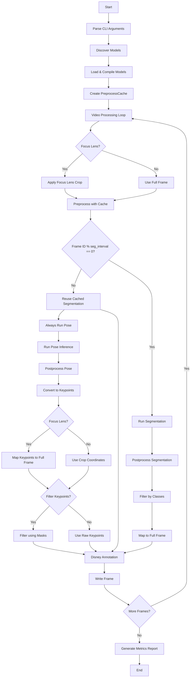

# C4 Model View: AS-IS Architecture - run_lens.py (Monolithic)

## Container Diagram - AS-IS



## Component Diagram - Internal Structure of run_lens.py



## Code Flow Diagram - Main Pipeline



## Data Structures & Transformations

### Preprocessing Pipeline
```python
# Input Frame (BGR)
frame_bgr: np.ndarray[H, W, 3]

# Focus Lens (optional)
crop_frame: np.ndarray[focus_size, focus_size, 3]
crop_x, crop_y: int
scale_factor: float

# Letterbox + Normalization
tensor: np.ndarray[1, 3, H_model, W_model]  # Float32, [0, 1]
metadata: {"ratio": float, "pad_w": float, "pad_h": float}

# Cache Strategy
if seg_shape == pose_shape:
    single_tensor → reused for both models
else:
    seg_tensor, pose_tensor → computed separately
```

### Model Outputs
```python
# Segmentation Output
output_boxes: np.ndarray[1, 116, 2100]  # 80 classes + 4 bbox + 32 mask_coefs
output_masks: np.ndarray[1, 32, 80, 80]  # Mask prototypes

# Pose Output  
output_pose: np.ndarray[1, 56, 2100]  # 1 class + 4 bbox + 17*3 keypoints
```

### Postprocessing Results
```python
# Detection Results
boxes: np.ndarray[N, 4]  # [x1, y1, x2, y2] in crop coords
scores: np.ndarray[N]
class_ids: np.ndarray[N]
masks: np.ndarray[N, H, W]  # Binary masks

# Pose Results
pose_boxes: np.ndarray[M, 4]  # Person bounding boxes
pose_scores: np.ndarray[M]
keypoints: np.ndarray[M, 17, 3]  # [x, y, confidence]
```

### Supervision Integration
```python
# Convert to Supervision types
detections: sv.Detections(xyxy, confidence, class_id, mask)
keypoints: sv.KeyPoints(xy, confidence, class_id)

# Apply Focus Lens mapping
full_frame_detections: sv.Detections  # coords mapped to original frame
full_frame_keypoints: sv.KeyPoints   # coords mapped to original frame
```

## Key Algorithms & Strategies

### 1. Smart Scheduling
- **Segmentation**: Every N frames (default: 5)
- **Pose**: Every frame (always)
- **Benefit**: Reduces computation by ~80% for segmentation

### 2. Focus Lens Crop Strategy
```python
if frame_size < focus_size:
    if strategy == "zoom":
        # Scale up frame to focus_size
    elif strategy == "pad":
        # Letterbox inverse: pad with black
crop = frame[crop_y:crop_y+focus_size, crop_x:crop_x+focus_size]
```

### 3. Preprocess Cache Optimization
```python
if seg_resolution == pose_resolution:
    # Compute once, reuse for both models
    tensor = preprocess(frame, resolution)
    seg_tensor = pose_tensor = tensor
else:
    # Compute separately
    seg_tensor = preprocess(frame, seg_resolution)
    pose_tensor = preprocess(frame, pose_resolution)
```

### 4. Dynamic Keypoint Filtering
```python
# Strategy selection based on person overlap
if max_bbox_iou > 0.3:
    strategy = "overlap"    # Precise bbox matching
else:
    strategy = "nearest"    # Fast centroid matching

# Apply filtering: keypoints outside person masks → [0, 0]
```

### 5. Disney/Roger Rabbit Annotation
```python
# Multi-layer rendering
frame_bw = grayscale(original) * 0.6              # Dark B&W world
lens_region = frame_bw[crop_area] * 1.1          # Slightly brighter lens
halo_effect = gaussian_blur(masks, alpha=0.5)     # Define boundaries
color_objects = original * 1.2 + masks             # Spotlight effect
skeleton_transparent = keypoints * 0.3 opacity     # Ghost effect
```

## Performance Characteristics

### Resource Usage
- **Memory**: ~800MB (models + tensors + cache)
- **Compute**: Segmentation every 5 frames, Pose every frame
- **I/O**: Sequential frame reading/writing

### Bottlenecks
1. **Model Loading**: Initial compilation time (~2-3 seconds)
2. **Focus Lens**: Additional crop/preprocessing overhead
3. **Keypoint Filtering**: Dynamic strategy adds computation

### Optimizations
1. **Preprocess Cache**: Avoids redundant tensor computation
2. **Smart Scheduling**: Reduces segmentation calls by 80%
3. **OpenVINO FP16**: Optimized inference on Intel iGPU

## Integration Points

### External Dependencies
- **OpenVINO**: Model loading, compilation, inference
- **Supervision**: Annotation, video I/O, data structures
- **OpenCV**: Image processing, geometric transformations
- **NumPy**: Array operations, mathematical computations

### File System
- **Model Discovery**: `exports/fp16/sauron_*/`
- **Video I/O**: Input files, output videos
- **Configuration**: CLI arguments only (no config files)

### Hardware Interface
- **GPU/CPU Selection**: OpenVINO device enumeration
- **Memory Management**: Tensor allocation and reuse
- **Threading**: Single-threaded processing

## Technical Debt & Issues

### Maintainability Problems
1. **Monolithic Structure**: 2,260 LOC in single file
2. **Mixed Responsibilities**: CLI, preprocessing, inference, annotation
3. **Hardcoded Values**: Magic numbers, fixed COCO classes
4. **No Abstraction**: Direct function calls, no interfaces

### Testing Challenges
1. **No Unit Tests**: Impossible to test components in isolation
2. **Tight Coupling**: All components depend on global state
3. **Side Effects**: Functions modify multiple data structures
4. **Complex State**: Cache, scheduling, filtering interdependencies

### Extensibility Limits
1. **Fixed Pipeline**: Cannot easily swap components
2. **Hardcoded Logic**: COCO-specific, Disney-style only
3. **No Plugin System**: Adding new models requires code changes
4. **Configuration**: CLI-only, no runtime reconfiguration

This monolithic architecture, while functional, presents significant challenges for maintenance, testing, and future enhancement - motivating the refactorization to modular Luna phase.

## Components to Extract for Luna Phase

### Preprocessing Module
**Location**: `bakery/adapters/openvino/preprocessing.py`

**Components**:
- `YOLOPreprocessor.letterbox()` - Aspect ratio preserving resize
- `YOLOPreprocessor.preprocess()` - BGR→RGB, normalize, HWC→CHW
- `YOLOPreprocessor.apply_focus_lens()` - Square crop with strategies
- `PreprocessCache` class - Tensor caching optimization

### Postprocessing Module
**Location**: `bakery/adapters/openvino/postprocessing.py`

**Components**:
- `SegmentationPostprocessor.postprocess()` - Parse YOLO seg output, NMS
- `PosePostprocessor.postprocess()` - Parse YOLO pose output, keypoints

### Benefits of Extraction

1. **Modularization**: Clean separation of concerns
2. **Testability**: Each component testable in isolation
3. **Reusability**: Components can be used in other projects
4. **Extensibility**: Easy to add new preprocessing/postprocessing strategies
5. **Maintainability**: Clear interfaces and single responsibility
