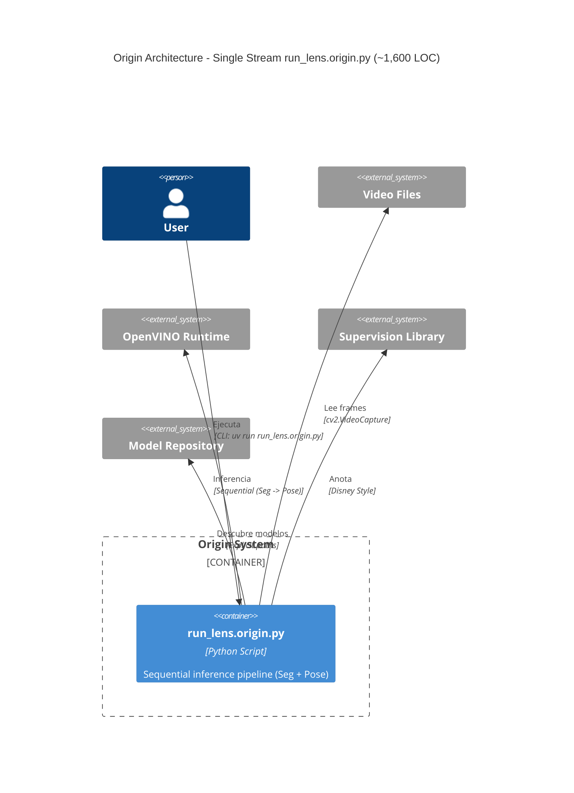
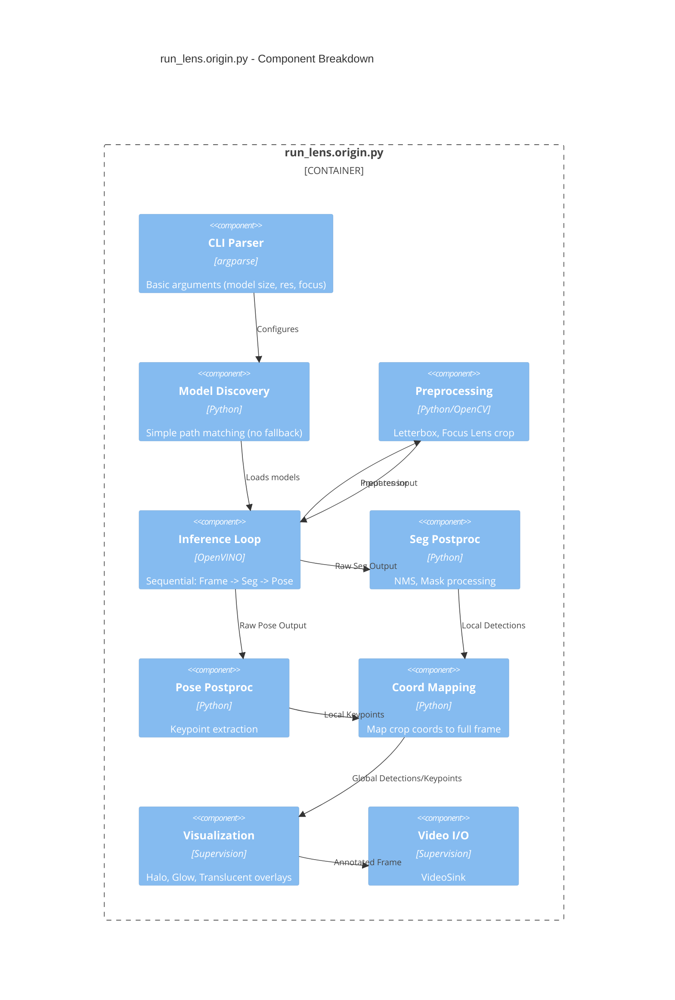

# C4 Model View: Origin Architecture - run_lens.origin.py

## Container Diagram - Origin

## Component Diagram - Internal Structure of run_lens.origin.py

## Functionality Mapping: Origin vs. Extended

This table maps the functionality from the lighter `run_lens.origin.py` to the more complex `run_lens.py.sample` (Extended/Hybrid).

| Feature | Origin (`run_lens.origin.py`) | Extended (`run_lens.py.sample`) | Change Type |
| :--- | :--- | :--- | :--- |
| **Model Discovery** | `discover_segmentation_models` `discover_pose_models` Strict matching. Fails if exact model not found. | `discover_models_dual` Includes **Fallbacks** (INT8 -> FP16, Resolution -> Lower Res). | ✨ Enhancement |
| **Scheduling** | **Sequential / Every Frame** Runs Segmentation AND Pose for every single frame. | **Smart Scheduling** `seg_interval`: Seg every N frames, Pose every frame. Reuses cached seg masks. | 🚀 Optimization |
| **Preprocessing** | Computed every time in loop. `preprocess_with_metadata` | **`PreprocessCache` Class** Caches tensors. If `seg_res == pose_res`, computes once and reuses tensor. | 🚀 Optimization |
| **Keypoint Filtering** | **Basic** Confidence thresholding only. | **Dynamic Strategy** (`filter_keypoints_by_masks_dynamic`) Checks bbox overlap. Switches between "nearest centroid" and "bbox IoU". | 🧠 Logic |
| **Device Support** | Single `--device` (default GPU). Both models run on same device. | **Heterogeneous Compute** `--seg-device` and `--pose-device`. Can offload Pose to CPU while Seg runs on GPU. | ⚙️ Config |
| **Inference Function** | `run_inference_fp16_segmentation_sv_lens` | `run_inference_fp16_segmentation_sv_lens` (Overloaded) Added args: `seg_interval`, `pose_device`, `keypoint_match_strategy`. | 🔄 Refactor |
| **Visualization** | Disney/Roger Rabbit style. Halo, Glow, Translucent UI. | Same core style, but integrated with scheduler (shows cached segmentation visually same as real). | 🎨 UI |
| **Code Structure** | Functional script. `main()` calls `run_inference...` | Functional + OOP. Introduces `PreprocessCache` class to manage state. | 🏗️ Architecture |

## Reverse Engineering Summary

1.  **Core Logic Preserved**: The fundamental "Focus Lens" strategy (crop -> inference -> map back) and the "Disney" visualization style are identical in both versions.
2.  **Performance Layer Added**: The Extended version wraps the Core Logic with performance optimizations:
    -   **Caching**: To avoid resizing/normalizing the same image twice.
    -   **Scheduling**: To skip heavy segmentation models on intermediate frames.
    -   **Resilience**: To find "good enough" models if the exact requested one is missing.
3.  **Logic Sophistication**: The Extended version solves the "Multiple Person" problem in pose estimation by adding the Dynamic Keypoint Filtering, which links keypoints to specific segmentation masks more accurately than simple distance.
