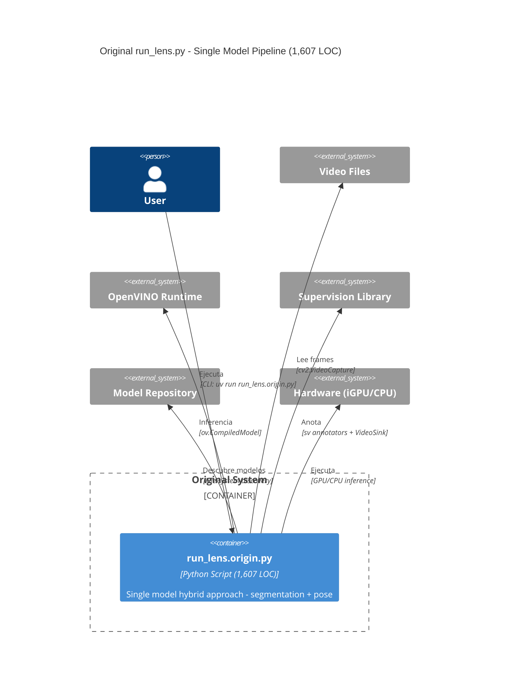
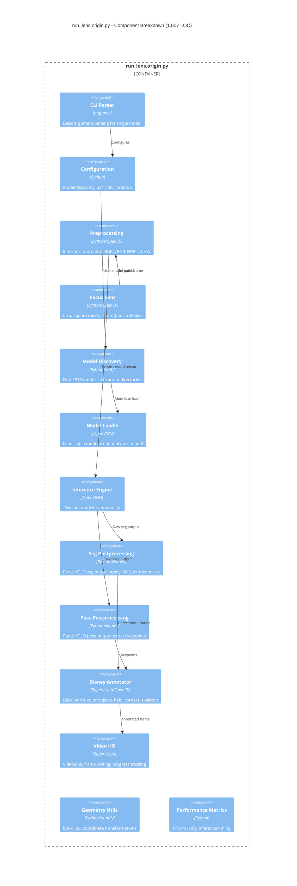
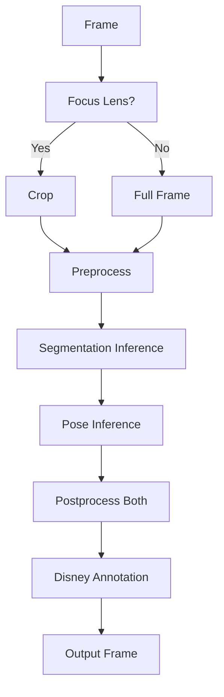
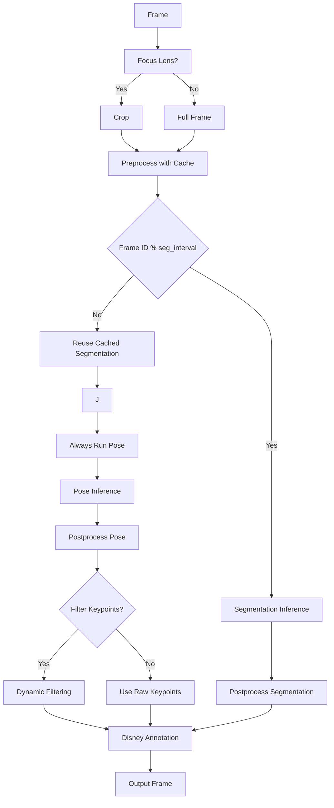

# C4 Model: Original run_lens.py Architecture (Reverse Engineered)

## Container Diagram - Original Architecture

## Component Diagram - Original Internal Structure

## Architecture Comparison: Original vs Extended

| Aspect | Original (1,607 LOC) | Extended (2,260 LOC) | Evolution |
|--------|---------------------|----------------------|------------|
| **Complexity** | Simple, single pipeline | Complex, dual optimization | +40% LOC |
| **Caching** | No caching | `PreprocessCache` class | New optimization |
| **Scheduling** | Every frame inference | Smart scheduling (seg_interval) | Conditional execution |
| **Device Mgmt** | Single device | Separate seg/pose devices | Heterogeneous compute |
| **Filtering** | Basic class filtering | Dynamic keypoint filtering | Advanced algorithms |
| **Discovery** | Basic discovery | Fallback strategies | Robust model finding |

## Functional Mapping Between Versions

### Core Functions Matrix

| Original Function | Extended Equivalent | Changes |
|-------------------|-------------------|---------|
| `discover_segmentation_models()` | Same | Enhanced with fallback |
| `discover_pose_models()` | Same | Enhanced with fallback |
| `apply_focus_lens()` | Same | No changes |
| `letterbox()` | Same | No changes |
| `preprocess_with_metadata()` | Same | No changes |
| `xywh2xyxy()` | Same | No changes |
| `nms()` | Same | No changes |
| `process_mask()` | Same | No changes |
| `postprocess_segmentation()` | Same | No changes |
| `postprocess_pose()` | Same | No changes |
| `convert_to_supervision_detections()` | Same | No changes |
| `convert_to_supervision_keypoints()` | Same | No changes |
| `map_detections_to_full_frame()` | Same | No changes |
| `map_keypoints_to_full_frame()` | Same | No changes |
| `run_inference_fp16_segmentation_sv_lens()` | Enhanced | +Scheduling, +Separate devices |
| `main()` | Enhanced | +Advanced CLI options |

### New Components in Extended Version

| Component | Purpose | Integration Point |
|-----------|---------|-------------------|
| `PreprocessCache` | Cache tensors to avoid redundant computation | Between preprocessing and inference |
| `discover_models_dual()` | Robust model discovery with fallback | Replace basic discovery |
| `filter_keypoints_by_masks_dynamic()` | Advanced keypoint filtering | Between pose postprocess and annotation |
| `compute_bbox_iou_single()` | IoU computation for filtering | Support function for filtering |
| `Smart Scheduling` | Run seg every N frames | Inference orchestration |
| `Heterogeneous Devices` | Separate devices for seg/pose | Model loading and inference |

## Data Flow Comparison

### Original Data Flow

### Extended Data Flow

## Key Architectural Evolution Points

### 1. Performance Optimizations

**Original:**
- Sequential inference every frame
- No caching of preprocessing results
- Single device for all operations

**Extended:**
- Smart scheduling reduces segmentation by ~80%
- PreprocessCache eliminates redundant computation
- Heterogeneous compute (seg on GPU, pose on CPU)

### 2. Robustness Enhancements

**Original:**
- Basic model discovery
- Simple error handling
- Fixed pipeline

**Extended:**
- Fallback strategies for model discovery
- Advanced error recovery
- Configurable execution strategies

### 3. Algorithm Sophistication

**Original:**
- Basic class filtering
- Simple coordinate mapping
- Fixed annotation style

**Extended:**
- Dynamic keypoint filtering with overlap detection
- Intelligent strategy selection
- Multi-strategy annotation pipeline

## Technical Debt Analysis

### Original Version Advantages
✅ **Simplicity**: 1,607 LOC vs 2,260 LOC  
✅ **Clarity**: Linear execution flow  
✅ **Maintainability**: Fewer interdependencies  
✅ **Testing**: Easier to validate behavior  

### Original Version Limitations
❌ **Performance**: No optimizations  
❌ **Robustness**: Basic error handling  
❌ **Flexibility**: Fixed execution patterns  
❌ **Scalability**: No advanced scheduling  

### Extended Version Advantages
✅ **Performance**: 80% reduction in segmentation calls  
✅ **Robustness**: Comprehensive fallback strategies  
✅ **Flexibility**: Configurable execution parameters  
✅ **Intelligence**: Dynamic algorithm selection  

### Extended Version Complexity Cost
⚠️ **Maintainability**: +40% LOC  
⚠️ **Complexity**: Multiple interdependent systems  
⚠️ **Testing**: More edge cases to validate  
⚠️ **Debugging**: Stateful cache and scheduling  

## Refactoring Recommendations

### Phase 1: Extract Core Components
1. **Preprocessing Module**: Extract focus lens, letterbox, normalization
2. **Postprocessing Module**: Extract seg/pose postprocessing
3. **Model Management**: Extract discovery, loading, device management

### Phase 2: Optimize Pipeline
1. **Scheduling System**: Make configurable with pluggable strategies
2. **Cache Management**: Abstract caching for different use cases
3. **Device Management**: Support heterogeneous compute patterns

### Phase 3: Enhance Intelligence
1. **Adaptive Filtering**: Make filtering strategies pluggable
2. **Performance Monitoring**: Add runtime performance tracking
3. **Configuration**: Move from CLI to configuration files

## Conclusion

The original `run_lens.origin.py` represents a clean, straightforward implementation of the hybrid segmentation + pose pipeline. The extended version introduces significant optimizations and robustness features at the cost of complexity.

**Key Insight**: The 40% increase in LOC provides substantial performance benefits (80% reduction in segmentation computation) and robustness improvements, making the trade-off worthwhile for production use.

**Recommendation**: The modular architecture proposed for the Luna phase should extract the clean, simple patterns from the original while preserving the performance optimizations from the extended version.